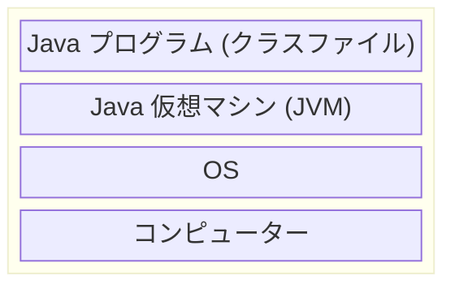

# はじめに

こんにちは、TIGの岸本卓也です。 [春の入門祭り2025](/articles/20250413a/) シリーズです。

私は Java の経験が長いのですが、JVM やバイトコードといった Java で処理が実行される根本的な仕組みへの理解が薄かったため改めて向き合うことにしました。本稿では理解の足がかりとなる調査方法を提示します。

# 環境

この検証は JDK 24 を使用し Windows 環境で実施しました。JDK の詳細なバージョンは次のとおりです。

```sh
openjdk version "24" 2025-03-18
OpenJDK Runtime Environment Temurin-24+36 (build 24+36)
OpenJDK 64-Bit Server VM Temurin-24+36 (build 24+36, mixed mode, sharing)
```

# "Hello World!" サンプルソース

シンプルな処理の例として、 [Java Tutorials](https://docs.oracle.com/javase/tutorial/getStarted/cupojava/win32.html) で提示されている以下の "Hello World!" ソースを題材にします。

```java HelloWorldApp.java
/**
 * The HelloWorldApp class implements an application that
 * simply prints "Hello World!" to standard output.
 */
class HelloWorldApp {
    public static void main(String[] args) {
        System.out.println("Hello World!"); // Display the string.
    }
}
```

なお JDK 21 以降では、main メソッドを以下のようにクラス定義無しで実装可能な機能 ([JEP 445: Unnamed Classes and Instance Main Methods (Preview)](https://openjdk.org/jeps/445)) がプレビューで導入されています。

```java
void main() {
    System.out.println("Hello World!");
}
```

これはまだプレビューかつ入門用の側面が強い機能のため、本稿ではこれまで通りクラス定義のある "Hello World!" ソースで試します。

# コンパイル

Java ソースを実行するにはコンパイルが必要です。Java コンパイラ ([`javac` コマンド](https://docs.oracle.com/en/java/javase/24/docs/specs/man/javac.html)) ではネイティブアプリにコンパイルするのではなく Java 仮想マシン (JVM) 用のバイナリにコンパイルします。JVM 用のバイナリはバイトコードと呼ばれ、たいていは拡張子が `.class` のクラスファイル形式で出力します。JVM は以下のように OS 上で動作しコンピューターの CPU アーキテクチャーや OS の違いを吸収してバイトコードを実行する役割を担っています。



サンプルソースを次のようにコンパイルすると `HelloWorldApp.class` が生成されます。

```sh
javac HelloWorldApp.java
```

クラスファイルはバイナリファイルでありそのままでは読み解くことが困難ですが、JDK に同梱の [`javap` コマンド](https://docs.oracle.com/en/java/javase/24/docs/specs/man/javap.html) で逆アセンブルしてバイトコードを分かりやすく表示させることができます。以下のように `-v` オプションを付けて実行すると、クラスファイルの詳細が表示されます。

```sh
javap -v HelloWorldApp.class
```

今回の場合は以下のように表示されました (一部マスク処理済み)。

```sh
Classfile /C:/***/HelloWorldApp.class
  Last modified 2025/05/28; size 432 bytes
  SHA-256 checksum b4931b536ad32a6b444d5c5a9568ca143820726483d533b4d57f9cdf6e8337e9
  Compiled from "HelloWorldApp.java"
class HelloWorldApp
  minor version: 0
  major version: 68
  flags: (0x0020) ACC_SUPER
  this_class: #21                         // HelloWorldApp
  super_class: #2                         // java/lang/Object
  interfaces: 0, fields: 0, methods: 2, attributes: 1
Constant pool:
   #1 = Methodref          #2.#3          // java/lang/Object."<init>":()V
   #2 = Class              #4             // java/lang/Object
   #3 = NameAndType        #5:#6          // "<init>":()V
   #4 = Utf8               java/lang/Object
   #5 = Utf8               <init>
   #6 = Utf8               ()V
   #7 = Fieldref           #8.#9          // java/lang/System.out:Ljava/io/PrintStream;
   #8 = Class              #10            // java/lang/System
   #9 = NameAndType        #11:#12        // out:Ljava/io/PrintStream;
  #10 = Utf8               java/lang/System
  #11 = Utf8               out
  #12 = Utf8               Ljava/io/PrintStream;
  #13 = String             #14            // Hello World!
  #14 = Utf8               Hello World!
  #15 = Methodref          #16.#17        // java/io/PrintStream.println:(Ljava/lang/String;)V
  #16 = Class              #18            // java/io/PrintStream
  #17 = NameAndType        #19:#20        // println:(Ljava/lang/String;)V
  #18 = Utf8               java/io/PrintStream
  #19 = Utf8               println
  #20 = Utf8               (Ljava/lang/String;)V
  #21 = Class              #22            // HelloWorldApp
  #22 = Utf8               HelloWorldApp
  #23 = Utf8               Code
  #24 = Utf8               LineNumberTable
  #25 = Utf8               main
  #26 = Utf8               ([Ljava/lang/String;)V
  #27 = Utf8               SourceFile
  #28 = Utf8               HelloWorldApp.java
{
  HelloWorldApp();
    descriptor: ()V
    flags: (0x0000)
    Code:
      stack=1, locals=1, args_size=1
         0: aload_0
         1: invokespecial #1                  // Method java/lang/Object."<init>":()V
         4: return
      LineNumberTable:
        line 5: 0

  public static void main(java.lang.String[]);
    descriptor: ([Ljava/lang/String;)V
    flags: (0x0009) ACC_PUBLIC, ACC_STATIC
    Code:
      stack=2, locals=1, args_size=1
         0: getstatic     #7                  // Field java/lang/System.out:Ljava/io/PrintStream;
         3: ldc           #13                 // String Hello World!
         5: invokevirtual #15                 // Method java/io/PrintStream.println:(Ljava/lang/String;)V
         8: return
      LineNumberTable:
        line 7: 0
        line 8: 8
}
SourceFile: "HelloWorldApp.java"
```

Code ブロックには [JVM の命令セット](https://docs.oracle.com/javase/specs/jvms/se24/html/jvms-6.html) に基づく処理が並んでいることが分かります。

サンプルソースと対応付けやすい部分として main メソッドに注目して Java ソースとバイトコードの該当箇所を抜粋したものは以下です。

```java
    public static void main(String[] args) {
        System.out.println("Hello World!");
    }
```

```java
  public static void main(java.lang.String[]);
    descriptor: ([Ljava/lang/String;)V
    flags: (0x0009) ACC_PUBLIC, ACC_STATIC
    Code:
      stack=2, locals=1, args_size=1
         0: getstatic     #7                  // Field java/lang/System.out:Ljava/io/PrintStream;
         3: ldc           #13                 // String Hello World!
         5: invokevirtual #15                 // Method java/io/PrintStream.println:(Ljava/lang/String;)V
         8: return
```

JVM ではメソッド起動時に新たな [フレーム](https://docs.oracle.com/javase/specs/jvms/se24/html/jvms-2.html#jvms-2.6) を作成して各種データを保持します。フレームにはオペランドスタックがあり、JVM 命令はこのオペランドスタックを使って処理を実行します。上記 main メソッドの Code ブロックの例では以下の処理になります。

- 命令インデックス0 (`getstatic     #7`): 定数プール #7の値 (`System.out` フィールドの参照) をスタックにプッシュする
- 命令インデックス3 (`ldc           #13`): 定数プール #13の値 (`String` 型の `"Hello World!"`) をスタックにプッシュする
- 命令インデックス5 (`invokevirtual #15`): 定数プール #15 (`java.io.PrintStream#println(String)` メソッドの参照) が示すメソッドを起動する。今回の場合、命令インデックス3でプッシュした値をスタックからポップし、新たなフレームを作成してそのフレームでメソッドの命令を実行していく。
- 命令インデックス8 (`return`): 呼び出し元に `void` を返却する

# プログラムの実行

コンパイルしたバイトコードは [`java` コマンド](https://docs.oracle.com/en/java/javase/24/docs/specs/man/java.html) を使って以下のように実行できます。

```sh
java -cp . HelloWorldApp
```

この実行ではクラスパス `-cp .` とメインクラス `HelloWorldApp` を指定しています。JVM はクラスパスに従ってカレントディレクトリからメインクラスを検索してロードし、メインクラスに定義された `main` メソッドを実行します。

プログラムの起動から終了までの流れは [Java 言語仕様の Execution](https://docs.oracle.com/javase/specs/jls/se24/html/jls-12.html) によると以下のように行われます。

- JVM の起動
  1. クラスのロード
  2. リンク: クラスの検証、static フィールドやメソッドテーブルの準備、シンボル参照の解決
  3. クラスの初期化: イニシャライザーの実行
  4. `<メインクラス>.main` メソッドの実行
- プログラムの終了: 以下のいずれかが発生すると終了する。
  - すべての非デーモンスレッドとシャットダウンフックが終了した。
  - `System.exit`, `Runtime.exit`, `Runtime.halt` のいずれかが呼び出された。
  - JVM が外部から終了リクエストを受け取った (例えばシグナル)。
  - JVM でハンドリングできない外部イベントが発生した (例えばプロセスの異常やコンピューターの電源断)。

これらの処理が具体的にどのように起きているかは [`-Xlog` オプション](https://docs.oracle.com/en/java/javase/24/docs/specs/man/java.html#enable-logging-with-the-jvm-unified-logging-framework) で出力できる JVM ログが参考になります。例えば、すべてのログを `vm_%t_%p.log` ファイルに出力する実行例は以下です。

```sh
java -Xlog:all=trace:vm_%t_%p.log:uptime,level,tid,tags -XX:LogClassLoadingCauseFor=* -cp . HelloWorldApp
```

また、 `-Xlog` オプションとは関係がありませんが、 `_JAVA_LAUNCHER_DEBUG=1` といった環境変数を設定すると JVM 起動に関する追加の情報がコンソールに出力されます。

JVM ログを概観した結果、JVM 起動の各処理は以下のタグまたはタグセットのログが参考になりそうです。

- クラスのロード: `class+load*`
- クラスの検証: `verification`
- シンボル参照の解決: `class+resolve`
- クラスの初期化: `class+init`

# さいごに

本稿では Java で "Hello World!" の処理が実行される仕組みをバイトコードや JVM を交えて説明し、調査に使える機能を紹介しました。調査にあたっては以下のページを参考にしました。

- [Java 言語仕様](https://docs.oracle.com/javase/specs/jls/se24/html/index.html)
- [JVM 仕様](https://docs.oracle.com/javase/specs/jvms/se24/html/index.html)
- [JDK ツール仕様](https://docs.oracle.com/en/java/javase/24/docs/specs/man/index.html)
- [JDK ソース](https://github.com/openjdk/jdk)
