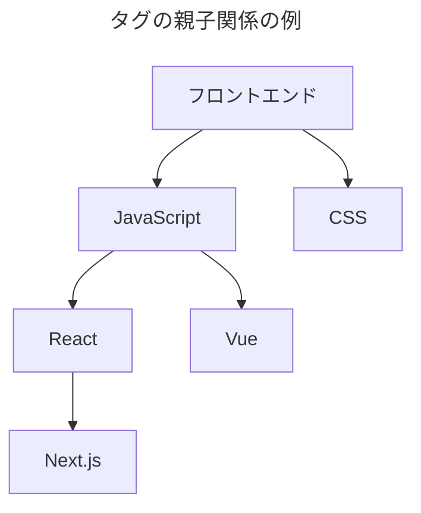

[夏の自由研究2025](/articles/20250825a/)ブログ連載の7日目です。

フューチャー技術ブログの「関連記事」の表示ロジックの変遷と今後についてまとめます。

# 背景

フューチャー技術ブログは開設以来、[Hexo](https://hexo.io/ja/)という静的サイトジェネレータを利用しています。そのため、サイトの構造や記事のレイアウトは完全にフルスクラッチで自由度が効く反面、全てを自分たちで（できれば、手間と時間をかけずに）行う必要があります。

創設が2016年、9年半が経過し現在1300ほどの記事が投稿されています。中にはバズって数万PVに届く記事もあります。せっかく、ある記事を見てもらったのであれば、他の記事をついでに見てもらうことで回遊率を上げたいという気持ちがあります。また、社内のナレッジ管理の側面では「know who」が重要なので、似たような記事を書いた人を辿れるようにしておくことは、ポリシー的に大事にしたいポイントです。

1300記事もあるとユーザー自身で探すことは難しいので、それっぽい記事を表示することが求められます。そこで、「関連記事」の上手い表示が求められます。現在では、記事のSNSボタン領域の次に関連記事を表示するようにしています。


この記事では、なるべくローコストかつシンプルな関連記事の導出しようとした軌跡を紹介します。

# 黎明期（2016年～） 原始的な運用

[投稿推移](https://future-architect.github.io/articles/)のページを見ると一目瞭然ですが、ブログ開設した2016年から2019年の間は、チームごとの持ち回り制で運営していたこともあり、投稿数は伸び悩んでいました。

この時期は、正直「関連記事」を出すほど関連性のある記事が存在しませんでした。また、著者数も少なく、記事本文に直接、過去の類似の投稿をテキストリンクで貼る寄稿者が多くそれで満足していた時代です。今の関連記事の領域は「人気の記事」を表示する仕組みにしていました。

「人気の記事」の表示ロジックですが、PVからの判定ではありません。Hexoのテーマが持つYAMLで個別に記事を指定するというモデルです。何か人気の記事があれば手動で切り替えていました。控えめに言って辛さしかありませんでした。そのため、すぐに運用が追いつかず陳腐化した上で、早々に表示ごと削除しました。

# 勃興期（2019年～） ナイーブな実装

ブログが軌道に乗ってきたのは2019年ごろです。[フューチャー技術ブログの運営で心がけていること](https://future-architect.github.io/articles/20200530/)とか[フューチャー技術ブログで行っている連載企画が良いよって話 ](https://future-architect.github.io/articles/20200908/) で書いたように、色々と運営手法が洗練されると記事数が増えてきました。

このころから、毎月10～20記事がコンスタントに公開されてきており、2021年初めには400-500記事に到達したため、「関連記事」を表示するようにしました。

実装は、記事同士の「タグ」と「著者」の重複数から関連度を計算するというロジック（$関連度=タグの重複+著者一致数$）です。これの上位数件を表示していました。

例えば、以下の2記事があるとします。

- タグが[AWS, Go]。著者が 「未来太郎」
- タグが[AWS, Lambda, Python]。著者が「未来太郎」

この場合、1（AWSタグが同じ）+1（著者が同じ）=2が関連度です。

非常にシンプルなロジックですが、想像より100倍くらいいい感じに機能しました。とにかく軽く、事前の学習時間もゼロで、非力なラップトップマシンでも容易に動き、タグがそこそこちゃんとついていれば、数百オーダーまでスケールもできます。小規模ならこれで十分だと思います。

# 中興期（2022年～） ベクトル化？

コロナ禍でリモートブームになり2020年～2021年は非常に投稿数が伸びました。分析データとしてそれなりに面白いということで[embeddingを用いた分析・検索・推薦の技術](https://future-architect.github.io/articles/20220613a/) にあるように、記事のメタデータをベクトル化し、コサイン類似度で関連記事を出してはどうかというトライも行われていました。当時は本文を見るより、以下のような原稿のMarkdownの先頭にくっついている、Front Matterと呼ばれるYAML形式のメタデータを用いる方が、精度が上がるという話でした。

```yaml Front-Matterの例
---
title: "技術ブログの関連記事の表示～できる限り低コストに関連度を計算～"
date: 2025/09/03 00:00:00
postid: a
tag:
  - 運営
  - TechBlog
  - NLP
category:
  - Culture
thumbnail: /images/2025/20250903a/thumbnail.png
author: 真野隼記
lede: "フューチャー技術ブログの「関連記事」の表示ロジックの変遷と今後についてまとめます。"
mathjax: true
---
```

embeddingの記事にあるように、記事のクラスタリングや、記事に追加するタグ自体の推薦など様々な試みがありましたが、当時の記事数は500-600ほどで自動化する程ではない。また、タグ自体の運用が試行錯誤だったということもあり、本格導入には至らずでした。

# 最近（2025年～） 逆文書頻度を取り入れてみる

記事数が1000を大きく上回るようになってきた2024年ごろから、「関連記事」への不満が少しずつ出てくるようになりました。

例えば、以下のようなケースです。

- [Go]のタグを持つ記事が100個
- [AWS]タグが200個
- [テックリード]タグが5個

この状態で、[Go, AWS, テックリード]の3つのタグを持つ記事は、[Go, AWS]のタグを持つ記事Aか、[テックリード]のタグを持つ記事Bを比較すると、記事Aが優先されます。これはこれで正しい気もしますが、[Go]や[AWS]は付けられる記事数が突出して多いため、より希少性がある[テックリード]のタグを優先させたいなと思っていました。しかし、[Go]のタグ数を直接除算するのはペナルティが大きすぎます。

そこで、逆文書頻度（IDF: Inverse Document Frequency）を利用することにしました。IDFは $IDF = \log(タグの総数/特定のタグを持つ記事数)$ で計算できます。シンプルで簡単に計算できる点が良いです。

タグの総数が1000とし、先程の例でIDFを計算すると、記事Bの関連度が高くなり、目的に合致できます。

- 記事A: $IDF=\log(1000/100)+\log(1000/200) \approx  1.69897$
- 記事B: $IDF=\log(1000/5) \approx  2.301$

この関連度を見たい人は少ないと思いますが、デバック用にマウスオーバーでツールチップに表示しています。もし、気になる方は確認してください。


関連度の計算ですが、同一著者かどうかも引き続き計算に入っています。タグがIDFでマイルドになるため、著者側もIDFに入れています。

その他の主要なロジックとしては以下があります。

- もし、タグや著者に紐づく関連記事が、規定件数未満の場合に「同一カテゴリ」のSNS人気記事から補填する
- もし、関連度が同一値だった場合は、最新の記事から選択する

これらのロジックで、概ね運営として関連記事に表示したい内容は実現できていると感じており、完璧では無いけれど、効果とコードベースのシンプルさのバランスが優秀だという点で、満足しています。

# 現状の課題感

基本的には、「タグ」ベースであるため、「タグ」を適切に設置する必要があります。現状ですと、運営が公開時に（GeminiのGemsなどを用いたり記事をレビューついでに読んで）手動で付与しています。しかし、いくつか課題が出ています。

1つ目はタグの設定の煩わしさと難しさに尽きます。

- 「タグ」の設定漏れがある
    - 公開時点では不要だと思って設定しなかったタグも、後々類似の記事が出たタイミングで、過去記事にも追加すべきです。しかし、どうしても業務が忙しいなどでチェックが雑になり、漏れてしまいます
- そもそも、あるべきタグを付けられていない
    - [Terraform]に加えて、[Pulumi]や[CloudFormation]タグが追加になったタイミングで、[IaC]といったタグを付与したくなります。これは設定漏れの一種ですが、[IaC]タグが既存に存在しない場合があります。その場合、新しい抽象化した概念でグルーピングして設定すべきですが、漏れてしまいます
- タグの表記揺れ
    - [GCP]が[Google Cloud]にリブランドされたように、表記が揺れているものを修正する必要があります
    - 対応が分かれば、便利スクリプトで置換しますが、気が付かない場合もあります。タイポの場合もありますし、例えば[オブザーバビリティ] [Observability] [可観測性]など全て正しいけど揺れていた場合もあります
- 意味のないタグがある
  - 1記事しか紐づかない、現時点では意味のないタグが存在します。例えば[PyCon JP 2024]などは1記事でもタグとしては理解できますが、[ログ,ログ設計]のうち、ログ設計が1記事にしか紐づかない場合、削除した方がユーザーとSEO観点で重複コンテンツが減り嬉しいでしょう。
  - すべて同じ記事に紐づくタグのセットがある。意味論的に別の概念のタグがたまたま紐づくのであれば良いですが、タグ同士の意味が近しい場合、これはオーバーなタグ付けだと考えられます。必ず関連付けしたい記事同士を紐付ける裏技のようですが、タグ検索時のノイズなので可能であれば統合した方が健全でしょう

このあたりは、[タグ一覧](https://future-architect.github.io/tags/)のページから、Geminiなどで定期的に怪しいタグを抽出してもらって棚卸ししていますが、本来はCI時点で検知したい内容です。ただし、「LLM」と「生成AI」のように本来は同じ意味と言えるが、「LLM」はLLMやRAGを開発管理する文脈、「生成AI」は業務に活用する文脈で使い分けていることも観測しており、自動化までのハードルは少し高いように思えます。

2つ目はカテゴリの適切な設定です。執筆時点のカテゴリと紐づく記事数は以下です。実は、最近[Frontend] [Mobile] [DataEngineering] のカテゴリを分離独立させました。

- Programming (305)
- DevOps (184)
- Infrastructure (134)
- Frontend (122)
- Culture (115)
- DataScience (102)
- DB (56)
- Mobile (56)
- IoT (51)
- Business (40)
- DataEngineering (37)
- Management (33)
- Security (32)
- 認証認可 (24)
- VR (18)

適切なカテゴリを作ることで、後述する親子関係のタグにより生じる問題を緩和できると思っています。しかし、どのような粒度でカテゴリを作るべきかは、読み手の関心事ごとに分離すべきでもあるので、それらのバランスに苦慮しています。[Programming]は突出して多いですが、その中の大多数を占める[Go]をスピンアウトさせるべきでしょうか？ また、[Programming]から[Backend]をスピンアウトさせるべきでしょうか。まだ判断がついていません。また、意味論的にも、iOSのCI/CD記事は、[Mobile]なのか[DevOps]のどちらに振り分けるか迷いも生じます（現状は、迷ったら数が少ないカテゴリに側を優先して振り分けています）。


# 今後（2028～）

おそらく、現在のナイーブなIDFベースのロジックでいくと、数年以内に問題が出てくると思います。例えば以下です。

- タグの意味的な親子関係により、精度低下
    - [フロントエンド] [JavaScript] [TypeScript] [React]など、タグ同士で（親子）関係を持つ場合があります。[React]の記事が増えてくると、[RSC]のような、細分化したタグを追加すると考えられるため、全体的にタグ数はインフレ傾向にあります
    - この場合、よりルートに近いタグ（フロントエンド、JavaScript、TypeScript）による評価は下げるといったペナルティによる調整が必要になってくると予測できます
    - また、[React] [Hooks]などの具体度が高いタグのみ紐づけられ、[フロントエンド]のような抽象度の高いタグは設定されない場合も問題です。[React]の記事数が十分であればこれでも良いですが、数が少ない場合は関連記事ゼロと見なされる懸念があります
- タグをたくさん持つ記事が有利という事実は変わらない
    - 多くのタグを持つ記事ほど、他の記事とタグの重複する確率が上がるため、関連記事に表示されやすくなってしまいます。逆に、タグが少ない良質な記事は不当に低く評価されてしまいます





対策の1つ目として以下が考えられます。

- タグ同士の距離を計算し、近いほどスコアを上げる
    - 例えば、タグの親子関係を以下のように定義し、完全一致は1点、親子関係は0.5点、兄弟関係は0.4点、祖父母関係は0.25点などと調整する

```json 親子関係.json
{
  "フロントエンド": ["JavaScript", "CSS", "HTML"],
  "JavaScript": ["TypeScript", "React", "Vue", "Node.js"],
  "CSS": ["Sass", "Tailwind CSS"],
  "React": ["Next.js", "Remix"],
  "バックエンド": ["Node.js", "Python", "Go"],
  "インフラ": ["AWS", "Docker"],
  "AWS": ["EC2", "S3"]
}
```

親子関係は、共起関係分析（ある記事でタグAが使われているとき、タグBも一緒に使われている）を元に、たたき台を作れると良いかなと思っています。先ほど紹介した、embedding記事のBERTやWord2Vecを利用するのも一手でしょう。とはいえ、まずはタグの共起分析で十分精度が出るのでは？と推測しています。

2つ目の対策は以下が考えられます。

- たくさんのタグを持つ記事の評価を下げるため、タグ数の和や積の平方根などで調整する

例として以下の記事があり、現状のロジックにおける課題を説明します。

- 記事A (シンプル): [React] (1タグ)
- 記事B (近い分野): [React, Next.js] (2タグ)
- 記事C (詳細タグ): [フロントエンド, JavaScript, React] (3タグ)

この場合、記事Aの関連記事は記事Cが優先されて表示されてしまいます。先に上げた親子関係でのルール（親子で0.5点など）で計算した結果です。

* AとBの関連度 1.5（React1点、Next.jsが0.5点）
* AとCの関連度 1.75（Reactが1点、JavaScriptが0.5点、フロントエンドが0.25点）

今回は、フロントエンドやJavaScriptからReactを解説していると推測できる記事Aより、より専門的だと考えられる記事Bを優先させたいとします。

これには、記事が持つタグ数での調整が考えられます。以下はシンプルに総和で使っています。

$$ \text{関連度} = \frac{\text{オリジナルの関連度}}{\text{記事Aのタグ数} + \text{記事Bのタグ数}} $$

* （新）AとBの関連度 1.5 / 3 = 0.5
* （新）AとCの関連度 1.75 / 4 = 0.4375

この例では、より専門的な記事であるBの関連度が高くなり、それなりに上手く行きそうだと思われます。実運用時は、和で割るのか、積で割るのか、積の平方根で割るといった、実データを見ながら調整する作業が入ると思います。また、気になるのは1記事にしか紐づかないけど、キーワード的に入れているタグ（例えば、書評記事の書籍名など）は運営側の意思で追加しているため、上記の計算から除外しても良いのではという気もしています。とはいえ、寄稿者側の意思で他に紐づきがないタグとの区別がつかないので、方針を考える必要があります。

他にも、極端にタグ数が少ない記事にタグを足すことや、タグ数の上限を設ける（現在は無限）などで調整しても良いかもしれません。ただ、本質的に必要十分なタグを付けていくことは守りたいので、ルールは慎重に考える必要があります。

注意として、どちらの対応策もそれなりに工数が必要そうな案です。現状、引き継ぎは考えていませんが、なるべく荷物は軽い状態をできる限り維持したい気持ちがあります。

# 将来（2032年くらい～）

このまま技術ブログ運営が続けば、このようなルールベースでの調整が崩壊すると考えられます。おそらく、3000~4000記事くらいでしょうか。社員数も増えてきており、1日1本の投稿ペースが2本以上になることも十分考えられます。そのため、タグや本文をベクトル化して、コサイン類似度などで判定することで運用負荷を下げる方法が求められるでしょう。

今すぐにコサイン類似度判定をやっても良いのですが、現状は以下の理由でストップしています。

- ルールベース、結果が分かりやすい（慣れてしまった）
    - ルールベースのロジックが高度に複雑化しない限り、関連度が上手くいった・いかないの理由は凄くシンプルに判明します。この結果を元に、タグ付けを改善しようというモチベーションが生まれやすいです
- どういったモデルが良いか、結果検証が難しい
    - 現状のルールベースでほぼ希望の結果ができてしまっているので、ベクトル化とコサイン類似度などの手法を取り入れて、どう良くなかったか確認する手段がない

そのため、ルールベースの複雑度が限界に達した場合や、いかにも面倒そうな親子関係定義などのタグ運用が業務の合間に行うレベルを超過して求められる場合に、導入しようと考えています。

ただし、「この記事にはこのタグを紐づけるべきではないか」という論点での利用は現時点でも積極的に考えたいと思います。

# まとめ

技術ブログの関連記事を表示するロジックについてまとめました。

大学は電気電子工学で、うっすらIDFなどを学んだ記憶がありますが、業務ではバックエンド開発が主体で、テキスト処理を集中して行ったことが無いので新鮮に取り組めています。

プロからの意見をお待ちしております。できればJS（Hexo）で簡単に運用できる技術を求めています。


