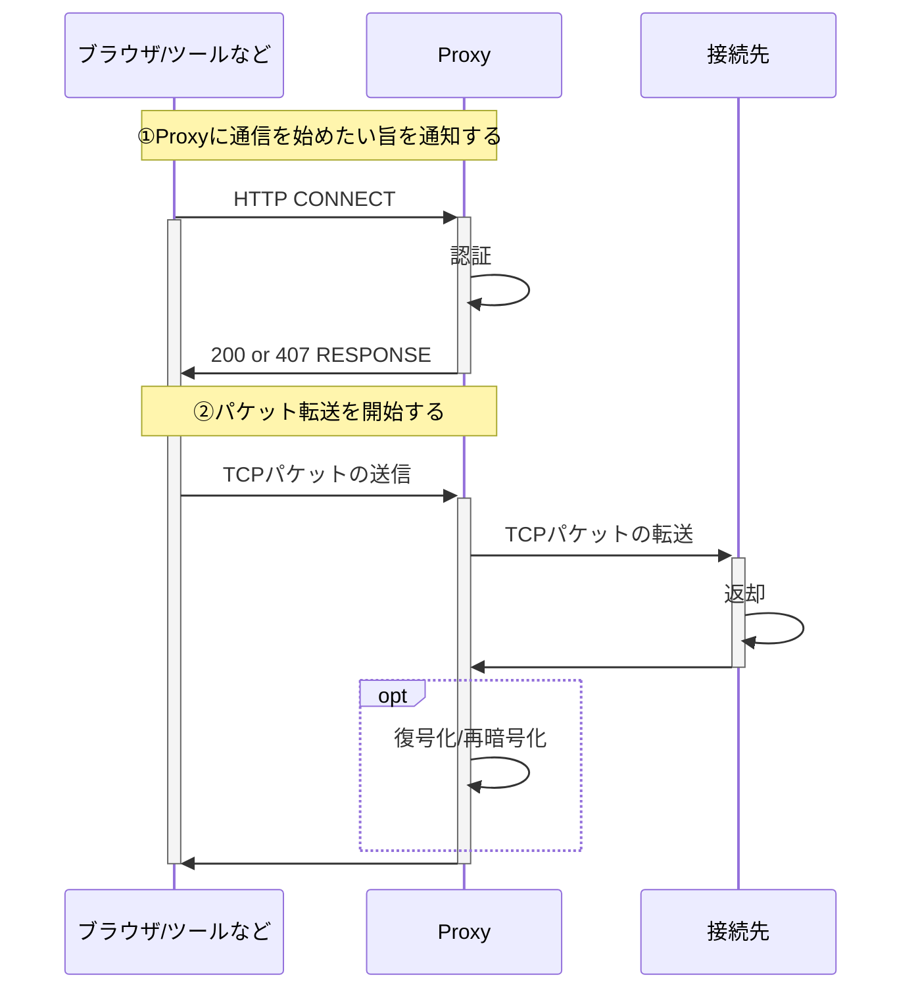
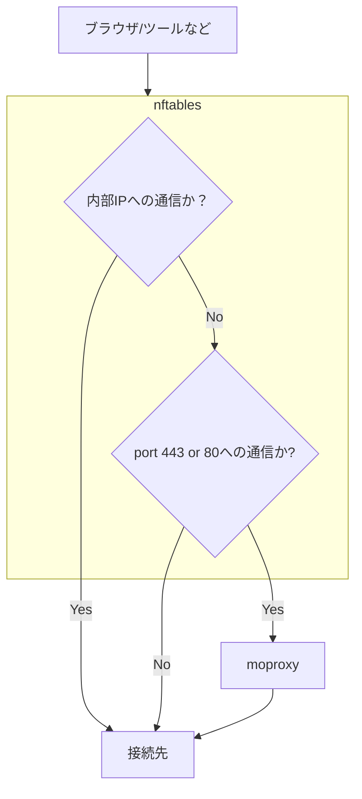

[夏の自由研究2025](/articles/20250825a/)ブログ連載の8日目です。

# はじめに

Technology Innovation Groupの神崎です。

セキュリティ上の理由などで、どうしてもProxyを使わざるを得ない環境下の時に、非常にハマりがちな設定のひとつとしてProxyの設定があります。これには理由があり、ProxyというのはOSレベルで適用するものではなく、利用するツール毎に設定を行う必要があり、各ツールのドキュメンテーションを読んで適切な設定を行う必要があります。そのため利用したいツールすべてについて、適切な設定をしないと動かないという特徴があります。「新しく使い始めたCLIツールがプロキシに対応していなかった」「Dockerのpullがプロキシで失敗する」などあるあるではないかと思います。

また、Proxy機能はツール目線でいうとよく使われる機能ではないため、特に「枯れていない」ツールを利用する際は、そもそもドキュメンテーションがなかったり、Proxyの認証に関してバグがあったりなど、Proxyの設定のトラブルシューティングに非常に時間がかかることがあります（場合によってはツールのソースコードを追うようなことまで必要になります）。

これらは非常に時間がかかり、生産性を低下させることが多く、特にツールの選定やちょっと使ってみたい場合はそれ自体を諦める遠因となることさえあります。そのため、何かツールごとではなく、OSレベルで設定する方法があれば、快適に過ごせるのではないか？と思っていました。

# TL;DR

解決策として、下記の構成を提案します。

- [moproxy](https://github.com/sorz/moproxy)を利用し、TCPパケットをHTTP CONNECTリクエストにくるんで、Proxyへの中継を行う
- Linuxカーネルのパケットフィルタリング機能 [^1] であるnftablesを利用して、宛先ポートが80(HTTP)ないし443(HTTPS)へのパケットをmoproxyに転送する
  - Well known portsではないポートへの通信は一旦ないものと想定する（必要に応じて個別に設定する）
- 各ツールでは、Proxyの設定は全く行わず、通常のProxyなしの設定を行い利用する

本記事ではその構成でなぜ動くのかを、HTTPのCONNECT仕様を深掘って解説した上で、具体的な設定例を示します。

※今回の記事ではWindows上のアプリケーションについては対象としていません。特にVPNクライアントが入っているケースを踏まえるとパケットがループしないようにうまく工夫をする必要がありますが、私自身がWindowsに明るくないので、Linuxのみの記述になります。すみません(多くのアプリケーションではインターネットオプションの設定を読みに行く形になるため、そこまで気にする機会はないかなと思います。~~だが、`Invoke-WebRequest`、おまえはゆるさん…~~)。

[^1]: NATの作成や、FWのルール設定などのバックエンドとして機能する

# そもそもProxyとの通信は何をやっているのか

私が一から解説する必要はないと思いますので、詳しくはこのサイト([作って学ぶ 「Https Man in The Middle Proxy」 in Go](https://yuroyoro.hatenablog.com/entry/2018/02/16/193816))を確認して貰いたいのですが、大きく分けると以下の2つのことをやっています。(HTTPSを前提とした場合)

1. HTTP CONNECTでProxyにHTTPS通信を始めたい旨を通知する(この情報を元にProxyは②のパケットを転送する)
2. ProxyにTCPパケットそのものを転送する



# Proxyを「透過」させるのに必要な実装

前述した仕組みを踏まえると、HTTPS通信にてProxy処理を「透過的」に行うには、ブラウザ/ツールなどから何かしらの手段でTCPのパケットを横取りし、パケットを送信する前にProxyにCONNECTリクエストを送った上で、横取りしたTCPパケットを再送してあげればよいことになります。
（また、HTTP通信の場合でも、相手先のProxyの実装にもよりますが、同様にTCPパケットを転送することで透過的に扱うことができます）

Linux上では、だいたい以下のような設定を行うことで上記を実現できます。



## moproxyの設定例

moproxyの設定例を示します。WSL2上のubuntuを前提に書いているため適宜読み替えて貰えればと思います。

今回はProxyがTLSの復号・再暗号化を行うので、必要な中間証明書をインストールします。
※信頼できる証明書をインストールするように注意してください！

```sh
sudo install -m 644 証明書パス.crt /usr/local/share/ca-certificates/internal_ca.crt
sudo update-ca-certificates
```

moproxyをインストールします。

```sh
TMPDIR=$(mktemp -d)
curl -fL -o "${TMPDIR}/moproxy.deb" 'https://github.com/sorz/moproxy/releases/download/v0.5.1/moproxy_0.5.1-1_amd64.deb'
sudo dpkg -i "${TMPDIR}/moproxy.deb"
```

下記ファイルを環境によって読み替えながら設置します。

```toml
# /etc/systemd/system/moproxy.service.d/override.conf
[Service]
EnvironmentFile=
EnvironmentFile=/etc/default/moproxy
ExecStart=
ExecStart=/usr/bin/moproxy --host $HOST --port $PORT --list /etc/moproxy/proxy.ini
```

```toml
# /etc/moproxy/proxy.ini; chmod 600 推奨
[server-1]
address=proxy.fqdn
protocol=http
http username = username
http password = passw0rd
```

```sh
# /etc/default/moproxy
HOST="::"
PORT="2080"
```

最後にsystemdを設定します。

```sh
sudo systemctl daemon-reload
systemctl is-enabled moproxy.service || sudo systemctl enable moproxy.service
sudo systemctl is-active moproxy.service && sudo systemctl restart moproxy.service || sudo systemctl start moproxy.service
```

上記にて、port 2080で待ち受けるサービスが作成されます。

## nftablesでの設定例

nftables自体はカーネルの機能としてインストールされているため、systemd-unitファイルを用意します。
特にDockerを利用している場合は、デフォルトで用意されている`nftables.service`を使うと、Docker用のネットワーク設定がリセットされてしまうため、個別に`nft`コマンドを呼ぶようにします。

unitファイルは、`nft`コマンドを直接呼びdaemonが起動しないので、`Type=oneshot`を設定します。また、`moproxy.service`への依存関係を持たせたいため、`RemainAfterExit=yes`をセットします。

nftables上では以下のルールを設定します。

- `proxy`という名称の新規tableを作成
- `proxy` tableにpreroutingのnat chainを追加 ※ルーティングされてきたパケット用、Dockerなど
- `proxy` tableにoutputのnat chainを追加 ※ホストからのパケット用
- 内部IPの場合は`accept`し何もしない (下記例だとクラスAアドレス)
- tcpの宛先ポートが80,443の場合は、port 2080にパケットを転送する

```toml
# /usr/local/lib/systemd/system/nft-proxy.service
[Unit]
description=nftables proxy
Wants=moproxy.service

[Service]
Type=oneshot
RemainAfterExit=yes
ExecStart=/usr/sbin/nft add table proxy
ExecStart=/usr/sbin/nft add chain ip proxy prerouting '{type nat hook prerouting priority 10;}'
ExecStart=/usr/sbin/nft add chain ip proxy output '{type nat hook output priority 10;}'
ExecStart=/usr/sbin/nft add rule proxy output ip daddr 10.0.0.0-10.255.255.255 accept
# ExecStart=/usr/sbin/nft nft add rule proxy output ip daddr <proxy_ip> accept
ExecStart=/usr/sbin/nft add rule proxy output tcp dport {80, 443} redirect to 2080
ExecStart=/usr/sbin/nft add rule proxy prerouting tcp dport {80, 443} redirect to 2080
ExecStop=/usr/sbin/nft flush table proxy

[Install]
WantedBy=multi-user.target
```

※今回はProxyサーバが80でも443でもないポートを利用していたので、特にループしていませんが、Proxyサーバが80か443を利用している場合は宛先IPによる`accept`ルールを追加する必要があります。

## WSLでの設定例

WSL上で自動的にプロキシ設定を行わないようにwsl.confを設定します。

```toml
# %USERPROFILE%\.wslconfig
[wsl2]
autoProxy = false
dnsTunneling = true
```

## 注意点

今回の構成では力業でTCPパケットを転送するということを行っているため、当然UDPを利用する通信(QUICやDNS)はProxyにリダイレクトされないです。

特にProxyへの除外先をIPではなくFQDN名で指定したいというニーズがある場合、この構成ではうまく動きません。moproxyの設定ファイルにはFQDN名でルール設定できるように見えますが、上記の構成ではmoproxy自体はTLSを復号しないため、FQDNを読む手段がなく動きません。(相手先のProxyがsocksv5などに対応していて、moproxyでCNIを読める設定にすれば可)

やはりProxyを使わざるを得ない環境では実現できる構成に制限がつくということかなと思います。

## 小ネタ

今回の設定では必要ないですが、Proxyへの認証時にはユーザー名やパスワードのURLエンコードが必要になるケースがあります。jqでは`@uri`を使うことでワンライナーでURLエンコードをやってくれるので、紹介しておきます。

```sh
# 例
PROXY_PASSWORD=$(systemd-ask-password --keyname=proxy.password "プロキシログイン用パスワードを入力してください: ")
PROXY_PASSWORD=$(echo "${PROXY_PASSWORD}" | jq -Rr @uri)
https_proxy="http://${PROXY_USERNAME}:${PROXY_PASSWORD}@${PROXY_URL}" curl -fL -o ...
```

# さいごに

Proxyを介したコネクションはツールの実装によるところがあり、トラブルが起こりやすいですが、この方式であればツール側はProxyの存在を気にせずに通常通りのリクエストを行うことができます。実は、Rancher Desktopは内部で同じ仕組みを使っており、いい仕組みを考える人がいるもんだと感心をしました。

また、moproxyはRustで書いてあり、動作を理解するために今回初めてまともにRustのソースコードを読んだのですが、とてもよい勉強になりました。自分で一から書けるかは置いておいて、読むのに当たっては結構好きな言語かもしれないという発見もあったので、機会があれば自分で書いたりすることもできればと思います。（特にマイコン向けとかで低レイヤーの実装が必要になった際には挑戦してみたい気がします）

# 参考

先人たちも色々な工夫をされていたようなので、こちらも参考にしてみてください。

- [ProxyとDockerと新人社員と時々わたし](/articles/20201020/)
- [ローカルプロキシで認証プロキシの煩わしさを解消！](/articles/20240227a/)
