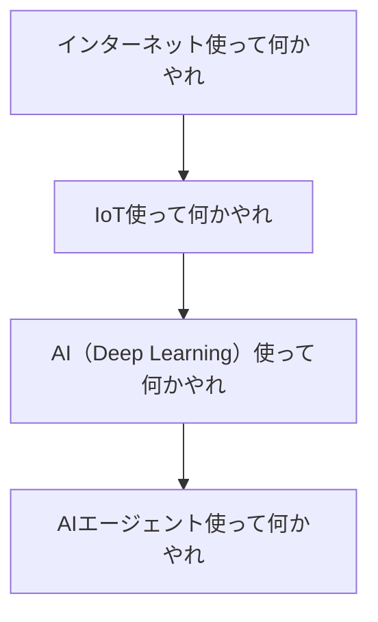

## はじめに

こんにちは。フューチャーアーキテクト 製造・エネルギーサービス事業部の柴田です😌 見真の心で本質を探求しています!

::: note info
先日、Google Cloud Next 2025に参加してきました。特にAIエージェントの分野は大きな盛り上がりを見せており、基調講演で中心的テーマとして扱われただけでなく、さまざまな企業ブースでユースケースやデモが紹介されていました。本記事では、Google Cloud Next 2025を通して感じたAIエージェント活用の現在地について、私なりの考えを整理してみたいと思います。
:::

## Google Cloud Next 2025 ハイライト

まずは簡単に、Google Cloud Next 2025のAIエージェント関連で特に印象的だった内容をいくつか紹介します。

- **Agentspaceの盛り上がり**
  Google Cloudが提供するAIプラットフォーム「Agentspace」は、初日の基調講演でも長い時間をかけて紹介されていました。スピーカーが実際の作業者に扮してユースケースを紹介する形式が印象的でした

*業者の服装をしたスピーカーが、AIエージェントを使って業務を魔法のように効率化するデモを実演*

- **各社のユースケース紹介**
  様々な企業がユースケースを紹介したり、ブースで展示デモを実施したりしていました。今後、AIエージェントを実際に業務へ導入した事例がますます増えていくと感じました
- **AIエージェント活用へのハードル低下**
  詳細は後述しますが、現時点ではAIエージェントを業務で活用するには様々なハードルがあります。しかし、このハードルを下げるサービスが今後続々と登場する兆しが見られました

## AIエージェント活用の現在地

Agentspaceを用いた業務効率化をはじめ、その他にも様々なユースケースが紹介・実演されていました。
それでは、Agentspaceを使えば誰でも簡単に業務をサポートしてくれるAIエージェントを作れるのでしょうか？ 私の所感としては、現時点ではまだ難しいと言えるでしょう。確かにAgentspaceのビジョンは非常に魅力的ですが、業務で価値を生むAIエージェントを作るためには、いくつかのハードルを乗り越える必要があると考えています。主なハードルは以下の3点です。

1. AIエージェントの作り込み
2. メタデータの整備
3. テスト方法の確立

### 1. AIエージェントの作り込み

自分の思い通りに作業をしてくれるエージェントは、設計者の「作り込み」に大きく依存します。単にLLMを呼び出すだけでは不十分で、信頼性の高いエージェントを構築するには、以下のような特有の難しさが伴います。

- **的確なプロンプトの作成**
  AIエージェントに期待通りの応答をしてもらうためには、試行錯誤を伴うプロンプトエンジニアリングが不可欠です。また、安定して望んだフォーマットで出力させるための工夫も必要となります
- **ツールとの連携**
  エージェントが外部データを利用するためにはツールが必要ですが、そのツールをどう定義するかも重要です。汎用性を求めるのであれば、ツールに渡すパラメータをAIエージェントに生成させると効果的ですが、自由度が高すぎると欲しいデータが得られなかったり、APIエラーが発生したりする可能性も高くなるため、バランスが重要となります

*画面左側にAIエージェントが列挙されている。このAIエージェントの作りこみが非常に重要*

### 2. メタデータ整備

AIエージェントが「売上データを集計して」といった指示に正しく応えるためには、DWH内のデータが何を意味するのかを理解している必要があります。そのために、以下のようなメタデータの作り込みが極めて重要になります。

- **テーブルレベルのメタデータ**
  「サービスの全顧客の会員情報を格納するテーブル。毎朝6時に更新」というように、できるだけ詳しく、人間が理解できる言葉でテーブルの目的や更新頻度を記述します
- **カラムレベルのメタデータ**
  物理名をAIエージェントが正しく解釈することは困難なため、「顧客コード」のように分かりやすく説明します。BigQueryであれば論理名の形式にこだわらず、カラムが持つ情報の詳細を記述することが有効です。また、コード値が格納されるデータであれば、「`1` なら有効会員、`9` なら退会済み」のように、その意味を定義する必要もあります

今後は、AIエージェント活用を前提としたテーブル設計が求められるでしょう。

### 3. テスト方法の確立

プロンプトの修正や使用するLLMの変更などでAIエージェントを更新した場合、本番適用前にテストが必要なのは従来通りですが、エージェント特有の課題があります。

- **出力の非決定性**
  AIエージェントは、同じ入力に対しても確率的に異なる出力を返すことがあるため、従来の「期待される結果と完全に一致するか」というテスト手法が適用しにくくなります
- **評価基準の曖昧さ**
  例えば「今日の出来事を要約してレポートを作成する」エージェントの場合、何を持って「良い要約」とするのか、その品質を客観的に評価するための明確な基準や指標の設定が困難です
- **テスト範囲の決定**
  ユーザーからの入力は自由な自然言語であるため、そのパターンは無限に近くなります。機能と無関係な質問をされた際に予期しない事態が起きないか、機密情報を漏らしてしまわないかなど、テストで網羅すべき範囲の決定は大きな課題です

### Gartnerのハイプサイクルから分かる現在地

Gartnerのハイプサイクルによると、AIエージェントは現在「過熱期」の真っ只中にあり、最も期待に満ちた面白い時期だと言えるでしょう。時間が経つにつれて、一度は前述のような課題から「幻滅期」に入ると考えられますが、それを乗り越えて最終的には様々な場面で利用されるようになるはずです。

*Gartner Hype Cycle Identifies Top AI Innovations in 2025*

思えば過去にも、「〇〇を使って何かやれ」という大きな技術トレンドが定期的にありました。今はまさに「AIエージェントを使って何かやれ」の時期です。過去のトレンドよりも業務への適用がイメージしやすく、アイデアも出やすいと感じます。今こそ、AIエージェントを使って様々なユースケースにトライすべき時でしょう。

## AIエージェントの未来展望

### 少し先の未来：開発はさらに容易に
エージェントの作り込みは、今後さらに簡単になっていくでしょう。Google Cloud Next のセッションで紹介されていたように、今後は「データエージェントファミリー」のような特化型エージェントがリリースされる予定です。Agent Designerのようなサービスも次々と登場し、データ分析という用途において、エージェント構築のハードルが格段に下がることが期待できます。

### 近未来：物理世界との対話

現在、AIエージェントの活動はデジタルの世界に限定されていますが、今後は物理世界に作用するデバイスを通じて、人間と物理的に対話する未来がやってくると考えられます。Google Cloud Nextでは、エージェントを通してロボットアームを操作するデモが紹介されていました。また、Googleが設置したバスケットボールコートで、エージェントがコーチングを行う体験コーナーは、多くの参加者の関心を集めていました。近い将来、人間がAIエージェントを搭載したデバイスと物理世界上で直接会話し、作業を依頼する時代がやってくるでしょう。

*AIエージェントのバスケットコーチ。現在でもAIから様々なことを学べますが、物理世界で人間の学習に直接関わる日も近いのかもしれません*

*ロボットアームとAIエージェントの連携デモ。今後はこのような展示がますます増えていくでしょう*

## まとめ

Google Cloud Next 2025に参加し、AIエージェントへの注目の高まりを肌で感じました。本記事が、AIエージェントの現在地と将来像を理解する一助となれば幸いです。今はトライ＆エラーを繰り返しながら、業務活用の手順やテスト方法を確立していく重要な時期だと考えています。そのため、引き続きユースケースの作成と検証を進めつつ、最新情報のキャッチアップに努めていきたいと思います。

最後に重要なことです。AIエージェントに100点満点を求めることは難しいですが、そこですぐに幻滅して「やっぱり使えない」という判断をしないでください。そういった場合を考慮した運用設計や、受け入れて業務遂行する覚悟がAIエージェントの業務活用には必要不可欠です。

## 参考資料

- [セッション 2：質問するだけ！AI エージェントとデータ分析の新潮流](https://services.google.com/fh/files/events/gcdais-25s-t3-session2.pdf)
- [Agent Development Kit > Tool](https://google.github.io/adk-docs/tools/)
- [Gartner Hype Cycle Identifies Top AI Innovations in 2025](https://www.gartner.com/en/newsroom/press-releases/2025-08-05-gartner-hype-cycle-identifies-top-ai-innovations-in-2025)
- [Gemini と Vertex AI で実現する AI バスケットボールコーチ開発の裏側](https://cloud.google.com/transform/ja/how-we-built-an-ai-basketball-coach-with-gemini-on-vertex-ai)
