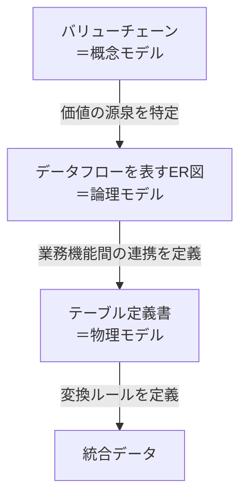
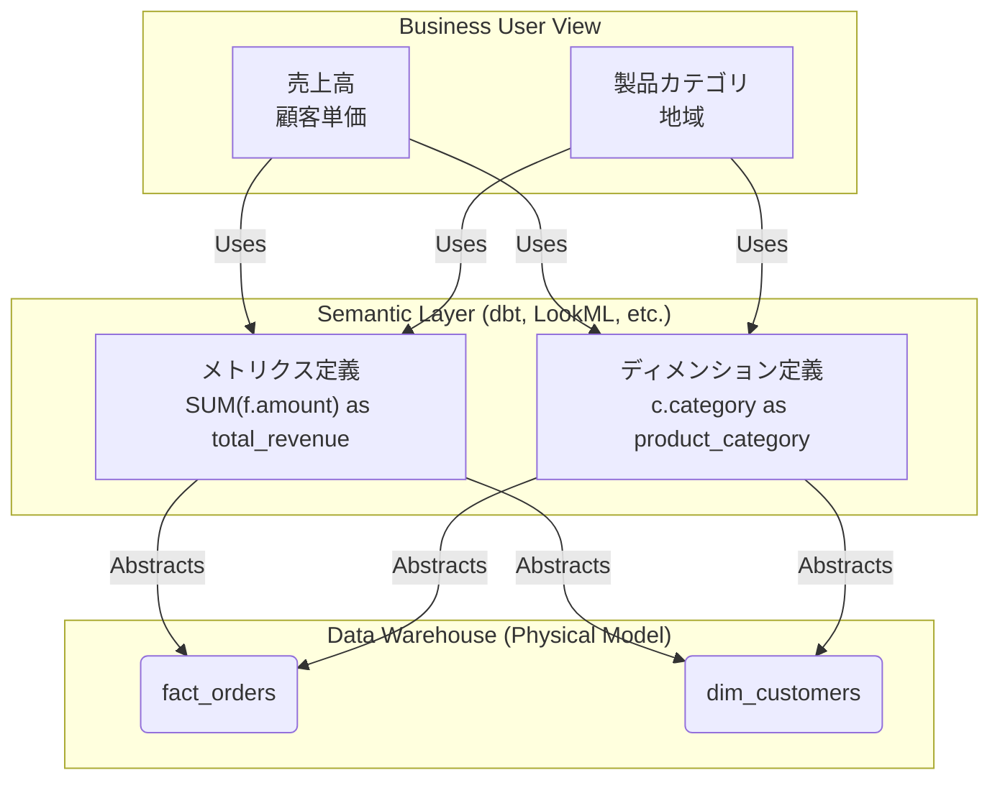
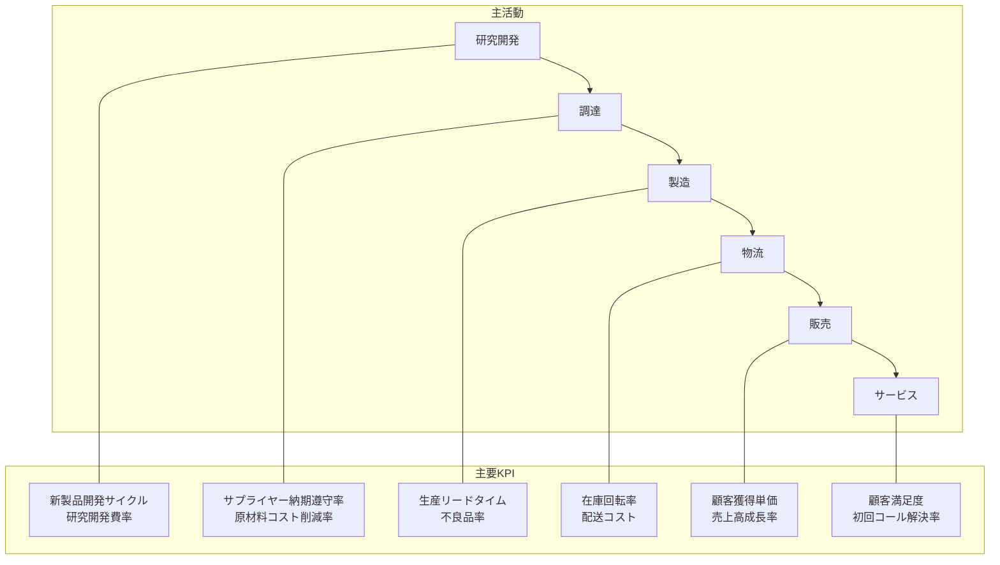
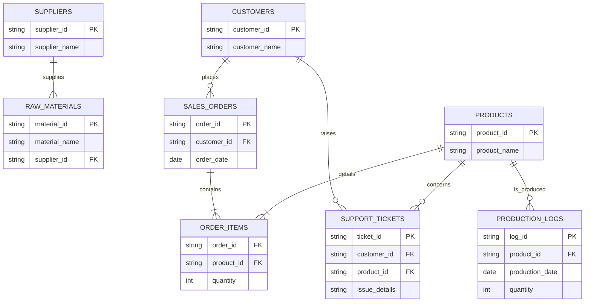
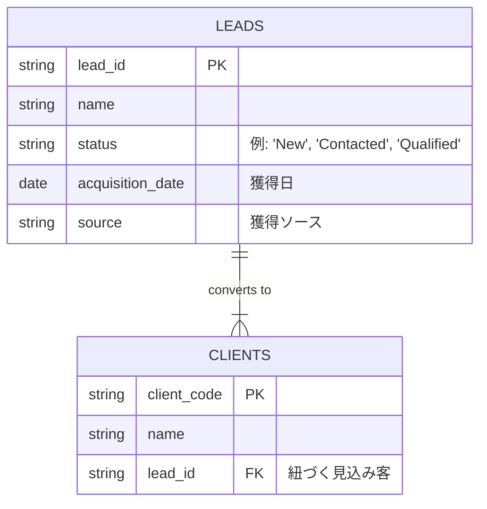

こんにちは。製造エネルギー事業部の大前七奈です。

今年に入り、GeminiなどLLMが今までにない進化を遂げています。多くの企業がAI活用を模索する一方で、「AIに何を食べさせればよいか分からない」「データが散在・サイロ化していて使えない」といった課題に直面しています。フューチャー恒例の[秋のブログ週間](/articles/20251031a/)を機に、今回はAI（特にGEMINI-CLI）を利用して、どのようにAIと協働してデータモデリングできるか、直近のデータモデリングのトレンドを調べました。

本記事では、**AI活用のROIを最大化するために、なぜ「概念モデル」からデータモデリングを始めるべきか**、そして、**AI自体をモデリングのパートナーとして活用し、コストパフォーマンス高くアジャイルにデータ基盤を整備する具体的な手法**を紹介します。

※GEMINI-CLI自体を利用するときの注意点やテクニックについてはまた別記事にまとめるため、ここで割愛させていただきます。

## 従来のデータ統合問題

レガシーシステム統合時、データ品質問題や設計上の問題に加え、最も困難な課題として「情報の意味（セマンティクス）」の不一致が挙げられます。新しいシステムと古いシステム間、あるいは、異なる事業部や部門で、同じエンティティが異なる意味や粒度で定義されている場合、技術的な接続以上にセマンティクスの統合がコストを増大させます。いわば、「表現のゆらぎ」問題です。

- よくある表現のゆらぎ問題＝領域による同じ言葉の違い:
  - 営業システムの `customers` テーブル（見込み客を含む）
  - 経理システムの `customers` テーブル（取引先のみ）
  - サポートシステムの `customers` テーブル（保守契約企業のみ）

## AI時代のためのデータモデリング：概念モデルから始めるコスト効率
AIは手段です。その能力を最大限に引き出すには、良質なデータが必要ですが、やみくもに全データを統合するのは得策ではありません。結局誰も使わないデータ基盤が完成し、投資対効果が見合わなくなります。

そこで重要になるのが、**価値に焦点を当てたトップダウンのアプローチ**です。ER図やテーブル定義といった物理的な設計から入る前に、まず企業全体の**バリューチェーン（概念モデル）**を定義することで、AI活用のコストパフォーマンスを最大化できます。



バリューチェーン（Value Chain / 価値連鎖）から始める理由は大きく３つあります。

1. 経営資源の集中
   - 「自社の活動のどこで価値（利益）が生まれ、どこで無駄（コスト）が発生しているか」を特定することで、データ整備やAI適用の優先順位を明確にし、投資を最も効果的な場所に集中できます。
2. データ基盤構築の羅針盤
   - 価値の源泉が分かれば、どのデータを、どの粒度で管理すべきかが明確になります。これにより、無駄なデータ統合を避け、議論が発散した際の拠り所となります。
3. AIのコンテキストとしての観点：Markdownによるデータ構造の表現
   - GeminiのようなAIにデータモデリングを依頼する際、最も効果的なのは、企業のデータ資産の全体像を**人間とAIの両方が理解できる形式**でコンテキストとして与えることです。その最適な方法の一つが、**VSCodeのフォルダ構造を模したリポジトリの階層構造でデータを整理する**ことです。

例えば、以下のようにデータ資産をフォルダーの階層構造を利用して整理した例です。このように、階層構造含めコンテキストとしてAIに与えることで、AIは「どのデータがどこにあり、どのような関係性を持つ可能性があるか」を正確に把握し、より精度の高いER図や統合ロジックを生成してくれます。

```sh
.
├── 研究開発/
│   ├── R&D_projects.csv # 研究開発プロジェクト情報
│   └── patent_data.csv  # 特許情報
├── 調達/
│   ├── supplier_contracts.csv      # サプライヤー契約情報
│   └── raw_materials_inventory.csv # 原材料在庫情報
├── 製造/
│   ├── production_logs.csv         # 製造ログ
│   └── quality_control_results.csv # 品質管理結果
├── 物流/
│   ├── shipping_records.csv    # 出荷記録
│   └── warehouse_inventory.csv # 倉庫在庫情報
├── 販売/
│   ├── sales_orders.csv      # 受注データ
│   └── customer_feedback.csv # 顧客フィードバック
└── サービス/
    ├── support_tickets.csv     # サポートチケット
    └── maintenance_records.csv # メンテナンス記録
```

さて、この概念モデルはどうやって物理モデルに展開すればいいか、まず、従来の**セマンティックモデル**（またはセマンティックレイヤー）の関係への理解を深めてから、具体的な手順を紹介したいと思います。

### セマンティックモデルとの関係

セマンティックモデルは、物理的なデータ構造（テーブルやカラム）と、ビジネスユーザーが理解できる言葉（指標や属性）との間の「翻訳層」の役割を果たします。

- **バリューチェーン（概念）との接続**: バリューチェーンで定義した「どこで価値が生まれるか」という概念は、セマンティックモデルにおける「メトリクス（例: 売上高、顧客獲得数）」として具体的に定義されます。
- **データ（物理）の抽象化**: ユーザーは `SUM(sales.amount)` のようなSQLを書く代わりに、「総売上」というビジネス用語でデータにアクセスできるようになります。

AI、特にLLMは、このセマンティックレイヤーを解釈することで、より自然言語に近い形でデータに関する問いに答えたり、分析を行ったりすることが可能になります。つまり、バリューチェーンからセマンティックモデルを定義することは、AIがビジネスコンテキストを理解するための「共通言語」を与えることに他なりません。

以下は、dbtなどのツールで定義されるセマンティックモデルの概念をMermaidで表現した例です。



## AI-readyデータとは

AI-ready データとは、AIモデルが学習や分析をスムーズに、かつ正確に行うために、以下の状態に「整えられている」高品質なデータを指します。先ほど議論してきた概念モデルやバリューチェーンは**関連性**という性質に関連しております。**正確性**や**一貫性**に関しては、AIを利用することで、従来の属人のやり方より網羅的に課題をあぶり出すことができます（詳しい手順は次の章）。

- 正確性:
  - データに間違いや入力ミスがないこと。
- 一貫性:
  - 例えば、同じ意味のデータが「東京」「トウキョウ」「TKO」のようにバラバラに書かれておらず、統一されていること。
  - 欠損値が適切に処理されており、その扱いに関するルール（例: NULLで統一）が明確であること。
- 関連性（目的に合っているか）:
  - AIが解決したい課題（例えば、商品の売上予測）に対して、本当に必要な情報が含まれていること。
- 代表性:
  - データが現実世界の分布を適切に代表していること。

データプロファイリングは、Pythonのdata_profilingライブラリを使うと一括で可視化・分析できます。AIの分析結果との整合性を比較するために生成しておくと便利です。

<iframe src="https://drive.google.com/file/d/1WDtI6QyD1dFHrz3Dv1gmkUREmbLT1K8e/preview" width="640" height="480"></iframe>

## AI-Readyのためのデータモデリング

さて、いよいよ手を動かす時間です！

従来のデータモデリング（概念→論理→物理）は、ウォーターフォール的に進められることが多く、数ヶ月かけて作成した物理モデルが、いざ開発段階になると業務実態と合わなくなる、といった手戻りが多発しました。

AI時代では、AIを「高速な壁打ち相手」として活用し、このプロセスをアジャイルに（反復的に）進めることができます。以下の各例はGEMINI‐CLIを利用したときの例です。

### ステップ1: AIとバリューチェーン（概念）のドラフトを作成

まず、業務担当者へのインタビューメモや、既存の業務フロー図、中期経営計画などのドキュメントをGeminiにインプットし、バリューチェーンの「たたき台」を作成させます。

**プロンプト例:**

```txt
あなたは製造業のコンサルタントです。
以下のインタビューメモに基づき、
この企業のバリューチェーン（主活動）を『研究開発』『調達』『製造』『物流』『販売』『サービス』の観点で整理し、
それぞれの活動で重要と思われるKPI（候補）を挙げてください。
```

**▼アウトプット例**



### ステップ2: AIとデータプロファイリング（物理）を実施

次に、ステップ1で特定したバリューチェーンの「価値の源泉」に関わる既存データ（例：「販売」領域のデータ）をプロファイリングし、前述のMarkdown形式でAIにインプットして、セマンティクスの問題をあぶり出します。

**プロンプト例:**

```txt
あなたはデータアーキテクトです。
以下のMarkdownで表現されたデータ資産マップに基づき、
企業全体のバリューチェーンを俯瞰できるような統合データモデルのER図をMermaidで作成してください。
各エンティティ間の関係性（1対多、多対多など）も定義してください。
```

**▼レスポンス例**



### ステップ3: AIと論理モデルをKPIに向けて改善

ステップ2で明らかになったセマンティクスの不一致を解決すると同時に、**ステップ1で定義したKPI（例：顧客獲得単価、顧客満足度）を計測・分析できるデータモデル**へと進化させます。

**プロンプト例（初回）:**

```txt
ありがとうございます。ステップ2の分析に基づき、「見込み客」から「取引先」への転換プロセスを追跡できるようにモデルを設計してください。
これにより、ステップ1で定義した**顧客獲得単価(CAC)の算出**が可能になるはずです。
統合顧客マスタの論理モデル（ER図）をMermaid形式で提案してください。
```

**▼レスポンス例(初回）**



*AIはCAC算出を意識して、`acquisition_date` や `source` といった属性を追加してくれるかもしれません。*

**プロンプト例（修正指示）:**

```txt
ありがとうございます。顧客獲得の分析ができそうです。
次に、**顧客満足度やLTV（顧客生涯価値）**の分析も視野に入れたいです。
先ほどのモデルに、販売後の「注文」と「サポート」の概念を追加してください。
どの注文に関する問い合わせかを追跡できるようにすることで、製品やサービスの問題点を特定し、顧客満足度の改善に繋げたいです。
```

このように、AIが生成したモデルを元に、ビジネスKPIを達成するための改善指示を繰り返すことで、モデルをアジャイルに進化させることができます。最終的に、記事の前半で示したような、バリューチェーン全体を俯瞰する包括的なER図へと発展させていきます。

### ステップ4: KPIに向けてデータ統合ロジックを生成

論理モデルが固まったら、次はそのモデルに元データを投入するための具体的なデータ統合（ETL/ELT）ロジックをAIに作成させます。

**プロンプト例:**

```txt
ありがとうございます。論理モデルがFIXしました。
ステップ2で提示した2つのCSV (`sales/customers.csv` と `finance/clients.csv`) から、
先ほど作成した `LEADS` テーブルと `CLIENTS` テーブルにデータを統合するためのSQL（INSERT文）を生成してください。
その際、以下の要件を満たしてください。
- `sales/customers.csv` のうち、statusが「契約済」の顧客を `CLIENTS` テーブルに登録する。
- それ以外のステータスの顧客は `LEADS` テーブルに登録する。
- `finance/clients.csv` の `client_name` の表記揺れ（例：「株式会社A」と「A株式会社」）を吸収して、`CLIENTS` テーブルの名寄せを行う。
```

**▼レスポンス例**

```sql
-- sales/customers.csv から LEADS テーブルへのデータ投入
INSERT INTO LEADS (lead_id, name, status)
SELECT
    customer_id,
    name,
    status
FROM
    sales_customers
WHERE
    status != '契約済';

-- sales/customers.csv と finance/clients.csv から CLIENTS テーブルへのデータ投入と名寄せ
INSERT INTO CLIENTS (client_code, name, lead_id)
SELECT
    -- 取引先コードは経理のものを正とする
    fc.client_code,
    -- 名前の表記揺れを吸収 (例として `REPLACE` を使用)
    REPLACE(REPLACE(sc.name, '株式会社', ''), '商事', '') AS unified_name,
    sc.customer_id
FROM
    sales_customers sc
JOIN
    finance_clients fc
ON
    REPLACE(REPLACE(sc.name, '株式会社', ''), '商事', '') = REPLACE(REPLACE(fc.client_name, '株式会社', ''), '商事', '')
WHERE
    sc.status = '契約済';

```

### ステップ5: AIと物理モデル（DDL）とドキュメントを生成
論理モデルが固まったら、最後のステップとして、AIに物理的な実装成果物であるDDL（Data Definition Language）やテーブル定義書の草案を作成させます。これにより、エンジニアは単純なコーディング作業から解放され、より複雑な実装に集中できます。

**プロンプト例:**

```txt
ありがとうございます。最終的な論理モデルが完成しました。
このER図に基づき、PostgreSQL互換のDDL（CREATE TABLE文）を生成してください。
各カラムには、その内容がわかるようにコメントを追加してください。
また、各テーブルの目的をまとめたMarkdown形式のテーブル定義書も作成してください。
```

**▼AIによるアウトプット例**

**1. DDL (SQL)**

```sql
-- 見込み客テーブル
CREATE TABLE LEADS (
    lead_id VARCHAR(255) PRIMARY KEY, -- 見込み客ID
    name VARCHAR(255), -- 会社名または担当者名
    status VARCHAR(50), -- ステータス (例: 'New', 'Contacted', 'Qualified')
    acquisition_date DATE, -- 獲得日
    source VARCHAR(100) -- 獲得ソース (例: 'Web', 'Event')
);

-- 取引先テーブル
CREATE TABLE CLIENTS (
    client_code VARCHAR(255) PRIMARY KEY, -- 取引先コード
    name VARCHAR(255), -- 取引先名
    lead_id VARCHAR(255) REFERENCES LEADS(lead_id) -- 紐づく見込み客ID
);

-- 注文テーブル
CREATE TABLE SALES_ORDERS (
    order_id VARCHAR(255) PRIMARY KEY, -- 注文ID
    client_code VARCHAR(255) REFERENCES CLIENTS(client_code), -- 取引先コード
    order_date DATE, -- 注文日
    status VARCHAR(50) -- 注文ステータス (例: '受注', '出荷済', 'キャンセル')
);

-- サポートチケットテーブル
CREATE TABLE SUPPORT_TICKETS (
    ticket_id VARCHAR(255) PRIMARY KEY, -- チケットID
    client_code VARCHAR(255) REFERENCES CLIENTS(client_code), -- 取引先コード
    order_id VARCHAR(255) REFERENCES SALES_ORDERS(order_id), -- 関連する注文ID
    issue_details TEXT -- 問い合わせ内容
);
```

**2. テーブル定義書 (Markdown)**

| テーブル名 | 物理名 | 目的 |
| :--- | :--- | :--- |
| 見込み客 | LEADS | 営業活動の対象となる潜在顧客を管理する。 |
| 取引先 | CLIENTS | 請求実績のある契約済み顧客を管理する。 |
| 注文 | SALES_ORDERS | 取引先からの製品やサービスの注文情報を管理する。 |
| サポートチケット | SUPPORT_TICKETS | 顧客からの問い合わせやサポート依頼を管理する。 |

このように、最終的な物理モデルの生成までAIを活用することで、データモデリングの全工程を高速化し、一貫性を保つことができます。

## おわりに
LLM（AI）が登場したからといって、データモデリングの重要性がなくなるわけではありません。むしろ、AIがデータの「意味」を理解するために、セマンティクスを定義するデータモデリングの重要性は増しています。

また、AIはデータモデリングという従来は**職人技であったプロセスを民主化**し、高速化してくれる強力なパートナーでもあります。具体的な活用機会として、以下の各レイヤにあるのではないかと考えます。

| レイヤー | 役割 | AIの活用機会 |
| :--- | :--- | :--- |
| メタデータ | 構造 | 分類と検証 |
| セマンティクス | 意味 | 自然言語によるドキュメンテーション |
| リネージ | コンテキスト | 影響分析 |
| ルール | ガバナンス | ポリシーの自動チェック |
| AI | インテリジェンス | 生成と推論 |

このようにAIと協働しながら、**トップダウン（概念モデル）でビジネス価値を定義し、ボトムアップ（既存データ）の現状をMarkdownで構造化してAIに提示する**、 という両輪を回すことが、手戻りのないデータ基盤を構築し、AI活用の成功を掴むための最短ルートとなるでしょう。

## 参考

- [MODERN DATA MODELING: THE QUIET REVOLUTION POWERING THE AI-DRIVEN ENTERPRISE](https://medium.sqldbm.com/modern-data-modeling-the-quiet-revolution-powering-the-ai-driven-enterprise-9d5b332a0ee7)
- [SNOWFLAKE、SALESFORCE、DBT LABSなどが、オープン セマンティック インターチェンジ共同構想によってAIのためのデータ活用準備を革新](https://prtimes.jp/main/html/rd/p/000000078.000116784.html)
- [HOW UNIVERSAL DATA MODELS SUPPORT BUSINESS-ORIENTED DATA MODELING](https://medium.com/universal-data-models/how-universal-data-models-support-business-oriented-data-modeling-79806d6960c4)
- [アジャイルデータモデリング 組織にデータ分析を広めるためのテーブル設計ガイド (KS情報科学専門書)](https://amzn.asia/d/cy6q7Wa)
