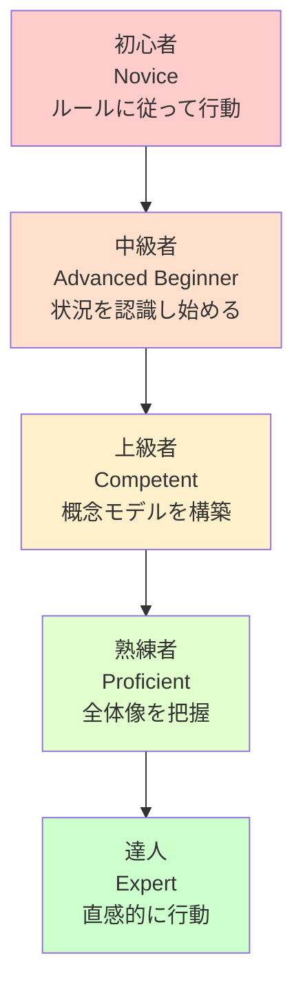
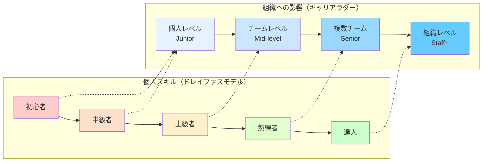

本記事は、[AI Tips連載](/articles/20250707a/)の1本目の記事となります。

# はじめに

こんにちは。HealthCare Innovation Group(HIG)の山本竜玄です。

業務やプライベートを通して、GeminiやGitHub Copilot、Cursor、Claudeなどを使用していますが、これらのAIエージェントツールをうまく使うにはプロンプトエンジニアリングの知識が必要だと実感しています。

例えば、Few-Shot Prompting（数個の例を与えてつつ、同様のタスクを依頼する）であったり、Tree of Thoughts（複数の選択肢や段階を並行して評価・検討させる）などを意識すると、AIからの回答の質が大きく向上します。

これらの手法を勉強する中で、ふと思ったことがあります。プロンプトエンジニアリングで使われる思考法は、LLMへの指示だけでなく、人にタスクを依頼する際や、自分のスキル改善について考えるときにも応用できるのではないか、ということです。

そこで本記事では、プロンプトエンジニアリングの各種手法と、エンジニアのスキル・成長段階の理論を調べた上で、それぞれを紐付け、日々の業務で実践できることはなにかを考えていきます。

<div class="note info" style="background: #e5f8e2; padding:16px; margin:24px 12px; border-radius:8px;"><span class="fa fa-fw fa-check-circle"></span>

なお、筆者自身は現在中級者レベル（Advanced Beginner / レベル2）程度の認識です。Andy Huntが指摘するように、多くのエンジニアがこのレベルで停滞するのが現実です。レベル3以降については実体験よりも調査・考察が中心となるため、推測や仮説が多分に含まれることをあらかじめお断りしておきます。

</div>

# 背景知識

まず最初に、今回の記事で使う理論やフレームワークについて簡単に整理していきます。

<div class="note info" style="background: #e5f8e2; padding:16px; margin:24px 12px; border-radius:8px;"><span class="fa fa-fw fa-check-circle"></span>
すぐに本題を読みたい方は、「スキルレベル別の実践アイデア」セクションまで読み飛ばしてもOKです。
</div>

## エンジニアの成長に関する理論

エンジニアの成長について考える時、有名なのがドレイファスモデルです。これは個人のスキルがどうやって身についていくかを説明した理論です。ただ、実際の現場では個人の技能だけでなく、チームや組織への影響力も重要になると考えています。そこで本記事では、ドレイファスモデルをメインにしつつ、エンジニアリングのキャリアラダーの視点も取り入れて考えていきます。

### 技能習得に関する「ドレイファスモデル」（Andy Hunt版）

ドレイファスモデルは1980年にドレイファス兄弟が作ったスキル習得の考え方です。いろんな分野で使われていて、看護の世界ではPatricia Bennerの「From Novice to Expert」が有名です。

エンジニアに関連するものとしては、「プラグマティック・プログラマー」を執筆したAndy Huntが、2008年に「Pragmatic Thinking and Learning」で、このモデルをソフトウェア開発用にアレンジしたものを執筆しています。



<!--
[](https://mermaid.live/edit#pako:eNpdkl1r01AYx79KON5mNWuaNAkyaJNeKoJe2ewiJidtIDkp2clYLQXTbFNbZbApykTGFDZxDC-sLwx1HyZNUr-FJy8t1XNxOM_5Pf__c16eAdBdAwIJdDyt16XuKyqiyGi046fv4utw_njv1kPv5sYdd9vSYb6Mwoso_JnNwUX8-ygKPkTB2fz0eTx5tUmtrW1Qzfbsx2U6PV5oG8a2hnRoUE3YsRCCXr6bjr8lX4JodDj_9GJ--SYKXsfnk2hEdiabxRmauZtM3MYrbrLr9CCGCOdRcjaKr79G4fsofJIdaXSYnE_Sz89KCzm3UNrp_kn6fbqwuOu5pqVbC4947-Ps11EcHmTq8Tg5OC3VSq5utf8EL2dXV3lua6cHvUKWvp0muyfp8S55h_L6KiqEW7hvQ6pBmZZtSzdMUydjlTSXBDL_EnlJzP-IUhLIZH6rpFUSXS8IoIEDPUezDPKtgyxTBbgLHagCiSwNaGq-jVWgoiFJ1Xzs3usjHUjY8yENPNfvdIFkavYWifyeoWGoWBppD2eR0tPQA9ddhtCwsOvdLtoo7yaadFNWvXSEyICe7PoIA0nM5UAagB0gcTW2wtZYhqmzvFATGIEGfSCt15kKywl8vcqxvCiuV_khDR7lBZkKxwo8x4s1URTJLFSHfwFlhhSy)
-->

このモデルで面白い（身も蓋もない）のは、ほとんどのエンジニアが「中級者」で止まってしまうという指摘です。達人レベルになるには最低10年の意図的な練習が必要とのこと。結構厳しいですね。

5つの段階をざっくり説明すると以下の通りです。

- 初心者（Novice）：コンテキストに左右されない明確なルールが必要。指示通りなら実行可能だが、想定外の事態では対処困難
- 中級者（Advanced Beginner）：わずかにルールから離れ、独力で作業可能。ただし全体像は見たがらず問題処理に手こずる
- 上級者（Competent）：問題領域の概念モデルを発展させ、独力で新しい問題を解決できる。チームの指導的役割
- 熟練者（Proficient）：全体像を求め、自己補正能力を持つ。格言を理解し、過去の失敗から学んで改善できる
- 達人（Expert）：直感に従って行動。膨大な経験を適切な状況で応用し、本質的な部分を瞬時に識別

Andy Hunt版で個人的に面白かったポイントが他にもいくつかあります。

- アジャイル開発は熟練者以上のレベルが前提（自分でフィードバックを活かして改善できるから）
- 技能は分野ごとに評価される（JavaScriptで熟練者でも、機械学習では初心者の可能性）
- 多くのエンジニアが中級者レベルで止まってしまう
- 達人になるには最低10年の「意図的な練習」が必要

看護版（ベナー版）との違いとしては、

両方ともスキルは生まれつきの才能ではなく、経験で身につくものだとしています。ただ、Andy Hunt版は技術の変化が速いエンジニアリングの世界を意識して、積極的な学習と「意図的な練習」を重視しています。一方、看護のベナー版は患者の安全を第一に、より段階的で安定した成長を大事にしています。

本記事ではエンジニアリングの文脈でAndy Hunt版を使いますが、会社の文化や役職によっては、ベナー版のような段階的なアプローチの方が適切な場合もあるかもしれません。

### ドレイファスモデルとキャリアラダーの統合

ドレイファスモデルは個人のスキルがどう発達するかにフォーカスしていますが、実際のエンジニアの職場では特定の技術的な深さだけでなく、チームや組織への影響力も評価されることが多いのではないでしょうか？

そこで本記事では、この2つを組み合わせて考えていきます。



<!-- [](https://mermaid.live/edit#pako:eNplk8tu00AUhl8lGpYkqeOxHdtC3ZCNEd2QHTYLN55pLDl25NqIEEVKMkBb2LaLIqFy6YZLEUhFtFVRH2Ya0q54BWZsx4qdWVg-853bf-wzBJ3AQUAHW6Hd71YePrL8Cjvb8WZ6YYHZ-M31xQWdntPpCSVf_13uUrJHyTc6PabkgE4_cEQ-UrKT0D0LpCn4aTXM2e672RW5Gb98UqnV1ist0bw-O5mfvuU3S45iSiGjr1cpTKlkzl8dzX-flqiUUtm8neyzVjOEfMfyV9TMf72Yn-_TyRmdfJ_9-Xl7dMUFcWWfKPlCp0zHZ0rGlFyWpBhMSjoJJp0cMq33NsO19Qex7wZhqs0QTUomLJSS90WvDdepeegp8pbaNlLJBjRvjnf-HvzIQ5OINkryLrmnMzDYDFIJhQLtyMb47qryVqNSq_OwRmaLJRtmtpjZUmbDzJYzW8pnGQ08xPNi1_P0Oxh32CkgMUdIKCGYI1xGUoaQwFMWkJyhTqeMjEUbSMEQ4wIS8ygGi2jRhqY5Wgkt2lAUXs3yQRX0UNizXYftyJC7WiDqoh6ygM5eHYTt2Iv4jzJirnYcBe2B3wF6FMaoCsIg3uoCHdveNrPivmNHqOXa7Gfs5bd9238cBL1FCHLcKAg30qVMdrPKdpOXz1Kyr4vC-0HsR0BvwCQe6EPwDOiyBOtQgoLQhIoqqYJaBQPm0xTqUFaVpihDRdMaojKqgudJRaEuQ1WRFU3SNI09VXH0H23Idyg)
-->

注意点として、大まかなイメージとして紐づけましたが、これらは別々の軸ではあります。個人のスキルレベルと組織への影響範囲は、必ずしも1対1で対応するわけではありません。当社で言えば、特定領域で達人レベルのスキルを持ちながら、個人貢献者として活動し続けるエンジニアもいます。

本記事では、プロンプトエンジニアリングの手法を両方の軸で活用する方法を考えていきます。「個人のスキルアップ」のテクニックと、「チーム・組織への貢献」のコミュニケーション手法の両方を整理していきます。

## プロンプトエンジニアリングについて

本題のプロンプトエンジニアリングの話です。これは簡単に言うと「AIにうまく指示を出して、期待した結果を得るためのテクニック集」です。

しかし、これらの手法はAIへの指示だけでなく、人間同士のコミュニケーションや自分の思考整理にも応用できるのではないかと考えています。

以下の表で、代表的な手法を整理しています。これらは単独でも使えますが、組み合わせることでより効果的になります。

| 手法名 | 概要 | 目的・効果 | AIへの指示例（キーワード） |
|:-------|:-----|:----------|:-------------------------|
| Few-Shot Prompting | 数個の例を与えてから、同様のタスクを指示する。 | パターンを学習させ、出力の精度と形式を安定させる。一貫性のある回答を得るための基本手法。 | `「例1：... 例2：... これらを参考に〇〇して」` |
| Chain of Thought (CoT) | 「ステップバイステップで考えて」と促し、思考のプロセスを書き出させる。 | 複雑な問題や推論タスクの正答率を向上させる。中間ステップを可視化することで論理の追跡が可能。 | `「ステップバイステップで考えてください」` |
| Step-Back Prompting | 具体的な問題から一歩下がって、より抽象的で一般的な概念や原理を考えてから具体的な問題に取り組む。 | 基本原理から考えることで、より正確で包括的な回答を生成する。抽象化レベルを上げてから具体化する手法。 | `「まず〇〇の基本概念について説明し、それを踏まえて〇〇を解決してください」` |
| Self-Consistency | 複数の推論パスから、自己整合性の取れた回答をさせる。 | 推論の信頼性を向上させ、ハルシネーション（幻覚）を減少させる。| `「同じ問題を複数回解いて、最も多く出現する答えを採用してください」` |
| Self-Critique | AI自身に出力結果を評価・批判させ、自己修正を促す。 | 出力の客観性を高め、潜在的な欠陥やバイアスを発見する。品質向上のための内省的アプローチ。 | `「この文章の曖昧な点や論理的矛盾を指摘してください」` |
| ReAct (Reason + Act) | 推論（Reason）と、ツール利用などの行動（Act）を組み合わせ、問題解決を行う。 | 外部情報が必要なタスクや、動的な状況に対応する能力を高める。思考と行動のサイクルを通じた学習。 | `「〇〇について調査し、その結果を基に要約してください」` |
| Tree of Thoughts (ToT) | 複数の思考経路をツリー構造で並行して評価・検討させる。 | より網羅的な探索を可能にし、単一思考経路では見逃す解を発見する。分岐思考による最適解の探索。 | `「〇〇の解決策を3つの異なるアプローチで検討し、比較してください」` |
| Least-to-Most Prompting (LtM) | 複雑な問題を小さなサブ問題に段階的に分解して解決していく。 | 段階的な問題解決により、複雑なタスクの精度と理解度を向上させる。簡単なものから順に積み上げる手法。 | `「この問題を小さな部分に分けて、簡単なものから順番に解決してください」` |
| Graph of Thoughts (GoT) | 思考をグラフ構造として表現し、任意の思考間の接続を可能にする。Tree of Thoughtsの発展形。 | 非線形推論とフィードバックループを通じて、複雑な問題の相乗効果的解決を実現。 | `「複数の解決策を組み合わせて相乗効果を検討し、フィードバックを取り入れて改善してください」` |
| APE (Automatic Prompt Engineer) | 最適なプロンプト自体をAIに考えさせる、メタ的なアプローチ。 | 特定のタスクに対するプロンプトの質を自動で最大化する。プロンプト生成の自動化と最適化。 | `「〇〇を解かせるための、最も効果的なプロンプトを作成してください」` |
| Zero-Shot CoT | 具体例なしで「ステップバイステップで考えて」と指示 | Few-Shotなしでも推論能力を引き出す。シンプルで汎用的 | `「この問題について、ステップバイステップで考えてみましょう」` |
| Role Prompting | 特定の役割や専門家の視点を設定 | 専門的な知識や視点を活用した高品質な回答 | `「あなたは10年の経験を持つソフトウェアアーキテクトです」` |

### 手法選択について

これらの手法は、どのようなタスクや課題にすべてが適応できるわけではなく、問題の複雑さや求める成果物に応じて組み合わせるのが良いと感じています。

シンプルなタスクには Few-Shot Prompting + Self-Critque の組み合わせで十分なことが多く、複雑な推論が必要なら Chain of Thought + Self-Consistency で信頼性を上げます。多角的な分析が必要なら Tree of Thoughtsで検討し、段階的な解決が必要なら Step-Back Prompting + Least-to-Most Prompting で基礎から積み上げます。

この記事のメインアイデアは、AIにうまく指示を出すために作られたこれらの手法が、エンジニアの日々の業務や成長にも応用できるのではないかということです。

### 成長段階とプロンプトエンジニアリング手法の対応関係

以下は、ドレイファスモデルの個人スキルの成長段階と、組織への影響範囲を考慮した実践的な対応関係です。筆者（中級者）の考察なので、あくまで一つの仮説として参考にしてください。

| スキルレベル | 個人の技能向上 | 組織への貢献 | 主要な思考法 |
|:---------|:---------|:---------|:---------|
| **初心者**<br/>（Novice） | Few-Shot Prompting<br/>具体例からパターン学習 | メンター・ペアプロを通じた学習 | 模倣と反復による基礎習得 |
| **中級者**<br/>（Advanced Beginner） | Chain of Thought<br/>思考プロセスの言語化 | ドキュメント作成やコードレビューでの思考共有 | 段階的思考と経験の蓄積 |
| **上級者**<br/>（Competent） | ReAct + Self-Critique<br/>仮説検証と自己評価 | チーム内技術判断とジュニア指導 | 概念モデル構築と応用 |
| **熟練者**<br/>（Proficient） | Tree of Thoughts<br/>複数選択肢の評価 | 複数チーム横断の技術設計と標準化 | 全体最適化と格言の理解 |
| **達人**<br/>（Expert） | Meta-Prompting + Role Prompting<br/>直感の言語化と伝達 | 組織技術戦略と文化形成への貢献 | 直感と経験の組織的共有 |

この対応関係のポイントは、個人スキルの向上だけでなく、そのスキルを組織でどう活かすかという視点を大事にしています。例えば、中級者のChain of Thoughtを壁打ちに用いる際には、自分の思考整理だけでなく、ドキュメントやコードレビューでチーム全体の知識共有にも役立てることができます。

# スキルレベル別の実践アイデア

ここからは、前章で整理した理論をもとに、「こんなふうに活用できるのでは？」というアイデアを成長レベルごとに紹介していきます。特にレベル3以降は筆者自身がまだ到達していない領域なので、推測や仮説が多く含まれる点をご了承ください。

## レベル1：初心者

| 項目 | 特徴 |
|------|---------|
| キャリアレベル | Junior Engineer |
| 特徴 | 明確なルールや手順があれば実行できるが、状況に応じた判断は困難 |
| 期待される成果 | 具体例からパターン学習し、基礎的な実装スキルを習得 |
| 主要な思考法 | Few-Shot Prompting（具体例から学ぶ思考） |

### このレベルでのポイント

初心者の段階では、抽象的な指示から具体的なアウトプットを想像するのが難しいです。

AIに良いお手本をいくつか見せると、そのパターンを学習するFew-Shot Promptingと同じように、初心者にも具体的な「完成形」や「お手本」を示すことで、効率的な学習が期待できると考えます。

#### 日々のAIを活用した実践アクション

| 立場・影響範囲 | 個人スキル向上のアクション | チーム・組織貢献のアクション |
|------|----------|---------|
| 個人として | 日々の業務で「優れたコード」を見つけたら保存し、新規実装時にAIに「この優れた例のスタイルを参考に〇〇機能を作成してください」などと依頼 | ペアプロなどで「なぜこのお手本が良いのか」を一緒に考え、チーム全体にナレッジとして貢献 |
| チームワークとして | タスク依頼者から提示されたお手本を「なぜこの実装が良いのか、3つの理由を教えてください」とAIに分析させ、理解を深める | わからないことを恥ずかしがらずに質問し、チーム全体の知識レベル向上、ドキュメント化の観点に貢献 |

### 次のレベル（中級者）への成長のための実践

Andy Huntによると、初心者は「コンテキストに左右されない明確なルール」が必要ですが、中級者への成長には「わずかにルールから離れる」能力が求められます。

#### 成長のためのプロンプトエンジニアリング活用法

1. Chain of Thoughtの練習：日々の作業で「この場合は少し違うアプローチが良いかもしれない」と感じた時、AIに「なぜこの状況では標準的な方法と違うアプローチが良いのか、ステップバイステップで考えてください」と問いかけ、判断根拠を言語化する練習を積む
2. 状況認識能力の養成：完全に指示通りではない場面に遭遇した際、「この状況で考慮すべき要素を3つ挙げ、それぞれがどう解決策に影響するか分析してください」などとAIと対話し、状況に応じた判断力を育てる

## レベル2：中級者（Advanced Beginner）

| 項目 | 特徴 |
|------|---------|
| キャリアレベル | Junior Engineer → Mid-level Engineer（過渡期） |
| 特徴 | 部分的な経験則が身につくが、全体像は見えていない。自分の判断プロセスの説明に苦労する |
| 期待される成果 | 思考プロセスの言語化と段階的アプローチの習得 |
| 主要な思考法 | Chain of Thought + Step-Back Prompting |

### このレベルでのポイント

Andy Huntが指摘するように、技能レベルの引き上げに最も効果的なのは「周囲に優れたお手本を配置すること」と考えます。単純な模倣から一歩進み、思考の「プロセス」そのものを意識的に言語化する必要があります。プロンプトエンジニアリングの「ステップバイステップで考えて」を人間版として応用し、優れたエンジニアの思考プロセスを再現することで、論理的思考力を鍛えます。

#### 日々の実践アクション

| 立場・影響範囲 | 個人スキル向上のアクション | チーム・組織貢献のアクション |
|------|----------|---------|
| 個人として | 複雑な機能やバグ調査の前に、エディタのコメントで思考ステップを箇条書きにする習慣をつける | 技術ブログやドキュメント作成を行い、Chain of Thoughtで客観性を確保した技術的知見の共有 |
| チームワークとして | Step-Back Promptingを実践する。複雑な課題に遭遇した際、「まずこの技術の基本原理を整理してから具体的な実装を検討」する流れを意識 | 「この実装に至るまでの考え方をステップバイステップで説明」し、レビュワーが判断根拠を理解できるようにする |
| チームメンバーとして | 「なぜこのアプローチを選んだのか」をAIと対話しながら整理し、チームメンバーに分かりやすく説明 | 実装完了やドキュメント化にあたって、「他にどんな方法を考えたか、その手順をステップバイステップで説明」を促し、チーム全体の検討に貢献 |

##### 具体例：バグ調査での思考プロセス可視化

Badアプローチ（思考プロセスが見えない）：

```js
// いきなりコードを書き始める
console.log(userPosts); // undefinedが出力される
// あれこれ試行錯誤...
```

Chain of Thoughtを意識したアプローチ：

```js
/*
思考ステップ：
1. まず現象を整理する
   - ユーザー投稿一覧が「たまに」表示されない
   - 「たまに」ということは条件によって発生している

2. 仮説を立てる
   - API呼び出しのタイミング問題？
   - データの形式が想定と異なる場合がある？
   - 認証状態による影響？

3. 検証手順を決める
   - ネットワークタブでAPI呼び出しを確認
   - レスポンスデータの形式をログ出力
   - 認証状態をログ出力
*/

// 上記の手順に従って調査を開始
console.log('認証状態:', authState);
console.log('API呼び出し前:', userPosts);
```

### 次のレベル（上級者）への成長のための実践

Andy Huntによると、中級者は「全体像を見たがらない」特徴があり、上級者への成長には「問題領域の概念モデルを発展させる」必要があります。

#### 成長のためのプロンプトエンジニアリング活用法

1. Step-Back Promptingの実践：いきなり解決策を考えるのではなく、「まずこの技術の基本原理を整理してから、具体的な実装方法を検討しよう」という流れを意識する
2. Self-Critiqueの習慣化：自分の実装をAIに「客観的な観点から潜在的な問題点を指摘してください」と評価させ、コードレビュー前のセルフチェックとして活用することで、自分の成果物やタスクを客観的にみる視点を取り入れる

## レベル3：上級者（Competent）

<div class="note warn" style="background: #fdf9e2; padding:16px; margin:24px 12px; border-radius:8px;"><span class="fa fa-fw fa-check-circle"></span>
以下レベル3以降の内容は、筆者の直接的な経験だけではなく、観察や調査をもとにした考察です。
</div>

| 項目 | 特徴 |
|------|---------|
| キャリアレベル | Middle-level Engineer |
| 特徴 | 問題領域の概念モデルを発展させ、独力で新しい問題を解決できる |
| 期待される成果 | 仮説検証サイクルの習得と客観的な自己評価能力 |
| 主要な思考法 | ReAct + Self-Critique + Self-Consistency |

### 参考になりそうな思考法：ReAct + Self-Critique + Self-Consistency

プロンプトエンジニアリングのReActパターンのように、自分の頭の中だけで推論する（Reason）閉じた世界から、外部からの情報（Act/Observation）を得て思考を修正するサイクルと、Self-Critiqueのように自分の成果物を客観的に批判する視点を取り入れることが重要です。

例えば、重要な技術的判断を行う際は、調査や情報を取得しつつ、パフォーマンス、保守性、拡張性といった異なる観点から評価し、自己批判的に見直しもしつつ最もバランスの取れた解決策を選ぶようにします。

### 日次で取り入れられる具体的なアクション

| 立場・影響範囲 | 個人スキル向上のアクション | チーム・組織貢献のアクション |
|------|----------|---------|
| 個人として | コードレビュー前の自己批判。AIに「経験豊富なシニアエンジニアとして、このコードの潜在的問題を指摘してください」と依頼する。 | 技術ブログやドキュメント作成として、Self-Critiqueで客観性を確保した技術的知見の共有 |
| チームワークとして | 同じ課題を異なる3つのアプローチで検討し、最適解を選択 | 「どんな仮説（Reason）が立てられる？検証方法（Act）は？」などと問いかけ、自律的思考を支援 |
| チームメンバーとして | パフォーマンス・保守性・拡張性の観点からSelf-Consistencyを適用 | 複数の技術的選択肢を提示し、チーム全体での意思決定プロセスを改善 |

#### 成長を意識した実践ポイント

Andy Huntによると、熟練者への移行には「自己補正能力」の獲得が重要です。上級者は問題解決はできるものの、「以前うまくいかなかった自らの行いを修正する」能力はまだ不十分です。個人レベルではReActのような行動を意識し、組織レベルでは自分の判断や行動が他のチーム・プロジェクトに与えた影響を Tree of Thoughtsで多角的に分析する習慣をつけることで、個人の成長と組織への貢献を両立できます。

## レベル4：熟練者（Proficient）

| 項目 | 個人スキル向上 |
|------|---------|
| キャリアレベル | Senior Engineer |
| 特徴 | 全体像を求め、自己補正が可能。格言の理解と文脈に応じた適用 |
| 期待される成果 | 複数選択肢の比較検討能力と過去の失敗からの学習 |
| 主要な思考法 | Tree of Thoughts |

### 参考になりそうな思考法：Tree of Thoughts

プロンプトエンジニアリングのTree of Thoughtsが示すように、最適解が一つではない複雑な問題に対し、複数の可能性を網羅的に比較検討し、意思決定の質を高める必要があります。

### 日次で取り入れられる具体的なアクション

| 立場・影響範囲 | 個人スキル向上のアクション | チーム・組織貢献のアクション |
|------|----------|---------|
| 個人として | 「この状況で『早すぎる最適化は諸悪の根源』という思想をどう解釈すべきか、3つの異なる視点（Tree of Thoughts）で検討してください」とAIと対話 | 技術判断について文書化し、他チームが参考にできる意思決定プロセスの共有をする |
| 技術リーダーとして | 「今回の判断→実行→結果を整理し、次回改善すべき意思決定プロセスを特定してください」 | 技術的要因・プロセス要因・コミュニケーション要因などを整理し、教育コンテンツにもなるポストモーテムの作成 |
| 組織横断リーダーとして | 複数のプロジェクト・チームの技術的制約を同時に考慮した最適解の探索 | 組織全体の技術品質向上のためのガイドライン作成と普及 |

#### 成長を意識した実践ポイント

Andy Huntによると、達人への移行は大きな質的転換を伴います。熟練者は「格言」を理解し適用できますが、達人は「直感」に従って行動します。この転換のために、Zero-Shot CoTの発想を応用し、「具体例や過去の経験に頼らず、この状況で直感的に最適解はなにか、ステップバイステップではなく一発で答えてみてください」といった直感的判断の練習を意識的に行います。

## レベル5：達人（Expert）

| 項目 | 内容 |
|------|------|
| キャリアラダー | Staff/Principal Engineer |
| 特徴 | 直感に従って行動。本質的な部分と重要でない部分を瞬時に区別。ルールを課すとパフォーマンスが低下 |
| この段階で大切になりそうなこと | 直感を尊重し、制約を与えないこと。実践を継続すること |
| 参考になりそうな思考法 | Meta Prompting |

### 参考になりそうな思考法：Meta Prompting

Andy Huntの指摘では、達人の特徴は「直感に従って行動し、理由を説明できない」ことです。この段階では、ルールやプロセスを強制するとむしろパフォーマンスが低下します。達人は本質的な部分と重要でない部分を瞬時に区別し、パターンマッチングを瞬時に行います。

この段階でのAIの活用法は、組織的なシステム設計ではなく、達人の直感を補完し、暗黙知を明文化するための「壁打ち相手」として機能できると考えます。達人は結論に達した理由を説明できないため、AIに「なぜこのアプローチが最適だと思うのか、可能な理由を列挙してみて」と依頼することで、新人教育やナレッジシェアに活用できます。

### 日次で取り入れられる具体的なアクション

| 立場・影響範囲 | 個人スキル向上のアクション | チーム・組織貢献のアクション |
|------|----------|------------|
| 個人として | 直感の言語化として、「私がこのアーキテクチャ選択で直感的に『正解』と感じる理由を、パターン認識→経験照合→リスク評価の順で逆算ください」など | Meta-Promptingで「この直感的判断を他のエンジニアに効果的に伝えるための最適な指導方法を設計してください」 |
| 技術リーダーとして | 「表面的な課題の背後にある根本的な設計思想の課題を依存関係グラフで可視化し、改善ポイントを特定してください」など |長期的な技術ロードマップと横断的な技術戦略の策定 |
| 組織文化リーダーとして | 個人の技術的直感を組織のベストプラクティスや技術文化として体系化 | 組織全体の技術レベル底上げと、将来の達人エンジニアを育成する環境の整備 |

#### 成長を意識した実践ポイント

達人レベルでは、Andy Huntが指摘するのは「達人であり続けるには、実践を続けること」が最も重要です。しかし、組織では達人の個人的専門性だけでなく、その知識を組織全体に波及させる影響力も期待されます。効果的な指導方法を自動生成したり、Role Promptingで専門家としての視点を明確化することで、直感的判断を組織の技術文化として体系化することが求められます。

# まとめ

本記事では、プロンプトエンジニアリングの各種手法をエンジニアの成長段階と組み合わせ、「個人スキルの向上」と「組織への貢献」の両面から活用する方法を考察してきました。特にレベル3以降については筆者の実体験が限られるため、推測や仮説に基づく部分が多いことをお断りしておきます。

今回記事を執筆して考えたこととしては、プロンプトエンジニアリングの手法は単一のタスクだけでなく、様々に活用できるのではないかということです。

例えば、Chain of Thoughtによる思考の言語化は、自分自身の頭の整理になるだけでなく、チームでの技術議論などでも活用できます。また、Self-Critiqueによる客観的評価は、個人のコード品質向上はもちろん、技術ドキュメントや設計資料の質向上にも貢献します。

プロンプトエンジニアリングの技術を意識して磨くことは、生産性の向上だけでなくに自分自身の思考の質を向上させることに繋がります。AIを単なるコード生成ツールとしてだけでなく、スキルやキャリアの「壁打ち相手」として活用することで、日々の業務やスキルアップにまた違った面白みが生まれるのではないかと考えています。

この記事が、皆さんの現場での業務において、AIとの新しい付き合い方を考える何かしらのヒントになれば幸いです。筆者自身もまだ学習の途上にあるため、ご意見やフィードバックをいただけますと大変ありがたく思います。

## 参考文献

- Benner, P. (1984). From Novice to Expert: Excellence and Power in Clinical Nursing Practice. Addison-Wesley.
- Hunt, A. (2008). Pragmatic Thinking and Learning: Refactor Your Wetware. The Pragmatic Bookshelf.
- Hunt, A., & Thomas, D. (1999). The Pragmatic Programmer: From Journeyman to Master. Addison-Wesley.
- Wei, J., et al. (2022). Chain-of-thought prompting elicits reasoning in large language models. Advances in Neural Information Processing Systems, 35, 24824-24837.
- Wang, X., et al. (2022). Self-consistency improves chain of thought reasoning in language models. arXiv preprint arXiv:2203.11171.
- Yao, S., et al. (2022). ReAct: Synergizing reasoning and acting in language models. arXiv preprint arXiv:2210.03629.
- Yao, S., et al. (2023). Tree of thoughts: Deliberate problem solving with large language models. Advances in Neural Information Processing Systems, 36.
- Besta, M., et al. (2024). Graph of Thoughts: Solving Elaborate Problems with Large Language Models. Proceedings of the AAAI Conference on Artificial Intelligence, 38(16), 17682-17690.
- Zhou, D., et al. (2022). Least-to-Most Prompting Enables Complex Reasoning in Large Language Models. arXiv preprint arXiv:2205.10625.
- Zhang, Z., et al. (2023). Multimodal Chain-of-Thought Reasoning in Language Models. arXiv preprint arXiv:2302.00923.
