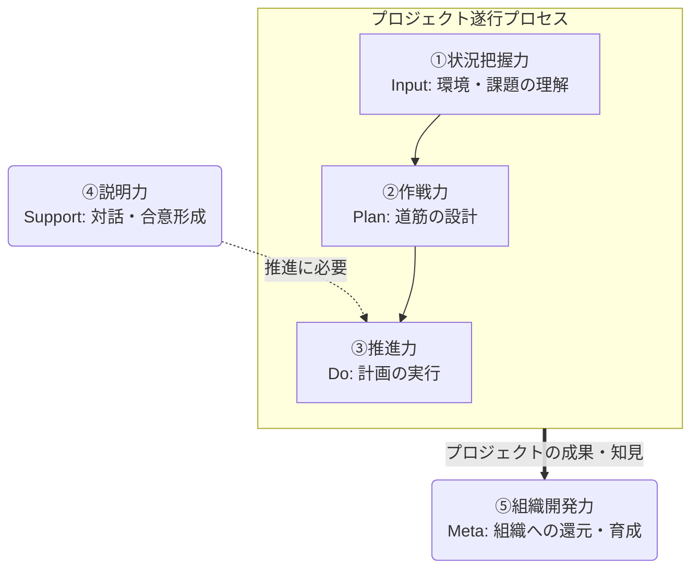

# はじめに

TIGの真野です。

フューチャーの有志で作成している設計ガイドラインの新作「ソフトスキルガイドライン」の発表です。

https://future-architect.github.io/arch-guidelines/documents/forSoftSkill/softskill_guidelines.html

これまではAWSやWeb API、データマネジメントといった技術的な設計指針を中心に公開してきましたが、少し趣向を変えて「非」技術領域にフォーカスしたコンテンツを公開しました[^1]。

[^1]: と、言いながらもすでに[Slack利用ガイドライン](https://future-architect.github.io/arch-guidelines/documents/forSlack/slack_usage_guidelines.html)なども存在します。良いアーキテクチャを作るためという目的で作成しているため、一般的なビジネススキルも包含すると考えています。

本記事では、なぜ今「ソフトスキル」をテーマにしたのか、その背景とガイドラインの概要について紹介します。

なお、本ガイドラインはフューチャーの有志メンバーが「アーキテクトにはこういう能力が必要だよね」という観点を持ち寄って整理したものであり、実験的な位置づけのドキュメントです。

# なぜ今「ソフトスキル」なのか

アーキテクト的なロールの人には、技術的な正しさだけでなく、ビジネスと技術の翻訳や様々な利害関係者を繋ぎ、プロジェクトを成功に導く能力が求められているかと思います。

この場合は、技術力は唯一絶対的な指標ではなく、要素の1つであると考えました。

* 技術力 ✖ ソフトスキル ✖ アセット ≒ 貢献/成果

技術力をレバレッジとして効かせる1つの要素がソフトスキルだと考えています。アーキテクトロールに付く人にとって、技術力とソフトスキルはある意味、車の両輪の様な関係性でしょう。

どれほど優れたアーキテクチャを設計できたとしても、それを顧客やチームに納得させ、実行に移すことができなければ、ビジネス価値は生まれません。技術特化型のスペシャリストも重要ですが、技術力を武器にビジネス視点を持ってレバレッジを効かせる「ジェネラリスト型アーキテクト」的なキャリアパスを進んでいる人も多い。そうした思いから、これまで少なくても当社では暗黙知とされがちだった「立ち振る舞い」を体系化することにしました。

::: note warn
なお、このガイドラインはあくまで有志が作成したものです。フューチャーの人事制度や評価などで実運用している訳ではありません。各社の状況や価値観が異なるため、全てに適用できるものであるとも見なしていません。しかし、流用できる部分も少なからずあると思いますので、気になる点はフィードバックを頂ければです。内容を確認させていただき、随時改善していきます。
:::

# 5つのコア・ソフトスキル

本ガイドラインでは、アーキテクトに必要なソフトスキルを以下の5つに分類しています。

それぞれの関係性は以下で、1～3はプロジェクト遂行で必要な本業（？）スキル、4は対話/合意形成が特に重要だとしてトップレベルに昇格、5はその他貢献といった具合です。

それぞれ、簡単に紹介します。ガイドラインにはもう少し細かく整理されています。

## ① 状況把握力

**背景にある考え**: 技術力が高くても、状況把握を誤れば価値を生みだせないでしょう。技術力には自慢があってもイマイチ刺さらない、一般論から踏み出せないときは状況把握が不足しているかもしれません。

* **業務知識**
  * 業界知識（トレンド、課題）
  * 事業理解力（ビジネスモデル、収益源）
  * 業務理解力（業務フロー、意思決定プロセス）
* **顧客理解**
  * 経営目標の理解（中期経営計画など）
  * 企業文化の理解（価値観、スピード感）
  * 組織力学の理解（非公式なキーマン、意思決定プロセス）
* **関係理解**
  * 案件の理解（背景、経緯）
  * 契約の理解（スコープ内外の判断）
  * 提案（スコープ外対応、次フェーズへの種まき）

顧客のビジネスモデルや業界知識はもちろん、組織力学（キーマンは誰かなど）、契約スコープなどを正確に理解する能力です。AI時代的な表現では、コンテキストを獲得する能力といえば良いでしょうか。

「あるべき論」としてのアーキテクチャは重要ですが、それが顧客の企業文化や予算・納期の制約の中で機能するかどうかを見極めるためには、正しい状況理解が不可欠です。一般論を振りかざしても意味がないのはどこでも伝わる話でしょう。

また、アーキテクチャのもっともらしさ（それで大丈夫なのか？）は、究極的にはビジネス目標を達成できれば良いとも言えると思います。そのため、超マクロで見ればアーキテクチャはビジネスゴールや目標の射影です。この理論でいけば、アーキテクチャ設計者は、事業（業務）担当者と同じ目線、課題意識を持つと話が早く、より精度が高いものを考え出せるでしょう。

## ② 作戦力

**背景にある考え**: アーキテクトには、ゴールが不明瞭な状態でも、仮説ベースで実現可能な計画を作り出しチームを導くことが求められます。決めてくれたらやりますではなく、決める側に徐々に移ってきたのです。

* **構想力**
  * ゴール設定（成功の定義）
  * 課題抽出（将来の問題を探索的に発見）
* **計画力**
  * 計画作成力（スケジュール、マイルストーン、勝ち筋）
  * リスクマネジメント（早期の対応案）
  * 体制構築（最適なチーム構成、役割定義）

不確実性が高いプロジェクトにおいて、ゴールから逆算したWBSやスケジュールを引き、リスク対策を早期に計画して「勝ち筋」を描く能力です。

単にタスクをこなすのではなく、将来問題になり得る課題（技術、ビジネス含めて）を探索的に見つけ出し、先手を打つことが求められます。そういった勘所を働かせられると、頼られる存在になると思います。

## ③ 推進力

**背景にある考え**: 技術力が高まると意見を求められる場面が増え、評論家に陥ってしまう場合があります。そうではなく当事者として最後までやり抜き、アーキテクチャを実現することが求められます。

* **リーダーシップ**
  * 不確実性耐性（仕様不明確でも前進させる）
  * オーナーシップ（他責にせず最後までやり抜く）
  * ディレクション（プロジェクトの大義を浸透させる）
  * 意思決定（複数選択肢からの決断）
  * 動機づけ（メンバーへの意義の説明）
  * 巻き込み力（有識者への相談、支援要請）
* **プロジェクトマネジメント**
  * WBS策定（見積もり、タスク分解）
  * 進め方の合意（マイルストーン、検証ポイント）
  * タスク依頼（背景説明、適切なアサイン）
  * 予実管理（遅延検知、リカバリープラン提示）
* **チームマネジメント**
  * 役割分担（スキルや志向を考慮）
  * チーム運営（ルール、プロセス改善）
  * 調整力（タスク調整、利害対立の解消）

技術的な意思決定にオーナーシップを持ち、結果に責任を持つ力です。職務経歴書を鮮やかにするための技術選定は忌避されるべきです。新技術の導入は（実際にそうかはさておき少なくてもその時点では）最後までやり抜く覚悟があって行うべきとされることが大多数でしょう。

また、仕様が不明確な状況でも自ら働きかけたり、進捗遅延に対して自律的にリカバリープランを提示したりと、プロジェクトを前に進めるための「リーダーシップ」と「マネジメント」の両面を含みます。

最終的にどこに着地させようと考えているのか、最悪ここまでは達成させたいのでそのための施策は～など、走りながら考え、常にプランB, Cを持っておく必要があります。もちろん、それらと同時にメンバーを離脱させては推進どころではないため、スキルや志向にあった役割分担や、人心掌握的な声掛け（褒めたり適切なフィードバックをしたり）などもケアする必要があります。

## ④ 説明力

**背景にある考え**: 相手の立場や知識レベルに合わせ、納得感のある合意形成を図ることで、その意思決定に価値が生まれます。

* **価値訴求 & 合意形成**
  * 魅力づけ（一貫した物語として語る）
  * 論点設定（議論すべきテーマの設定）
  * 仮説立案（解決策の提示、メリット・デメリット）
  * 比較整理（判断軸を想定した多角的な評価）
  * 合意形成（戦略的な根回し、信頼関係構築）
  * 期待値コントロール（実現可能性の伝達）
* **コミュニケーション**
  * 簡潔さ（PREP法、要点の絞り込み）
  * 表現力（デフォルメ、比喩、抽象化）
  * ドキュメント力（構造化、視覚的な美しさ）
  * 傾聴力（真意の推測、非言語情報の読み取り）
  * 対話力（深い議論への誘導、建設的な対立）
  * 質問力（深掘り、潜在ニーズの引き出し）
  * ファシリテーション（発散と収束、合意への誘導）

技術的な価値を、顧客（非エンジニア）やビジネスサイドに伝わる言葉へ「翻訳」し、合意を形成する力です。

どれだけ優れた設計やシステム構築ができたとて、それを伝えてナンボです。正しく価値訴求し評価されることで、もっと良いものを作ろう！ といったモチベーションにも繋がります。長期的に健全な関係性づくりはビジネス的にも重要です。

そのためには、「なぜこのアーキテクチャなのか」といった一貫したナラティブであったり、戦略的な根回しや構造化されたドキュメント作成を通じて、納得感を重視した合意形成が必要です。

## ⑤ 組織開発力

**背景にある考え**: 個人の知恵を組織の資産へすることで、組織の持続可能性を高めます。優秀であればあるほど、組織レベルの貢献も求められるでしょう。だれしもが良い組織文化のある企業に所属したいと思いますが、その文化を生み出す側にあなたは立っているかもしれません。

* **タレントマネジメント**
  * 採用（スキル・カルチャーの見極め基準言語化）
  * 育成（コードレビュー、1on1、適切な裁量付与）
  * 評価（納得感のあるフィードバック）
* **ナレッジマネジメント**
  * アセット化（成果物の汎化・標準化・再利用）
  * ナレッジトランスファー（アセットの共有・改善サイクル）
* **組織文化 & ブランディング**
  * 心理的安全性（失敗の開示、オープンな対話）
  * 自己研鑽支援（相互学習、勉強会の企画）
  * ブランディング（外部登壇、執筆、発信文化の醸成）

個人の知見を「組織のアセット」に変え、採用・育成・外部発信を通じて組織全体のケイパビリティを強化する力です。

自分一人が優秀なだけではなく、ナレッジを形式知化して後進を育成し、自分が抜けても回る仕組みを作れるかは、レポートライン（先輩社員）から見ても重要な観点でしょう。

20代、30代ですとまだまだプレイヤーとしての成長意欲が強いと思いますが（私も30代ですが）、立場が上がるとより部署/全社的な視点での貢献が求められ始めます。自社の組織課題/技術課題についての不満を言うだけではなく、実行することはそれ自体チャレンジングな取り組みかと思いますので、いっそ自分事にして取り組んでしまうのもお勧めです。

# スキルレベルと期待値

ここまでの説明ではスキルという概念は登場しませんでした。実際のガイドラインでは、各項目ごとに3段階のレベルを定義しています。

* **Level 1 【認識】**: 重要性を理解し、サポートがあれば実行できる
* **Level 2 【実践】**: 独力で標準レベルを遂行できる。とりあえず目標にすべきレベル
* **Level 3 【指導】**: 他者を指導し、新しい仕組みを生み出す

全ての項目で満点を取る必要はありません。得意分野でチームを牽引しつつ、苦手な領域でもLevel 1（認識）を持っておくことで、チームとして補完し合える状態を目指しています。

# おまけ話

実はこのガイドライン、作成メンバーの永井さんと議論している際に「この内容はエンジニアリングマネージャー（EM）の文脈でも有用ではないか？」という話になりました。そこで、EMのカンファレンスである「EMConf JP」への応募を検討したのですが……気づいたときにはCfPの申込期限が過ぎており、あえなく断念しました。

大きな舞台で登壇という形でのアウトプットは叶いませんでしたが、引き続きアップデートを続けて次の機会を狙っていければなと思います。

# おわりに

「ソフトスキル」という言葉は広義であり、組織やプロジェクトによって求められる要素は異なります。

本ガイドラインもあくまでフューチャーの一部の「有志」が定義した「現時点での解」に過ぎません。内容について「わかる！」「ここは違うんじゃないか？」といったご意見があれば、ぜひXなどでフィードバックをいただけると嬉しいです。

最後に、作成・レビューに関わってくれた永井さん、武田さん、佐藤さん、澁川さん、赤坂さん、井上さん、清水さんに感謝します。

**ソフトスキルガイドライン**
https://future-architect.github.io/arch-guidelines/documents/forSoftSkill/softskill_guidelines.html
