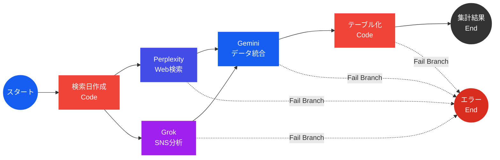

## はじめに

最近、「マルチAIエージェント」という言葉をよく耳にするようになりました。

単一のLLMですべてを解決するのではなく、検索が得意なAI、分析が得意なAIなどを適材適所で組み合わせる手法です。その好例として話題になったのが、2026年の第51回衆議院議員選挙に合わせて公開された「[ホリエモンAI選挙](https://vote.horiemon.ai/)」です。

このAI選挙予測サイトを見て、「面白そう」と思ったエンジニアや「ウチのビジネスでも活かせそう」と直感したビジネスパーソンは少なくないはずです。私が凄いなと思った点は、**「予測の仕組み(AIエージェントの組み合わせ、プロンプト)」が公開されていること**です。つまり、各サービスの契約さえあれば、誰でも同じロジックを手動で試すことができます。具体的には、以下のような役割分担です。

- **Perplexity** で最新の世論調査、報道データを検索させて
- **Grok** でX上の投稿を検索してSNSトレンドを分析させて
- **Gemini** でそれらの情報を統合・構造化してもらう

このフローは手動で実行可能ですが、毎回3つのサービスを開いてプロンプトをコピー&ペーストし、結果を貼り合わせる単調作業を繰り返すのは「プログラマーの三大美徳」（怠惰・短気・傲慢）に反します。

そこで、この記事では、**Dify Cloud と 3つのAI Agent API(Perplexity / Grok / Gemini)を組み合わせて、ボタン1つで選挙情勢分析レポートを自動生成するワークフローを構築する方法** を解説します。

「そんな複雑なシステム、個人で検証したら高いんじゃないの？」と思われがちですが、**今回の検証(分析フローの一部再現)にかかったAPI費用は、たったの8ドル(約1,200円)** です。本記事では、用意するソースコードはPythonが数行程度で、Dify Cloud上で動かせる(ローカル環境不要)手順に加え、「各サービスのAPIキーをどこで取るのか」「Difyのどの画面で何を設定するのか」を解説します。

::: note alert
本記事は「ホリエモンAI選挙」の仕組みを参考にDifyでワークフローを構築する技術解説記事であり、同サービスを完全に再現するものではありません。以下の点にご留意ください。

- 「ホリエモンAI選挙」では「全体情勢分析」「都道府県別分析」「比例ブロック分析」の3種類の分析が行われていますが、本記事では **「全体情勢分析」のみ** を対象としています
- 本家で投入されている事前データ(選挙区の区割り情報、立候補者情報など)の投入は行っていません
- プロンプトの一部について、公開情報から推測して埋め合わせた箇所があります
:::

## 完成イメージ

まず、最終的に何ができるのかを先にお見せします。

ワークフローの全体構成は以下の通りです。



Dify上で「実行」ボタンを押すと、以下のフローが自動で処理されます。

1. **Perplexity**がWeb上の世論調査・ニュースを検索して分析
2. **Grok**がX上の投稿を分析してSNS世論を分析
3. 上記2つの結果を**Gemini**が統合、構造化されたJSONを出力
4. PythonコードがJSONをMarkdownテーブルに整形

最終出力には、以下のように、内閣支持率、各政党それぞれの支持率・トレンド・分析コメント、データソースリストが含まれます。

(出力フォーマット以外の最終的な出力は黒塗りさせていただきました。皆さんも手元で試してみて、どんな結果が得られるのかを検証してみて下さい！)


### 検証に要した費用

今回のワークフローには、Dify・Perplexity・Grok・Gemini を利用しています。動作検証にあたり、初回費用枠や最低購入額等を利用することで、8ドル(1,200円 = 150円×8ドル)となりました。(※為替レートは執筆時点の概算)

| サービス名 | 検証に要した費用 | 備考 |
| --- | --- | --- |
| Dify Cloud | $0 | 今回のワークフローは「無料枠」で実現可能 |
| Perplexity | $3 | APIクレジットの最低購入額が $3 のため |
| Grok(xAI) | $5 | APIクレジットの最低購入額が $5 のため |
| Gemini(Google AI Studio) | $0 | 無料トライアル分の「91日間可能な $300 のウェルカムクレジット」を利用した |

---

## 事前準備1:Perplexity API

### APIキーの取得手順

1. [Perplexity](https://www.perplexity.ai/) にアクセスして、アカウントを作成します
2. ログイン後、左下のアイコン → 「API」を選択します
3. APIグループ名を入力して「保存」を選択します


4. 「API請求」に移動して、支払い方法(クレジットカード)を登録します


5. 「クレジットをもっと購入」をクリックして、最低購入額の $3 を購入します


6. 「APIキー」に移動後、「APIキーを生成する」をクリックしてキーを発行します


7. 発行されたキーを控えておきます(後でDifyに登録します)

## 事前準備2:xAI(Grok)API

### APIキーの取得手順

1. [xAI Console](https://accounts.x.ai/sign-in) にアクセスし、アカウントを作成します
2. ダッシュボードから「API Keys」に移動します
3. 「Create API Key」でキーを発行します

    **設定パラメータ**

    | カテゴリ | 設定項目 | 値 |
    | --- | --- | --- |
    | Restrict access | Models | grok-4-1-fast-reasoning |
    | - | Endpoints | Chat |
    | Rate limits | TPM | 50000 |
    | - | RPM | 20 |


4. 発行されたキーを控えておきます


5. Billingから「Purchase credits」を選択します


6. 最低購入額の $5 を入力し、クレジットカードを登録して購入します


## 事前準備3:Google AI Studio(Gemini API)

### APIキーの取得手順

1. [Google AI Studio](https://aistudio.google.com/) にアクセスし、右上の Get started からGoogleアカウントでログインします


2. 左下の「Get API Key」を選択し、続いて右上の「APIキーを作成」をクリックします


3. 「プロジェクトを作成」から新しいプロジェクトを作成します


4. 「Copy API key」で取得したキーを控えておきます


5. 続いて、「お支払い情報を設定」をクリックします


6. **$300分の無料クレジット**と**自動請求なし**が表示されていることを確認してから「同意して続行」を選択します


7. 「連絡先情報」と「お支払い方法(無料枠の場合も必須)」を入力して「無料で利用開始」を選択します


8. Google AI Studioのコンソール画面に戻り、割り当てティアが「お支払い情報を有効にする」と表示されていれば設定完了です

    注意点: 「お支払い情報を有効にする」をクリックすると以下画面に遷移しますが、課金が始まる「有効化」は不要です


## Dify Cloud のセットアップ

### アカウント作成

[Dify Cloud](https://cloud.dify.ai/) にアクセスして、アカウントを作成します。


### プラグインのインストール

Dify Cloudでは、外部LLMとの接続に「プラグイン」を使用します。今回必要なプラグインは以下の2つです。

| プラグイン | 用途 |
| --- | --- |
| [`langgenius/perplexity`](https://marketplace.dify.ai/plugins/langgenius/perplexity) | PerplexityをToolノードとして使用するため |
| [`langgenius/gemini`](https://marketplace.dify.ai/plugins/langgenius/gemini) | GeminiをLLMノードとして使用するため |

補足: xAI(Grok)の[`langgenius/x`](https://marketplace.dify.ai/plugins/langgenius/x) は、本ブログ執筆時点(2026.02.08)では `x_search`(X/Twitterを検索するオプション機能) に対応していないため、今回は利用しません。

インストール手順:

1. Dify画面右上の「プラグイン」からメニューを開きます
2. 「プラグインをインストールする」から「マーケットプレイス」を選択します
3. PerplexityとGeminiを検索して、インストールします


4. 右上のアイコンをクリックして「設定」に移動して、「モデルプロバイダー」を表示します
5. Geminiの「セットアップ」をクリックして、API Keyに **Google AI Studioで発行したAPIキー** を入力して保存します


6. トークン名の右側に緑色のランプが点灯していれば、Geminiの設定は完了です


### ワークフローの準備

1. 画面上部の「スタジオ」に移動して「最初から作成」を選択します


2. 「ワークフロー」を選択して、名前と説明文を入力したら「作成する」を選択します


3. 開始ノードには「ユーザ入力」を利用します


### 環境変数の設定

ワークフローの編集画面で、環境変数を2つ設定します。

| 変数名 | 型 | 用途 |
| --- | --- | --- |
| `xai_api_key` | **Secret** | GrokのAPIトークン |
| `CHUDOU_DESCRIPTION` | String | プロンプト内で参照する政党情報(後述) |

`xai_api_key`をSecret型にすることで、Dify上のUIでマスク表示されます。もう一つの`CHUDOU_DESCRIPTION`は政党の説明文を格納する変数で、プロンプト内から`{{#env.CHUDOU_DESCRIPTION#}}`で参照します。

1. 右上の `ENV` をクリックします
2. 「環境変数を追加」のポップアップに適切な「タイプ・変数名・値」を入力します
    - `xai_api_key` の値には、xAIで取得したAPIキーを入力します
    - `CHUDOU_DESCRIPTION` には政党の説明文を入力します。今回、登録する説明文はAIに生成させました


3. 環境変数を登録すると、以下のように表示されます。（`CHUDOU_DESCRIPTION`の説明文はAIに生成させてみてください）


## ワークフロー構築

今回のワークフローは、最終的に以下のような形になります。


ここからは、Difyのワークフローエディタ上で構築する各ノードを順番に解説します。

### スタートノード

入力変数は何も設定しません。今回のワークフローは「**完全手動実行**」です。画面右上の「テスト実行」ボタンを押すことで全体のワークフローが動きます。本ブログでは、動作確認のしやすさから「手動実行」としていますが、スケジュールノードに変更すれば「定期自動実行」への切り替えも可能です。

### 検索日作成(Codeノード / Python)

Grokの`x_search`や後続のノードに渡す日付範囲を動的生成するためのノードです。

**ノードの追加**


Pythonの処理には以下コードを登録します。

```python
from datetime import datetime, timedelta, timezone

def main() -> dict:
    now = datetime.now(timezone.utc)

    from_dt = now - timedelta(hours=24)

    to_date = now.strftime("%Y-%m-%d")
    from_date = from_dt.strftime("%Y-%m-%d")

    return {
        "from_date": from_date,
        "to_date": to_date,
    }
```

出力は`from_date`と`to_date`の2つの文字列です。UTCベースで生成しているのは、Dify Cloudのサーバのタイムゾーンに依存しないようにするためです。

* 入力変数
  * （なし）
* 出力変数
  * from_date: String
  * to_date: String

**ノードの完成形**


### Grok(HTTP Requestノード)

Difyの xAI(Grok) プラグインには [`langgenius/x`](https://marketplace.dify.ai/plugins/langgenius/x) があります。ただし、このプラグインでは、X/Twitterを検索する `x_search` が本ブログ執筆時点(2026.02.08)では利用できないため、今回は HTTP Requestノードで直接APIを叩きます。

**ノードの追加**


**認証設定**

「認証なし」と表示されているボタンを選択して、環境変数に登録したGrokのAPIキーを登録します

- 認証タイプ: APIキー
- API認証タイプ: Bearer
- APIキー: `{{#env.xai_api_key#}}`（「環境変数」として登録した値）


**パラメータ設定内容**

| カテゴリ | 設定項目 | 値 |
| --- | --- | --- |
| API | メソッド | POST |
| - | URL | `https://api.x.ai/v1/responses` |
| ヘッダー | キー | `Content-Type` |
| - | 値 | `application/json` |
| タイムアウト設定 | 接続タイムアウト | 10秒 |
| - | 読み取りタイムアウト | 240秒 |
| - | 書き込みタイムアウト | 30秒 |

- 失敗時再試行
  - 最大試行回数: 3回
  - 再試行間隔: 1000ミリ秒
- 例外処理
  - 例外分岐

**リクエストボディ(JSON)**

```json
{
  "model": "grok-4-1-fast-reasoning",
  "input": [
    {
      "role": "user",
      "content": "【日付】{{#検索日作成.to_date#}}\n\nX上での2026年衆院選に関するSNS動向を分析してください。..."
    }
  ],
  "tools": [
    {
      "type": "x_search",
      "from_date": "{{#検索日作成.from_date#}}",
      "to_date": "{{#検索日作成.to_date#}}"
    }
  ],
  "temperature": 0.7,
  "top_p": 0.95,
  "max_output_tokens": 30000
}
```

`tools`配列に`x_search`を指定するのがポイントです。これにより、GrokがX上の投稿を実際に検索した上で回答を生成します。`from_date`と`to_date`は前段のCodeノードの出力を変数展開しています。

プロンプトは「[ホリエモンAI選挙 予測の仕組みを公開](https://vote.horiemon.ai/how-it-works)」で公開された文面を利用しています。

**ノードの完成形**


### Perplexity(Toolノード)

DifyのPerplexityプラグインを「ツール」ノードとして配置します。

**ノードの追加**


**認証設定**

1. 「APIキー認証設定」をクリックする


2. Perplexity APIで発行したAPIキーを「Perplexity API key」に入力して保存する


**「Query」に登録するプロンプト**

「[ホリエモンAI選挙 予測の仕組みを公開](https://vote.horiemon.ai/how-it-works)」のプロンプトに記載された以下の変数に対して、本ブログでは以下の対応を行なっています。

- **{TODAY}**: 「検索日作成ノード」で作成した値の `to_date` を代入
- **{CHUDOU_DESCRIPTION}**: 環境変数の `{CHUDOU_DESCRIPTION}` を代入
- **{RECENT_PARTIES_DETAIL_BLOCK}**: プロンプトから削除

**パラメータ設定内容**

| パラメータ | 設定値 |
| --- | --- |
| Model Name | sonar-pro |
| Max Tokens | 20000 |
| Temperature | 0.6 |
| Top K | 40 |
| Top P | 0.9 |
| Presence Penalty | 0 |
| Frequency Penalty | 0.4 |
| Return Images | False |
| Return Related Questions | False |
| Search Recency Filter | Week |
| Search Context Size | High |

- 失敗時再試行
  - 最大試行回数: 3回
  - 再試行間隔: 1000ミリ秒
- 例外処理
  - 例外分岐

**ノードの完成形**


### Gemini(LLMノード)

PerplexityとGrokの出力を受け取り、構造化されたJSONとして統合するGeminiノードを追加します。

**ノードの追加**


**LLMの設定**

- **モデル**: `gemini-3-pro-preview`
- **Temperature**: 0.3(構造化出力の安定性を重視)


**プロンプト**

プロンプトの中でPerplexityとGrokの出力結果を明示的に渡します。

```text
...
【ニュース・調査データ(Perplexity)】
-> Perplexity / {x} text

【X/Twitter世論分析(Grok)】
-> Grok / {x} body
...
```


**構造化出力(Structured Output)の活用**

Difyの「構造化出力」機能を有効にし、JSONスキーマを定義しています。これにより、Geminiの出力を指定したスキーマに従わせます。ただし、このスキーマを指定したとしても、本来ならば数字が入るべきところに文字列が入ってしまうケースなどが見られたので、出力の完全保証とはなりません。

「出力変数」の `structured_output` から、出力スキーマを指定します。

<details>
<summary>インポートするJSON全文(クリックで展開)</summary>

```json
{
  "type": "object",
  "properties": {
    "analysis_date": {
      "type": "string"
    },
    "cabinet_approval": {
      "type": "object",
      "properties": {
        "rate": {
          "type": "number"
        },
        "trend": {
          "type": "string"
        },
        "source": {
          "type": "string"
        },
        "confidence": {
          "type": "number"
        },
        "analysis": {
          "type": "string"
        }
      },
      "required": [
        "rate",
        "trend",
        "source",
        "confidence",
        "analysis"
      ],
      "additionalProperties": false
    },
    "party_momentum": {
      "type": "object",
      "properties": {
        "ldp": {
          "type": "object",
          "properties": {
            "support_rate": {
              "type": "number"
            },
            "trend": {
              "type": "string"
            },
            "analysis": {
              "type": "string"
            }
          },
          "required": [
            "support_rate",
            "trend",
            "analysis"
          ],
          "additionalProperties": false
        },
        "chudou": {
          "type": "object",
          "properties": {
            "support_rate": {
              "type": "number"
            },
            "trend": {
              "type": "string"
            },
            "analysis": {
              "type": "string"
            }
          },
          "required": [
            "support_rate",
            "trend",
            "analysis"
          ],
          "additionalProperties": false
        },
        "ishin": {
          "type": "object",
          "properties": {
            "support_rate": {
              "type": "number"
            },
            "trend": {
              "type": "string"
            },
            "analysis": {
              "type": "string"
            }
          },
          "required": [
            "support_rate",
            "trend",
            "analysis"
          ],
          "additionalProperties": false
        },
        "dpfp": {
          "type": "object",
          "properties": {
            "support_rate": {
              "type": "number"
            },
            "trend": {
              "type": "string"
            },
            "analysis": {
              "type": "string"
            }
          },
          "required": [
            "support_rate",
            "trend",
            "analysis"
          ],
          "additionalProperties": false
        },
        "jcp": {
          "type": "object",
          "properties": {
            "support_rate": {
              "type": "number"
            },
            "trend": {
              "type": "string"
            },
            "analysis": {
              "type": "string"
            }
          },
          "required": [
            "support_rate",
            "trend",
            "analysis"
          ],
          "additionalProperties": false
        },
        "reiwa": {
          "type": "object",
          "properties": {
            "support_rate": {
              "type": "number"
            },
            "trend": {
              "type": "string"
            },
            "analysis": {
              "type": "string"
            }
          },
          "required": [
            "support_rate",
            "trend",
            "analysis"
          ],
          "additionalProperties": false
        },
        "sansei": {
          "type": "object",
          "properties": {
            "support_rate": {
              "type": "number"
            },
            "trend": {
              "type": "string"
            },
            "analysis": {
              "type": "string"
            }
          },
          "required": [
            "support_rate",
            "trend",
            "analysis"
          ],
          "additionalProperties": false
        },
        "team_mirai": {
          "type": "object",
          "properties": {
            "support_rate": {
              "type": "number"
            },
            "trend": {
              "type": "string"
            },
            "analysis": {
              "type": "string"
            }
          },
          "required": [
            "support_rate",
            "trend",
            "analysis"
          ],
          "additionalProperties": false
        },
        "hoshu": {
          "type": "object",
          "properties": {
            "support_rate": {
              "type": "number"
            },
            "trend": {
              "type": "string"
            },
            "analysis": {
              "type": "string"
            }
          },
          "required": [
            "support_rate",
            "trend",
            "analysis"
          ],
          "additionalProperties": false
        },
        "genzei_yukoku": {
          "type": "object",
          "properties": {
            "support_rate": {
              "type": "number"
            },
            "trend": {
              "type": "string"
            },
            "analysis": {
              "type": "string"
            }
          },
          "required": [
            "support_rate",
            "trend",
            "analysis"
          ],
          "additionalProperties": false
        },
        "other": {
          "type": "object",
          "properties": {
            "support_rate": {
              "type": "number"
            },
            "trend": {
              "type": "string"
            },
            "analysis": {
              "type": "string"
            }
          },
          "required": [
            "support_rate",
            "trend",
            "analysis"
          ],
          "additionalProperties": false
        }
      },
      "required": [
        "ldp",
        "chudou",
        "ishin",
        "dpfp",
        "jcp",
        "reiwa",
        "sansei",
        "team_mirai",
        "hoshu",
        "genzei_yukoku",
        "other"
      ],
      "additionalProperties": false
    },
    "key_issues": {
      "type": "array",
      "items": {
        "type": "string"
      }
    },
    "key_issues_confidence": {
      "type": "number"
    },
    "regional_trends": {
      "type": "object",
      "properties": {
        "urban": {
          "type": "string"
        },
        "urban_summary": {
          "type": "string"
        },
        "urban_confidence": {
          "type": "number"
        },
        "rural": {
          "type": "string"
        },
        "rural_summary": {
          "type": "string"
        },
        "rural_confidence": {
          "type": "number"
        }
      },
      "required": [
        "urban",
        "urban_summary",
        "urban_confidence",
        "rural",
        "rural_summary",
        "rural_confidence"
      ],
      "additionalProperties": false
    },
    "sources": {
      "type": "array",
      "items": {
        "type": "string"
      }
    }
  },
  "required": [
    "analysis_date",
    "cabinet_approval",
    "party_momentum",
    "key_issues",
    "key_issues_confidence",
    "regional_trends",
    "sources"
  ],
  "additionalProperties": false
}
```

</details>


スキーマの主要構成:

```json
{
  "analysis_date": "分析日",
  "cabinet_approval": {
    "rate": "支持率(数値)",
    "trend": "rising | stable | declining",
    "source": "情報源",
    "confidence": "信頼度(0-100)",
    "analysis": "分析コメント"
  },
  "party_momentum": {
    "ldp": { "support_rate": "...", "trend": "...", "analysis": "..." },
    "chudou": { ... },
    // ... 各政党
  },
  "key_issues": ["争点1", "争点2", "争点3"],
  "regional_trends": {
    "urban": "都市部の傾向",
    "rural": "地方の傾向"
  },
  "sources": ["ソース1", "ソース2", ...]
}
```

- 失敗時再試行
  - 最大試行回数: 3回
  - 再試行間隔: 1000ミリ秒
- 例外処理
  - 例外分岐

**ノードの完成形**


### テーブル化(Codeノード / Python)

GeminiのJSON出力を、人間が読みやすいMarkdownテーブルに変換するノードです。

- 入力変数
  - gemini: Gemini/{x} text String
- 出力変数
  - markdown_table: String

<details>
<summary>テーブル化のPythonコード全文(クリックで展開)</summary>

```python
import json

def main(gemini: str) -> dict:
    try:
        data = json.loads(gemini)
    except json.JSONDecodeError:
        return {"markdown_table": "エラー: 有効なJSONデータではありません。"}
    except Exception as e:
        return {"markdown_table": f"エラーが発生しました: {str(e)}"}

    date = data.get("analysis_date", "")
    cab = data.get("cabinet_approval", {})

    trend_map = {
        "rising": "上昇 ↗",
        "declining": "下落 ↘",
        "stable": "横ばい →"
    }

    cab_trend = trend_map.get(cab.get("trend"), cab.get("trend"))

    output = []
    output.append(f"### 分析日: {date}")
    output.append("")
    output.append("### 1. 内閣支持率・重要課題")
    output.append("| 項目 | 数値/ステータス | 分析・詳細 |")
    output.append("|---|---|---|")
    output.append(f"| **内閣支持率** | {cab.get('rate', '-')}% ({cab_trend}) | {cab.get('analysis', '').replace('\n', '')} |")

    issues = data.get("key_issues", [])
    issues_str = "、".join(issues)
    output.append(f"| **重要課題** | 信頼度: {data.get('key_issues_confidence')}% | {issues_str} |")
    output.append("")

    parties = data.get("party_momentum", {})

    name_map = {
        "ldp": "自民党",
        "chudou": "中道改革連合",
        "ishin": "日本維新の会",
        "dpfp": "国民民主党",
        "jcp": "日本共産党",
        "reiwa": "れいわ新選組",
        "sansei": "参政党",
        "team_mirai": "チームみらい",
        "hoshu": "日本保守党",
        "genzei_yukoku": "減税日本・ゆうこく連合",
        "other": "その他"
    }

    output.append("### 2. 政党別情勢")
    output.append("| 政党 | 支持率 | トレンド | 分析 |")
    output.append("|---|---|---|---|")

    for key, info in parties.items():
        name = name_map.get(key, key)
        rate = f"{info.get('support_rate', '')}%"
        trend_val = info.get("trend", "")
        trend = trend_map.get(trend_val, trend_val)
        analysis = info.get("analysis", "").replace("\n", " ")

        output.append(f"| {name} | {rate} | {trend} | {analysis} |")

    output.append("")

    reg = data.get("regional_trends", {})

    output.append("### 3. 地域別情勢")
    output.append("| 地域 | 概況 | 詳細 | 信頼度 |")
    output.append("|---|---|---|---|")
    output.append(f"| **都市部** | {reg.get('urban_summary', '')} | {reg.get('urban', '')} | {reg.get('urban_confidence', '')}% |")
    output.append(f"| **地方** | {reg.get('rural_summary', '')} | {reg.get('rural', '')} | {reg.get('rural_confidence', '')}% |")
    output.append("")

    sources = data.get("sources", [])
    if sources:
        output.append("---")
        output.append("**データソース:**")
        for src in sources:
            output.append(f"- {src}")

    final_markdown = "\n".join(output)

    return {
        "markdown_table": final_markdown
    }
```

</details>

<br>

主な処理:

- JSONパース処理
- トレンド値の日本語変換
  - `rising` → `上昇 ↗`
  - `declining` → `下落 ↘`
  - `stable` → `横ばい →`
- 政党キーの日本語マッピング
  - `ldp` → `自民党`
  - `chudou` → `中道改革連合`
  - etc.
- 各セクション(内閣支持率、政党別情勢、地域別情勢、データソース)をMarkdown表に整形
- JSONパースに失敗した場合のエラーメッセージ出力

出力は1つの`markdown_table`文字列です。この文字列がワークフローの最終出力としてEndノードに渡されます。

**ノードの完成形**


### 集計結果(出力ノード)

「テーブル化」された集計結果を表示します。

**ノードの追加**


出力変数:

| 変数名 | 値 | 内容 |
| --- | --- | --- |
| markdown_table | テーブル化 / {x} markdown_table String | テーブル形式に整形されたGeminiの集計結果 |

**ノードの完成形**


### エラーハンドリング(出力ノード)

各ノード(Perplexity、Grok、Gemini、テーブル化)には`fail-branch`(失敗時分岐)を設定しています。いずれかのノードが失敗した場合、専用のエラーEndノードに遷移し、どのノードで失敗したかを個別の変数として表示します。


出力変数:

| 変数名 | 値 | 内容 |
| --- | --- | --- |
| perplexity_error | Perplexity / {x} error_message String | Perplexityノードのエラーメッセージ |
| grok_error | Grok / {x} error_message String | Grokノードのエラーメッセージ |
| gemini_error | Gemini / {x} error_message String | Geminiノードのエラーメッセージ |
| table_error | テーブル化 / {x} error_message String | テーブル化ノードのエラーメッセージ |

これにより、外部APIや内部処理でエラーが起こった場合に、どれが落ちたのかを特定できます。

**ノードの完成形**


## ワークフローの実行

すべてのノードの配置と設定が完了したら、いよいよワークフローを実行します。

1. 右上の「テスト実行」をクリックする
2. ワークフローの実行完了を待つ


3. `Test Run` の「結果」で集計結果を確認する


---

## おわりに

本記事では、「ホリエモンAI選挙」の仕組みを参考に、Dify Cloud上でPerplexity・Grok・Geminiを組み合わせた選挙情勢分析ワークフローを構築しました。

今回改めて感じたのは、ホリエモンAI選挙が **「予測の仕組み」を公開している** ことの価値です。「Web検索 + SNS検索 + データ統合・構造化」というアーキテクチャだけでなく、具体的にどのAPIを使い、どんなプロンプトを投げているのかまで公開されていたことで、本記事のような再現検証が可能になりました。この「情報収集→分析→構造化」という役割分担のパターンは、選挙分析に限らず、市場調査やブランドモニタリングなど、幅広い領域に応用できるのではないかと感じています。

また、普段の私はインフラエンジニアとして活動していますが、今回はDify Cloudを利用したことで、インフラの構築やメンテナンスについてほとんど考える必要がありませんでした。ワークフローの設計とプロンプトの調整に集中でき、使い方さえ分かっていれば、アイデアを形にするまでの時間が大幅に短縮されることを実感しました。

なお、今回の実装にあたっては、各種調査にPerplexityを多用しました。達成したい目的が明確な状況では、各情報に引用元のリンクが付いた状態で回答が得られるため、情報の裏取りがしやすく非常に便利でした。

一方で課題もあります。実行するたびに支持率などの数値が大きく変動し、出力が安定しない事象が見られました。出力の安定性を高めるには、少なくとも以下の4点の調整が必要だと考えています。

- **質の高い事前投入データ**: 本家で投入されている選挙区の区割り情報や立候補者情報を、今回は一切投入していない。正確なベースデータがなければ、AIの出力はその都度の検索結果に左右されやすくなる
- **途中でのデータ加工処理**: 各AIの出力をそのまま次のノードに渡すのではなく、中間で不要な情報の除去やフォーマットの正規化を行うことで、後段のAIへの入力品質を上げられる
- **出力のバリデーション処理**: Geminiの構造化出力後に、支持率の合計値が妥当な範囲か、数値フィールドに文字列が混入していないか等をCodeノードで検証し、異常値があれば再実行やフォールバックを行う仕組みを入れる
- **LLMに与えるパラメータの最適化**: Temperature等のパラメータを用途に応じて細かくチューニングすることで、出力のばらつきを抑えられる

これらは今後の改善ポイントです。
