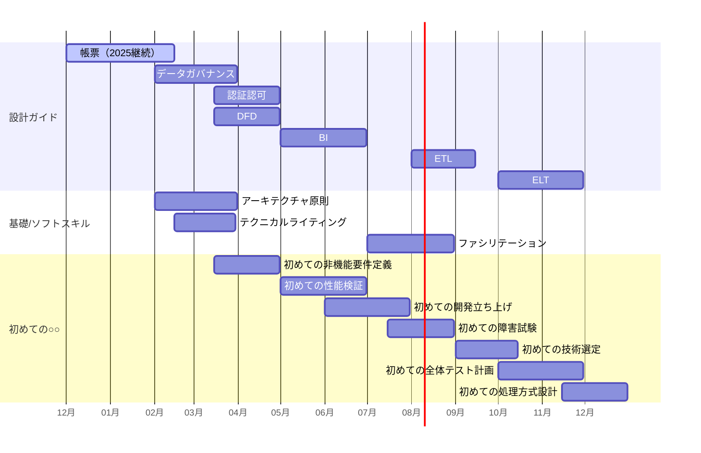

# はじめに

TIG（Technology Innovation Group）の真野です。

フューチャーの有志で取り組んでいる「アーキテクチャ設計ガイドライン」の活動について、2026年の作成スケジュールを公開します。

# アーキテクチャガイドラインとは？

アーキテクチャガイドライン」とは、一言で言えば、システム開発の現場で頻出する「よくある設計論点」とその「推奨される解決策」を汎化し、体系的にまとめたドキュメント群です。現在、[Webフロントエンド](https://future-architect.github.io/arch-guidelines/documents/forWebFrontend/web_frontend_guidelines.html)や[Web API](https://future-architect.github.io/arch-guidelines/documents/forWebAPI/web_api_guidelines.html)、[PostgreSQL](https://future-architect.github.io/arch-guidelines/documents/forDB/postgresql_guidelines.html)といった技術領域から、[Gitブランチフロー](https://future-architect.github.io/arch-guidelines/documents/forGitBranch/git_branch_standards.html)や[コードレビュー](https://future-architect.github.io/arch-guidelines/documents/forCodeReview/code_review.html)といった開発プロセスに至るまで、幅広いテーマをGitHub上で公開しています。

いくつかの強いこだわりがあります。

* **「ルールブック」ではなく「考えるためのツール」**
    「これに従えば思考停止でOK」というマニュアルではなく、「何が論点になりやすいか」「なぜその選択肢を推奨するのか」とい背景と理由の記述に重きを置いています。プロジェクト固有の事情で推奨と異なる判断をする際の、「議論の出発点（土台）」として使われることを意図しています。
* **読み物としての「熱量」**
    単なる箇条書きの規約集ではありません。PDF換算で40ページから多いものでは140ページにも及ぶため、初見ではおそらく重厚さを感じます。これはアーキテクト以外のメンバーにも理解を深めてもらえるよう、コラムなども交えながら「なぜその設計が必要なのか」を説明するためです。とは言え、より筋肉質に密度を高める打ち手の話もしています。
* **技術 × コミュニケーション**
    純粋な技術スタックだけでなく、アーキテクチャ決定に不可欠な合意形成や、チーム開発を円滑にするための「コミュニケーション系」ガイドライン（コードレビュー、Slack利用など）もラインナップしています。純粋な技術だけで、良いアーキテクチャ作れますかというと否ですよね。技術の枠にこだわらないことを思い切って決めました。

[ガイドライン](https://future-architect.github.io/tags/%E3%82%AC%E3%82%A4%E3%83%89%E3%83%A9%E3%82%A4%E3%83%B3/) タグで、作成報告のブログがまとまっていますので、良ければ参照ください。

# なぜスケジュールを公開するのか

事前にスケジュールを公開することで、次のメリットが（微小ながらある）と考えています。

1. **活動の透明性を上げることで、興味を持ってもらう**
    ガイドライン作成はそれなりに思いやスキルがある有志メンバーで行っており、中身は常連的なメンバーと新規メンバーが組み合わさっています。それ自体は悪くないですが、新規メンバーの数をもう少し増やしても良いかなと思っています。そのため興味を持った方が、ガイドライン作成がどういう活動なのかを知るための判断材料を、なるべく手に入りやすくしたいと思っています
2. **自分たちへのコミットメント**
    ガイドライン作成は有志によるボトムアップ活動です。あらかじめスケジュールを公表することで、計画的に推進するための良い規律になると思います。もちろん、自らを追い込む意図もあります
3. **事前準備のためのジャブ打ち**
    スケジュールが分かれば、このタイミングに合わせて、関連したネタを事前に収集・整理するといったアンテナを貼ることができます。ガイドライン作成はキックオフ1~2週間前にメンバー募集をするのですが、書籍や動画などで体系的に学ぼうとすると、さすがに少し時間は足りないと感じます。準備時間の確保のためのジャブは重要です

## 2026年の公開スケジュール

2026年は、これまでの「設計ガイドライン」の拡充に加え、そしてジュニア/ミドル向けに実務を支援する新シリーズ「初めての○○○○」 を柱に、計15本程度の公開を目指しています。

現時点での計画は以下の通りです。

春先（3月〜4月）にかけて、「認証認可」「DFD」「テクニカルライティング」などの作成が重なっており、ここが活動の山場となる予定です。

なお、上記はDFDを除き私が企画を主導するコンテンツに絞っています。他のもスター選手がナレッジ作成に勤しむといった話も進んでいますので、実際に公開されるコンテンツ量はこれより多くなる見込みです（凄い量になりそうですね）。

# 2026年の注目ポイント

* **データ領域の強化**
    2025年はアプリケーション開発の主要技術をカバーしましたが、2026年は**データ領域**を強化します。「データガバナンス」「BI」「ETL/ELT」など、データ利活用の基盤となるテーマに取り組みます。また、業務システムで避けて通れない「帳票」や、設計難易度の高い「認証認可」についても形式知化を進めます。
* **アーキテクトの「ソフトスキル」の言語化**
    技術力だけでなく、合意形成やドキュメンテーション能力もアーキテクトの重要な資質です。先日公開した「ソフトスキルガイドライン」に続き、「アーキテクチャ原則」「テクニカルライティング」「ファシリテーション」といったテーマで、思考の型や伝える技術をドキュメント化します。
* **新シリーズ「初めての○○」**
    アーキテクトを目指す層に向けた**実践的な入門シリーズ**です。「非機能要件定義」や「技術選定」など、教科書的な知識だけでなく、実際のプロジェクト現場で「具体的にどう動けばいいのか」という勘所をガイドすることを目指しています。社内の若手～中堅メンバーが、迷わずに次のステップへ進めるような指南書となることを意図しています。

# さいごに

ガイドラインは「これに従えば考えなくて済む」というルールブックではなく、**どうすべきかを考えるためのツール（議論の出発点）** を意図して作成しています。

2026年もこのコンセプトを大切にしつつ、より多くの領域でナレッジを共有し、本質的な価値創造に集中できる環境作りを推進していきます。

本記事で紹介したスケジュールは現時点での計画であり変更の可能性がありますが、温かく見守っていただければ幸いです。公開されたガイドラインへのフィードバックがあれば、ぜひIssueの起票や、X（旧Twitter）などでコメントをお寄せください。

https://github.com/future-architect/future-architect.github.io/issues
