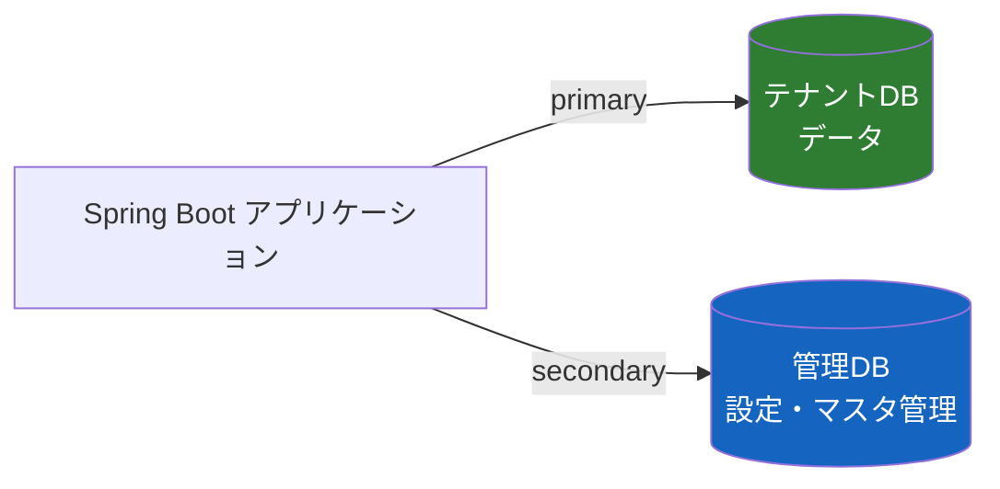

## はじめに

### Flyway とは

[Flyway](https://flywaydb.org/) はデータベースのスキーマ変更をバージョン管理するマイグレーションツールです。`V1__create_table.sql`、`V2__add_column.sql` のようにバージョン番号付きの SQL ファイルを用意しておくと、アプリケーション起動時に未適用のマイグレーションを自動的に検出・実行してくれます。Spring Boot では `spring-boot-starter` に Flyway が統合されており、依存関係を追加するだけで自動構成が有効になります。

### 本記事の背景

私たちのプロジェクトでは長らく Flyway なしで運用してきました。テーブル追加やカラム変更は手動で DDL を流していたのですが、環境が増えてきて正直面倒になってきたので、重い腰を上げて導入することにしました。

ところが、いざ導入してみるとすんなりとはいきませんでした。というのも、このプロジェクトはテナント用と管理用の2つの DataSource を持つ構成で、Flyway を適用したいのは管理 DB だけ。Spring Boot の Flyway 自動構成は primary DataSource にしか紐づかないため、手動で Flyway Bean を構成する必要がありました。さらに、既存のテーブルがある状態への後付け導入でいくつかハマりポイントがあったので、本記事ではその辺りの知見を共有します。

- secondary DataSource に手動で Flyway を構成する方法
- `baselineOnMigrate(true)` の正しい理解と V1 に書くべき内容
- `@ConditionalOnProperty` を使った環境別の有効/無効切り替え

### なぜ Flyway を選んだか — Liquibase との比較

DB マイグレーションツールとしては [Liquibase](https://www.liquibase.com/) も候補に挙がりました。参考までに両者の比較を載せておきます。

| 比較軸 | [Flyway](https://flywaydb.org/) | [Liquibase](https://www.liquibase.com/) |
|:-------|:------|:----------|
| 変更定義の形式 | SQL のみ | XML / YAML / JSON / SQL |
| DB 製品差異の吸収 | 自前で location 分割が必要 | 宣言的な定義なら Liquibase が吸収 |
| ロールバック | 非サポート（手動で逆 SQL を書く） | DSL 定義なら約8割を自動生成、SQL 定義は手動 |
| 学習コスト | SQL が書ければすぐ使える | DSL（XML/YAML）の習得が必要 |
| Spring Boot 統合 | `flyway-core` を追加するだけ | [`liquibase-core` を追加するだけ](https://docs.liquibase.com/tools-integrations/springboot/springboot.html) |
| 適したシステム | DB 固有の SQL を多用する / 複数 RDB 製品をサポートする | 単一 RDB で完結する / ロールバックを自動化したい |

Liquibase は宣言的な定義で RDB の差異を吸収してくれる点が魅力です。単一の RDB 製品で完結するシステムや、ロールバックの自動化が必要なケースでは有力な選択肢になるでしょう。

一方、私たちのプロジェクトでは Oracle と PostgreSQL の両方をサポートしており、DB 固有の構文（`CLOB` / `TEXT` の違いや PL/SQL 等）を多用していました。宣言的な定義だけでは対応しきれない場面が多いと判断し、素の SQL をそのまま書ける Flyway を採用しました。Flyway はロールバックをサポートしていないため、マイグレーションに失敗した場合は手動で逆の DDL を流す運用になりますが、管理 DB のスキーマ変更頻度はそこまで高くないのでこれで十分と割り切りました。

## システム構成

今回のシステムは以下の2つの DataSource を持ちます。
今考えると、primaryとsecondaryは逆にすべきでした・・・反省。



| DataSource | 役割 | Flyway |
|:-----------|:-----|:-------|
| primary（テナントDB） | テナントごとのデータを格納。環境ごとに接続先が変わる | **不要** |
| secondary（管理DB） | アプリの設定やマスタ情報を管理。全環境で共通のスキーマ | **必要** |

Spring Boot では `spring.datasource.*` プロパティで定義された DataSource が primary DataSource として扱われます。Flyway の自動構成（`FlywayAutoConfiguration`）はこの primary DataSource に紐づいて動作するため、`spring.datasource.*` 以外で定義した secondary DataSource にはマイグレーションが適用されません。

やりたいことを整理すると以下の通りです。

| 環境 | primary（テナントDB） | secondary（管理DB） |
|:-----|:---------------------|:-------------------|
| dev | Flyway 無効 | Flyway **無効**（開発環境なのでマイグレーション用のDDLを手動確認・試行錯誤） |
| staging / prod | Flyway 無効 | Flyway **有効**（自動マイグレーション） |

## 実装: secondary DataSource に手動で Flyway Bean を構成する

### yml 設定

まず `application.yml`（共通設定）で Spring Boot の自動構成 Flyway を無効化します。

```yaml
spring:
  # Spring Boot自動構成の Flyway（= primary DataSource に適用）の有効/無効。
  # primary DataSource はテナント用でマイグレーション不要のため無効化。
  # 管理DB（secondary）へのマイグレーションはこの設定とは独立して
  # Java 側で手動構成・実行される。
  flyway:
    enabled: false
    locations: classpath:db/migration/common,classpath:db/migration/oracle
```

ポイントは2つです。

1. `enabled: false` で自動構成 Flyway を無効化（primary DataSource にはマイグレーション不要）
2. `locations` は設定しておく（後述の手動構成 Bean で `@Value` 経由で再利用）

### Java 実装

secondary DataSource の設定クラスに Flyway Bean を手動で定義します。

```java
@Component
@ConfigurationProperties(prefix = "app.manager.datasource")
public class ManagerSqlConfig {

    @Value("${spring.flyway.locations:classpath:db/migration/common}")
    private String[] flywayLocations;

    @Bean(name = "managerDataSource")
    public DataSource managerDataSource() {
        // secondary DataSource の構成（省略）
    }

    /**
     * 管理DB用の Flyway マイグレーションを実行する.
     *
     * Spring Boot の Flyway 自動構成は primary DataSource に紐づくため、
     * secondary DataSource には手動で Flyway を構成する必要がある.
     */
    @Bean(name = "managerFlyway", initMethod = "migrate")
    public Flyway managerFlyway(
            @Qualifier("managerDataSource") DataSource managerDataSource) {
        return Flyway.configure()
                .dataSource(managerDataSource)
                .locations(flywayLocations)
                .baselineOnMigrate(true)
                .load();
    }
}
```

`@Bean(initMethod = "migrate")` により、Bean 生成時に自動的に `Flyway#migrate()` が呼ばれます。

`spring.flyway.locations` を `@Value` で参照することで、yml 側でマイグレーションファイルのパスを管理でき、Oracle / PostgreSQL などの Dialect 切り替えにも対応できます。

## 落とし穴: baselineOnMigrate と V1 マイグレーションの関係

### 問題

上記の実装でデプロイしたところ、**V1 マイグレーションが実行されない**という問題が発生しました。

マイグレーションファイル（`V1__add_column.sql`）に差分DDL（ALTER TABLE）を書いていたにもかかわらず、管理DB にカラムが追加されていませんでした。`flyway_schema_history` テーブルを確認すると、V1 に対して `TYPE=BASELINE` のレコードが記録されており、実際のSQLは実行されていませんでした。

### baselineOnMigrate とは

`baselineOnMigrate(true)` は **既にテーブルが存在するスキーマに対して、途中から Flyway を導入する**ための設定です。

Flyway は通常、空のスキーマに対して V1 から順にマイグレーションを適用することを前提としています。しかし既にテーブルが存在するスキーマに Flyway を導入する場合、Flyway は「このスキーマは管理下にない」としてエラーを出します。`baselineOnMigrate(true)` を指定すると、Flyway は既存スキーマに対して「ここまでは適用済み」というベースラインを自動的に作成し、それ以降のバージョンからマイグレーションを開始します。

### baselineVersion のデフォルトは "1"

ベースラインを「どのバージョンで作成するか」を決めるのが `baselineVersion` です。**デフォルト値は `"1"` です。**

つまり `baselineOnMigrate(true)` を指定すると:

- `flyway_schema_history` テーブルが自動作成される
- **V1 = ベースライン（＝適用済み扱い）** として記録される
- 実際に実行されるのは **V2 以降のみ**

私たちのような既存スキーマに途中からflywayを導入する場合はこんな流れになります。

1. 既存スキーマ(初期状態)
    * flyway_schema_historyテーブルなし
1. flywayがbaselineOnMigrate=true で初回実行
    * flyway_schema_historyテーブル作成
    * V1をベースラインとして記録
        * `TYPE=BASELINE` のレコードが作成されるのみ
        * この段階ではマイグレーションSQLは実行されない
1. flywayがV2以降のマイグレーションを実行

実際に `flyway_schema_history` を見ると、V1 が `TYPE=BASELINE` として記録されていることが確認できます。`execution_time` は 0、つまり SQL は実行されていません。


### V1 に何を書くべきか

Flyway の `baselineOnMigrate` は **「V1 の内容は既にスキーマに反映済みである」** という前提で動作します。したがって、V1 には**現在のスキーマ状態を再現する全DDL**（CREATE TABLE 等）を記述するのが正しい設計です。

```
db/migration/common/
├── V1__initial_schema.sql       ← 既存スキーマの全DDL（既存環境ではスキップされる）
├── V2__add_is_default.sql       ← ここから実際の差分マイグレーション
├── V3__add_index.sql
└── ...
```

V1 に全DDLを書いておくことで、**環境によって2つの動作**が実現できます。

| 環境 | baselineOnMigrate | V1 の扱い | V2 以降 |
|:-----|:------------------|:----------|:--------|
| **既存環境**（テーブルあり） | `true` | ベースラインとしてスキップ | 差分を自動適用 |
| **新規環境**（空スキーマ） | `false`（デフォルト） | 全DDLとして実行 | 差分を自動適用 |

新規環境では `baselineOnMigrate` はデフォルトの `false` のままで、V1 の全DDLから順に実行されます。既存環境では `baselineOnMigrate(true)` により V1 がスキップされ、V2 から差分が適用されます。

### V1 に差分DDLを書いてしまった

上記のことが理解できてなかったため、V1 に差分DDL（ALTER TABLE）を書いてしまいました・・・

```
V1__add_column.sql  ← ALTER TABLE（差分DDL）を記述 → ベースラインでスキップされた
```

既存環境に途中から Flyway を導入する場合、V1 は「既にスキーマに存在する状態の記録」であり、差分マイグレーションは **V2 から開始する**のが正解です。

### 修正後のマイグレーション構成

```
db/migration/common/
├── V1__initial_schema.sql       ← 全DDL（新規環境構築用に配置）
└── V2__add_is_default.sql       ← 差分マイグレーション（V1 からリネーム）
```

修正後にアプリを再起動すると、V1 は `TYPE=BASELINE` のまま、V2 が `TYPE=SQL` として実行されます。


### もし V1 に差分を書いてデプロイしてしまったら

既に `baselineOnMigrate(true)` で V1 が BASELINE として記録されてしまった場合でも、`flyway_schema_history` をリセットすることでやり直しが可能です。
私は誤解釈をしていたためやってしまいました・・・みなさんは気をつけてください。

```sql
-- V1 で適用された差分DDLを手動で巻き戻す（例: カラム追加の場合は削除）
ALTER TABLE テーブル物理名 DROP COLUMN カラム物理名;

-- flyway_schema_history を初期化
TRUNCATE TABLE "flyway_schema_history";

COMMIT;
```

リセット後にアプリを再起動すれば、Flyway が BASELINE(V1) を再作成し、V2 から差分マイグレーションを実行します。

なお、`flyway_schema_history` は Flyway が小文字でテーブルを作成するため、もしOracleを利用してる場合は **ダブルクォートで囲まないと `ORA-00942: table or view does not exist` になります**。Flyway 内部では JdbcTemplate 経由で小文字固定のテーブル名が使われており、Oracle のデフォルトの大文字変換とは異なる名前で格納されています。

```sql
-- NG: Oracle が大文字の FLYWAY_SCHEMA_HISTORY を探しに行く
TRUNCATE TABLE flyway_schema_history;

-- OK: 小文字のテーブル名を明示指定
TRUNCATE TABLE "flyway_schema_history";
```

ただし、この手順は Flyway の管理情報を直接操作するため **自己責任** でお願いします。本番環境では十分に検証してから実施してください。

Java コードは `baselineVersion` の明示指定なし（デフォルト "1"）のままで正しく動作します。

```java
@Bean(name = "managerFlyway", initMethod = "migrate")
public Flyway managerFlyway(
        @Qualifier("managerDataSource") DataSource managerDataSource) {
    return Flyway.configure()
            .dataSource(managerDataSource)
            .locations(flywayLocations)
            .baselineOnMigrate(true)  // 既存環境向け: V1 をベースラインとしてスキップ
            .load();
}
```

## 複数の RDB 製品をサポートする場合の tips

Oracle と PostgreSQL の両方をサポートしている場合、マイグレーション SQL の書き方に少し工夫が必要です。

### 共通 SQL で書ける範囲は意外と広い

Oracle は `VARCHAR` で宣言すると内部的に `VARCHAR2` として扱い、`NUMERIC` は `NUMBER` に対応します。そのため、カラム定義を `VARCHAR` / `NUMERIC` で統一しておけば、Oracle でも PostgreSQL でも同じ SQL が通ります。

```sql
-- Oracle/PostgreSQL 共通で動く
ALTER TABLE LLM ADD IS_DEFAULT VARCHAR(1) DEFAULT '0' NOT NULL;
```

### 共通化できない場合は location を分ける

`CLOB`（Oracle）と `TEXT`（PostgreSQL）のように自動変換されない型や、DB 固有の構文（`CREATE SEQUENCE` のオプション、`COMMENT ON` の書き方の違い等）がある場合は、同じ SQL ファイルでは対応できません。

Flyway の `locations` 設定で共通と DB 固有のディレクトリを分けて管理します。

```
db/migration/
├── common/                         ... Oracle/PostgreSQL 共通
│   ├── V2__add_is_default.sql
│   └── V3__insert_default_llm.sql
├── oracle/                         ... Oracle 固有
│   └── V4__add_clob_column.sql
└── postgresql/                     ... PostgreSQL 固有
    └── V4__add_text_column.sql
```

```yaml
# application.yml
spring:
  flyway:
    locations: classpath:db/migration/common,classpath:db/migration/oracle
```

ポイントは、**共通と固有の両方に同じバージョン番号を置かないこと**です。DB 固有の構文が必要な場合は `common/` には置かず、`oracle/` と `postgresql/` の両方に同じバージョンの SQL をそれぞれの方言で配置します。共通の `V4` と Oracleもしくはpostgresql の `V4` の両方あると、Flyway が重複バージョンとしてエラーにします。

環境ごとの `locations` 切り替えは yml のプロファイル分割で対応します。

```yaml
# application-oracle.yml
spring:
  flyway:
    locations: classpath:db/migration/common,classpath:db/migration/oracle

# application-postgresql.yml
spring:
  flyway:
    locations: classpath:db/migration/common,classpath:db/migration/postgresql
```

## dev 環境だけ Flyway を無効にする

開発中はテーブル定義が確定するまで DDL を試行錯誤することが多く、Flyway が自動で走ると不便です。`@ConditionalOnProperty` を使って、**Bean 登録自体を条件付き**にします。

### @ConditionalOnProperty とは

Spring Boot のアノテーションで、**プロパティの値に応じて Bean の登録自体をスキップ**できます。

```java
@Bean(name = "managerFlyway", initMethod = "migrate")
@ConditionalOnProperty(
    name = "app.manager.flyway.enabled",
    havingValue = "true",
    matchIfMissing = true)
public Flyway managerFlyway(...) { ... }
```

3つのパラメータの意味は以下の通りです。

| パラメータ | 値 | 意味 |
|:----------|:---|:-----|
| `name` | `"app.manager.flyway.enabled"` | チェック対象のプロパティキー |
| `havingValue` | `"true"` | プロパティがこの値のときだけ Bean を登録する |
| `matchIfMissing` | `true` | プロパティが**未定義**の場合も Bean を登録する（= デフォルト有効） |

この3つの組み合わせにより、以下の挙動になります。

| プロパティの状態 | Bean 登録 | 理由 |
|:----------------|:----------|:-----|
| 未定義 | **登録される** | `matchIfMissing = true` により未定義 = 条件一致 |
| `true` | **登録される** | `havingValue = "true"` に一致 |
| `false` | **登録されない** | `havingValue = "true"` に不一致 |

`matchIfMissing = true` がポイントです。これにより、staging / prod の yml にわざわざ `enabled: true` を書く必要がなく、**dev だけ `false` を明示指定すればよい**設計になります。

### Bean 単位で効く

`@ConditionalOnProperty` はメソッドレベルのアノテーションです。クラス全体ではなく、**そのメソッドで定義される Bean だけ**が条件の対象になります。

```java
// 例；管理DB用のConfiguration
@Component
public class ManagerSqlConfig {

    @Bean
    public DataSource managerDataSource() { ... }      // ← 常に登録

    @Bean
    @ConditionalOnProperty(...)                         // ★ ここだけ条件付き
    public Flyway managerFlyway(...) { ... }
}
```

これにより、Flyway を無効にしても管理DB への接続や SQL 実行は通常通り動作します。

### yml 設定

dev 環境用の yml にだけプロパティを追加します。

```yaml
# application-dev.yml
app:
  manager:
    flyway:
      enabled: false  # マイグレーション DDL を手動確認してから適用する
```

staging / prod では未定義のまま（= `matchIfMissing = true` によりデフォルト有効）にします。

## 設定の全体像まとめ

最終的な設定の対応関係を整理します。

### プロパティの役割分担

| プロパティ | 制御対象 | デフォルト |
|:----------|:---------|:----------|
| `spring.flyway.enabled` | Spring Boot 自動構成の Flyway（primary DataSource） | `true` |
| `app.manager.flyway.enabled` | 手動構成の Flyway Bean（secondary DataSource） | `true`（`matchIfMissing`） |

### 環境別設定

| 環境 | `spring.flyway.enabled` | `app.manager.flyway.enabled` | 結果 |
|:-----|:------------------------|:-----------------------------|:-----|
| 共通 | `false` | （未指定） | primary: 無効 / secondary: 有効 |
| dev | （共通を継承） | `false` | primary: 無効 / secondary: **無効** |
| staging / prod | （共通を継承） | （未指定 = 有効） | primary: 無効 / secondary: **有効** |

### Java コード最終形

```java
@Component
@ConfigurationProperties(prefix = "app.manager.datasource")
public class ManagerSqlConfig {

    @Value("${spring.flyway.locations:classpath:db/migration/common}")
    private String[] flywayLocations;

    @Bean(name = "managerDataSource")
    public DataSource managerDataSource() {
        // DataSource 構成（省略）
    }

    /**
     * 管理DB用の Flyway マイグレーション.
     *
     * {@code app.manager.flyway.enabled=false} で無効化できる（dev 環境向け）.
     */
    @Bean(name = "managerFlyway", initMethod = "migrate")
    @ConditionalOnProperty(
        name = "app.manager.flyway.enabled",
        havingValue = "true",
        matchIfMissing = true)
    public Flyway managerFlyway(
            @Qualifier("managerDataSource") DataSource managerDataSource) {
        return Flyway.configure()
                .dataSource(managerDataSource)
                .locations(flywayLocations)
                .baselineOnMigrate(true)
                .load();
    }
}
```

## おわりに

マルチ DataSource 構成で Flyway を使う際のポイントをまとめます。

1. **Spring Boot の Flyway 自動構成は primary DataSource 専用**。secondary DataSource には `@Bean(initMethod = "migrate")` で手動構成が必要
2. **`baselineOnMigrate(true)` は既存スキーマへの Flyway 後付け導入用**。V1 は「現在のスキーマ状態」を記録する全DDLを配置し、実際の差分マイグレーションは V2 から開始する
3. **`@ConditionalOnProperty` で Bean 単位の有効/無効切り替え**が可能。`matchIfMissing = true` により、無効にしたい環境だけ `false` を指定すればよい

特に 2 は Flyway のドキュメントを読んでいても見落としがちなポイントだと感じました。`baselineOnMigrate` の意味を正しく理解せずに V1 に差分DDLを書いてしまうと、既存環境ではスキップされ、新規環境でしか実行されないという事態になります。

## Appendix: Flyway 公式ドキュメント

本記事で扱った Flyway の設定項目に関する公式ドキュメントへのリンクです。

| 設定項目 | 説明 | ドキュメント |
|:---------|:-----|:------------|
| `baselineOnMigrate` | 既存スキーマへの後付け導入時にベースラインを自動作成する | [Flyway Baseline On Migrate Setting](https://documentation.red-gate.com/fd/flyway-baseline-on-migrate-setting-277578974.html) |
| `baselineVersion` | ベースラインのバージョン番号（デフォルト: "1"） | [Flyway Baseline Version Setting](https://documentation.red-gate.com/fd/flyway-baseline-version-setting-277578975.html) |
| `locations` | マイグレーション SQL の配置先ディレクトリ | [Flyway Locations Setting](https://documentation.red-gate.com/fd/flyway-locations-setting-277579008.html) |
| Baselines（概念説明） | ベースラインの仕組みと使い方の概要 | [Baselines](https://documentation.red-gate.com/fd/baselines-273973441.html) |
| Configuration（全体） | Flyway の全設定項目一覧 | [Configuration](https://documentation.red-gate.com/flyway/reference/configuration) |

