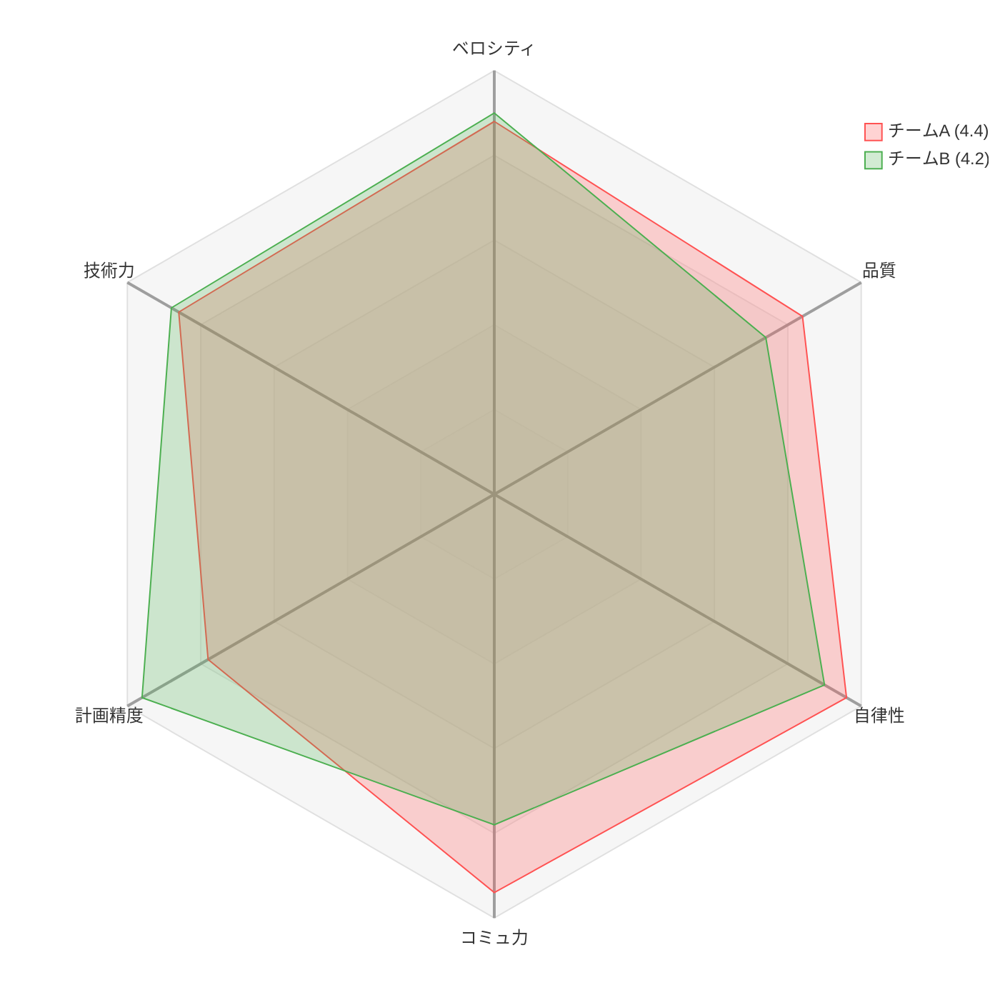
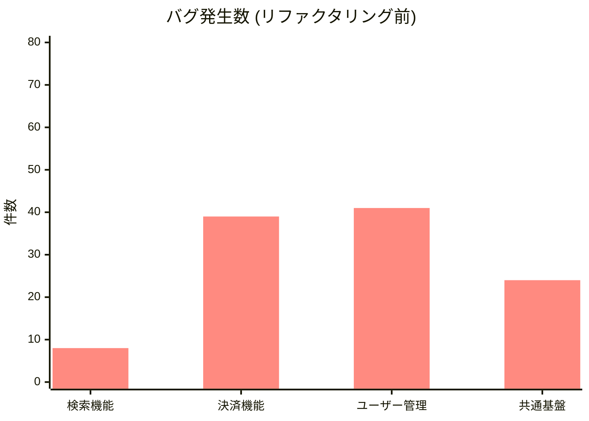
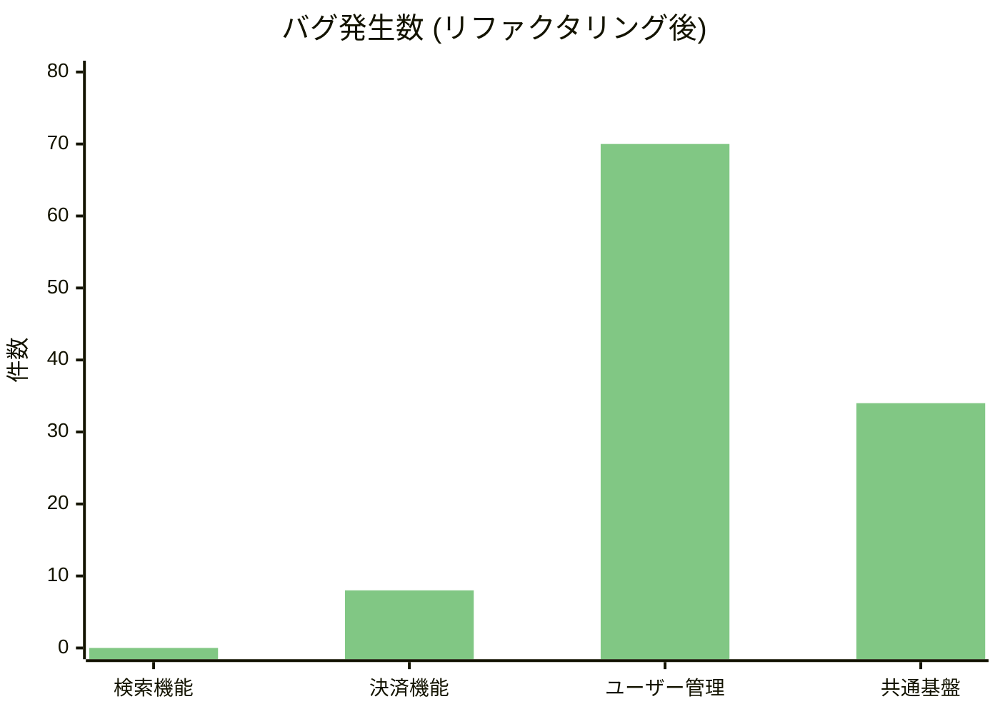

## はじめに

Markdownでプロジェクトの進捗報告やチームの振り返り資料をまとめていると、定量的な部分にはグラフを入れたくなります。Excelなど外部ツールでグラフを作成して画像を挿入しても良いですが、画像ファイルの管理がちと面倒です。

[Mermaid.js](https://mermaid.js.org/) はUMLを描けることで有名ですが、実はいくつかのグラフ表示もサポートされています。どうせあまりオシャレじゃないんでしょう？..と、あまり期待していなかったのですが、想定よりオシャレ化ができることが分かったので、この感動を伝えさせてください。

もちろん、見た目や構成ではいくつか制約があります。それさえ許容できれば、テキストでグラフを記述でき、VS Codeなどでのプレビュー以外にも、GitHub・GitLab・Notionなど多くのプラットフォームでプレビューできますし、何よりAIからの支援も受けやすくなりお勧めです。

試してみたナレッジをいくつか紹介します。

## 環境

- Mermaid.js v11+（`radar-beta`、`xychart-beta`が利用可能）
- 表示確認: VS Code（Markdown Preview Mermaid Support拡張）、GitHub

## レーダーチャート

2025年3月にリリースされた[v11.6](https://github.com/mermaid-js/mermaid/releases/tag/mermaid%4011.6.0)からレーダーチャートが利用可能になりました。[ドキュメント](https://mermaid.ai/open-source/syntax/radar.html)もあります。レーダーチャートは、多軸の評価結果を一目で比較したいといった用途に便利ですよね。

### Tips 1: レーダーチャートの装飾

例えば、チームの「開発チーム成熟度」を複数の観点で評価し、2つのチームの強みを重ねて比較してみます。

このとき、以下の設定がおすすめです。デフォルトでもそこそこオシャレですが、細かい調整をしたくなります。

1. `graticule polygon` を指定して目盛線を多角形にする
   - デフォルトの曲線もオシャレだが、言いたいことが伝わりにくい...
2. 絶対評価の基準となる `max`（満点）と `min`（最低点）を指定する
   - 指定しない場合は、入力から自動で補正するが揃えた方が無難
3. `curve` のラベルにチーム名だけでなく、括弧書きで「平均スコア」等のサマリを埋め込んで凡例とする
   - テキストでの追加情報は、ラベルに足すしかない
4. デフォルトの配色を変えたい場合、configで変更可能
 　 - `cScale0`/`cScale1`で1番目、2版目のレーダーの色を調整。 `curveOpacity` で透過度を指定する



```c
---
config:
  theme: default
  themeVariables:
    cScale0: "#FF5252"
    cScale1: "#4CAF50"
    radar:
      axisColor: "#9E9E9E"
      graticuleColor: "#E0E0E0"
      curveOpacity: 0.25
      curveStrokeWidth: 1
---
radar-beta
    graticule polygon
    axis v["ベロシティ"], q["品質"], a["自律性"]
    axis c["コミュ力"], p["計画精度"], t["技術力"]
    curve d["チームA (4.4)"]{4.4, 4.2, 4.8, 4.7, 3.9, 4.3}
    curve c["チームB (4.2)"]{4.5, 3.7, 4.5, 3.9, 4.8, 4.4}
    max 5
    min 0
```

## 棒グラフ

### Tips 2: 積み上げグラフの実現

xychart-betaは ネイティブの積上げ棒グラフをサポートしていません。複数の`bar`シリーズを定義すると、並列ではなく**重ね描画**されます。

例として、機能別・優先度別の残タスク数を可視化したいとします。

| | 検索機能 | 決済機能 | ユーザー管理 |
|---|---|---|---|
| 優先度：高 | 0 | 2 | 0 |
| 優先度：中 | 2 | 4 | 3 |
| 優先度：低 | 4 | 0 | 1 |
| **合計** | **6** | **6** | **4** |

素朴にそのまま書くと、本来「6」「6」「4」の高さになるはずの棒グラフが、ただ同じ位置から重ねて描画されてしまい、意味不明な状態になります（積み上げグラフになっているじゃん...と思いますが、高さをよく見ると合計値に達していません）。

```mermaid
xychart-beta
    title "❌️重なって描画される"
    x-axis ["検索機能", "決済機能", "ユーザー管理"]
    y-axis "タスク数" 0 --> 10
    bar "高" [0, 2, 0]
    bar "中" [2, 4, 3]
    bar "低" [4, 0, 1]
```



```c
xychart-beta
    title "NG: そのままの数値（重なって描画される）"
    x-axis ["検索機能", "決済機能", "ユーザー管理"]
    y-axis "タスク数" 0 --> 10
    bar "高" [0, 2, 0]
    bar "中" [2, 4, 3]
    bar "低" [4, 0, 1]
```

3本のグラフが重なっていますが、逆手にとって考えると、累積値で、擬似的に積上げ棒グラフにできるということです。悪い回避策だという指摘はいったん脇に..。

棒グラフは "最後"に書いた定義が "手前" に表示されます。そのため、一番最初に積み上げたい「低」を最初に書いて、「高」を最後に書きます。

- $ 低 = 高 + 中 + 低$
- $ 中 = 高 + 中$
- $ 高 = 高$

こうすると、「中」の棒は「低」の棒の「内側」に重なり、「高」の棒はさらにその内側に重なります。結果として**色が層になり、積上げに見える**わけです。

```mermaid
xychart-beta
    title "✅️積み上げには成功、❌️0件が微妙な表示"
    x-axis ["検索機能", "決済機能", "ユーザー管理"]
    y-axis "タスク数" 0 --> 10
    bar "低" [6, 6, 4]
    bar "中" [2, 6, 3]
    bar "高" [0, 2, 0]
```



```c
xychart-beta
    # ...中略...
    bar "低" [6, 6, 4]
    bar "中" [2, 6, 3]
    bar "高" [0, 2, 0]
```

積み上げは成功しましたが、0件である「高」が微妙に表示されてしまいノイジーです（0なのにわずかに表示されてしまってます）。いろいろ試したのですが、配列の中間の0は `-1` に置換することで回避可能です。末尾の記述も-1にするか省略で回避できました。`-1` にしておくことで、グラフ上にはレンダリングされませんが、「データが存在する」という判定になるため、色の割当順序が正しく維持されるため、都合が良いです。

```mermaid
xychart-beta
    title "✅️ 意図した通りに疑似積上げされる"
    x-axis ["検索機能", "決済機能", "ユーザー管理"]
    y-axis "タスク数" 0 --> 10
    bar "低" [6, 6, 4]
    bar "中" [2, 6, 3]
    bar "高" [-1, 2]
```



```c
xychart-beta
    x-axis ["検索機能", "決済機能", "ユーザー管理"]
    # ...中略...
    bar "高" [-1, 2]  ← 中間は-1、末尾は省略でも良い
```

### Tips 3: 色の指定は plotColorPalette と凡例

さきほど、積み上げ棒グラフ化には成功しましたが、優先度が高い順に、目立たせたいと思うはずです。疑似積上げでは「外側ほど薄く、内側ほど濃く」するのが自然です。「高」を最も濃い色にすると、対応すべきタスクが視覚的に目立ちます。棒グラフの色は`plotColorPalette`で指定します。シリーズの定義順（`bar`の記述順）に対応します。

色を付けると、色の意味は何だ？となりますが、xychart-betaには凡例機能はありません（！）。そのため、Markdownが許容する環境であれば、Mermaidブロックのすぐ下にHTML書いてしまうのがてっとり早い回避手段です。

```mermaid
---
config:
  theme: base
  themeVariables:
    xyChart:
      plotColorPalette: "#fff4dd, #ffd8b1, #FF6E40"
---
xychart-beta
    x-axis ["検索機能", "決済機能", "ユーザー管理"]
    y-axis "タスク数" 0 --> 10
    bar "低" [6, 6, 4]
    bar "中" [2, 6, 3]
    bar "高" [-1, 2]
```



<div style="display: flex; justify-content: center; gap: 24px; font-size: 14px; color: #424242; font-family: sans-serif; margin-top: -8px;">
  <div style="display: flex; align-items: center; gap: 6px;">
    <span style="color: #FF6E40; font-size: 18px;">■</span> 高
  </div>
  <div style="display: flex; align-items: center; gap: 6px;">
    <span style="color: #ffd8b1; font-size: 18px;">■</span> 中
  </div>
  <div style="display: flex; align-items: center; gap: 6px;">
    <span style="color: #fff4dd; font-size: 18px; text-shadow: 0 0 1px #ccc;">■</span> 低
  </div>
</div>

<br>

```c
---
config:
  theme: base
  themeVariables:
    xyChart:
      plotColorPalette: "#fff4dd, #ffd8b1, #FF6E40"
---
xychart-beta
...
    bar "低" [6, 6, 4]    ← 1番目（#fff4dd: 薄い黄色）
    bar "中" [2, 6, 3]    ← 2番目（#ffd8b1: 薄いオレンジ）
    bar "高" [-1, 2]  ← 3番目（#FF6E40: 濃いオレンジ）
```

HTMMLは以下のようなものを、mermaid.jsのすぐ下にそのまま配置します。


```html
<div style="display: flex; justify-content: center; gap: 24px; font-size: 14px; color: #424242; font-family: sans-serif; margin-top: -8px;">
  <div style="display: flex; align-items: center; gap: 6px;">
    <span style="color: #FF6E40; font-size: 18px;">■</span> 高
  </div>
  <div style="display: flex; align-items: center; gap: 6px;">
    <span style="color: #ffd8b1; font-size: 18px;">■</span> 中
  </div>
  <div style="display: flex; align-items: center; gap: 6px;">
    <span style="color: #fff4dd; font-size: 18px; text-shadow: 0 0 1px #ccc;">■</span> 低
  </div>
</div>
```

ポイントは、薄い色（優先度「低」）の凡例の四角（■）に `text-shadow: 0 0 1px #ccc;` を付けて輪郭線を出すことです。これにより、白背景でも凡例の視認性をしっかり確保できます。

### Tips 4: Before/Afterの表示

xychart-betaはグループ化（横並べ）ができません。そのため、リファクタリング前（Before）と後（After）のバグ発生数を比較したい場合などは、グラフを2つ並べます。





ポイントは**Y軸の上限を揃えること**（`0 --> 80`）です。これにより、棒の長さだけで直感的に「改善したかどうか」を比較できるようになります。

## おわりに

Mermaid.jsは「テキストで書ける手軽さ」が最大の強みですが、積上げ棒グラフや凡例、スライスの順序制御といった実務で欲しい機能に一部制約があります。

しかし、今回紹介した**疑似積上げ・-1置換・HTML凡例・上下2段比較**といったテクニックを使えば、これらの制約を回避して、メンテナンス性の高い「それっぽい」レポートをMarkdown内で完結させることができます。

特にAIツールとの相性は抜群です。「このタスクデータをMermaidの疑似積上げ棒グラフにして」と頼めば、累積値の計算からコード生成まで一瞬で終わります。ぜひ、日々の進捗報告や振り返り資料に取り入れてみてください。
