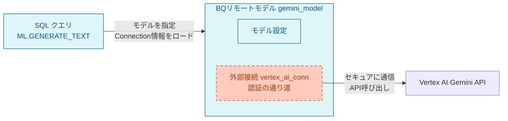

[春の入門祭り2026](/articles/20260421a/)の6本目です。

## はじめに

こんにちは。フューチャーアーキテクト 製造・エネルギーサービス事業部の柴田です😌 見真の心で本質を探求しています!

BigQuery上のデータに対して、外部APIを呼び出すことなく、クエリ内でGeminiによるテキスト生成やデータ解析する手順をまとめました。サービスに対する対応の手間を減らすために、エラー発生時の推奨アクションを提示しています。

普段のGemini利用と異なる利用料金などについても整理しています。

## 事前準備

BigQueryとVertex AIを連携させるための設定とモデルを作成します。

### 全体の構成図

モデル利用のためには、次の設定が必要です。

- 外部接続
- 外部接続で呼び出すモデル

構成図は以下の通りです。



### 外部接続（Connection）の作成

BigQueryコンソールの「データ 追加」 > 「Vertex AI」のデータソースを選択（vertex aiで検索）


外部データへのアクセスで、BiqQueryフェデレーションを選択します。


以下のように、外部データソースとの接続を作成します。

- 接続タイプ：Vertex AI リモートモデル、リモート関数、BigLake, Spanner（Cloud リソース）
- 接続ID：用途が分かりやすい名前にする（接続名なので*_connという命名を推奨）
- ロケーションタイプ：任意のリージョンを選択
- 分かりやすい名前：日本語OKなので利用方法が明確な名前にします
- 説明：より詳細な説明


作成した接続はBigQueryコンソールの「接続」で確認することができます。


### リモートモデルの定義

BigQueryから外部のGemini APIを呼び出すための、設定情報（メタデータ）を登録します。
以下の`CREATE OR REPLACE MODEL`クエリを実行してモデルを作成します。
BigQuery内に、Geminiを呼び出すためのモデルを定義します。これは1度だけ実行すればOKです。

```sql
CREATE OR REPLACE MODEL プロジェクト名.データセット名.モデル名
REMOTE WITH CONNECTION プロジェクト名.リージョン.先ほど作成した接続ID
OPTIONS (
-- 利用したいGeminiのエンドポイントを指定（例:gemini-2.5-flash, gemini-2.5-pro）
endpoint = '使用するモデル'
);
```

参考：クエリの具体例は以下の通りです。

```sql
CREATE OR REPLACE MODEL `project_id.logexplorer.gemini_model`
REMOTE WITH CONNECTION `project_id.asia-northeast1.logexplorer_ai_conn`
OPTIONS (
endpoint = 'gemini-2.5-flash'
);
```

クエリを実行すると、指定したデータセットの直下にモデルが作成されます。


## モデルの利用

作成したモデルを利用して推論します。ここでは実際のクエリ例を示します。特定の処理で発生したエラーログをBigQueryにリアルタイムで取り込ませている状態で、このようなプロンプトでエラーに対する推奨アクションをAIに教えてもらおうとしています。

```
あなたは優秀なクラウドデータエンジニアです。
以下のエラーメッセージから原因を推測し、解決のための具体的な「推奨対応方法」を150文字以内で提示してください。
【対象ファイル】：対象ファイル名
【エラーメッセージ】：エラーメッセージ
```

以下の例はstatus_tag が 'error' のログを抽出し、Geminiに推奨アクションを推論させるというクエリです。

```sql
-- ====================================================================
-- 目的: status_tag が 'error' のログを抽出し、Geminiに推奨アクションを推論させる
-- ====================================================================
SELECT
	timestamp_jst,
	service_name,
	target_file,
	status_tag,
	message,
-- JSONレスポンスからテキスト部分のみを抽出（回答の本文のみを取り出す必須処理）
JSON_VALUE(ml_generate_text_result, '$.candidates[0].content.parts[0].text') AS recommended_action
FROM ML.GENERATE_TEXT(
-- ==================================================================
-- モデルの指定
-- 事前に CREATE MODEL で作成した、Vertex AI（Gemini）を呼び出すためのモデルを指定します。
-- ==================================================================
	MODEL project_id.logexplorer.gemini_model,
(
-- ================================================================
-- 1. AIに渡すためのデータ（プロンプト）を準備するサブクエリ
-- ================================================================
SELECT
	timestamp_jst,
	service_name,
	target_file,
	status_tag,
	message,
	CONCAT(
	'あなたは優秀なクラウドデータエンジニアです。\n',
	'以下のエラーメッセージから原因を推測し、解決のための具体的な「推奨対応方法」を150文字以内で提示してください。\n\n',
	'【対象ファイル】', IFNULL(target_file, '不明'), '\n',
	'【エラーメッセージ】\n', IFNULL(message, 'なし')
	) AS prompt
FROM
	project_id.logexplorer.logexplorer_errors
WHERE
	status_tag = 'error'          -- 指定条件：エラーのみを対象
	AND message IS NOT NULL       -- メッセージが空のものは除外（APIの無駄撃ち防止）
ORDER BY
	timestamp_jst DESC
),
-- ==================================================================
-- 2. モデルの推論パラメータ設定
-- ==================================================================
STRUCT(
0.0 AS temperature,       -- 0.0にすると回答が固く・決定的になる（エラー分析に適している）
300 AS max_output_tokens  -- 出力される最大トークン数（コスト上限のストッパー）
)
);
```

## 利用料金を押さえるためのポイント

これまでの手順で各レコードに対してGeminiを実行できますが、好き放題に利用すると料金が膨らんでいきコストを圧迫してしまいます。

なので、ここでは利用料金を抑えるための解決方法の例を紹介しますす。

### Geminiの料金体系（Gemini 2.5  2025年4月29日現在）

- トークン数の比例して課金される（日本語の場合は１文字２トークン）
- 入力・出力の合計トークン数で課金額が決まる

| モデル | タイプ | 料金（100 万トークンあたり）<= 20 万入力トークン | 料金（100 万トークンあたり）>20 万入力トークン |
| --- | --- | --- | --- |
| Gemini 2.5 Pro | 入力（テキスト、画像、動画、音声） | $1.25 | $2.50 |
|  | テキスト出力（回答と推論） | $10 | $15 |
| Gemini 2.5 Flash | 入力（テキスト、画像、動画） | $0.30 | $0.30 |
|  | テキスト出力（回答と推論） | $2.50 | $2.50 |

### 利用料金を抑える方法の例

1. 用途におけるモデルの選択
上記の表が示すように、FlashとProでは利用料金が3倍以上変わります。普段使いではとりあえず一番性能がいいものを選びがちですが、コストに直結するため複雑な推論を必要としない場合などにはFlashや古いバージョンのモデルを利用します。
2. 同じ質問を何度もしない
一度推論した結果（プロンプトと回答のセット）はBigQueryのテーブルに保存し、次回以降は JOIN で過去の回答を使い回す。
3. バッチ内重複排除
2.とやや共通していますが、1回のスケジュール実行内で同じエラーが複数ある場合、GROUP BY や ROW_NUMBER() を使って代表の1件だけをGeminiに投げ、結果を他の行にコピーする。

## さいごに

以上、BigQuery内で直接Geminiを実行する方法の紹介でした。

普段Gemiiniに何かを聞くときは料金を気にしないと思いますが、システムに組み込むときにはちゃんと事前にコストを計算しないと、思わぬ請求額へと膨れ上がってしまう可能性があります。特に入力プロンプトは長くなりがちですが、ここは料金にかなり大きく効いてきます。

これからのデータエンジニアリングにとっても、AIを組み込むことが必須になっていますので、その助力になれば幸いです。

## 参考リンク

- BIqQueryでのAI実行方法
  https://docs.cloud.google.com/bigquery/docs/generate-text?hl=ja
- Vertex AIの料金
  https://cloud.google.com/vertex-ai/generative-ai/pricing?hl=ja
- モデル一覧（実装時に必要なモデルIDを確認できる）
  https://console.cloud.google.com/vertex-ai/model-garden?hl=ja
