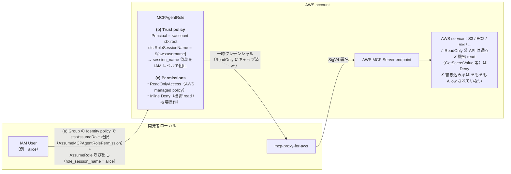
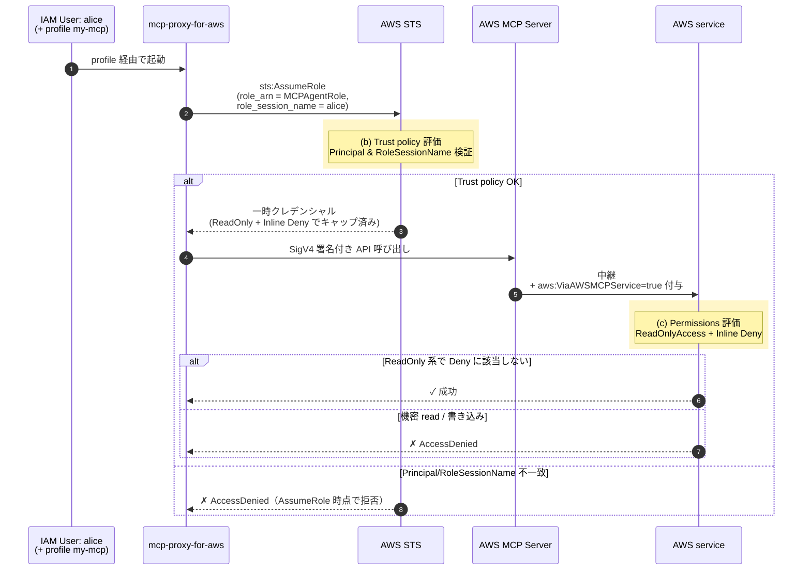

こんにちは、棚井龍之介です。

最近、Claude Code を含めた「AI の利用環境」は、インターネット利用環境に次ぐ福利厚生のひとつだと実感する日々を送っています。

2026年5月6日、AWSが **AWS MCP Server** の一般提供（GA）を開始しました。AIコーディングエージェントから AWS サービスへ、IAM ベースのガードレール・CloudWatch メトリクス・CloudTrail ロギングを伴って安全にアクセスできる、マネージドな Model Context Protocol (MCP) エンドポイントです。

本記事では Claude Code から AWS MCP Server をセットアップし、提供される 11 ツール・IAM ガードレール・CloudTrail 監査までを実際に動かしながらまとめます。

## TL;DR

- **接続**: Claude Code → `mcp-proxy-for-aws`（uvx 経由のローカル stdio プロキシ）→ AWS マネージドエンドポイント
- **ツール**：公式アナウンスで強調される主要 4 つに加え、`recommend` / `list_regions` / `suggest_aws_commands` 等を含む **全 11 個**（知識系 6 + API 系 5）が提供される（[公式リファレンス](https://docs.aws.amazon.com/agent-toolkit/latest/userguide/understanding-mcp-server-tools.html)）
- **認証**: doc 系はサーバー側では認証不要（curl で実証可）だが、公式プロキシが全リクエストに SigV4 署名するため Claude Code 経由では AWS クレデンシャル必須
- **IAM ガードレール 2 軸**: context key（`aws:ViaAWSMCPService` / `aws:CalledViaAWSMCP`）で「ヒトと AI エージェント経由」を分離する経路別 Deny に加え、専用ロール（`ReadOnlyAccess` + Inline Deny）への AssumeRole で実行コンテキスト全体を包括的にキャップする方式が組み合わせ可能
- **CloudTrail 監査**: MCP 経由は `userIdentity.invokedBy = aws-mcp.amazonaws.com` で識別できる。一方 `sourceIPAddress` が固定値になるため、`aws:SourceIp` 制限を併用する設計は要再検討

## AWS MCP Server とは

AWS MCP Server は、AWS 公式が提供する Agent Toolkit for AWS スイートの中核コンポーネントです。Agent Toolkit for AWS は3つの要素で構成されます。

| 構成要素 | 役割 |
|---|---|
| **AWS MCP Server** | マネージドな MCP エンドポイント（ツール単位の認可：API系は SigV4 必須、doc系は SigV4 不要） |
| **Agent Skills** | AWS タスクごとに用意された手順・リファレンス（必要に応じてエージェントが取得） |
| **Agent Plugins** | 複数エディタ（Claude Code、Codex、Cursor、Kiro 等）への一括導入パッケージ |

ローカル運用は不要で、AWS 側がスケーラビリティ・自動アップデート・監査ログを管理します。

### 提供リージョン・料金・クォータ

- 対応リージョンは、本記事執筆時点（2026年5月11日現在）で 米国東部（バージニア北部）と 欧州（フランクフルト）の2リージョンに限られる
- AWS MCP Server 自体に追加料金は発生しない。エージェントが作成・利用した AWS リソースおよびデータ転送料金のみが課金される
- 公式クォータ（[AWS MCP Server Quotas](https://docs.aws.amazon.com/agent-toolkit/latest/userguide/aws-mcp-limits.html)）：1 アカウント・1 リージョンあたり、リクエスト数は **3 RPS（リクエスト/秒）**、同時接続は最大 27（引き上げ不可）、同時セッションは最大 180（引き上げ申請可）。`run_script` の作業ディレクトリ等の ephemeral storage は 8 時間で削除される

## 前提環境の確認

セットアップ前に以下が揃っているか確認します。

```bash
# uv（必須：mcp-proxy-for-aws を uvx で実行するため）
$ uv --version
uv 0.11.11

# Claude Code
$ claude --version
2.1.133 (Claude Code)

# AWS CLI と認証情報
$ aws --version
aws-cli/2.34.44 Python/3.14.4 Darwin/24.5.0
$ aws sts get-caller-identity
{
    "UserId": "ABCD****************",
    "Account": "123***********",
    "Arn": "arn:aws:iam::123***********:user/agent-user"
}
```

uv が未インストールなら [公式インストールガイド](https://docs.astral.sh/uv/getting-started/installation/) を参照してください。

## Claude Code への AWS MCP Server セットアップ

公式が示すセットアップ方法は2系統あります。

### A. プラグイン経由（対話セッション内）

Claude Code を起動した状態で、対話プロンプトに以下を入力します。

```txt
/plugin marketplace add aws/agent-toolkit-for-aws
/plugin install aws-core@agent-toolkit-for-aws
/reload-plugins
```

`aws-core` プラグインは AWS MCP Server の登録に加え、CDK / CloudFormation / コンテナ / ストレージ / オブザーバビリティ向けの Agent Skills もまとめて入ります。

### B. `claude mcp add-json` で AWS MCP Server だけ登録（CLI から）

スクリプト化したい場合や、最小構成で試したい場合はこちらの方法を使います。

```bash
claude mcp add-json aws-mcp --scope user '{
  "command": "uvx",
  "args": [
    "mcp-proxy-for-aws@latest",
    "https://aws-mcp.us-east-1.api.aws/mcp",
    "--profile", "my-aws-profile",
    "--metadata", "AWS_REGION=ap-northeast-1"
  ]
}'
```

ポイント:

- 第1引数の URL（`https://aws-mcp.us-east-1.api.aws/mcp`）が AWS MCP Server のエンドポイントを指す。今回の登録例は米国リージョン側で、欧州リージョンを使う場合は URL の `us-east-1` 部分を `eu-central-1` に置き換える
- `--profile` で AWS プロファイルを明示できる
- `--metadata AWS_REGION=…` は、API 呼び出しのデフォルトリージョンを AWS MCP Server（エンドポイント）側に伝えるためのオプションである。エンドポイントのリージョン（`us-east-1`）と、実際に操作したい AWS リソースのリージョン（`ap-northeast-1`）は別の概念として扱う
- 意図しない書き込みを防ぎたい場合は `args` に `"--read-only"` を加えておくと、`readOnlyHint: True` が明示されていないツールがすべて無効化される

A・B どちらの方法でも裏側で起動するプロセスは同じ（`uvx mcp-proxy-for-aws@latest`）で、A は Agent Skills も同梱される代わりに引数を細かく指定できない、という違いです。

### 接続確認

```bash
$ claude mcp list
Checking MCP server health…

aws-mcp: uvx mcp-proxy-for-aws@latest https://aws-mcp.us-east-1.api.aws/mcp --profile my-aws-profile --metadata AWS_REGION=ap-northeast-1 - ✓ Connected
```

## 提供される11のツール

ローンチブログでは `call_aws` / `search_documentation` / `read_documentation` / `run_script` の4つが強調されますが、実際に AWS MCP Server が公開するツールは **11個** あります。

確認方法は以下の2系統があります。

1. クライアント側：Claude Code 経由で AWS MCP Server に `tools/list` を投げると、`mcp__aws-mcp__aws___*` 名前空間に紐づくツール定義として全11個が列挙される
2. 公式ドキュメント側：[Understanding the MCP Server tools](https://docs.aws.amazon.com/agent-toolkit/latest/userguide/understanding-mcp-server-tools.html)（AWS Agent Toolkit User Guide）に全11ツールのリファレンスが記載されている

`tools/list` の取得結果と公式ドキュメントの記載は完全に一致します。公式ガイド側ではツールが用途別に2カテゴリに分類されています。

### AWS Knowledge Tools（知識・ドキュメント系：6個）

| # | ツール名 | 役割 |
|---|---|---|
| 1 | `search_documentation` | AWS 公式ドキュメント検索 |
| 2 | `read_documentation` | URL を指定してドキュメント本文取得 |
| 3 | `recommend` | ドキュメントページの関連推薦 |
| 4 | `list_regions` | 全 AWS リージョン一覧 |
| 5 | `get_regional_availability` | サービス・API・CFn の地域別可用性チェック |
| 6 | `retrieve_skill` | Agent Skill（特定領域の実行手順）を取得 |

### AWS API Tools（API実行系：5個）

| # | ツール名 | 役割 | エンドポイント側の SigV4 |
|---|---|---|---|
| 7 | `call_aws` | AWS CLI コマンドを実行（15,000以上のAPI） | SigV4 必須 |
| 8 | `run_script` | サンドボックス Python 実行 | SigV4 必須 |
| 9 | `suggest_aws_commands` | 自然言語クエリから AWS CLI コマンドを提案 | SigV4 不要 |
| 10 | `get_presigned_url` | S3 用の署名付き URL を生成（大ファイル転送用） | SigV4 必須 |
| 11 | `get_tasks` | `call_aws` / `run_script` 経由の長時間タスクをポーリング | SigV4 必須 |

## 実践1：ナレッジカットオフ後の AWS サービスを質問する

LLM のナレッジカットオフ以降にリリースされた AWS サービスについて、`search_documentation` と `read_documentation` を組み合わせると、エージェント自身が公式ドキュメントから最新情報を取得できます。

題材は [AWS News Blog の GA アナウンス](https://aws.amazon.com/blogs/aws/the-aws-mcp-server-is-now-generally-available/)で取り上げられている **Amazon S3 Vectors** を採用し、公式デモと同じ題材が Claude Code 環境でも同様に再現できるかを確認します。Claude Code の対話セッション中に普通に質問するだけで、必要に応じてツールが呼ばれます。ここでは再現性のために `claude -p`（非対話モード）で明示的にツールを指定して呼び出します。

```bash
$ claude --allowedTools "mcp__aws-mcp__aws___search_documentation,mcp__aws-mcp__aws___read_documentation" \
    -p "search_documentation で 'Amazon S3 Vectors' を検索し、最初の3件のタイトルとURLを箇条書きで報告してください。"
```

実行結果:

```md
- Amazon S3 Vectors — https://aws.amazon.com/s3/features/vectors/
- Introducing Amazon S3 Vectors: First cloud storage with native vector support
  at scale (preview) | AWS News Blog
  — https://aws.amazon.com/blogs/aws/introducing-amazon-s3-vectors-first-cloud-storage-with-native-vector-support-at-scale/
- Api-S3vectors-2025-07-15 — https://docs.aws.amazon.com/aws-sdk-php/v3/api/api-s3vectors-2025-07-15.html
```

続けて `read_documentation` で本文を取得すれば、Web 検索を介さずダイレクトに公式ドキュメントを読み込めます。今回は `https://aws.amazon.com/s3/features/vectors/` を指定し、

> Amazon S3 Vectors は、ベクトルデータをネイティブに保存・クエリできる初のクラウドオブジェクトストレージで、AI エージェント、AI 推論、セマンティック検索向けに最適化されています。ベクトルのアップロード・保存・クエリのコストを最大 90% 削減でき、…

といった要約を得られました。WebFetch との違いは、`read_documentation` が AWS のドキュメントページを取得して AI 向けに markdown 形式に変換して返す点と、`search_documentation` が AWS ドキュメント全体（API リファレンス・ベストプラクティス・サービスガイド・Skills）を検索できるため、URL を事前に知らなくても目的のページに到達できる点です。

対話モードの Claude Code でも同じ質問を試したところ、同様のレスポンスが得られました。


## 実践2：`call_aws` で AWS API を直接叩く

対話セッション中に自然言語で質問するだけで、Claude Code は必要な API を自動選択し、`call_aws`（MCP 越しに AWS CLI を実行するツール）を複数回組み合わせて呼び出してくれます。

たとえば、ガバナンス監査の文脈で「誰がいつ作った EC2 か」を確認したいとき、対話セッションで次のように質問します。

> AWS MCP Server を使って、ap-northeast-1 にある EC2 インスタンスを稼働中・停止中で分けて、それぞれの起動時刻と、作成した IAM プリンシパルも一緒に一覧してください。

「AWS MCP Server を使って」と添えるのは、Claude Code が他の経路（Bash で `aws cli` を直接叩く等）ではなく AWS MCP Server 経由で実行するように誘導するためです。実際に Claude Code へ投げた結果が次のスクリーンショットです。


この調査（誰がいつどのリソースを作ったかの追跡）は、手動で aws cli を叩くと以下のような複数ステップが必要です。

1. `ec2:DescribeInstances` でインスタンス一覧と状態・起動時刻を取得する
2. 取得した各 InstanceId について、CloudTrail で `LookupEvents` を `EventName=RunInstances` + `ResourceName=<instance-id>` で叩く
3. 返ってきた event の `userIdentity` から作成者を抽出する
4. 結果をテーブルに整形する

ユーザーは API 名も CLI オプションもレスポンス JSON のパスも書いていませんが、Claude Code が `call_aws` ツールを使ってこの 4 ステップを内部的に実行してくれます。自然言語で運用上知りたいことを投げるだけで、複数 API のオーケストレーション・JSON 解析・整形までを自動でやってくれるのが対話モードの利点です。

本記事ではこの後の手順で読者の手元で同じ結果が再現できるよう、`-p`（非対話）モードで同じ質問を投げる形でデモします。対話モードと同じ自然言語のプロンプトで構いません。

```bash
$ claude --allowedTools "mcp__aws-mcp__aws___call_aws,mcp__aws-mcp__aws___run_script,ToolSearch" \
    -p "AWS MCP Server を使って、ap-northeast-1 にある EC2 インスタンスを稼働中・停止中で分けて、それぞれの起動時刻と、作成した IAM プリンシパルも一緒に一覧してください。"
```

```txt 実行結果
稼働中（running）— 1 台

┌───────────────────┬─────────────────────┬──────────────┬─────────────────────┬────────────────────────────────────┐
│       Name        │     InstanceId      │ InstanceType │  LaunchTime (UTC)   │       作成 IAM プリンシパル        │
├───────────────────┼─────────────────────┼──────────────┼─────────────────────┼────────────────────────────────────┤
│ dev-app-server-01 │ i-XXXXXXXXXXXXXXXXX │ t3a.small    │ 2026-05-01 00:49:30 │ 不明（CloudTrail 90 日保持期間外） │
└───────────────────┴─────────────────────┴──────────────┴─────────────────────┴────────────────────────────────────┘

停止中（stopped）— x 台（うち抜粋4件）

┌────────────────────┬─────────────────────┬──────────────┬─────────────────────┬────────────────────────────────────┐
│        Name        │     InstanceId      │ InstanceType │  LaunchTime (UTC)   │       作成 IAM プリンシパル        │
├────────────────────┼─────────────────────┼──────────────┼─────────────────────┼────────────────────────────────────┤
│ dev-ubuntu-test-01 │ i-XXXXXXXXXXXXXXXXX │ t2.micro     │ 2026-05-08 06:59:07 │ IAMUser: user-a                    │
├────────────────────┼─────────────────────┼──────────────┼─────────────────────┼────────────────────────────────────┤
│ dev-ubuntu-test-02 │ i-XXXXXXXXXXXXXXXXX │ t2.micro     │ 2026-05-08 06:28:54 │ IAMUser: user-a                    │
├────────────────────┼─────────────────────┼──────────────┼─────────────────────┼────────────────────────────────────┤
│ dev-win-2025       │ i-XXXXXXXXXXXXXXXXX │ t3.micro     │ 2026-04-27 01:36:40 │ IAMUser: user-b                    │
├────────────────────┼─────────────────────┼──────────────┼─────────────────────┼────────────────────────────────────┤
│ dev-rhel-01        │ i-XXXXXXXXXXXXXXXXX │ t2.micro     │ 2026-03-19 01:30:49 │ 不明（CloudTrail 90 日保持期間外） │
└────────────────────┴─────────────────────┴──────────────┴─────────────────────┴────────────────────────────────────┘
（残り x-4 件は省略）

...
```

ローカルの AWS CLI を経由しているわけではなく、AWS MCP Server 側で API 呼び出しが組み立てられて実行されます。CloudTrail event の `userIdentity.invokedBy` フィールドに `aws-mcp.amazonaws.com` が記録されるため、ヒトのコンソール操作・直接 CLI 操作と区別できます（後述「監査・ログ」セクションで event を確認します）。

## IAM ポリシーで AI エージェントの行動範囲を絞る

後述の CloudTrail event で確認できるとおり、AWS MCP Server 経由の API 呼び出しは呼び出し元の IAM プリンシパルそのものとして AWS に到達します。AWS MCP Server が独自の AWS 内 ID（サービス専用の身分）として API を呼ぶわけではなく、ユーザーのアクセスキーで SigV4 署名された **普通の API 呼び出しを中継** しているだけです。したがって、通常の IAM 設計（ユーザー・グループ・ロールの権限）がそのまま MCP 経由の挙動を縛ります。「最小権限のユーザに MCP を解禁する」という方針であれば、特別な条件キーは不要で、見慣れた IAM ポリシー設計でそのまま対応できます。

実際のリクエストの流れを整理すると次のようになります。MCP クライアントは SigV4 で署名したリクエストを AWS マネージド MCP サーバーに送り、サーバー側で SigV4 を検証したうえで context key（`aws:ViaAWSMCPService` / `aws:CalledViaAWSMCP`）を付与してから下流の AWS サービスに API 呼び出しを転送します。下流の AWS サービス側は通常の IAM ポリシー評価の一部として、この context key を条件式で参照できます。


出典：[AWS Security Blog: Understanding IAM for Managed AWS MCP Servers](https://aws.amazon.com/jp/blogs/security/understanding-iam-for-managed-aws-mcp-servers/)

組織の規模・統制レベルに応じて、以下の A（SCP）または B（IAM グループ）のパターンを使い分けます。さらに、専用ロールへの AssumeRole でエージェントが扱うクレデンシャル全体を ReadOnly でキャップする方法（補足）も組み合わせ可能です。

### A. SCP（Service Control Policy）

Organizations を使っているなら、本番アカウント・OU に SCP として適用するのが定番です。SCP は root を含む全プリンシパルに作用するため、誰がどんな経路で叩いても本番への書き込み系操作を一括で禁止できます。本番アカウント全体への横断的なガードレールに使います。

ポリシー条件には MCP 経由を識別する 2 つの IAM context key が使えます（SCP に限らず、IAM Group ポリシーや AssumeRole の Trust policy など、すべての IAM ポリシーで利用可能です）。

| context key | 型 | 用途 |
| --- | --- | --- |
| `aws:ViaAWSMCPService` | Bool | AWS マネージド MCP 経由かどうかの真偽値判定 |
| `aws:CalledViaAWSMCP` | string（single-valued） | どの MCP サーバー経由かを判定（値は MCP の AWS 内識別子：`aws-mcp.amazonaws.com`、`eks-mcp.amazonaws.com`、`ecs-mcp.amazonaws.com` 等。AWS の用語では「サービスプリンシパル名」） |

これらを使い分けることで「普段は管理者権限のままでよいが、AI エージェント経由で叩く瞬間だけ特定の破壊的操作を止めたい」「汎用 MCP は禁止して EKS/ECS 専用 MCP は許可したい」といった粒度を表現できます。

たとえば「特定アカウント・OU では AWS MCP Server 経由の操作を全面禁止する」というポリシーを敷きたい場合は、Bool 型の `aws:ViaAWSMCPService` を条件にしてすべてのアクションを Deny する SCP を適用します。

```json
{
  "Version": "2012-10-17",
  "Statement": [
    {
      "Sid": "DenyAllActionsViaMCP",
      "Effect": "Deny",
      "Action": "*",
      "Resource": "*",
      "Condition": {
        "Bool": {
          "aws:ViaAWSMCPService": "true"
        }
      }
    }
  ]
}
```

「破壊的操作だけ MCP 経由で禁止したい」場合は `Action` を `ec2:TerminateInstances` / `rds:DeleteDBInstance` / `s3:DeleteBucket` 等に絞り込みます。MCP の種類で分けたい場合は string 型の `aws:CalledViaAWSMCP` で MCP のサービスプリンシパル名を判定します（具体的なポリシー例は [AWS Security Blog: Understanding IAM for Managed AWS MCP Servers](https://aws.amazon.com/jp/blogs/security/understanding-iam-for-managed-aws-mcp-servers/) を参照）。

### B. IAM グループに ReadOnly + NG操作の Deny をアタッチ

シンプルな方法で、多くの組織ではこれだけで十分です。新規に `mcp-users` のような IAM グループを作って使用メンバーを入れる方法でも、AWS MCP Server を使う人がすでに所属している既存グループに権限を追加する方法でも運用できます。

読み取り権限のベースとして AWS マネージドポリシー `ReadOnlyAccess`（または `SecurityAudit`）をグループにアタッチし、削除・変更系で組織として実行させたくない NG 操作だけを customer-managed policy として別途アタッチします。NG 操作の典型例：

```json
{
  "Version": "2012-10-17",
  "Statement": [
    {
      "Sid": "DenyDangerousActions",
      "Effect": "Deny",
      "Action": [
        "ec2:TerminateInstances",
        "rds:DeleteDBInstance",
        "iam:Delete*",
        "s3:DeleteBucket"
      ],
      "Resource": "*"
    }
  ]
}
```

なお、グループ単位だと粒度が荒くて困る場面（例：GA したばかりの MCP を動作検証メンバー数名にだけ解禁したい）では、同じポリシーを IAM ユーザー／ロールに直接アタッチして段階展開する形も使えます。

### 補足：AssumeRole で包括的な ReadOnly キャップ

`aws:ViaAWSMCPService` を使った前項の例は「特定サービスごとのガードレール」（経路別 Deny）に向く一方、「経路に関わらずエージェントが使うクレデンシャル自体を ReadOnly に縛りたい」というように、複数サービスにまたがる包括的な制限を入れたい場合は、IAM の context key ではなく **MCP 専用ロール + AssumeRole** という別レイヤーで構成できます。

AWS 公式の設計指針は [AWS Security Blog: Secure AI agent access patterns to AWS resources using MCP](https://aws.amazon.com/blogs/security/secure-ai-agent-access-patterns-to-aws-resources-using-model-context-protocol/) を参照してください（サンプル実装は `boto3.assume_role()` の `PolicyArns` で渡す session policy 方式が中心です）。本セクションでは、AssumeRole ベースの人間アクセスで広く使われてきた **「Group identity policy で AssumeRole 権限を付与・剥奪 + Trust policy の `sts:RoleSessionName = ${aws:username}` で監査詐称防止 + 専用ロールに `ReadOnlyAccess` を静的アタッチ + 機密 read 系は Inline Deny で除外」** という多層防御パターンを MCP 用ロールに当てはめます。

仕組みの概略:

1. MCP 用の専用 IAM ロール（例：`MCPAgentRole`）を作成し、`ReadOnlyAccess`（AWS マネージドポリシー）と機密 read 系の Inline Deny を直接アタッチする
2. ロールの Trust policy で `sts:RoleSessionName = ${aws:username}` を強制し、`sts:AssumeRole` 権限は MCP 利用メンバーが所属する IAM Group の identity policy で付与する
3. `mcp-proxy-for-aws` の `--profile` に、そのロールを assume するプロファイル（`role_arn` + `source_profile` を指定）を設定する
4. SDK が AssumeRole を実行し、その session の権限が `ReadOnlyAccess` + 追加 Deny に絞られる

このアプローチは MCP 固有の context key を使わず、エージェントの実行コンテキスト全体を ReadOnly でキャップする思想です。「経路（MCP 経由 / 直接 CLI）ごとの使い分け」ではなく「エージェントが使うクレデンシャル全体への制限」として機能します。

全体像は次のとおりです。図中 (a)〜(c) は **AssumeRole が成り立つために必要な 3 つの要素**（呼び出し元の権限・ロールの受け入れ条件・ロールの実行権限）に対応します。



同じ構成を「時系列」の視点で表現したシーケンス図が次です。AssumeRole 評価 → クレデンシャル発行 → SigV4 → MCP 中継 → Permissions 評価 という IAM 評価の発火順序を、上のフロー図とは別の切り口から見られます：



フロー図は「どの要素がどこに繋がっているか」という構造を、シーケンス図は「どの順番で何が評価されるか」という時系列を表します。IAM の評価点は **黄色のハイライト** で示した 2 段階で、(b) Trust policy で落ちれば (c) Permissions の評価には進みません。Group メンバーシップの追加・削除は `iam:AddUserToGroup` / `iam:RemoveUserFromGroup` として CloudTrail に記録されるので、MCP アクセス権の付与・剥奪も監査ログから追えます。

整理すると、AWS MCP Server 向けの IAM 制御は次の使い分けになります：

| 要件 | 想定される構成 |
|---|---|
| 「特定サービスの危険な操作だけ MCP 経由で禁止」（経路別ガードレール） | `aws:ViaAWSMCPService` + サービス特化 Deny（前項のパターン） |
| 「エージェントが使うクレデンシャル全体を ReadOnly に縛る」（包括キャップ） | AssumeRole + 専用ロール（本セクションのパターン） |

## 監査・ログ（CloudTrail / CloudWatch）

AWS MCP Server 経由の API 呼び出しはすべて CloudTrail に記録されます。実際に `call_aws` で発行した `sts:GetCallerIdentity` の event を `ap-northeast-1` の CloudTrail から取得した抜粋：

```json
{
  "eventTime": "2026-05-08T08:45:04Z",
  "eventSource": "sts.amazonaws.com",
  "eventName": "GetCallerIdentity",
  "awsRegion": "ap-northeast-1",
  "userIdentity": {
    "type": "IAMUser",
    "arn": "arn:aws:iam::123456789012:user/agent-user",
    "userName": "agent-user",
    "invokedBy": "aws-mcp.amazonaws.com"
  },
  "sourceIPAddress": "aws-mcp.amazonaws.com",
  "userAgent": "aws-mcp.amazonaws.com"
}
```

CloudTrail で MCP 経由かどうかを判別する際に使うフィールドは以下です（直接 CLI 経由との比較）。

| フィールド | 直接 CLI 経由 | MCP 経由 |
|---|---|---|
| `userIdentity.arn` | 実 IAM プリンシパル | 同じ（MCP は本人として動作） |
| `userIdentity.invokedBy` | 付かない | `aws-mcp.amazonaws.com` |
| `sourceIPAddress` | クライアントの実IPアドレス | `aws-mcp.amazonaws.com`（実IPは記録されない） |
| `userAgent` | `aws-cli/...` などクライアント実装文字列 | `aws-mcp.amazonaws.com` |

ポイント：MCP 経由の操作は CloudTrail から「誰の IAM プリンシパルが・MCP サービス経由で・何の API を」叩いたかが追えます。一方、クライアントの IP アドレスや具体的なツール（Claude Code / Codex / Cursor 等）の区別は CloudTrail には現れません。

`sourceIPAddress` が `aws-mcp.amazonaws.com` 固定値になる挙動は、ガードレール設計上重要な制約になります。IAM ポリシーで `aws:SourceIp` を条件として「社内ネットワークからのみアクセス可」と縛っていた場合、MCP 経由の呼び出しはこの条件にマッチせず、許可ステートメント側で落ちる（または明示 Deny に当たる）可能性があります。MCP 経由を許可したい場合は、`aws:SourceIp` 条件を `aws:ViaAWSMCPService` での例外と組み合わせて再設計するか、SCP レベルで除外を入れる必要があります。

なお、IAM ポリシーの condition key として登場する `aws:ViaAWSMCPService` / `aws:CalledViaAWSMCP` は、ポリシー評価時に MCP 経由かどうかを判定する論理値・文字列値であり、CloudTrail event の中に同名のフィールドが現れるわけではありません。ログ分析側では `userIdentity.invokedBy = "aws-mcp.amazonaws.com"` をフィルタ条件として使います。

CloudWatch Logs Insights から「MCP 経由の呼び出しだけ」を抽出する場合のクエリ例：

```text
fields eventTime, eventSource, eventName, userIdentity.arn, userIdentity.invokedBy
| filter userIdentity.invokedBy = "aws-mcp.amazonaws.com"
| sort eventTime desc
| limit 50
```

CloudWatch メトリクスでも MCP 経由の呼び出し回数・レイテンシ・エラー率が可視化されます。

## まとめ

AWS MCP Server を Claude Code に組み込む手順、11 ツールの動作、IAM 設計、CloudTrail 監査までを実際に動かして整理しました。要点：

- **接続と認証**：`mcp-proxy-for-aws`（uvx 経由のローカル stdio プロキシ）が MCP プロトコルの全往復に SigV4 を強制するため、Claude Code 経由では AWS クレデンシャル必須
- **認可モデル**：MCP 固有の IAM action はなく、通常の IAM / SCP / マネージドポリシー（`ReadOnlyAccess` 等）でそのまま権限制御できる
- **11 ツール**：知識系 6（`search_documentation` 等）と API 系 5（`call_aws` 等）の 2 系統
- **IAM ガードレール 2 軸**：経路別 Deny は `aws:ViaAWSMCPService` 等の context key、包括キャップは専用ロール（`ReadOnlyAccess` + Inline Deny 直接アタッチ）への AssumeRole で実現。Trust policy で `sts:RoleSessionName = ${aws:username}` を強制すれば CloudTrail の個人追跡性も担保
- **CloudTrail 監査**：MCP 経由の API 呼び出しは `userIdentity.invokedBy = aws-mcp.amazonaws.com` でフィルタ可能（`sourceIPAddress` 固定値の挙動は `aws:SourceIp` 制限との併用時に要注意）

最初の一歩としては、`--read-only` フラグ付き・サンドボックスアカウントで `call_aws` から始めると手軽に試せます。[AWS Security Blog](https://aws.amazon.com/jp/blogs/security/understanding-iam-for-managed-aws-mcp-servers/) で VPC endpoint 対応（two-stage authorization）等の機能拡充も予告されているため、ガバナンス要件が厳しい環境では機能が揃ってからの本格採用も選択肢になります。

## 参考リンク

- [AWS What's New: AWS MCP Server is now generally available](https://aws.amazon.com/about-aws/whats-new/2026/05/aws-mcp-server/)
- [AWS News Blog: The AWS MCP Server is now generally available](https://aws.amazon.com/blogs/aws/the-aws-mcp-server-is-now-generally-available/)
- [AWS MCP Server (User Guide)](https://docs.aws.amazon.com/agent-toolkit/latest/userguide/mcp-server.html)
- [Understanding the MCP Server tools](https://docs.aws.amazon.com/agent-toolkit/latest/userguide/understanding-mcp-server-tools.html)
- [Quotas for AWS MCP Server](https://docs.aws.amazon.com/agent-toolkit/latest/userguide/aws-mcp-limits.html)
- [AWS Security Blog: Understanding IAM for Managed AWS MCP Servers](https://aws.amazon.com/jp/blogs/security/understanding-iam-for-managed-aws-mcp-servers/)
- [AWS Security Blog: Secure AI agent access patterns to AWS resources using MCP](https://aws.amazon.com/blogs/security/secure-ai-agent-access-patterns-to-aws-resources-using-model-context-protocol/)
- [GitHub: aws/agent-toolkit-for-aws](https://github.com/aws/agent-toolkit-for-aws)
