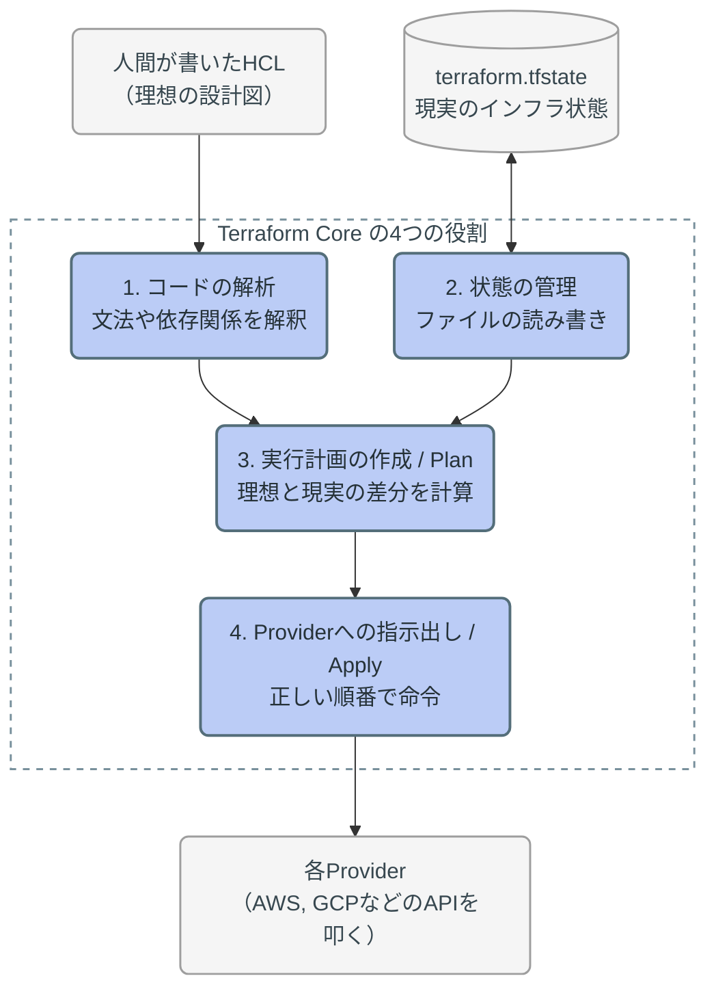

本記事は[Terraform 連載 2026](/articles/20260518a/) 最後の記事です。

# はじめに

製造エネルギーグループの永井です。

AIって便利ですよね。新しい分野の学習にAIは欠かせなくなりました。ただAIはもっともらしい嘘をつく可能性もあり、信頼できる一次情報（公式ドキュメント）に当たることは重要だと思います。私もこれまでAIの回答に対して「いやそんなわけなかろう」と何度も突っ込んできました。

本記事ではAIと公式ドキュメントを行ったり来たりしながらTerraformについて基本的な知識を整理していきます。

# Terraformの基本とメリット

::: note tip
**Terraformとは何か？（AIの回答）**

Terraformとは、インフラストラクチャをコードとして管理（IaC: Infrastructure as Code）し、自動構築や安全なバージョン管理を可能にするオープンソースのツールです。

なぜTerraformが必要なのかというと、手作業によるサーバー構築の手間や設定ミス（ヒューマンエラー）を徹底的に排除し、「いつでも、誰が実行しても、全く同じ環境を再現できる（冪等性）」という状態を作り出せるからです。

* **従来の構築方法**: クラウドの管理画面（GUI）を操作し、手順書を見ながら手作業で環境を作成。
* **Terraformを使った構築**: 各クラウドと接続する「Provider」や、現在の状態を記録する「tfstateファイル」という仕組みを介し、コードに書いた理想の状態を自動再現。

例えば、AWSやGoogle Cloud上でサーバーを立ち上げる際も、Terraformがコードと実際の環境（tfstate）の差分を読み取り、Provider経由で自動構築してくれます。

したがって、インフラ構築の「効率化」「自動化」「属人化の解消」を図る上で、Terraformは現代のシステム開発において欠かせない技術となっています。

:::

メリットはよくわかりました。

実際のコンソール画面でリソースを構築してみると設定項目がたくさんあります。また利用料金節約のために、環境ごとに設定を変えるのもよくある運用だと思います。ヒューマンエラーを排除してくれるのはありがたいです。

ただちょっとProviderやtfstateなどよくわからない言葉が出てきたので、それぞれの言葉について公式ドキュメントをあたってみましょう。

# ProviderとTerraform Coreの役割分担

Providerに関する公式ドキュメントのURLを教えてもらって自分で読んでみます。

[公式ドキュメント（Providers）](https://developer.hashicorp.com/terraform/language/providers)を確認しました。

初心者が知っておくとよさそうな部分をまとめます。

* Terraformが各Cloudとやり取りするためのルールはProviderが規定している。
* [Terraform Registry](https://registry.terraform.io/browse/providers)という場所にProviderは規定されている。
* Terraform Registryに変数などの使い方など基本的なドキュメントはそろっている。
* 個人でTerraform Providerを作ることもできる。（Docker imageみたいですね。公式のProviderから選択するのが無難そうです。）

ん？？ ではTerraform自体はなにしてるんでしょう？

::: note tip
**Terraform本体は何をしているのか？（AIの回答）**

結論から言うと、Terraform本体（Terraform Core）は、理想の設計図（コード）と現在の状況（tfstate）を見比べて「次に何をすべきかの計画（差分）」を計算し、Providerに的確な指示を出す「現場監督」の役割を担っています。

なぜなら、Providerが「AWS専用の作業員」や「GCP専用の作業員」だとすれば、誰かが「システム全体の設計図を読み解き、現在の進捗を確認し、どの作業員にどういう順番で動いてもらうか」を取り仕切る必要があるからです。

具体的にTerraform本体（Core）は下図のフローで動いています。

つまり、Terraform本体はクラウドに直接触れることはなく、「状態管理と差分計算を行う非常に賢いエンジン」として機能しています。この明確な役割分担があるからこそ、TerraformはAWSでもGCPでもローカルPCでも、同じ「Plan（計画）してApply（適用）する」という統一された体験を提供できるのです。

:::

作業をキューイングしたり、人が書いたHCLを翻訳したりと、アプリケーションでいうところのOSに近い部分を担っていることがわかりましたが、Terraform Coreという新しい言葉が出てきました。

## Terraform Coreについて公式ドキュメントによると

これも[公式ドキュメント](https://developer.hashicorp.com/terraform/plugin/how-terraform-works)を読んでみました。

要点をまとめます。

* Terraform Core と Terraform Plugins に分かれる
* Terraform CoreはRPCというプロトコルを用いてTerraform Pluginsとやり取りする
* **Terraform Core（本体）の役割**
  * 設定ファイルやモジュールの読み込み、変数の展開・計算
  * 構築・削除・更新など、リソースの状態管理（State）
  * リソースの依存関係のグラフ化
  * 実行計画の作成（実際のインフラへ適用する前に、どのような変更が起きるかを事前計算・プレビューする）
* **Terraform Plugins（Providerなど）の役割**
  * インフラストラクチャプロバイダー（AWSやGCPなど）との認証
  * 私たちが書いた `resource` や `data` というコードブロックを、実際のクラウドサービスの機能（API）へ正確に繋ぎ合わせる
  * 各クラウド固有の便利機能の提供

Coreという名前だけあってOSのような役割を担っていることがよりイメージできるようになりました。特にユーザにとって重要なのは実行計画の作成ですね。

Terraform Planしたときに確認できる内容ですが、これもTerraform Coreが担っているとのことでした。Applyすると何がどう変化するのか事前に知っておかないと不安になるので、しっかり確認する必要があります。依存関係のグラフ化も気になりますが、そこまで深堀りするとちょっと長くなりそうなので今回は見送ります。

# Terraformを支える状態管理と実行計画

さて新しい疑問が出てきたのでさらに深堀りしていきます。
Terraform Coreの重要な役割である「状態管理」と「計画の実行」についてもAIに聞き、公式ドキュメントで裏付けを取りました。

::: note tip
**状態管理（Resource state management）とは？（AIの回答）**

「現実のインフラが今どうなっているか」をTerraform本体が記憶しておく仕組み

結論から言うと、状態管理（Resource state management）は、Terraform本体（Core）が `terraform.tfstate` というファイルを使って、自分が過去に作成したリソースの現在の状態を追跡・記憶しておく重要な役割です。

なぜこれが必要かというと、コード（HCL）には「最終的にどうなりたいか（理想）」しか書かれていないため、現実のクラウド環境と見比べないと「何を新しく作り、何を削除すべきか」が判断できないからです。

* **具体例**: コードに「Webサーバーが3台必要」と書かれているとします。
* **Stateがない場合**: Terraformは今の状態を知らないため、毎回「よし、3台作ろう」と動いてしまい、実行するたびにサーバーが増え続けてしまいます。
* **Stateがある場合**: Stateファイルを見て「すでに2台存在しているな」と把握し、「あと1台だけ追加すればいい」という正確な判断が下せます。

つまり、Terraform本体がこの「状態管理」を担っているおかげで、何度コマンドを実行しても同じ環境が保たれる「冪等性（べきとうせい）」が実現できているのです。

:::

::: note tip
**計画の実行（Plan execution）とは？（AIの回答）**

理想と現実の「差分」を計算し、Providerに正しい順番で指示を出す仕組み

計画の実行（Plan execution）とは、Terraform本体（Core）がコード（理想）とState（現実）の差分から「どのリソースを、どういう順番で作成・変更・削除するか」という手順書を作成し、それを実行する役割のことです。

いきなりクラウドを操作するのではなく、まずは安全に「計画」を立ててから動くのがTerraformの大きな特徴です。

* **計画（Plan）**: リソース同士の依存関係を計算します。「Webサーバーを作るには、先にネットワークが必要だ」といった順番をTerraform本体が自動で判断し、「この順序で進める」という実行計画（Execution Plan）を作成します。
* **実行（Execution）**: 立てた計画に沿って、Terraform本体が各Provider（AWSやGCPなど）に対して、「はい、次はネットワークを作って！」「それが終わったらサーバーを立てて！」とRPC通信で的確に指示を出します。

:::

### State周りについて公式ドキュメントによると

例も交えてきれいにまとめまっていました。状態管理はTerraformの核となる機能のようです。理解しておくとTerraformへの理解も深まりそうなので公式ドキュメントを読んでみます。

- [Stateの目的と概念](https://developer.hashicorp.com/terraform/language/state/purpose)
- [Stateファイルの仕様や仕組み全体](https://developer.hashicorp.com/terraform/language/state)
- [実行計画に関する公式ドキュメント](https://developer.hashicorp.com/terraform/cli/commands/plan)
- [リソースの依存関係](https://developer.hashicorp.com/terraform/tutorials/configuration-language/dependencies)

これらの公式ドキュメントを読むことで、以下の点がわかりました。

* Stateファイルによって「コード上の名前」と「クラウド上のID」を紐づけているからこそ、未作成や更新の判断が正確にできる。
* Terraformはリソースの依存関係（参照・被参照）などのメタデータを管理している。
* キャッシュを保持することで効率的にリソースの管理を行うことができる。
* Stateファイルはリスク管理の観点からバックアップを取得して[HCP Terraform](https://developer.hashicorp.com/terraform/cloud-docs/migrate)に保存しておくのがおすすめ。
* Stateファイルはユーザが自分で手編集できない。
* [暗黙の依存関係](https://developer.hashicorp.com/terraform/tutorials/configuration-language/dependencies#manage-implicit-dependencies)と[ユーザが規定する明示的な依存関係](https://developer.hashicorp.com/terraform/tutorials/configuration-language/dependencies#manage-explicit-dependencies)という仕組みを用いて、「どちらを先に作るべきか」を決定している。

ここまでで、基本的な知識はついたのではないでしょうか。

# 終わりに

AI便利ですね！ただ公式ドキュメントを確認する姿勢も大事です。

「とりあえず動くものを作るだけ」「ざっくり知識を得たい」くらいならAIに聞くだけで十分な範囲をカバーできそうです。ただ、ずっとAIと会話していると「合ってるんだろうか。」と不安になります。今回のように公式ドキュメントと1対1の割合にするくらいが精神衛生上よいなと感じました。また、当たり前ですが「公式ドキュメントのURLを教えて」というような具体的な指示の方がうまく動いてくれました。

さらに人が書くブログ記事にもまだまだ価値があると感じました。というのも、この記事は私が理解を得るにいたった経緯をまとめたものです。ということは他にも同じ経緯をたどって理解する人がいるはずです。日々の業務で忙しいですが自分の発信の機会も増やしていきたいです。

本記事ではAIと公式ドキュメントを行ったり来たりしながらTerraformについて基本的な知識を整理しました。

後は実際に動かしてみてさらに理解を深めようと思います。ここまでお付き合いいただきありがとうございました。
