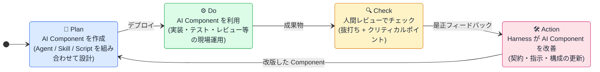
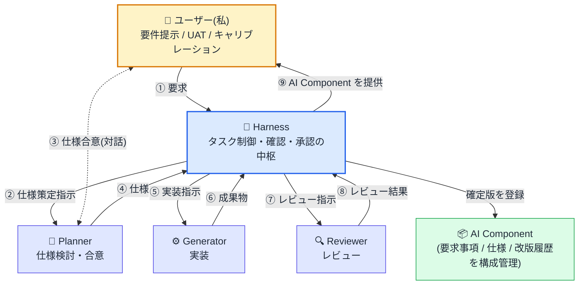

::: note info

本稿は、AI駆動開発をエンジニアリング組織に導入・運用してきた経験を踏まえ、「AI Agent をどう"チームメンバー"として扱うか」という設計論を、現場目線で整理したものです。

提案書でも、ベンダー資料でもなく、**実際に手を動かしているエンジニアが、同じく手を動かしているエンジニアに向けて書いた考察**として読んでいただければと思います。

:::

# はじめに:なぜ今、"設計論"が必要なのか

ここ1〜2年、現場では Cursor / Claude Code / Devin / 各種 Copilot 系の導入が一気に進みました。手元での生産性は確かに上がりました。一方で、こんな声をよく聞きます。

- 「AI が出してくるコードのレビュー負荷で、結局トータルの工数は変わっていない」
- 「便利だが、属人化している。チームでどう運用するかが見えない」
- 「PoC は動いたが、本番ワークフローに組み込む段で詰まった」
- 「責任の所在が曖昧。AI が壊したのか、人間が見落としたのかが切り分けられない」

これらはツールの問題ではなく、**チーム運用の設計が欠けている**ことの帰結だと感じています。

AI 駆動開発の本質は、「速いコード補完を手に入れる」ことではありません。**AI Agent をチームメンバーとして編成し、人間とは違う性質を持つメンバーを前提にエンジニアリングプロセスを再設計すること**です。

本稿では、その設計論を 5 つの観点に分けて整理します。

# 観点 1:プロセスの骨格は、対象の複雑さに応じて変える

AI 駆動開発の議論には、相反する主張が混在しています。一方には "vibe coding" に代表される「設計と実装の境界を溶かす」論調があり、他方には「従来プロセスをそのまま AI で短縮するだけ」という慎重論があります。

この問いには、私自身の実体験から答えたいと思います。**結論を先に書くと、対象の複雑さによってプロセスの骨格を変えるべき**、というのが私の立場です。

## 私の実体験:小さい道具づくりに、ウォーターフォールはいらなかった

私は普段、設計開発を支えるアプリケーション、テスト工程の自動化スクリプト、エビデンス収集スクリプト、レポート生成スクリプトを、**ほぼすべて AI に作ってもらっています**。要件定義書も設計書も書きません。AI Agent に要件を伝え、ツールが出てきて、E2E で動作確認する。それで完結しています。

1 年半前は、出てきたコードを自分でレビューしていました。しかし GitHub Copilot や Claude Code を本格的に使い始めた頃から、コードレビューをやめました。代わりに、**E2E テストの結果を AI にフィードバックするループだけで、ツールの作成・活用が成立しています**。

この領域では、極論で言われている「設計工程レス」「コードレビュー不要」は、実際に機能します。**対象が小さく、要件が私の頭の中に収まり、壊れても私だけが困る範囲**だから成り立つわけです。

## しかし、プロジェクトで構築するシステムは話が違う

一方で、私がプロジェクトで構築するシステムは、サービス・モジュール・機能ごとに**要件が大量にあり、それらが互いに依存して複雑な構造**を成しています。

ここで「要件定義 → 設計 → 実装 → テスト」の各フェーズを工程管理せず、AI で一気に短縮しようとするのは、**リスクが高すぎる**と考えています。理由は単純で、

- AI が一度に正しく扱える文脈の量には限界がある
- 要件間の依存関係を、構成管理なしに頭の中だけで追える規模を超えている
- 壊れたときに困るのが「私だけ」ではなく、顧客と運用チーム全員になる
- 設計判断の根拠が残らないと、後の改修・障害対応で詰む

つまり、**AI の能力 × 対象の複雑さ × 失敗時の影響範囲**で、プロセスの濃度を決める必要があります。これを無視して「世間が AI で速くなると言っているから」を理由にプロセスを薄めるのは、無謀でしかありません。

## だから、骨格は対象ごとに使い分ける

| 対象の例 | 骨格の濃度 | 私の運用 |
|---|---|---|
| 個人ツール、自動化スクリプト、レポート生成 | 限りなく薄い | 要件 → AI → E2E フィードバックループ |
| 小規模アプリ、社内向け補助システム | 軽い骨格 | 仕様だけは Planner が言語化し、構成管理する |
| プロジェクトで構築する業務システム | 従来工程の骨格を維持 | 要件定義 → 設計 → 実装 → テスト、ただし各工程の "中身" を AI で再構築 |

そして、プロジェクト規模のシステムにおいては、各工程の**中身**を次のように再構築します。

| 工程 | 従来の中身 | AI 駆動開発での中身 |
|---|---|---|
| 要件定義 | 人間が対話で整理 | 対話は人間、構造化・抜け漏れチェックは AI |
| 設計 | 設計書を人間が書く | 設計書と機械可読版を並走させる(双方向同期) |
| 実装 | 設計書 → コード | テストファーストが現実解になる(テスト先行生成 → 実装 → 検証) |
| テスト | 物量制約で限定的 | AI Component が大規模に検証カバレッジを担保 |
| レビュー | 人 → 人の単層 | Component → 人 → Harness の PDCA ループ |

工程名は同じでも、**中で起きていることがまったく違う**。これが現場の実感です。

骨格を維持する理由は、認知負荷だけではありません。**規模と複雑さに対して、判断の根拠と変更の履歴を残す**ためです。これがなければ、AI が出したものを誰も検証できず、改修も継承もできなくなります。

> **エンジニアへの実装的含意**:「AI で速くなるからプロセスを省ける」ではなく、「**対象の複雑さに対して、プロセスの濃度を意識的に選ぶ**」。個人ツールでウォーターフォールを敷くのは滑稽だし、業務システムで構成管理なしに進めるのは無謀です。判断軸は「壊れたら誰が困るか」と「複雑さが頭の中に収まるか」の 2 つで十分です。

# 観点 2:AI Agent を「ツール」ではなく「マイクロサービス」として扱う

ここが、現場で最も意識を変えるべき点だと感じています。

> **用語の整理**:本稿では、**AI Agent**(チームメンバー単位の単体 AI)と、**AI Component**(Agent / Sub Agent / Skill / MCP / Script を組み合わせた稼働単位)を使い分けます。I/O 契約は本来 Agent 粒度で結ばれるものですが、実運用では複数 Agent を束ねた Component に対しても同じモデルで適用されます。以降、**個の振る舞いを論じるときは Agent**、**稼働させるまとまりを論じるときは Component** と読み分けてください。

多くのチームで AI は「便利な補完ツール」として扱われています。これは個人の生産性向上には機能しますが、**チームとして再現性のある成果を出す体制にはなりません**。

代わりに、私は AI Agent を **マイクロサービス的に扱う** ことを推奨します。具体的には、Agent を作るときに以下を明文化します。

```yaml
# 例: Agent 定義(I/O 契約)
name: code-reviewer-agent
purpose: PR のコード品質を機械的にレビューする

functional:
  - 静的解析では見つからない設計上の問題を指摘する
  - 修正提案を unified diff 形式で返す

non_functional:
  latency: p95 < 30s
  cost: 1 PR あたり $0.20 以内
  reliability: 月次の誤検知率 < 15%

input:
  type: PR diff (unified diff format)
  context: PR description, related files

output:
  type: Markdown report
  schema: { findings: [{severity, file, line, message, suggestion}] }

out_of_scope:
  - セキュリティレビュー(別 Agent)
  - パフォーマンスレビュー(別 Agent)
```

この **I/O 契約モデル** が効くのは次の理由です。

1. **エンジニアリングプロセスのデザインに組み込める(最大のメリット)**:契約という共通言語があるからこそ、Agent を工程の中に "部品" として配置でき、入出力を起点にプロセス側を設計し直せる。プロセスに組み込めないものは、いずれ属人運用に逆戻りする
2. **責任分界が明確になる**:Agent が何をやって、何をやらないかが言語化される
3. **改善サイクルが回る**:契約に対する充足率を測れるので、Agent の改善が定量的になる
4. **置き換えが効く**:契約が同じなら、中身のモデル(GPT-x → Claude-x → ローカル LLM)を差し替えられる
5. **属人化しない**:誰が呼んでも同じ振る舞いが期待できる

特に 1 つ目が私にとっての本丸です。AI Agent を "便利な相棒" 止まりにせず、**エンジニアリングプロセスの構成要素として設計できるかどうか**で、得られるパフォーマンスが **個人レベル** に留まるか、**組織レベル** にまで広がるかが決まります。

| パフォーマンスの広がり | 状態 | 典型像 |
|---|---|---|
| **個人レベル** | AI が個々人の生産性を底上げする | 各自が思い思いに Copilot を使いこなしている状態 |
| **組織レベル** | AI Agent が工程の部品として再利用され、組織全体のスループットを底上げする | 契約された Agent が、誰のどの工程からでも同じ品質で呼び出される状態 |

両者の差は、AI の性能ではなく、**契約という共通言語をプロセスに編み込めているかどうか**で決まります。

> **エンジニアへの実装的含意**:Agent ごとに README.md(または agent.yaml)を必須化する。`purpose`, `non_functional`, `out_of_scope` の 3 つは特に重要。「これは何をしないか」を書かない Agent は、必ず期待値ズレを起こします。

# 観点 3:検証は "層" ではなく "PDCA サイクル" として組む

AI は確率的に間違えます。これは仕様です。

問題は、**間違いをどう検知し、どう次の改善に回すか**です。人間レビューに全量を流せば速度が犠牲になり、ノーチェックで流せば信頼が犠牲になる。一回限りの "検証" ではこのジレンマは解けません。**検証を改善ループに組み込む**ことで、はじめて構造的に解けます。

私が運用しているのは、AI Component を中心に据えた PDCA サイクルです。



各フェーズの中身を補足します。

| フェーズ | 主体 | 中身 |
|---|---|---|
| **Plan** | Harness + Planner | 要件を仕様に落とし、**AI Component**(Sub Agent / Skill / Script を組み合わせた構成体)を設計する |
| **Do** | AI Component | 現場の実装・テスト・レビュー等で稼働し、成果物を生み出す |
| **Check** | 人間 | 全件レビューではなく、抜打ち検査と Hard Gate に絞って判定 |
| **Action** | Harness | Check のフィードバックを受け、Component の契約・指示・構成を改版する |

Do の主体は AI Component です。中身は Agent / Sub Agent / Skill / Script などで構成されており、観点 2 の I/O 契約は Component 単位で結ばれます。

そして、検証は "層" ではなく **"閉じたループ"** として設計します。Check が Action に直結し、Action が次の Plan を駆動する。**一度通したら終わり、ではなく、ズレを見つけたら必ず Component が改版される**ことが、この設計の肝です。

## Check と Action を機能させる 3 つの工夫

**(1) Component 内部の検証側の独立性を、段階的に確保する**

Do フェーズでは、AI Component が内部に Reviewer 系の自動検証を持ちます。ここで Generator 側と Reviewer 側が同じ "考え方" のままだと、同じバイアスを同じように見逃します。だからといって「異なるベンダーのモデルを混ぜろ」は短絡で、コストばかり増えがちです。独立性は**二択ではなく段階**で考えるのが現実的です。

| レベル | 構成 | 排除できるバイアス |
|---|---|---|
| L0 | 同一セッション内で自己レビュー | ほぼ何も(アンカリング残存) |
| L1 | 同一モデル + 別セッション | 生成時の文脈アンカリング |
| **L2** | **同一モデル + 別セッション + 別 Agent(役割・指示が別設計)** | **アンカリング + 役割固定バイアス** |
| L3 | 異なるサイズのモデル | モデルサイズ起因の見落としパターン |
| L4 | 異なるベンダー / モデル系統 | 自己選好バイアス、モデル固有の知識偏り |

私自身の運用は **L2** です。Generator Agent と Reviewer Agent を**別 Agent として設計**し、**別セッション**で動かしています。同一モデル(Claude 系)制約下で取りうる独立性を、ほぼ取り切っている構成と整理しています。

L3 / L4 に踏み込むかどうかは、「**何のバイアスを排除したいか**」という狙いで決めるべきです。自己選好バイアスを潰したい、異なる知識ベースで補完したい、といった具体的な狙いがあれば L4 の運用負荷も元が取れます。一方、狙いが言語化できないまま「ベンダーを混ぜた方が良さそうだから」で構成すると、運用負荷だけが増えます。

ポイントは、**検証の独立性は "あるかないか" ではなく "どこまで取るか"** という設計判断だ、ということです。

**(2) Component の自動検証をキャリブレーションする(Action の中身)**

Component の自動検証も間違えます。誤検知(false positive)と見逃し(false negative)は必ず発生する前提です。Action フェーズで Harness が回しているのは、まさにこの自動検証ロジックの調整です。私はキャリブレーション自体は行いますが、**月次のような定期活動にはしていません**。代わりに、Check で「実際に問題だった」「実際は問題なかった」とのズレを**発見した時点でその場の PDCA を回す**運用にしています。

定期キャリブレーションは、運用規模が大きくなれば必要ですが、現状の Component 規模では「発見ドリブン」の方が反応が速く、過剰なメタ運用コストを抱え込まずに済んでいます。**プロセスを先に整えるより、ズレを見つけたら即直す方が、現場の運用スタイルに馴染む**というのが今の感触です。

**(3) Check は "重要ポイント" にだけ人間が介入する**

Component の自動検証を通過した成果物に対して、人間は全件ではなく**抜打ち検査**を行います。代わりに、Hard Gate(後述)では必ず人間が判断する。**人間の時間を、判断の難易度が高い領域に集中させる**のがポイントです。

## なぜこのループが "本丸" なのか

エンジニアなら誰もが経験していると思いますが、品質保証で最も苦心している領域は何でしょうか。

- 単体テスト CI:規模が大きくなるほどメンテナンス負荷が比例して増え、維持に苦労する
- レビュー全般(コード・ドキュメント・設計):関連ドキュメントが多くてすべてを見切れず、レビュアーに負荷が集中し、時間制約と品質維持のジレンマに苦心する

これらは「人間の能力不足」ではなく**物量と時間の制約**で起きています。

AI Component が大量検証を担い、Harness が改善ループを回し、人間は判断の難所に集中する。この PDCA ループ全体で **人間が物量で苦心していた品質保証を、現実的な負荷で回せる状態にする**。これが AI 駆動開発の中心的な価値だと考えています。コードを速く書けることは、副次的な効果に過ぎません。

# 観点 4:承認ゲートの強度配置 —— "失敗の許容" を言語化する

すべての工程に強い人間承認を置けば速度が犠牲になり、すべて省けば信頼が犠牲になる。

このトレードオフを、**ゲートの強度配置**として明示的に設計します。

| ゲート種別 | 配置例 | 内容 |
|---|---|---|
| **Hard Gate**(必須承認) | 要件確定、本番リリース、セキュリティ設計、スキーマ変更 | 人間が必ず明示承認。失敗を許容しない |
| **Soft Gate**(サンプリング承認) | 実装、テストケース、リファクタ | Component の自動検証を通過した後、人間が抜打ち検査 |
| **Audit Gate**(事後監査) | ドキュメント、コメント整備、軽微な修正 | ログのみ残し、定期的に監査。事後修正を許容 |

このゲート設計は、案件特性に合わせてカスタマイズします。金融系の本番マイグレーションと、社内ツールのコメント修正に、同じ強度のゲートを置く必要はありません。

> **エンジニアへの実装的含意**:CI パイプラインや GitHub Actions の `required_reviewers` 設定、Branch Protection Rule に、このゲート強度を写像します。Hard Gate = required review + status check 必須、Soft Gate = auto-merge 可、Audit Gate = post-merge audit job。**ゲートはドキュメントではなく、リポジトリ設定として実体化**することが重要です。

# 観点 5:AI Agent Manager という職能を、組織にどう据えるか

ここまで読んでいただいた方は、ある違和感を持つかもしれません。「これだけのことを、誰が設計・運用するのか?」

その答えとして **AI Agent Manager** という職能があります。2026年5月時点で、この呼称は AI 業界で一般用語になりつつあり、業界レポートや海外の求人にも登場するようになりました。ここで言いたいのは「新しい名前を作ろう」ではなく、**この職能を組織のどこに、どう据えるかが、AI 駆動開発の成否を決める**ということです。

従来のエンジニアリング組織には、この役割を正面から引き受ける職能がありませんでした。SRE が近い性格を持ちますが、対象が違います。SRE が "サービスの信頼性" を司るのに対し、AI Agent Manager は **"Agent の契約と信頼性"** を司ります。

| 主体 | 責務 |
|---|---|
| AI Agent | 契約に従って稼働する(責任主体ではない) |
| **AI Agent Manager** | **Agent の I/O 契約定義、契約遵守の保証、ポートフォリオ管理、改善サイクル統括** |
| AI 運用者(エンジニア) | 契約範囲内での成果物の評価、日々の利用 PDCA |
| プロジェクト責任者 | プロジェクト全体の最終責任 |

求められる素養は、SRE 的な信頼性思考、プロダクトマネージャ的な契約定義能力、そして AI の得意/不得意を実装レベルで把握する技術理解、です。

正直に言うと、**この職能を一人で担える人材は、今の市場にほぼいません**。育てるしかない、というのが現実的な認識です。

# 現場での実装例:AI Harness Agent の運用

ここまで述べた 5 つの観点のうち、特に **AI Component を中心に置く部分** をどう実装しているか、私自身の運用例の一部としてご紹介します。エンジニアリングプロセス全体の AI 駆動化を網羅した実装例ではなく、その**構成要素となる仕組み**の話と捉えてください。

私は、**AI Component(AI Agent / Skill / MCP / Script 等)の作成・改善・運用を一気通貫で管理する "AI Harness Agent"** を運用しています。"Component を作る Agent" であり、いわば AI 駆動開発のためのメタ Agent です。

## アーキテクチャ:Harness + Planner / Generator / Reviewer

Harness Agent 自身が、配下に 3 つの専門 Agent を束ねるチーム構造になっています。



各 Agent の責務は次の通りです。

| Agent | 役割 |
|---|---|
| **Harness** | ユーザー要求を解釈し、配下 Agent への作業分配・確認・承認を行う中枢。AI Component の最終提供者 |
| **Planner** | 要求を仕様に落とし、ユーザーと合意を取る |
| **Generator** | 合意済み仕様に基づき AI Component を実装する |
| **Reviewer** | Generator の成果物をレビューする(PDCA の Do 内で自動検証を担う) |

そして、人間側の私の役割は 3 つ:**要件を出すユーザー**、**UAT 担当**、そして**キャリブレーター**です。

## Component の構成管理 ―― PDCA を回すための前提

Harness Agent が生成する各 AI Component には、**要求事項・仕様・改版履歴**などが構成管理として紐付いています。「動くもの」だけを成果物にしない、というのが設計上の意思決定です。

これがあるからこそ、後述のキャリブレーションや、運用チームへの引き渡しが成立します。仕様が残っていない Component は、改善の根拠を失います。

## ライフサイクル:発生 → 運用引き渡し → 改善

Component のライフサイクルは次のように進みます。

1. **発生**:ユーザー要求が起点
2. **生成**:Harness 経由で Planner → Generator → Reviewer が動く
3. **運用引き渡し**:運用チームに渡され、日々の運用と改善が始まる
4. **改善サポート**:私は引き続き、各社 AI 製品(Agent / Model)の仕様変化に追随した**難度の高いキャリブレーション**を担当する
5. **運用終了**:正直に言うと、ここは現状**明示的なステータス管理をしていません**

ライフサイクルの中で、**発生と改善のサイクル**に重みを置いた設計になっています。"終わらせ方" は、現時点では運用上の課題として残しています。

> 補足:運用終了の管理を後回しにできているのは、Component の数がまだ "認知可能な規模" だからです。スケールが進めば、Deprecated/Sunset 状態の明示が避けられなくなる、という認識は持っています。次に取り組むべき宿題です。

## なぜ自作の Harness を選んだのか

Claude Code や OSS で良いのでは？ という疑問が湧くと思います。

実際、Claude Code それ自体がタスク単位の Harness としては非常に優秀です。Sub Agent・MCP・Skill・Script を駆使し、結果を確認しながら成果物を返す ―― これは本稿で述べた Harness の振る舞いそのものです。

加えて、AI Component の構成管理やプロセス制御を網羅的にサポートする OSS も存在します。代表例として、[get-shit-done (現在はOpen GSD)](https://github.com/open-gsd/gsd-core) のようなプロジェクトは、より多機能な実装を提供しています。

それでも私が自作 Harness を併用している理由は、カスタム性の容易さとアウトプットの再現性の高さを同時に握れる点にあります。

| 観点 | Claude Code 単体 | 多機能 OSS(例: Open GSD) | 自作 Harness |
|---|---|---|---|
| 守備範囲 | タスク単位の制御 | PJ ワークフロー全体 | Component ライフサイクル(軽量版) |
| 構成管理 | セッション単位 | 体系的に提供される | PJ 必要分だけ自前で持つ |
| 導入コスト | ほぼゼロ | 学習・運用形式の習得が先行 | 自作の手間はあるが PJ ごとに最適化 |
| カスタム性 | プロンプト依存 | OSS のモデルに従う | **行動方針・Script 挙動を自分で定義** |
| アウトプット再現性 | セッションごとに揺れる | 高い(ただし OSS の枠内) | **行動方針と固定挙動の合わせ込みで安定** |

ポイントは、**Agent / Harness の行動方針** と **Script に任せる固定的な挙動** を自分の言葉で定義できていることです。これがあるから、

- 誰が呼んでも同じ使い方ができる
- アウトプットの揺れが小さくなり、結果が安定する
- それでいて、必要なときに自分でカスタム可能なまま

という三立ちが取れています。AI ツールを場当たり的に使うと、自由度を上げるほどアウトプットが揺れがちですが、**行動方針と固定挙動を分けて定義する**ことで、揺れの原因を構造側で抑え、自由度はそのまま握れます。

残るコストは AI 製品のアップデート追随ですが、これは苦になっていません。むしろ、新しいモデル・新しい機能・精度改善を現場で触りながらキャッチアップできるおまけが付いてくるので、追随コストと学習機会がセットで返ってくる感覚です。

## 失敗談:導入の時間が捻出できない、という壁

最後に、現場でリアルに刺さった失敗談を一つ。

Harness Agent を運用チームに引き渡すフェーズで、想定外に苦戦したのが**導入そのもの**でした。

前提として必要なのは、それほど複雑なことではありません:

- Claude Code が動く環境
- MCP サーバの導入
- 社内プロキシの設定
- 必要な環境変数の定義

エンジニアにとっては「半日もあれば終わる作業」のはずです。しかし現場で起きたのは、こういう声でした。

> 「やることは分かっている。でも、その半日を捻出できない」

レポジトリをクローンすれば、導入作業自体も Claude Code がほぼ自動でやってくれる ―― **そういう状態を作ってあるのに、その入口に立つ時間すら取れない**。皮肉なのは、**忙しい現場ほど AI 活用でなんとかしたいと願っている**ことです。導入できれば楽になることが見えている。でも、その「楽になる前の小さな段差」を越える時間が、最も忙しい人にこそ存在しない。

ここから学んだ教訓は二つです。

1. **導入工数を技術的にゼロに近づけても、組織的なゼロにはならない**。導入のためのアサインを、上長を巻き込んで明示的に確保する仕組みまでがセットで初めて "導入可能" になる。
2. **AI 駆動開発の最大のボトルネックは、技術ではなく "最初の半日" を組織として誰が確保するか**である。これは Harness の設計では解けない。組織側の問題として、別の手段(経営層からのトップダウン、専任の導入支援担当の派遣など)で解決する必要があります。

これは弊社が技術的に詰める部分ではなく、現場と一緒に時間を確保しに行く泥臭い動きが必要、という気づきでした。

# おわりに

AI 駆動開発の議論は、ともすればモデル選定やプロンプト技法に流れがちです。しかし、現場で本当に効くのは、**人と AI の協働チームをどう設計するか**という、チームデザインの話です。

最後にもう一度、5 つの観点を整理しておきます。

1. **プロセスの骨格は対象の複雑さで使い分ける。中身を変える**
2. **AI Agent をマイクロサービスとして扱う(I/O 契約モデル)**
3. **検証は "層" ではなく PDCA サイクルで組む(Plan / Do / Check / Action)**
4. **承認ゲートの強度配置(Hard / Soft / Audit)**
5. **AI Agent Manager という職能を組織にどう据えるか**

## これからについて

これからのエンジニアリングプロセスの発展として、私が広げていきたいのは次の二つのカバレッジです。

- **仕組みとして動作する AI**:工程の中に組み込まれ、契約に従って自律的に動く Component 群
- **ガイドとして動作するハーネス AI**:人と Component の協働を中継し、判断の場面で適切な情報を差し出す上位 Agent

プロセスを丸ごと差し替えるのではなく、**既存プロセスの中で、この二つが担う範囲を着実に広げていく**。これが、現場が壊れずに持続する変化の形だと感じています。

エンジニアリング組織で AI 導入を進めている方、PoC からプロダクション運用への移行で詰まっている方の参考になれば幸いです。
