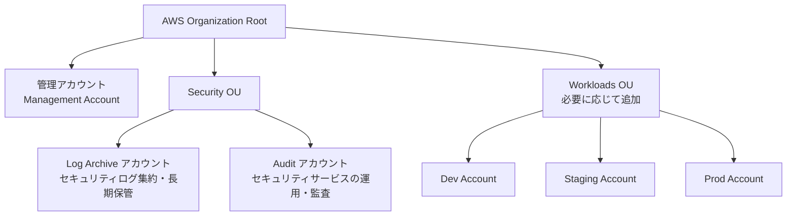
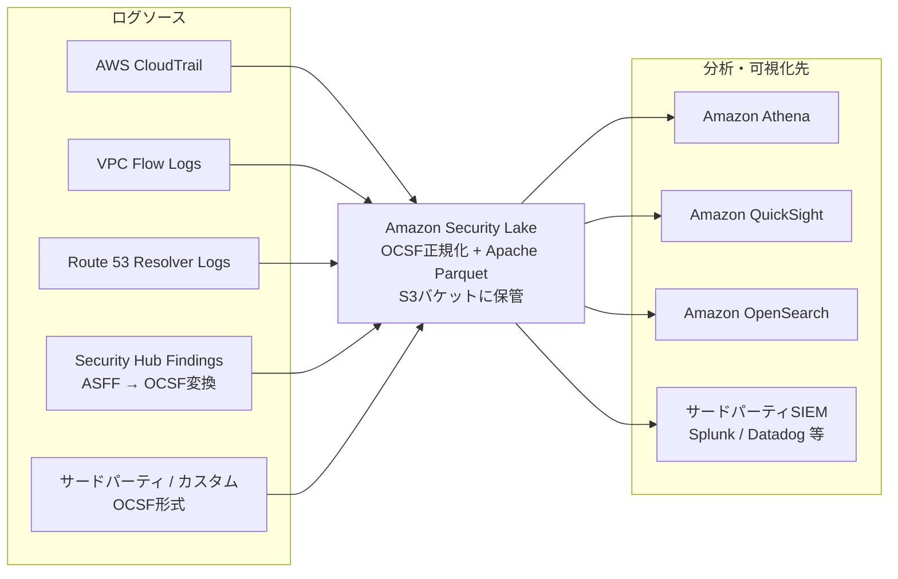

## はじめに

CSIG所属、FutureVulsチームの棚井です。

2026年5月18日に AWS Certified Security - Specialty (SCS-C03) を受験し、823点 / 1000点(合格ライン750点)で一発合格しました。AWS認定試験はこれが初挑戦でしたが、業務でAWSのセキュリティ関連サービスを設定・運用する機会があり、知識の体系化と棚卸しを兼ねて、Foundational/Associate/Professionalを飛ばして、いきなりSpecialtyの「Security」に挑戦しました。

前回の[情報処理安全確保支援士の合格体験記](https://future-architect.github.io/articles/20251110a/)に続く、セキュリティ系資格の合格報告です。受験の後押しとなったのは、同記事でも紹介した部署の資格取得推奨と一部経費負担制度です。

セキュリティの実務経験はあるけれど AWS 認定は初めて、という方や、学習に LLM (Claude等) をどう組み込むか試行錯誤している方に、特に読んでほしい内容です。AWS Certified Security - Specialty の受験を検討している方の参考にもなるはずです。

## 試験の概要

[AWS Certified Security - Specialty (SCS-C03) 試験ガイド](https://d1.awsstatic.com/onedam/marketing-channels/website/aws/ja_JP/certification/approved/pdfs/docs-security-spec/AWS-Certified-Security-Specialty_Exam-Guide-03.pdf)によると、本試験はクラウドソリューションのセキュリティを担う立場の方を対象に、AWSの製品とサービスを保護する知識を検証します。受験対象者として、クラウドソリューションの保護について3〜5年相当の経験が推奨されています。

試験の出題形式と内訳は以下のとおりです。

- 設問形式: 択一選択、複数選択、並べ替え、内容一致
- 設問数: 採点対象 50問 + 採点対象外 15問 = 計65問
- 合格スコア: 100〜1,000の換算スコアで 750(補整スコアリングモデル)

コンテンツ分野と出題比率は、以下のとおりです。

| コンテンツ分野 | 出題比率 |
|---|---|
| 1. 検出 | 16% |
| 2. インシデント対応 | 14% |
| 3. インフラストラクチャのセキュリティ | 18% |
| 4. Identity and Access Management | 20% |
| 5. データ保護 | 18% |
| 6. セキュリティ基盤とガバナンス | 14% |

AWS認定試験の全体像は[AWS認定の公式ページ](https://aws.amazon.com/jp/certification/)を、各分野の詳細なタスク/スキルは前述の試験ガイドを参照してください。

## 学習方法

私の学習は、シンプルに2ステップでした。

1. Claudeとの壁打ちで学習計画を立てる
2. Udemyの演習問題集を1周する

### 1. Claudeとの壁打ちで学習計画

学習はClaudeとの壁打ちから始めました。日々の業務でClaudeを利用しており、私の関心領域や学習傾向はある程度Claudeに把握されています。そのため、以下を相談・依頼するだけで、自分に合った学習計画の素案が出てきました。

- 必要な勉強時間の見積もり
- 参考になるサイトの紹介 (例えば、[SCS-C02からC03への変更点まとめ](https://sal-blog.com/aws-scs-c02toc03/) を教えてもらいました)
- 学習中に出てきた技術的な質問への解説

3点目の「私の関心領域・既知の知識に合わせた解説」が、一番効きました。AWSのサービスを単独で説明されるより、自分が実務で扱ってきた技術やOSSと対比して教えてもらう方が、知らないサービスでも既知の知識にぶら下げて覚えられるので、頭に入る速さが違います。「これは ○○ と同じ役割を担うサービスで、違いはこの点」と差分だけ教えてもらえる学び方は、相手がLLMだからこそ成立すると思います。

### 2. Udemyの演習問題集を1周

主教材は [(C03アップデート済)【全網羅+詳細解説】SCS-C03実践問題 (Security Specialty)290問](https://www.udemy.com/course/aws-scs-practice/)(講師: [syo @Cloud](https://www.udemy.com/user/kanekoriyou-2/))を選びました。Udemyの月額サブスクに登録して利用しています。

具体的に取り組んだのは、以下の2つです。

- 演習問題5 (250問): C03の追加要素 + 演習1〜4からの抜粋(出題順序固定)
- 演習問題6 (40問): 新規ボーナス問題 + 演習1〜4からの抜粋(出題順序固定)

演習問題1〜4は取り組んでいません。これらの内容は演習問題5に含まれている、との説明を見つけたためです。結果として、合計約290問を1周しただけで合格できました。

#### 解説の活用方法

演習問題を解くうえで実践したのは、大きく2つです。

1つ目は、正誤に関わらず解説を全部読むことです。AWS認定試験は「最適な選択肢を選ぶ」形式なので、誤答の選択肢にも学びがあります。むしろ「なぜその選択肢ではダメなのか」を追う方が、サービスの境界や使い分けがはっきりします。正答の解説より誤答の解説の方が情報量が多い、と感じる場面が何度もありました。

2つ目は、テキスト解説とフロー図を往復することです。この教材の最大の魅力は、ほぼ全ての解説にフロー図が付いている点です。たとえば、

- IAMポリシーの評価ロジック (明示的Deny優先: 暗黙のDeny → 明示的Allowで許可 → 明示的Denyが最優先で上書き)
- 侵害が疑われるインスタンスの隔離手順 (削除保護 → ネットワーク疎通遮断 → スナップショット取得)

のように「順序」が問われる論点は、図で頭に入っているかどうかがシナリオ問題の正答率を左右します。私はまずテキスト解説を読んで自分の中で処理順序のイメージを作り、そのあとフロー図で答え合わせをする、という読み方をしていました。こうすると「読んだだけで理解した気になる」状態を防げます。

本番でも、教材で繰り返し見た論点(IAMポリシーの評価ロジック、インシデント対応の手順系)がそのまま問われる感覚で、合格点(750/1000)狙いならこの講座だけで足りました。

## 試験勉強で得た学び

業務であまり触らず、今回しっかり覚え直したポイントを挙げます。

### インシデントの初動調査は「読み取り専用権限」で行う

侵害が疑われる環境を調査するとき、誤操作による証拠破壊を防ぐため、読み取り専用権限のIAMロール/アカウントで初動調査を行うのがベストプラクティスです。

AWS公式の[AWS Security Incident Response User Guide - Prepare access to AWS accounts](https://docs.aws.amazon.com/security-ir/latest/userguide/prepare-access-to-accounts.html)でも、インシデント対応チームには事前に最小権限のアクセスを割り当てておく(provision least privilege access in advance)ことが推奨されています。読み取り専用調査の出発点として代表的なのは、セキュリティ設定メタデータの参照に特化した [`SecurityAudit`](https://docs.aws.amazon.com/aws-managed-policy/latest/reference/SecurityAudit.html) と、全AWSサービスのリソース・基本メタデータを横断的に参照できる [`ViewOnlyAccess`](https://docs.aws.amazon.com/aws-managed-policy/latest/reference/ViewOnlyAccess.html) です。これらを起点に、組織のニーズへ合わせて権限を絞り込みます。試験のためというより普段のロール設計でそのまま使える話で、調査時の操作ミスを権限制御で未然に防ぐ、という観点が一番の学びでした。

### AWS Control Towerの推奨ランディングゾーン構成

[AWS Control Tower](https://docs.aws.amazon.com/controltower/latest/userguide/how-control-tower-works.html)では、Security OU を設けて、その中に Log Archive アカウントと Audit アカウントを分離して持たせる構成が推奨されています([AWS Prescriptive Guidance - Account structure and OUs](https://docs.aws.amazon.com/prescriptive-guidance/latest/designing-control-tower-landing-zone/account-structure.html))。

- Log Archive アカウント: 各アカウントのAPIアクティビティやリソース設定のログを集約するリポジトリ([詳細](https://docs.aws.amazon.com/prescriptive-guidance/latest/security-reference-architecture/log-archive.html))
- Audit アカウント: GuardDuty や Security Hub などのセキュリティサービスを運用・管理し、監査・コンプライアンスチームが各アカウントをレビューするためのアカウント(AWS SRA の Security Tooling アカウントに相当)

運用面では、GuardDuty・Security Hub・AWS Config などの [delegated administrator(委任管理者)](https://docs.aws.amazon.com/organizations/latest/userguide/orgs_integrate_services_list.html) を Audit アカウントに設定し、組織横断のセキュリティ運用をここに集約します。一方で Security Lake は、ログ集約という役割に合わせて、AWS SRA では Log Archive アカウントを委任先として推奨しており、委任先がサービスごとに異なる点に注意が必要です。いずれにせよ、管理アカウントは組織管理だけ、日々のセキュリティ運用は Audit アカウント、と役割がきれいに分かれます。

私がこれまで慣れていたのは「環境ごとに1AWSアカウント」(例: 開発+検証で1、本番で1) の構成でしたが、Control Tower は管理アカウント + 個別アカウントをOU単位で組織化し、ロールではなくアカウント単位で権限を分離します。アカウント単位で責務を分けるという発想は、今まで自分になかった視点でした。

### Service Catalog + CloudFormation + サービスアカウントによる実行環境制御

[AWS Service Catalog](https://docs.aws.amazon.com/servicecatalog/latest/adminguide/introduction.html)で承認済みの[CloudFormationテンプレートをカタログ化](https://docs.aws.amazon.com/servicecatalog/latest/adminguide/getstarted-CFN.html)し、利用者にはサービスアカウント経由でデプロイさせる構成です。Service Catalogには「Constraints」という仕組みがあり、起動先・インスタンスタイプ・付与するIAMロールといったデプロイ方法に制約をかけられます。利用者には承認済みテンプレートだけを触らせ、組織として外したくない部分は Constraints で縛る。承認済みリソースの払い出し口をこう作るのか、と腹落ちしました。

### 侵害インスタンスの「隔離」手順

侵害が疑われるEC2インスタンスの隔離について、教材では以下の順序が原則として示されていました。

1. 削除保護を有効化(誤削除の防止)
2. ネットワークACL / セキュリティグループでネットワーク疎通を遮断
3. EBSのスナップショットを取得(フォレンジック用)

ただし、「隔離(ネットワーク遮断)」と「スナップショット取得」のどちらを先に置くかは、ケースバイケースです。攻撃の継続を即時に断つことを優先するなら、遮断が先になります。[Amazon GuardDuty - 侵害された可能性のあるAmazon EC2インスタンスの修復](https://docs.aws.amazon.com/guardduty/latest/ug/compromised-ec2.html)も、隔離用セキュリティグループの作成(`0.0.0.0/0` を許可しない)→ アタッチ → 他のSGの削除、とネットワーク隔離を最優先します。

一方、揮発性の高い証拠の保全を優先するなら、スナップショットが先です。[AWS Security Incident Response User Guide - Collect relevant artifacts](https://docs.aws.amazon.com/security-ir/latest/userguide/collect-relevant-artifacts.html)が示すフォレンジック観点の順序は「メタデータ取得 → インスタンス保護(削除保護)有効化とタグ付与 → EBSスナップショット → メモリ取得 → (オプション)ライブレスポンス → デコミッション → 隔離」で、隔離は最後に置かれます。なお、[AWS Prescriptive Guidance - Forensics account](https://docs.aws.amazon.com/prescriptive-guidance/latest/security-reference-architecture-cyber-forensics/forensics-account.html)のように、調査対象のスナップショットをフォレンジック専用アカウントへコピーする設計パターンもあります。

正解は状況次第ですが、「インスタンスを保護する」「攻撃を断つ」「証拠を保全する」の3つが論点だと頭に入っていれば、本番のシナリオ問題でも選択肢の優先順位を付けられました。

### データ集約先としてのAmazon Security Lake

[Amazon Security Lake](https://docs.aws.amazon.com/security-lake/latest/userguide/what-is-security-lake.html)は、セキュリティログを[OCSF (Open Cybersecurity Schema Framework)](https://docs.aws.amazon.com/security-lake/latest/userguide/open-cybersecurity-schema-framework.html)形式で正規化し、Apache Parquet形式でS3に集約するデータレイク基盤です。AWS Security Hub (CSPM: Cloud Security Posture Management) との違いは、以下のように整理できます。

- Security Hub: セキュリティ検出結果の集約・優先度付け・ダッシュボード化
- Security Lake: セキュリティ「データ」そのものの集約・長期保管・分析基盤化

片方があればもう片方が不要、という関係ではありません。実際、[Security Hub CSPMのFindings](https://docs.aws.amazon.com/security-lake/latest/userguide/security-hub-findings.html)も ASFF 形式から OCSF 形式に変換した上で Security Lake に取り込めます。サービス連携の全体像は以下のようになります。

SOC対応やSIEM体制を見越したサードパーティ連携については、[Third-party integrations with Security Lake](https://docs.aws.amazon.com/security-lake/latest/userguide/integrations-third-party.html)に多数のソース・サブスクライバーが記載されています。正規化済みのデータが S3 に溜まるので、Splunk や Datadog といった既存の SIEM にそのまま流し込める。SOC を回す側からすると、この一点だけでも Security Lake を置く価値がありそうだと感じました。

## 試験勉強を通しての所感

### 実務経験のあるサービスは圧倒的に有利

業務で実際に設定・運用したことのあるサービスについては、知識を問われても迷うことは少なかったです。

例えば、「稼働中の非暗号化RDSを暗号化する方法」という問いに対して、

> スナップショットを取得し、それを暗号化を有効にしてコピーする。その暗号化済みスナップショットからインスタンスを復元する

という回答は、実際に手を動かしたことがあれば即答できます([Encrypting Amazon RDS resources](https://docs.aws.amazon.com/AmazonRDS/latest/UserGuide/Overview.Encryption.html))。非暗号化インスタンスから暗号化スナップショットは直接作れず、コピー時に暗号化を付与する、という一手間がポイントです。「稼働中のRDSをそのまま暗号化する方法はない」という制約を、机上で覚えるか実務で体感したか、で記憶への定着度が全く違います。

### 業務での「あるあるネタ」も出題される

トラブルシュート系の問題には、業務で一度は遭遇するような「あるある」が散りばめられています。

- Lambda起動時にCloudWatchにログが出力されない → 大抵はLambda実行ロールに AWS管理ポリシー [`AWSLambdaBasicExecutionRole`](https://docs.aws.amazon.com/aws-managed-policy/latest/reference/AWSLambdaBasicExecutionRole.html)(`logs:CreateLogGroup` / `logs:CreateLogStream` / `logs:PutLogEvents` を許可) が付与されていない
- EC2のCloudWatch エージェントが、長時間起動していると途中からログ連携されなくなる → 自分の環境では logrotate との設定齟齬が原因でした
- S3バケットを「特定VPCからのみアクセス可」にしたくて、VPCエンドポイントポリシーに `aws:SourceVpc` 条件を書いてもアクセス制御が効かない → バケット単位で「このVPCからのみ」を表すなら、リソース側=[S3バケットポリシーに `aws:SourceVpc` / `aws:SourceVpce` 条件を書く](https://docs.aws.amazon.com/AmazonS3/latest/userguide/example-bucket-policies-vpc-endpoint.html)のが正解です。VPCエンドポイントポリシーは「そのエンドポイント経由でどのバケットやプリンシパルに到達できるか」を制御するものなので、バケット側のVPC限定はエンドポイントポリシーだけでは表現しきれません
- KMSで暗号化したS3オブジェクトに、Lambdaがアクセスできない → S3バケットの読み取り権限に加えて、Lambda実行ロールに `kms:Decrypt` が効く状態にする必要がある。同一アカウントでキーポリシーがIAMへの委任(Enable IAM policies)を含む既定構成なら、実行ロールのIAMポリシーに `kms:Decrypt` を付与すれば足りる。キーポリシーがプリンシパルを明示列挙する運用や、キー所有者が別アカウントの場合は、キーポリシー側でも実行ロールに `kms:Decrypt` を許可する

これらは、知識として知っていたというより、業務でハマった経験がそのまま回答に直結しました。過去のインシデントメモを引っ張り出しながら解いている感覚で、実務で踏んだ地雷は記録しておくものです。

### 全く知らないサービスはClaudeに都度解説してもらう

一方で、これまで触れる機会がなかったサービスもいくつかありました。私の場合は、以下の3つです。

- [AWS Signer](https://docs.aws.amazon.com/signer/latest/developerguide/Welcome.html): コードやコンテナイメージへのデジタル署名サービス(Sigstore/cosignでの署名検証は実務で扱ってきましたが、AWSマネージドサービスとしてのSignerは触れる機会がありませんでした)
- [AWS Nitro Enclaves](https://docs.aws.amazon.com/enclaves/latest/user/nitro-enclave.html): 機密データ処理用の隔離されたコンピューティング環境
- Amazon CodeGuru Security: コード脆弱性検出サービス(※[2025年11月20日でサポート終了](https://dev.classmethod.jp/articles/amazon-codeguru-security-eos-announcement/)。代替としてAmazon Q Developerのコードレビュー機能などが案内されています)

これらは、教材で遭遇した瞬間にClaudeに解説をお願いしました。CodeGuru SecurityがすでにEOLになっていることも、こうした壁打ちの中で判明しました。

## 試験結果の振り返り

総合スコアは **823点 / 1000点**(合格ライン750点)、**+73点** での合格でした。セクション別の成績は以下のとおりです。

| コンテンツ分野 | 出題比率 | 成績 |
|---|---|---|
| 1. 検出 | 16% | コンピテンシーを満たしている |
| 2. インシデント対応 | 14% | コンピテンシーを満たしている |
| 3. インフラストラクチャのセキュリティ | 18% | コンピテンシーを満たしている |
| 4. Identity and Access Management | 20% | コンピテンシーを満たしている |
| 5. データ保護 | 18% | **改善が必要** |
| 6. セキュリティ基盤とガバナンス | 14% | コンピテンシーを満たしている |

「データ保護」分野が「改善が必要」となりました。正直、ここは詰めが甘かったです。KMSのキーポリシー設計、エンベロープ暗号化、ホスト間でのキー管理、各種データストアでの暗号化オプションと、設定項目の組み合わせが多い分野です。合格はしましたが、継続して勉強が必要です。

## おわりに

振り返ると、効いたのは次の3つでした。

1. 業務でのセキュリティ実務経験(前提となる知識・直感)
2. Claudeとの壁打ち(学習計画、未知のサービスの解説、関心領域への紐付け)
3. Udemyの演習問題集(フロー図付き解説による試験範囲のカバーと処理順序の体得)

なかでも一番大きかったのは1つ目です。実務でハマった経験がそのまま得点になり、LLMと教材は、その土台の穴を埋める役割でした。特別なことはしていません。

AWS認定を1つでも保持していれば、再認定や次回の試験に使える50%割引バウチャーが付与されます。これを使って、次は AWS Certified Advanced Networking - Specialty (ANS-C01) に挑戦する予定です。同じSpecialtyレベルでネットワーク領域を固めて、セキュリティ × ネットワークの両軸でAWSの理解を深めていきます。

受かったら、また書きます。

