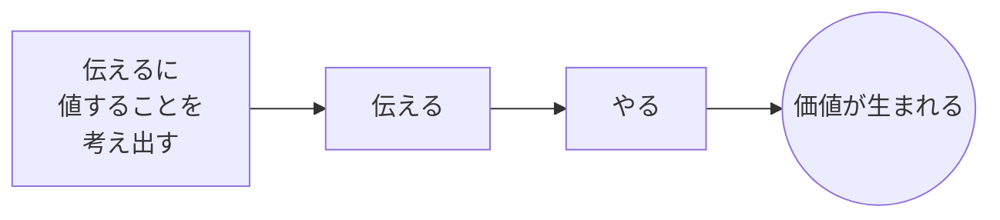
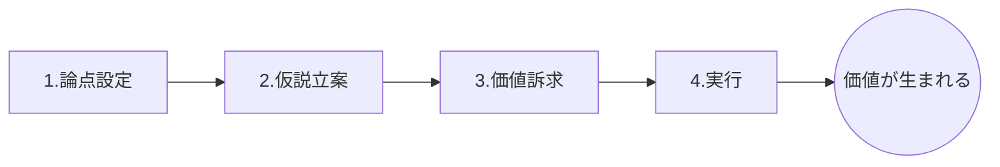

# 1. はじめに

TIG（Technology Innovation Group）の清水です。

以前、OJTを始める方向けに[これだけやろうOJT](/articles/20260423a/)を書きました。

今回は、始めたOJTをどう終わらせるのがよいか、一つの考え方を紹介します。

# 2. OJTをいつ終えるか

OJTはいつ終えると良いのでしょう。詳細設計・開発・内部結合ができたら？それともお客さんに何かを説明できたら終わり？

「**価値を生む流れが身に付いたら、OJTは終わり**」が私の考えです。

価値を生む流れ、とはなんでしょう。以降、説明します。

# 3. 価値を生む流れ

普段、私はこのように仕事をしています。

このままではOJTに適用しにくいので、少し細かくします。こう表現すると、実タスクと紐づけて出来栄えが確認しやすいです。

- **論点設定**: 何を考えるべきか、を文章にする
- **仮説立案**: 自分的ベストを文章にする
- **価値訴求**: 分かりやすく伝え心を動かす
- **実行**: 自ら段取りを考え、やる

こんなにきれいに物事は流れないので、当然ぐるぐるします。一連の流れとしてどう振る舞えば良いかが身に付いてくると、それが仲間にも分かります。OJT終了です。仲間からは「最近、明後日の方向に走らなくなったね」という言葉が出るはずです。

# 4.どんなタスクで出来栄え確認するか

たまたまちょうど良い仕事がない時は、既存タスクの改善をお願いするのも有効です。タスクが生まれた背景・文脈を理解して自分なりの案を考え出し、価値を表現し伝え、やる、という一連の流れを実体験できます。

コツは文章で認識合わせすることです。文章にすると、理解度・思考の深さを他者が評価しやすいです。確認する時は、例えば価値訴求の作成物単品に着目するのではなく、「これがどうやって価値につながると考えたのか」という**価値とのつながり**を説明してもらい、思考過程の確認とフィードバックに重点をおくと、他の仕事でも応用しやすいです。

出来栄え確認は、減点法でやるとお互い病んでしまうので、価値につながる行動ができたか、その**打率が上がってきたか**に着目すると前向きになれます。

# 5. 苦しみポイント

論点設定、仮説立案に苦しむケースが多いでしょう。真野さんの[「これ何のためにやってるんだっけ？」と言われないために。](https://future-architect.github.io/articles/20251015a/)の記事でも同じことが語られ、参考書籍も紹介されています。[前回記事](https://future-architect.github.io/articles/20260423a/)では「嬉しさ分析」という単語で説明していますが、打席数を増やすことで改善できます。[テクニカルライティングガイドライン](https://future-architect.github.io/arch-guidelines/documents/forTechnicalWriting/technical_writing_guidelines.html)内では、「メッセージ設計」という単語で触れられています。

「そういう練習」を積んでいる人は多くないので、最初は出来なくて当然です。沢山・**細かく**失敗して、身につけましょう。それではお決まりというかなんというか、私自身の失敗談をどうぞ。

::: note warn
残念なケース　（基盤の話で書いていますが、残念さの構造はアプリでも同じです）

社会人6年目の時の私の話です。ActiveDirectoryサーバの構成確定に詰まり、2日半を溶かしました。基盤屋として商用UNIX構築をしていた私の、初Windows構築でした。64コアの物理サーバを冗長化する必要があり、前提となるActiveDirectoryのサーバ構成立案中でした。マルチホーム時のWindows管理パケットの流れを理解し、障害時の復旧方法確立と合わせての構成確定が必要で、複数構成で実験しながら挙動を確かめていました。ところが試すたびに異なる挙動を示します。私に見えていない要素があるからなのですがその時は分かりません。とにかく気合充分な私は睡眠を削り調査探索実験に没頭していました。3日目に先輩から電話が来て、報告したら「そんなに時間をかけてそれしか試していないの？」とがっかりされました。

「でも、俺はやれる範囲でやっていたもん！」
高井戸の5階建ビルの屋上で、タバコを吸いながらイライラしていました。
今は分かります。先輩が見たかったのは、詰まったら別のアプローチでプロジェクト全体を前に進める私の姿でした。でもその時の私は、挙動理解と構成確定を自分でやり切ることだけを考えていました。

この残念なケースはこう表現できます。

私がやらなかったこと
**・論点を共有しなかった＝そもそも何を考えるべきか、を先輩と話さなかった。**
**・仮説を共有しなかった＝自分の見立て、を先輩と話さなかった。**
・もしかしたら失敗するかも、を真剣に考えなかった。
・自分の見込みが外れた時点で、助けてと言わなかった。

私がやったこと
**・プロジェクト全体の成功よりも、自分にできるはずだ（できてほしい）を優先した。**
・別戦線（商用UNIX）の経験から、新しい戦線（Windows）でもやれると過信した。
・楽観見立てと好奇心で、実験をどんどん進めた。また悪いことにこれが楽しい。
・体力気力の限界に挑戦した。
・紙巻タバコを一杯吸った。

:::

つまり、社会人6年目だった私に出来なかったことを、OJTでやろうね、と言っています。あーなんてことだ。

でもより正確に表現すれば、同じ轍を踏まないようOJTで練習できるのでは？ が本当の意図です。2年前に「価値を生む流れを身につける」をOJTに導入して、有効性は実証済みなのでした。えっへん。

## 本当はどうすると良かったか、細かく考えたい方向け（長いです）

本ケースの“正解“をどこまで書くか迷ったのですが、細かく考えたい方向けに以下記載します。
特に難しいこの部分を書きます。

- 【論点設定】 何を考えるべきか、を文章にする
- 【仮説立案】 自分的ベストを文章にする

### ✅ うまく行くパターン

| | 内容 |
|---|---|
| **論点** | 仕様満足・予定通りの納品のために、自分にできることは何か **を考える** |
| **仮説** | この活動計画で、期日通りに納品できる**と私は考える**。この部分の活動が現戦力で対応しきれないと分かった場合は計画をこう切り替え、仕様と納期を守る。 |

### ❌ うまく行かないパターン。6年目の私の例

| | 内容 |
|---|---|
| **論点** | 構成確定のため、Windows管理情報パケットの伝達挙動はどう明らかにできるか **を考える** |
| **仮説** | この5パターンを試行すれば、Windows管理情報パケットの伝達挙動が把握できる**と私は考える**。|

うまく行かないパターンでは、**思考範囲が著しく狭い**です。

問いが小さいと勝てそうにない、が分かりますよね。うまく行くパターンに書かれている「活動計画」立案には、沢山の知識と「別の視点」が必要そう、も予想できます。ちなみにこの「論点」だけなら、30秒もあれば書いて、先輩に飛ばせますよね？ **それが何よりも大事です**。

今回の例では、うまく行くパターンに書いてある「活動計画」が肝ですが、多くのケースで活動計画は肝です。そして「活動計画立案」で大きく成長できます。慣れないうちは個々の設計も不明で、並走する複数の活動の関係性も読み解けません。膨大な不明点が山脈となり、目的地も分からず呆然とするでしょう。どうするか。

- **はじめは「とにかく妄想で」組み立てます。**
緩い段階で、確実な情報もない状態で
とにかく進め方を考え文章にして
- **とにかくさっさと先輩と話す。**
どうせ間違っているので、とにかくさっさと話すことです。
どう考えたかも話す。
こりゃあだいぶん遠そうだぞ、はお互い気がつくので
- **そういう時は先輩が自分の頭の中をフルオープンして例を示す。**
論点・仮説はそれぞれ何か。既知と未知は何か。
何が容易で難所はどこか。なぜそう思うか。
先輩的ベストプランは何か。なぜか。
- **そして次は、新人さん自身が違うケースで考えて先輩と話す。**
考える範囲を縮めたり、深さを変えたり。

最初から新人さんがやるには、複雑すぎるケースもあります。その場合はまず、先輩が見本を見せるのが良いです。このサイクルをくるくるやっていると「何が確かか分からない状態でどう進めるのが良さそうか」が身に付いてきます。活動計画を考える時、論点と仮説の組み合わせが階層構造を成すことにも気がつくはずです。さらに奥行きを持った多層構造にもなっていきます。

活動計画立案は、無限にも思える未来の組み合わせの中から、最も確からしいと思われる道筋を選び取って表現していくことです。たくさんある未来の中からどれを選択するか。ここで頼りになるのは「あの人はどうなったら嬉しいのだろう」を考えることです。これは[前回記事](https://future-architect.github.io/articles/20260423a/)に書きました。

::: note info
「要するに活動計画を自分で立てろということか？」
→非常に近いです。有り体に言えば「全体をうまく行かせろ」です。

活動計画を立てる時、技術的な論拠が必要です。工程表を組むとき、期間の確からしさが必要です。経済合理性がなければ前進は難しいです。「このやり方でならば、価値あるこれを現実世界に誕生させられる」こそが「伝えるに値すること」です。そこに実現可能性がなくては何の意味もありません。仕事は技術力と合わせて、意思決定含めた全体をデザインし形にする複合的な力が必要、という全体感がイメージできるのではないでしょうか。部分ではなく**相互に影響し合う物事同士の関係性を理解する**ことが求められている、と言えるかもしれません。

ちなみに活動計画立案時、「それもうまくいかない時、次の戦い方は？」を視野に入れることが重要です。本ケースならば、遅延濃厚の場合は仮機材を一旦搬入し、後続のお客様作業期間を増やしつつ、課題解消後に本機材を納品し全体として辻褄を合わせる、が次の手でしょうか。

今回のケースでは、設計実装が走り出してからのことを書きました。しかし当然、どの工程でも同じ事象は発生し得ます。「提案依頼を受けて」「提案“書“を期日までに出す」に視野狭窄してしまう不幸は代表例です。その提案“内容“は、本当の本当に価値につながっているのか？それは具体誰の幸せか？という問いで、残念な活動になっていないかを炙り出せます。

:::

技術調査・設計実装・顧客説明・計画立案と様々なタスクがあり、時に人は迷子になります。技術で言えば基盤とアプリは全然別物です。業界により常識も違う。お客さん対応も状況により全く違う。だとしても根本的な、どの条件が変わっても同じように必要な力がある。それをOJTで意識して練習したらどうか、がこの記事の主題です。

実務上で新人さんが担うタスクは、この考え方を導入しても変わらないはずです。変わるのはそのタスクの捉え方です。どういう文脈の上に生じているものか。そのタスクは誰の嬉しさにどう繋がるのか。自分のこのタスクの「本当の意味」とは何か。その理解度が変わり、世界との向き合い方が変わる入口になると私は考えています。誰かが言うことをそのまま受け入れるのでなく、自分なりに良し悪しを判断する力を養う活動。それこそ、教育される課程を終え自ら現実社会で踠くことを選択した後輩に、先輩が手渡せるものではないでしょうか。

# 6. まとめ

OJTは　 **論点設定　→  仮説立案　→  価値訴求　→  実行**

という価値を生む一連の流れが身に付いたら終わり、という話を書きました。

この活動で、新人さんの強み・弱みが理解できます。この人はこういうやり方で価値創出に貢献できる、という一文が自然と出来上がります。次のプロジェクトに送り出すのは少し先かもしれませんが、その日のことを考えながら仕事をするのは、楽しいですよね。

強み・弱みをもっと理解したい方、仕事に必要な力を深く考えたい方は[ソフトスキルガイドライン](https://future-architect.github.io/arch-guidelines/documents/forSoftSkill/softskill_guidelines.html)をご覧ください。詳しく記載されており、考えを進める助けになってくれます。特に状況把握力、作戦力の項は必見です。
