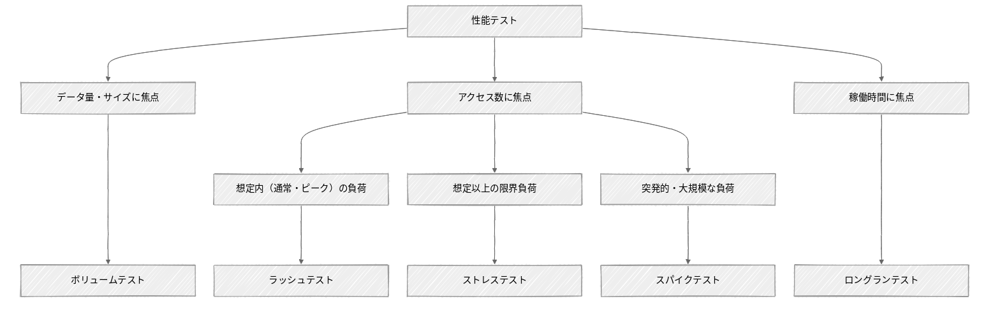

# はじめに

TIG（Technology Innovation Group）の武田です。

はじめての性能テストという性能テストの入門ガイドラインを作成し、公開しました。
<https://future-architect.github.io/arch-guidelines/documents/forPerformanceTest/performance_test.html>

本ガイドラインは、性能テストの計画から実行、分析に至るまでの実践的なプロセスを一通りまとめたものとなります。次のような方を主な読み手として想定しています。

- 性能テストの経験がなく、何から手をつければよいかわからない方
- これまでなんとなく性能テストを実施してきたが、考え方を体系的に整理したい方

# ガイドライン作成のモチベーション

まずはじめに、性能テストは難しいです。私が難しいと考える理由は次の3点です。

- **技術的な視野の広さ**
  フロントエンドから、バックエンドアプリケーション、ミドルウェア、データベース、そしてインフラまで、システムの全体を捉えて性能を見ていく必要があります。性能目標を達成できないときに、どこにボトルネックがあるのか「あたり」をつけ、クイックに原因特定から改善まで進めるには、特定の技術領域に偏らない幅広い知識と視野が欠かせません。

- **業務ドメインの理解**
  テストシナリオやデータパターンは、技術だけで決められるものではありません。対象システムがどのように使われ、いつアクセスが集中するのかといった、ビジネスコンテキストを理解したうえで初めて定義できるものです。

- **多くの関係者の調整**
  性能テストは巻き込むべき関係者が多くなります。アプリケーションやインフラの開発者はもちろん、目標値や完了基準を合意するビジネスサイドの方々、テスト環境やクラウドの利用申請に関わる方々など、多くの人を巻き込みながら調整を進めるコミュニケーションが求められます。

こうした難しさゆえに、性能テストを計画段階からリードできる人は、どうしても一部のベテラン勢に限られてしまいがちです。経験則や暗黙知に支えられている部分も大きく、性能テストの経験が浅い若手やミドル層がリードするにはハードルが高いのが現状でした。

本ガイドラインは、こうした状況を少しでも変えたいという思いから作成しました。
性能テストの考え方や進め方を体系化することで、性能テスト未経験のエンジニアでも、計画からレポーティングまでを自信を持って推進できるようになることを目指しています。

# ガイドラインのポイント紹介

全体としては、まず性能テストの前提となる知識（分類や性能指標などの考え方）を説明したうえで、**計画 → 準備 → 実行 → チューニング → レポーティング**という一連のステップに分けて論点や進め方を解説する構成になっています。

ここでは、その中でも特に重要なポイントをいくつか紹介します。

## 性能テストの分類

性能テストという言葉は解釈の揺れが大きく、負荷テストと同義に使われることもあれば、別物として区別されることもあります。本ガイドラインでは、性能に関するあらゆるテストを包括する概念として「性能テスト」を捉えたうえで、実施条件と目的に応じて5つに分類しています。

## 性能目標の定め方

性能テストの大前提として性能要件をどう定めるかという点が重要です。本ガイドラインでは「スループット」「処理時間」「リソース使用率」のそれぞれについて、目標値の決め方を手厚く扱いました。

例えば処理時間については、目標値を平均値や最大値ではなくパーセンタイル値（例. 95パーセンタイルで500ms以内）として定義する理由を説明しています。あわせて、既存システムをベースラインとするアプローチや、TTFBのような業界標準の指標、IPAの非機能要求グレードを参考にした目標値の設定例まで、現場でそのまま使える形に落とし込んでいます。

## 性能テストの段取り

複数の種別をやみくもに実施するのではなく、ボリュームテスト → ラッシュテスト → ロングランテスト → ストレステストと観点を段階的に広げていく進め方を推奨しています。

テストの観点を「データ量」から「データ量 × 同時アクセス数」、そして「データ量 × 同時アクセス数 × 継続稼働時間」へと段階的に変化させていくことで、効率よくテストを積み上げられます。各テストには目的に対応した完了基準を定めており、「どうなったら次に進んでよいのか」がわかるようにしています。

## テストツールの選定

負荷ツールやモニタリングツールの選び方も解説しています。負荷ツールについては、JMeter・k6・Gatling・Vegeta・AWS Distributed Load Testingといった代表的なツールを記述方法・実行効率・分散構成対応・習熟コストなどの観点で比較しました。

そのうえで、本ガイドラインでは **k6** を推奨しています。テストをJavaScriptのコードとして書けるためバージョン管理やCI/CD連携と相性がよく、Go言語製で負荷生成の効率が高いことが主な理由です。

|                | JMeter                                              | k6                                                                 | Gatling                                                          | Vegeta                                                                 | AWS DLT                                                              |
| :------------- | :-------------------------------------------------- | :----------------------------------------------------------------- | :--------------------------------------------------------------- | :--------------------------------------------------------------------- | :------------------------------------------------------------------- |
| 説明           | Java製OSS負荷テストツール \- 多機能で利用実績も多い | Go製OSS負荷テストツール \- 省リソース、JSで記述しCI/CD統合に優れる | Scala製OSS負荷テストツール \- コードで記述、HTMLレポートがリッチ | Go製OSS CLI負荷テストツール\- HTTP特化、シンプルで手軽だが機能は限定的 | AWSの分散負荷テストサービス \- AWS上で大規模・サーバレス実行を自動化 |
| 記述方法       | XML （GUIで生成）                                   | JavaScript                                                         | Scala/Java/JavaScriptなど                                        | 設定ファイル/CLI引数                                                   | JMeter/k6/Locustに対応                                               |
| GUI            | あり                                                | なし                                                               | なし                                                             | なし                                                                   | あり                                                                 |
| プロトコル     | ✅️ HTTP/SOAP/JDBCなど多数（拡張可）                 | ⚠️ HTTP/WebSocket/gRPCなど（拡張可）                               | ⚠️HTTP/WebSocket/gRPCなど（拡張可）                              | ❌️ HTTP特化                                                            | ✅️ 多くのプロトコルに対応                                            |
| 実行効率       | ⚠️ 低（OSスレッドベース）                           | ✅️ 高                                                              | ✅️ 高                                                            | ✅️ 高                                                                  | ✅️高                                                                 |
| シナリオ準備   | ✅️ GUI記録機能あり、直感的                          | ✅️ コード記述、har-to-k6等あり                                     | ✅️ コード記述、レコーダーあり                                    | ✅️ 非常にシンプルな設定                                                | ✅️ JMeter・k6・Locustに対応                                          |
| 環境準備       | ⚠️ Javaインストール・設定必要                       | ✅️ 単一バイナリ配置のみ                                            | ⚠️ Java/Scala環境設定必要                                        | ✅️ 単一バイナリ配置のみ                                                | ⚠️ 環境のデプロイが必要                                              |
| 分散構成対応   | ✅️ コントローラ/ワーカー方式                        | ❌️ 手動での分散実行（k8s operatorあり）                            | ❌️ 手動での分散実行                                              | ❌️ 手動での分散実行                                                    | ✅️AWS Fargate                                                        |
| レポート       | ✅️ GUI表示、HTMLレポート、CSV/XML/JTL出力           | ✅️ 標準出力、JSON出力、CloudWatch連携                              | ✅️ HTMLレポート自動生成                                          | ⚠️ 標準出力、CSV/JSON出力                                              | ✅️コンソール表示、CloudWatch連携                                     |
| 商用サービス   | ✅️ あり                                             | ✅️ あり（k6 Cloud）                                                | ✅️ あり（Gatling Enterprise）                                    | ❌️ なし                                                                | ✅️                                                                   |
| 習熟コスト     | ⚠️ 独自GUIが複雑                                    | ✅️ シンプルで容易                                                  | ⚠️ 独自DLSが複雑                                                 | ✅️ シンプルで容易                                                      | ⚠️ AWSインフラ知識が必要                                             |
| GitHubスター数 | 9.1k                                                | 29.4k                                                              | 6.8k                                                             | 24.7k                                                                  | \-                                                                   |

## チューニングポイント

テスト実行中に特定したボトルネックをどう解消していくか、代表的なチューニング観点を「アプリケーションサーバ / ランタイム」「アプリケーションロジック」「DBサーバ」「DBスキーマ / DBクエリ」の各レイヤに分けて紹介しています。スケーリングやコネクションプール、SQLの実行計画やインデックスの最適化など、現場でよくあるポイントを一通り網羅しています。

## レポーティング

最後に、テストの結果をどう評価・報告するかをまとめています。種別（ボリューム / ラッシュ / ロングラン / ストレス）ごとに、性能指標・リソース使用状況・エラー内訳・最適なインフラ構成の検討結果といった、レポートに含めるべき観点を整理しました。性能テストは「測って終わり」ではなく、本番運用に耐えられること、そして残存リスクまでを説明できて初めて完了します。

このほかAPPENDIXとして、Core Web Vitalsを軸とした画面（フロントエンド）の性能テストや、計画時・実施後に使えるチェックリストも用意しています。

# おわりに

性能テストは「とりあえず負荷をかけて終わり」ではなく、目的を定め、合否を判断し、ボトルネックを潰しながら本番運用に耐えられることを示していく一連のプロセスです。本ガイドラインが、性能テストにこれから取り組む方や、自分たちの進め方を見直したい方にとっての一助となれば幸いです。

ガイドラインはGitHubの [future-architect/arch-guidelines](https://github.com/future-architect/arch-guidelines) で公開しており、Issueやプルリクエストでのフィードバックも歓迎しています。
