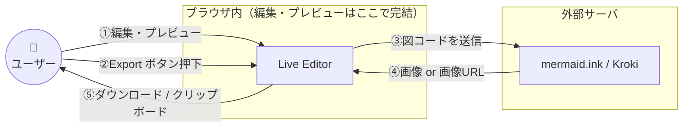

# はじめに

TIG（Technology Innovation Group）の真野です。

Mermaid.js で図を書こうと [Mermaid Live Editor](https://mermaid.live/) を開いたはいいものの、思いの外色々なボタンがあって機能を使いこなせない！と感じている人も多いのではないでしょうか。

そんな人に役立つかもしれない知識を、Tipsという形で9つまとめました。

## Mermaid.js とは？

[Mermaid.js](https://mermaid.js.org/) はテキスト DSL から SVG で図を描画する JavaScript ライブラリです。2014年公開時点ではフローチャートとシーケンス図の2種類しかありませんでした。今ではフローチャート、シーケンス図、ER 図など、v11 時点で30種類近いダイアグラムに対応しています（[ちなみに名前は『リトル・マーメイド』から取った](https://github.com/mermaid-js/mermaid/issues/1904#issuecomment-787065874)そうです）。

2022年2月に [GitHub が Markdown の Mermaid ネイティブサポート](https://github.blog/developer-skills/github/include-diagrams-markdown-files-mermaid/) を発表してから一気に広まった印象があり、現在は GitHub・GitLab・Notion などが標準対応しています。クライアントサイド JS 単独で動く身軽さと相まって、Diagrams as Code の中心的存在です。

同じく「図をテキストで書く」系としては [PlantUML](https://plantuml.com/) が先行しています。PlantUML は Java ベースで開発されていて、配置図・タイミング図・ユースケース図など UML 記号の網羅性が高いのが特徴です。ただしレンダリングにサーバサイド環境を要する分、GitHub や社内 Wiki にそのまま貼って読ませる気軽さは Mermaid の方がある、という棲み分けかなと思います。フューチャーでも過去に [PlantUML 用のカラーテーマ（toy / vibrant / mars）を自作して公式テーマに採用された](https://future-architect.github.io/articles/20211108a/) 経緯があり、社内では Mermaid.js も PlantUML もよく使われています。

## Mermaid Live Editor とは？

[Mermaid Live Editor](https://mermaid.live/) は、Mermaid コードを書くとリアルタイムでプレビューしてくれる公式ブラウザ IDE です。ログイン不要で、開けばすぐ使えます。

画面構成は以下のとおり。

- 左ペイン：エディタ（`Code` / `Config` / `History` の3タブ）
- 右ペイン：プレビュー（`Diagram` / `Actions` タブ）
- 図のコードは URL に埋め込まれるため、URL を共有すれば同じ図が他人の環境で開ける

裏側は VS Code と同じ [Monaco Editor](https://microsoft.github.io/monaco-editor/) ベースで、`Config` タブは独立した Monaco インスタンスです。これが後述するショートカット系Tipsに効いてきます。

# エディタを効率化する

## 1. VS Code のショートカットがそのまま使える

Live Editor のエディタは VS Code と同じ [Monaco Editor](https://microsoft.github.io/monaco-editor/) ベースなので、VS Code の感覚で使えるショートカットがそのまま効きます。個人的にヘビロテしているのは次の3つです。

| ショートカット | 動作 |
|---|---|
| `Ctrl + Alt + ↑/↓`（macOS は `Cmd + Alt + ↑/↓`） | マルチカーソル編集（縦方向に行追加） |
| `Shift + Alt + →/←` | 括弧 (`[]` / `()` / `{}`) 内のラベルを一気に選択 |
| `Ctrl + F` / `Cmd + F` | 正規表現対応の検索・置換 |

ガントチャートで全タスクの期間を後ろ倒しにしたい時や、シーケンス図で参加者名を一括リネームしたい時にマルチカーソルが効きます。クラス図の属性名リファクタでは、正規表現置換（例：`private string (\w+)Name` → `private string $1_name`）が刺さります。「マウスに手を伸ばさない編集」が図面の編集にもそのまま効くのは、地味ですが効果が大きいです。

## 2. Config タブでスタイルを本体コードから隔離する

Live Editor の左ペイン `Config` タブに JSON を書くと、[`theme` / `themeVariables`](https://mermaid.js.org/config/theming.html) といったスタイル設定を、コード本体の [frontmatter](https://mermaid.js.org/config/configuration.html#frontmatter-config) とは分離してプレビューに反映できます。

```json
{
  "theme": "forest",
  "themeVariables": {
    "primaryColor": "#ffefd5"
  }
}
```

コード本体はこのままの素の状態で動きます。

````c
flowchart LR
  A[開始] --> B[処理] --> C[終了]
````

frontmatter に `config:` を書くのと見た目の結果は同じです。

- コード本体と一緒に持ち回りたい → frontmatter に書く。移植性が高まる
- Live Editor 内だけで良い → Config タブに書く。コード本体をスリムに見せることができる

ちなみに、`config` を変更してもURLは反映されるので、単にMermaid Live Editorで閉じてやり取りする場合はどちらを使っても大差ないです。こだわりがなければ、私は移植性が高いfrontmatter記述が良いと思いますが、どうでしょうか？

## 3. 時計アイコンで履歴パネルを開きスナップショット保存

画面上部の GitHub アイコンの隣にある白黒の🕓️アイコンをクリックすると、履歴パネルが開きます。`Save Current State` を押すと現在の編集状態がスナップショットとして残り、後から一覧から選んで戻せます。

大きな編集をするときは、`Save Current State` でスナップショットを残すか、Live Editor を別タブで開いてそちらで試すのがお勧めです。元タブの URL（`#pako:...`）にその時点のコードが保持されているので、別タブの試行が失敗しても元タブに戻ればすぐやり直せます。`Save Current State` の保存先はブラウザの `localStorage` なので、別PC・別ブラウザには引き継がれない点には注意です。

同じ履歴パネルに `Save diagram` ボタンもありますが、こちらは Mermaid Chart のクラウドに保存するもので、[Mermaid Chart](https://www.mermaidchart.com/) アカウントへのログインが必要です。長期保管したいバージョンや環境を跨いで残したいバージョンは、ログインの上 `Save diagram` を使うか、GitHub 等の外部リポジトリで別途管理する運用になります。

# 見た目を整える

## 4. ダークモードでの見え方を気軽に確認する

Live Editor のプレビューエリア右下（白塗りの☀マーク / 🌜️マーク）には、背景をライト/ダークに切り替えるアイコンがあります。

Tip 2 のように `themeVariables` で独自スタイルを当てた時は、両モードで確認するクセをつけておくのが安全です。ライトモードでは視認性が良くなったが、ダークモードでは文字が読みにくいといったことも多いためです。特に技術ブログなど、外部公開系はどちらでも読めるようにしておくと、読者に優しいです。

## 5. スクラッチモードを Live Editor の外でも使う

Live Editor のプレビューエリアの下部に、図を手書き風に描画してくれる `Sketch` モードの切替ボタン（✏️のようなボタン）があります。手書き風の方が頭に入りやすい気がするので、よく使いたくなります。

ただし Live Editor 上で `Sketch` を有効にしただけでは、コードを他ツールに貼り付けても手書き風は再現されません。`Sketch` はプレビュー側の描画オプションとして効いているだけで、コード本体には何も書き込まれないためです。

GitHub / Qiita / 自社サイトなどで同じ見た目を再現したい場合は、frontmatter の `config.look` に `handDrawn` を明示します。


```c
---
config:
  look: handDrawn
---
flowchart LR
  A[開始] --> B[処理] --> C[終了]
```

[`look: handDrawn`](https://mermaid.js.org/intro/syntax-reference.html#selecting-diagram-looks) は Mermaid v11 でサポートされた設定で、[Rough.js](https://roughjs.com/) ベースの揺れた線で図が描画されます。Live Editor の `Sketch` ボタンをオンにした時と同じ見た目が、コードブロックを貼り付けた先でも再現されるようになります。

# 共有・公開のTips

## 6. 実は読み取り専用ビューを作れる

Live Editor の共有URLには、実は2種類あります。

- `https://mermaid.live/edit#pako:...`：エディタUI付きで開く（デフォルト）
- `https://mermaid.live/view#pako:...`：プレビューだけの読み取り専用ビュー

`#pako:...` 部分のハッシュは同一なので、URL のパスを `edit` / `view` で書き換えるだけで切り替わります。`edit` はエディタUI付きで編集可能、`view` は読み取り専用でレンダリング済みの図だけが表示されます。

`Share` ボタンから取得できるのは `edit` 系 URL のみで、`view` URL は UI 上には出てきません。コピーした URL のパス部分を手動で `view` に書き換える必要があります。

## 7. URL ハッシュの正体は pako + URL-safe base64

共有URLの `#pako:...` の正体を追っておきます。Live Editor の[serde.ts](https://github.com/mermaid-js/mermaid-live-editor/blob/develop/src/lib/util/serde.ts) を読むと、以下の処理が行われています。

1. 図のコードと設定を JSON 化
2. [pako](https://github.com/nodeca/pako) で deflate 圧縮（level 9）
3. URL-safe base64 化（`+` → `-`、`/` → `_`）
4. 先頭に `pako:` プレフィックスを付ける

これが分かると、Live Editor の UI を使わずに共有URLをプログラム生成できます。Python なら標準ライブラリだけで書けます。

```python
import base64
import json
import zlib

state = {
    "code": "flowchart LR\n  A[開始] --> B[処理] --> C[終了]",
    "mermaid": '{"theme": "default"}',
    "autoSync": True,
    "updateDiagram": True,
}
compressed = zlib.compress(json.dumps(state).encode(), 9)
encoded = base64.urlsafe_b64encode(compressed).decode().rstrip("=")
print(f"https://mermaid.live/view#pako:{encoded}")
```

社内ツールで CSV → 図 → Live Editor URL という一括変換パイプラインを組もうと思えば組めそうです。pakoってなんだろう思ってましたが、ライブラリ名だったとは。

# Sample Diagrams を覗く

## 8. Sample Diagrams にある ZenUML とは？

Live Editor 上部の `Sample Diagrams` ドロップダウンを開くと、フローチャートやシーケンス図などに並んで `ZenUML` という見慣れない選択肢が入っています。個人的に以前から気になっていたので、この機会に中身を覗いてみました。

[ZenUML](https://zenuml.com/) は Mermaid v10 から統合されたシーケンス図専用の別 DSL で、標準の [`sequenceDiagram`](https://mermaid.js.org/syntax/sequenceDiagram.html) と並ぶ選択肢として Live Editor に同梱されています（[公式ドキュメントの ZenUML ページ](https://mermaid.js.org/syntax/zenuml.html)）。コードの1行目を `zenuml` にするだけで切り替わります。

標準 `sequenceDiagram`：

```text
sequenceDiagram
  Client->>API: POST /order
  API->>DB: INSERT order
  DB-->>API: ok
  alt stock > 0
    API->>Queue: publish
    API-->>Client: 201 Created
  else
    API-->>Client: 409 Conflict
  end
```

ZenUML：

```text
zenuml
  title 注文フロー
  Client->API.createOrder() {
    API->DB.insert()
    if (stock > 0) {
      API->Queue.publish()
      return 201
    } else {
      return 409
    }
  }
```

標準のシーケンス図が素直に上から下へ流れる記法なのに対し、ZenUML は Java / C# の関数呼び出しに近い中括弧ベースで、条件分岐・並列処理のネストが中に折り畳まれる形になります。`alt ... else ... end` で縦に伸びていく標準記法より、深いネストの構造が把握しやすい気がします。`while` / `par` / `try-catch`、`@Async` / `@Starter` などのアノテーションもあって、非同期フローの表現力でも ZenUML が優位です。

ただし現時点では大きな落とし穴があります。（※2026年5月時点）手元で試した限り、GitHub Markdown も Qiita も ZenUML コードブロックを描画できませんでした（各プラットフォームが内蔵する Mermaid レンダラーが ZenUML 統合のバージョンにまだ追いついていないのが原因のようです）。Mermaid 最大の旨味である「コードブロックをそのまま貼って読ませる」気軽さが失われるので、現時点では ZenUML の採用は見送り、標準の `sequenceDiagram` を使うのが無難、というのが実際に試してみての結論です。

# セキュアに使う

## 9. Actions タブの Export 系ボタンは外部サービスに図コードを送信している

`Actions` タブには `Copy Image` / `PNG` / `SVG` / `PDF` / `Copy Markdown` といった便利なボタンが並んでいます。Mermaid にネイティブ対応していない社内 Wiki やメール本文に図を貼りたい時に刺さる機能ですが、実際には Live Editor 本体ではなく外部サービスの [mermaid.ink](https://mermaid.ink/) や [Kroki](https://kroki.io/) にコードを送信してサーバサイドでレンダリングしています。



プレビューしているだけならブラウザ内で完結していますが、Export ボタンを押した瞬間にコードが外に出る、という構造です。`Copy Markdown` はクリップボードに以下のような形を返してくれます。画像 URL をクリックすると Live Editor の編集画面に戻れる気の利いた作りで、Mermaid 非対応の Wiki・メールに貼るぶんには便利です。

```markdown
[](https://mermaid.live/edit#pako:eNp...)
```

便利な反面、社外秘の情報を扱うなど固くしたい場合は、これらのボタンを押さないといったチーム方針も考えられます。逆に技術ブログなど最初から公開前提の図であれば、mermaid.ink の URL にクエリパラメータを足して画像フォーマットや解像度を調整することもできます。パラメータの詳細は [mermaid.ink の README](https://github.com/jihchi/mermaid.ink) を参照してください。

完全に閉じた環境で図を画像化したい場合は、CLI の `mmdc`（[mermaid-cli](https://github.com/mermaid-js/mermaid-cli)）をローカルで回すのが現実的です。

おまけで、[Mermaid Chart](https://www.mermaidchart.com/) アカウント（無料）でログインすると、シンタックスエラー時にプレビューエリアに `Fix with AI` ボタンが表示され、LLM に修正案を返してもらえる機能も使えます。GeminiやClaudeなどに直してもらう人が多いと思いますので、利用したいモチベーションは低いかと思いますが、これも Mermaid Chart の LLM 基盤にコードを送信する仕組みです。そのため、Export 系と同じく社外秘の図では使わない方針が固いでしょう。

# おわりに

毎日のように開いている Live Editor ですが、改めて整理してみると意外と触れていない機能がまだまだある、というのが書き終えての率直な感想です。

特に外部データ送信については、よく考えればその通りなのですが、きちんと考えたことはなかったので調べる過程で勉強になりました。
