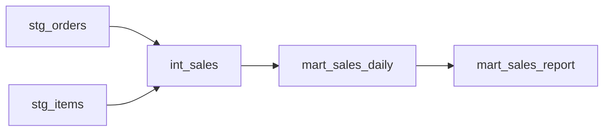
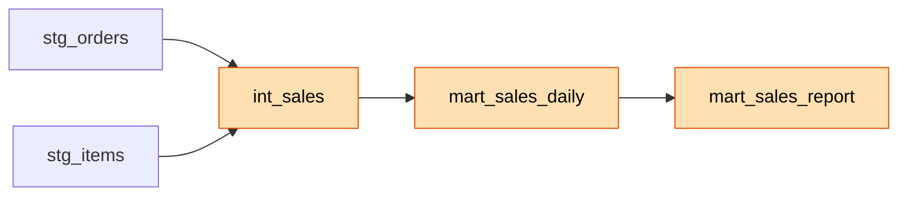
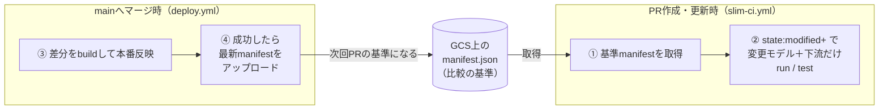

# 1. はじめに

こんにちは。製造エネルギーグループの片岡久人です。

[データエンジニアリング技術連載](/articles/20260630a/)の一環として、dbt の CI を効率化する **Slim CI** を、**dbt Core + BigQuery + GitHub Actions + Google Cloud Storage（以下 GCS）** の構成で、**どうやって実現するのか**を解説します。

dbt でデータ基盤を育てていくと、ある時期から「CI が遅い」「BigQuery のコストがじわじわ増えている」という悩みにぶつかります。モデルが増えるほど、Pull Request（以下 PR）を出すたびに走る CI の時間とコストが積み上がっていくからです。Slim CI は、この悩みに対する定番の解法です。

Slim CI が実現すると、CI はこんなふうに動きます。

- PR を出すと、**変更したモデルとその下流だけ**が run / test される
- 変更と無関係なモデルには触らないので、CI の時間も BigQuery のスキャンコストも「変更の規模」に比例するようになる
- モデルが数百個に増えても、CI が線形に遅くなっていかない

本記事のゴールは、この Slim CI が **どのような仕組みで・どうやって実現されているのか** を理解することです。Slim CI は便利なコマンドを並べれば動くものではなく、`manifest` という状態ファイルを「いつ・どこで・誰が更新するか」という設計が本体です。そのため前半では、コマンドの前に「頭の中のモデル」をしっかり作っていきます。

## 前提

本記事は以下の環境を前提としています。

- dbt Core（`dbt-bigquery` アダプタ）を利用している。**本記事は dbt Core 1.8 系を前提**とします（`state:modified` や `--defer` の挙動、unit test などはバージョンによって差があるため）
- データウェアハウスは BigQuery
- ソースコードは GitHub で管理し、CI は GitHub Actions を利用する
- GCP プロジェクトを操作できる

## 用語のおさらい

本記事で当たり前のように使う dbt の3つの言葉だけ、先に確認しておきます（普段 dbt を触っている方は読み飛ばしてください）。

- **モデル（model）**：1つの SQL ファイル = 1つのテーブル / ビュー。dbt はこれを BigQuery 上に作成します。
- `ref()`：モデルの中で別のモデルを参照する書き方です。`select * from {{ ref('stg_orders') }}` のように書くと、dbt は「このモデルは `stg_orders` に依存している」と理解します。
- **テスト（test）**：「この列は NULL でない」「この列は一意」といった、データが満たすべき条件のチェックです。

この `ref()` が、次章の主役になります。

# 2. なぜ Slim CI が必要なのか

構築を始める前に、「そもそも何が問題で、Slim CI が何を解決するのか」をはっきりさせておきます。ここが曖昧なままだと、後半の設計判断（なぜ manifest を GCS に置くのか、なぜ CD が成功したときだけ更新するのか）が、ただの丸暗記になってしまうからです。

## CI が無い世界

dbt プロジェクトに CI が何も無いと、レビューは「SQL を目で追って、たぶん大丈夫」で進みます。問題は、SQL は文法的に正しくても、**実際に流してみないと壊れているかどうか分からない**ことです。

- 変更したモデルの列名を変えたら、それを参照していた下流のモデルが軒並み動かなくなった
- ある列に想定外の NULL が混ざり、その列を使う集計が静かに間違った値を出し続けた

こうした問題は「マージして本番で動かして初めて発覚する」ことになります。データの怖いところは、**エラーで止まらず、間違ったまま動き続ける**ケースがあることです。だからこそ「マージ前に、実際に BigQuery で流して検証する」CI が欲しくなります。

## 素朴な CI（毎回フルビルド）の限界

では素直に、「PR のたびに `dbt build`（全モデルを run + test）する」CI を組んだとします。正しさは担保できますし、最初はこれで十分です。

問題は、プロジェクトが育つと、この素朴な CI が3つの課題で効いてくることです。順番に見ていきましょう。

### 課題（1） 時間 — DAG を毎回まるごと作り直している

ここで dbt の一番大事な性質を確認します。1章で触れた `ref()` によって、モデルたちは**お互いに依存し合ったグラフ**を作ります。



矢印は「A を作ってから B を作る」という依存関係です。このグラフは循環しない（下流から上流へ戻らない）ので、**DAG（有向非巡回グラフ）** と呼ばれます。dbt はこの DAG を読み取り、正しい順番でモデルを作っていきます。

`dbt build` は、この **DAG 全体を毎回まるごと作り直します**。PR で触ったのが1モデルだけでも、関係ない残り全部もビルドします。

モデルが N 個あれば、PR の中身に関係なく毎回 N 個ビルドすることになります。プロジェクトが育つ = N が増える = **CI 時間が N に比例して伸びていく**。やがて「PR を出してから CI が終わるまで待たされる時間」が、レビューのボトルネックになっていきます。

### 課題（2） お金 — BigQuery はスキャンした分だけ課金される

BigQuery の料金は、オンデマンド課金の場合、**クエリがスキャンしたデータ量**で決まります。全モデルを build するということは、PR のたびに全ソーステーブルを読み直すということです。

1回あたりは小さく見えても、開発が活発なチームでは **PR 回数 × 毎回フルスキャン**で積み上がっていきます。「変更と1ミリも関係ないモデルのスキャン料を、PR のたびに払い続けている」状態です。

### 課題（3） ノイズ — CI の赤が信用されなくなる

全モデルを test すると、**自分の変更とは無関係なモデルのデータ起因の失敗**まで拾ってしまいます。上流データの一時的な乱れで、自分が触ってもいないモデルのテストが赤くなる、といったことが起こります。

これが続くと、「CI はどうせたまに赤い」という空気になり、**本当に自分の変更が何かを壊した赤**が、そのノイズに埋もれて見逃されるようになります。

CI の価値は速さだけではありません。**「赤 = 自分の変更が何かを壊した」と信じられること**、このシグナルの信頼性こそが本質です。全量 test はこの信頼性を下げてしまいます。

## では、何を検証すれば「十分」なのか

3つの課題の根っこは、すべて「**変更と関係ないところまで検証している**」ことにあります。ならば逆に問い直してみます。PR を安全にマージするために、最小限どこまで検証すれば十分でしょうか。

答えは、**変更の影響範囲だけ**です。具体的には次の2つです。

1. **変更したモデルそのもの** — ちゃんとビルドでき、テストを通るか
2. **その下流のモデル全部** — `ref()` を辿った先。上流を変えた影響で壊れないか

先ほどの DAG でいうと、`int_sales` を変更したなら、検証すべきは `int_sales` とその下流の `mart_sales_daily`・`mart_sales_report` です。



一方で**上流**（`stg_orders`・`stg_items`）はどうでしょうか。これらは今回変更していません。変更していない = **すでに本番で動いて検証済み**ということです。作り直す必要はなく、「本番にある実テーブルをそのまま参照」すれば十分です。

この2つの発想——

- 検証するのは「変更モデル + その下流」だけ
- 変更していない上流は、本番の実テーブルを参照して済ませる

——が、Slim CI の考え方そのものです。そして次章で見るように、これらはそれぞれ dbt の `state:modified+` と `--defer` というフラグに、ほぼそのまま対応します。

::: note info
dbt Cloud にはこの Slim CI が機能として組み込まれています。本記事が対象にしているのは **dbt Core を自前の CI（GitHub Actions）で動かす**ケースです。この場合、Slim CI の心臓である「比較の基準となる manifest」を、自分たちで保存・受け渡しする仕組みを作る必要があります。次章以降は、まさにその設計と実装の話です。
:::

# 3. Slim CI の仕組み

2章で「変更モデル + その下流だけ検証し、上流は本番の実テーブルを参照する」という方針にたどり着きました。この章では、それを dbt がどうやって実現しているのかを見ていきます。ここが理解できれば、あとの YAML は「その仕組みを GitHub Actions で動かしているだけ」に見えてきます。

## manifest とは何か

Slim CI を理解する鍵は、`manifest.json`（以下 manifest）というファイルです。

manifest は、dbt が `dbt compile`（や `run` などコンパイルを伴うコマンド）のときに `target/` ディレクトリに吐き出す、**プロジェクトの設計図**です。中には、全モデルの一覧・それぞれの依存関係（DAG）・コンパイル後の SQL などが、まるごと記録されています。

つまり manifest は「その時点のプロジェクトのスナップショット」です。この性質が、次の state 比較に効いてきます。

## state 比較 — manifest 版の git diff

Slim CI がやりたいのは「何が変わったモデルなのか」を知ることです。dbt はこれを、**2つの manifest を突き合わせる**ことで実現します。

- 基準となる manifest：**前回デプロイが成功したときの設計図**（＝本番の状態）
- 今の manifest：**この PR での設計図**

この2つを比べて、SQL や設定に差分のあるモデルを「変更されたモデル」として特定します。イメージとしては **manifest 版の `git diff`** です。git がファイルの差分を見るのに対し、dbt はモデルの差分を見ている、と考えると腹落ちしやすいと思います。

## 3つのフラグ

この state 比較を実際のコマンドにするのが、次の3つのフラグです。2章の方針と1対1で対応しています。

- **`--select state:modified+`**
  基準 manifest と比べて「変更されたモデル」＋「その下流」を選択します。末尾の `+` が「下流も含める」の意味です。2章でいう変更の影響範囲が、そのままコマンドになったものです。
- **`--state <ディレクトリ>`**
  比較基準にする manifest（前回デプロイ成功時のもの）が置いてある場所を指定します。
- **`--defer`**
  今回ビルドしない上流モデルを、**CI 環境で作り直す代わりに、すでにビルド済みの環境（本番）にある実テーブルで代用する**ようにします。
  もう少し正確に言うと、dbt は普段 `ref('stg_orders')` を「自分が実行している環境の `stg_orders`」と読み替えます。`--defer` を付けると、今回選ばれなかったモデルについては、**まず実行中の環境（`ci`）に同名のテーブルがあるか探し、無ければ基準（`--state` で指定した本番）側のテーブルを参照する**ようになります。クリーンな CI 環境なら上流は存在しないので、結果として本番が参照され、変更していない上流をわざわざ作り直さずに済みます。

そして重要なのは、**この3つはセットで初めて成立する**ということです。仮に `--defer` が無いと、`state:modified+` で選ばれなかった上流モデルが CI 環境に存在せず、参照先が見つからずに落ちてしまいます。「変更分だけ作り、残りは本番を借りる」——この合わせ技が Slim CI の肝です。

::: note info
本記事では説明をシンプルにするため、比較の基準（`--state`）も `--defer` の参照先も **本番** として書いています。ただし、どの環境を基準にするかはチームの運用や「何を検証したいか」によって変わります。たとえば「開発環境にマージする前に、必要な差分テストを洗い出す」ことが目的なら、その**開発環境**を基準・参照先にする、といった構成も考えられます（基準となる manifest も、環境ごとに用意することになります）。読むときは「本番」を、自分の環境における“安定した基準となる状態”に読み替えてください。
:::

::: note info
理屈のうえでは、`ci` のような固定のデータセットを使い回していると、過去の PR 実行で作られた古いテーブルが `ci` に残っていた場合に、`--defer` が本番ではなくそちらを参照する、ということも起こり得るようです。気になる場合は、`--favor-state` を付けると常に基準（`--state`）側のテーブルを優先させられます。
:::

## manifest の循環 — Slim CI の心臓

ここまでで「基準となる manifest（前回デプロイ成功時の設計図）」が必要だと分かりました。では、その基準はどこから来て、いつ更新されるのでしょうか。

答えが、次の循環です。



- **PR のとき**：GCS から基準 manifest を取ってきて、それと比べて変更分だけ検証する
- **マージのとき**：本番に反映したあと、その最新状態の manifest を GCS にアップロードし直す
- こうして上げられた manifest が、**次の PR の比較基準**になる

この「マージのたびに基準が最新化され、次の PR がそれを参照する」というぐるぐる回る仕組みこそが、Slim CI の心臓部です。

## manifest の置き場所 — GCS か、GitHub Actions の Artifact か

「基準 manifest をどこに置くか」には、大きく2つの選択肢があります。**GCS のような外部ストレージ**に置くか、**GitHub Actions の Artifact**（ワークフローの成果物置き場）に置くかです。それぞれ一長一短があります。

**GitHub Actions の Artifact に置く場合**

- メリット：GitHub の中で完結する。GCS バケットのような外部リソースや、それに対する権限を用意しなくてよい
- デメリット：Artifact には保存期限があり（デフォルト90日）、期限管理の考え方が GitHub 依存になる。また、「main の最新の成功デプロイ実行から manifest を拾ってくる」ために、**その実行の `run-id` を特定する一手間がかかる**（`actions/download-artifact@v4` は `run-id` と `github-token` を渡せば実行をまたいで取得できるが、どの実行が最新の成功デプロイかは `workflow_run` トリガーや `gh`/API で解決する必要がある）。GCS の固定パスなら、この run-id 特定の手間がそもそも要らない

**GCS に置く場合**

- メリット：`gs://.../manifest.json` という固定パスが常に「最新の基準」を指すので、どのワークフローからでも素直に取得できる。保持期間も自分で制御できる。さらに、**本記事では dbt が生成するドキュメント（dbt docs）も同じ GCS バケットで配信する構成**にしており、manifest と docs の置き場所を一本化できる（この docs 配信は6章の `deploy.yml` で実際に行います）
- デメリット：GCS バケットという管理対象と、それに対する権限設定が増える

本記事で GCS を採用しているのは、正直なところ **BigQuery を使っている時点で GCP プロジェクトが手元にあり、素直に組めたから**という面が大きいです。「実行をまたいだ受け渡しのしやすさ」と「dbt docs を GCS でホストして manifest と同居させられること」を重く見るなら GCS が扱いやすく、「GitHub の外にリソースを増やしたくない」を重く見るなら Artifact も十分に選択肢になります。自分のチームがどちらを重視するかで選ぶとよいと思います。

# 4. どうやって実現するか — 全体像と必要な部品

仕組みが分かったところで、それを GitHub Actions 上で動かすために必要な「登場人物」を整理します。この章はコマンドを一つひとつ再現する手順書ではなく、**実現の地図**として読んでください。

## 必要な部品

Slim CI を回すには、ざっくり次の部品がそろっていれば OK です。

- **GCS バケット 1つ**：基準 manifest の置き場所。
- **GitHub Actions から GCP への認証**：ワークフローが BigQuery や GCS を操作するための認証です。`google-github-actions/auth` を使って設定します（具体的な認証方式の設定は本記事の本筋から外れるため割愛します）。
- **CI 用・本番用の権限（サービスアカウント／Workload Identity）**：本記事のワークフローは、サービスアカウントを Workload Identity 経由で利用する前提です。ここに1つ勘所があります。CI 側の権限には、**基準となる環境（本記事では本番）のデータセットの読み取り権限**が必要です。`--defer` で上流モデルをその環境のテーブルから参照するためで、これを忘れると PR のときだけ「テーブルが見つからない」で落ちます。
- **dbt の `profiles.yml` に2つのターゲット**：CI 実行用のターゲットと、本番デプロイ実行用のターゲット（`deploy.yml` の `dbt run --target prod` で使います）。なお `--defer` の参照先そのものは、この prod ターゲットではなく `--state` に渡す manifest に記録された本番のテーブル情報で決まります。

```yaml
# profiles.yml（抜粋）
my_dbt_project:
  target: ci
  outputs:
    ci: # CI 実行用。専用データセットに書き込む
      type: bigquery
      method: oauth # 実行環境の認証情報を利用（キーファイル不要）
      project: my-project-dev
      dataset: ci
      location: asia-northeast1
      threads: 8
    prod: # 本番デプロイ実行用（deploy.yml の --target prod で使う）
      type: bigquery
      method: oauth
      project: my-project-prod
      dataset: analytics
      location: asia-northeast1
      threads: 8
```

::: note info
GCP への認証や IAM ロールの具体的な設定は、環境によって差が大きく、本記事の本筋からも外れるため割愛します。認証には `google-github-actions/auth` を使います。詳細は公式を参照してください。
:::

https://github.com/google-github-actions/auth

# 5. PR 側のワークフローを読む — slim-ci.yml

いよいよ本体です。PR が作られた/更新されたときに走る `slim-ci.yml` を見ていきます。全文は折りたたみに入れておくので、ここでは**キモの3ステップ**に絞って解説します。

::: note warn
以降で載せるワークフロー（`slim-ci.yml` / `deploy.yml`）は、仕組みを説明するための**サンプル**です。そのままコピーすれば動くものではなく、プロジェクト名・バケット名・ディレクトリ構成・認証まわりなどはご自身の環境に合わせて調整してください。
:::

<details><summary>slim-ci.yml 全文</summary>

```yaml
name: dbt Slim CI

on:
  pull_request:
    branches: [main]
    paths:
      - 'dbt/**' # dbt の変更を含む PR のときだけ起動

jobs:
  slim-ci:
    runs-on: ubuntu-latest
    permissions:
      contents: read
      id-token: write # GCP への認証に必要
    steps:
      - uses: actions/checkout@v4

      - uses: actions/setup-python@v5
        with:
          python-version: '3.12'

      - uses: google-github-actions/auth@v2
        with:
          workload_identity_provider: ${{ secrets.WORKLOAD_IDENTITY_PROVIDER }}
          service_account: ${{ secrets.CI_SERVICE_ACCOUNT }}

      - uses: google-github-actions/setup-gcloud@v2

      - name: Install dbt
        run: pip install 'dbt-bigquery~=1.8.0' # 本記事の前提バージョン（1.8系）に固定

      - name: Install dbt packages
        working-directory: dbt
        run: dbt deps

      # ① 基準となる本番 manifest を取得
      - name: Get prod manifest
        working-directory: dbt
        run: |
          mkdir -p prod-run-artifacts
          gcloud storage cp gs://my-project-dbt-artifacts/manifest.json \
            prod-run-artifacts/manifest.json

      # ② 何が選ばれるかを可視化（動作確認・デバッグ用）
      - name: Show selected models
        working-directory: dbt
        run: dbt ls --select state:modified+ --state prod-run-artifacts --target ci

      # ③ 変更モデル＋下流だけを run / test（上流は --defer で本番を参照）
      - name: dbt run & test (modified models only)
        working-directory: dbt
        run: |
          dbt run  --select state:modified+ --defer --state prod-run-artifacts --target ci
          dbt test --select state:modified+ --defer --state prod-run-artifacts --target ci
```

</details>

## キモ（1） 基準 manifest を取ってくる

```yaml
- name: Get prod manifest
  working-directory: dbt
  run: |
    mkdir -p prod-run-artifacts
    gcloud storage cp gs://my-project-dbt-artifacts/manifest.json \
      prod-run-artifacts/manifest.json
```

3章の「比較の基準」を GCS から取ってくるステップです。落としてきた manifest を `prod-run-artifacts/` に置き、次のステップで `--state` にこのディレクトリを指定します。

::: note warn
このステップには順序依存があります。基準 manifest は次章の `deploy.yml` が作って GCS に置くものなので、**まだ一度も deploy が走っていない初回は、ここで manifest が見つからず失敗します**。最初に一度 `deploy.yml` を通して基準 manifest を用意してから、PR 側の Slim CI が使えるようになります（`deploy.yml` 側は manifest が無くても全量ビルドにフォールバックするようになっています。詳しくは6章で触れます）。
:::

## キモ（2） 何が選ばれるかを可視化する

```yaml
- name: Show selected models
  working-directory: dbt
  run: dbt ls --select state:modified+ --state prod-run-artifacts --target ci
```

`dbt ls` は「選択されるモデルを一覧するだけ」のコマンドです。run/test の前にこれを挟んでおくと、**今回の PR で何が検証対象になるのか**が Actions のログで一目で分かります。必須ではありませんが、仕組みを理解するうえでも、運用でのデバッグでも効くのでおすすめです。

## キモ③ 変更分だけ run / test する

```yaml
- name: dbt run & test (modified models only)
  working-directory: dbt
  run: |
    dbt run  --select state:modified+ --defer --state prod-run-artifacts --target ci
    dbt test --select state:modified+ --defer --state prod-run-artifacts --target ci
```

3章で説明した3フラグがそのまま登場しています。`state:modified+` で変更モデルと下流を選び、`--defer` で上流は本番を参照し、`--state` で基準 manifest の場所を教えている——それだけです。仕組みが分かっていれば、このコマンドはもう読めるはずです。

なお `on.paths` で `dbt/**` を指定しているので、dbt に関係ない PR ではこのワークフローは起動しません。無駄な CI を回さないための小さな工夫です。

# 6. マージ側のワークフローを読む — deploy.yml

PR 側だけでは循環が完成しません。マージ時に**基準 manifest を最新化する**のが `deploy.yml` の役割です。ここも全文は折りたたみにして、キモだけ解説します（こちらも5章と同じく、そのまま動くものではなくサンプルです）。

<details><summary>deploy.yml 全文</summary>

```yaml
name: dbt Deploy

on:
  pull_request:
    types: [closed]
    branches: [main]
    paths:
      - 'dbt/**' # dbt の変更を含む PR のマージ時だけ起動

jobs:
  deploy:
    if: github.event.pull_request.merged == true # マージされたPRのみ
    runs-on: ubuntu-latest
    permissions:
      contents: read
      id-token: write
    steps:
      - uses: actions/checkout@v4

      - uses: actions/setup-python@v5
        with:
          python-version: '3.12'

      - uses: google-github-actions/auth@v2
        with:
          workload_identity_provider: ${{ secrets.WORKLOAD_IDENTITY_PROVIDER }}
          service_account: ${{ secrets.CD_SERVICE_ACCOUNT }}

      - uses: google-github-actions/setup-gcloud@v2

      - name: Install dbt
        run: pip install 'dbt-bigquery~=1.8.0' # 本記事の前提バージョン（1.8系）に固定

      - name: Install dbt packages
        working-directory: dbt
        run: dbt deps

      # manifest が取れなくても止めない（初回導入時は全量buildにフォールバック）
      - name: Get prod manifest (best effort)
        working-directory: dbt
        run: |
          mkdir -p prod-run-artifacts
          gcloud storage cp gs://my-project-dbt-artifacts/manifest.json \
            prod-run-artifacts/manifest.json \
            || echo "::warning::No prod manifest – falling back to full run"

      - name: dbt run (modified models only, fallback to full)
        working-directory: dbt
        run: |
          if [[ -f prod-run-artifacts/manifest.json ]]; then
            SELECT_ARGS="--select state:modified+ --state prod-run-artifacts"
          else
            SELECT_ARGS=""
          fi
          dbt run --target prod $SELECT_ARGS

      # デプロイ成功時のみ manifest を更新（＝次回PRの基準を最新化）
      # あわせて dbt docs（静的HTML）も生成し、同じバケットで配信する
      - name: Update manifest & docs on GCS
        working-directory: dbt
        run: |
          dbt docs generate --static --target prod
          gcloud storage cp target/manifest.json gs://my-project-dbt-artifacts/manifest.json
          gcloud storage cp target/static_index.html gs://my-project-dbt-artifacts/index.html
```

</details>

## キモ 成功したときだけ manifest を更新する

```yaml
- name: Update manifest & docs on GCS
  working-directory: dbt
  run: |
    dbt docs generate --static --target prod
    gcloud storage cp target/manifest.json gs://my-project-dbt-artifacts/manifest.json
    gcloud storage cp target/static_index.html gs://my-project-dbt-artifacts/index.html
```

一見ただのアップロードですが、このステップが **`dbt run` の後ろに置かれていること**自体が最重要ポイントです。GitHub Actions のステップは、前のステップが失敗すると後続がスキップされるのがデフォルトの挙動です。つまり manifest のアップロードを run のあとに置くだけで、**デプロイ（run）が成功したときだけ**最新 manifest が GCS に上がる、が成立します。

なぜ「成功時だけ」でなければいけないのでしょうか。基準 manifest は「本番が今どうなっているか」を表すものです。もしデプロイが失敗したのに manifest を更新してしまうと、「実際には反映されていない変更」を反映済みとして記録してしまい、次の PR でその変更が検証対象から漏れます。逆に、失敗時に更新しなければ、その変更は次の PR でも「まだ modified」として扱われ、**自然にリトライ**されます。「成功したときだけ基準を最新化する」——この設計が、循環を正しく保っています。

::: note info
このステップで `dbt docs generate` を使っているのには理由があります。実は、基準にしたい `manifest.json` は直前の `dbt run` の時点で `target/` に生成済みなので、**manifest を上げるだけなら `docs generate` は不要**です。ここで実行しているのは、**dbt docs（データカタログの静的サイト）も同じ GCS バケットで配信している**ためです（3章で GCS の利点として挙げた「docs のホスティングと同居できる」がこれにあたります）。`docs generate` は catalog を作るためにウェアハウスへ追加のクエリ（`INFORMATION_SCHEMA` の読み取り）を投げるので、そのぶんのひと手間はかかります。docs を配信しないなら、このステップは省いて、直前の run が生成した `manifest.json` をそのまま上げるだけで十分です。
:::

## 鶏と卵の問題

「基準 manifest が無いと Slim CI が動かない。でも最初の manifest は誰が作るの?」という疑問が湧くかもしれません。これは、manifest の取得を **best effort** にし、無ければ全量 build にフォールバックすることで解決しています。

```yaml
if [[ -f prod-run-artifacts/manifest.json ]]; then
  SELECT_ARGS="--select state:modified+ --state prod-run-artifacts"
else
  SELECT_ARGS=""    # manifest が無ければ全量build
fi
```

初回はまだ基準が無いので全量 build が走り、その成功時に**最初の manifest** が GCS に置かれます。2回目以降はそれが基準として使われる、という流れです。

# 7. 動かすとどうなるか

仕組みと実装がそろいました。実際に PR を出すと、どう動くのかを見てみます。

たとえば `int_sales` を1つ変更した PR を出すと、`slim-ci.yml` の「Show selected models」ステップのログに、こんなふうに出ます。

```text
$ dbt ls --select state:modified+ --state prod-run-artifacts --target ci
my_dbt_project.int_sales
my_dbt_project.mart_sales_daily
my_dbt_project.mart_sales_report
```

変更した `int_sales` と、その下流の `mart_sales_daily`・`mart_sales_report` だけが選ばれています。上流の `stg_orders`・`stg_items` は選ばれず、run/test の対象になりません（CI 環境に無い上流は `--defer` で本番のテーブルを参照します）。まさに2章で描いた変更の影響範囲の通りです。

そしてこの PR をマージすると `deploy.yml` が走り、本番に反映したあと最新 manifest が GCS に上がります。次に誰かが PR を出すときには、その新しい manifest が基準になっている——これで一巡です。

普段なにげなく PR を出すと CI が回っていますが、その裏では毎回この「基準を取ってきて、差分を測って、変更分だけ検証する」が動いている、というわけです。

# 8. 補足：テストは PR 側で回す

最後に、テストをどこで回すかについて1つ補足します。

本記事のサンプルでは、テスト（unit test もデータテストも）は **PR 側の Slim CI** で、変更の影響範囲に対して実行しています（5章の `dbt test --select state:modified+ ...`）。一方 `deploy.yml` はデプロイ（run）に絞っています。とくに unit test（モデルのロジックを、固定した入力データで検証するテスト）は、コードのロジックを確かめるものなので、マージ前の PR 側で回すのが自然です。

なお、デプロイ**後**にもテストを回したくなる場面があります。たとえば「本番に反映されたデータそのものが、想定どおりの品質になっているか」を継続的にチェックしたい場合です。そのときは `deploy.yml` の `dbt run` を `dbt build`（run + test）に変えると、本番反映とあわせてデータテストも走らせられます。

ただしその場合、unit test は `--exclude test_type:unit` で外すのがおすすめです。unit test は固定の入力データでロジックを検証するテストなので、本番データに対して回しても意味がなく、余計な時間がかかるだけだからです。

# 9. まとめ

本記事では、dbt Slim CI を GitHub Actions と GCS でどう実現するかを、仕組みから見てきました。

- 素朴な全量 build の CI は、プロジェクトが育つと**時間・お金・ノイズ**の3つの課題で効いてくる
- 解決策は「変更モデル + その下流」だけを検証し、変わっていない上流は本番を参照すること
- それを dbt で実現するのが `state:modified+` / `--state` / `--defer` の3フラグ
- そして Slim CI の心臓は、**マージ成功時に基準 manifest を GCS へ最新化し、次の PR がそれを参照する**という循環

改めて振り返ると、Slim CI の本体は個々のフラグそのものではなく、**「manifest（＝プロジェクトの設計図）を、いつ・どこで・誰が更新するか」という設計**にあります。ここさえ腹落ちしていれば、認証方式やディレクトリ構成が違っても、自分の環境に合わせて組み立てられるはずです。

この記事が、Slim CI の仕組みを理解したり、導入の一歩を踏み出したりするきっかけになれば幸いです。

