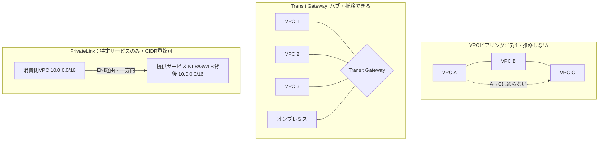
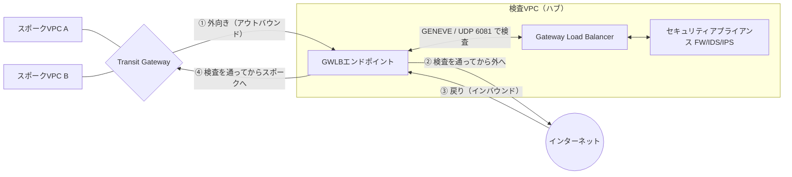
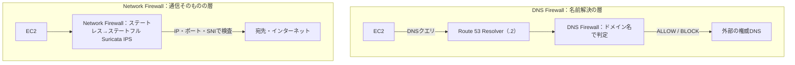
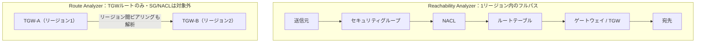

# はじめに

フューチャーでFutureVuls（脆弱性管理SaaS）の開発に携わる棚井です。

2026年7月1日に AWS Certified Advanced Networking - Specialty (ANS-C01) を受験し、769点/1000点(合格ライン750点)で一発合格しました。[前回のSecurity](https://future-architect.github.io/articles/20260604a/) に続く、2つ目のAWS認定です。

受けた動機はシンプルで、AWSネットワークの知識武装です。業務を通して断片的な知識は溜まっていましたが、体系立てて全体を見たことはありませんでした。なので、ここで一度、網羅的におさらいして固めておきたいと考えました。背中を押したのは、**この試験が2026年8月25日で廃止される** という告知です。ネットワークのSpecialtyがなくなる前に受けておきたかったので、廃止の約2ヶ月前に申し込みました。

受験の少し前、6月25日と26日には [AWS Summit Japan 2026](https://aws.amazon.com/jp/events/summits/japan/) に両日参加してきました。今年は会場全体がAIエージェントの話でした。個人的に一番刺さったのがAWS DevOps Agentです。CloudWatchのアラームなどを起点に、こちらがプロンプトを打たなくても自律的にインシデントを調査し、テレメトリやコード、デプロイ履歴を突き合わせて、原因と対処案まで出してくれるようです。

これを見て、ネットワークの障害調査も、これからはエージェントが担っていくのだろうと感じました。ただ、エージェントがどのメトリクスを見て、どのサービスのログを読んでいるのかを自分が分かっていないと、出てきた結果を判断できません。その中身を正しく理解しておきたいというのも、ネットワークを棚卸ししようと思った理由の1つでした。

# 試験の概要

ANS-C01は、AWSとオンプレをまたぐネットワークを大規模に設計し、運用し、守れるかを問うSpecialtyレベルの認定です。出題は4分野に分かれます。

> 参考：[AWS Certified Advanced Networking - Specialty (ANS-C01) 試験ガイド（公式）](https://docs.aws.amazon.com/ja_jp/aws-certification/latest/advanced-networking-specialty-01/advanced-networking-specialty-01.html)

| 分野                                                   | 出題比率 |
| ------------------------------------------------------ | -------- |
| ネットワーク設計                                       | 30%      |
| ネットワーク実装                                       | 26%      |
| ネットワークの管理と運用                               | 20%      |
| ネットワークセキュリティ、コンプライアンス、ガバナンス | 24%      |

- 設問数：65問（採点対象50問、採点対象外15問）
- 試験時間：170分
- 合格ライン：1000点満点で750点
- 設問形式：択一選択、複数選択、マッチング

配点が一番大きいのはネットワーク設計の30%です。実際、要件から最適な構成を選ばせる問題が中心で、帯域や冗長性、レイテンシ、暗号化、コストのどれを優先するかで答えが変わりました。

冒頭のとおり、この試験は2026年8月25日で受験できなくなります。廃止前に取った認定は、取得日から3年はそのまま有効です（私の場合は2029年7月まで）。ただし廃止後は新規発行も再認定もありません。AWSはここ数年でSpecialtyを絞っていて、Machine Learning - Specialtyも2026年3月末で廃止済みです。ネットワークもその流れの中にあります。

# 学習方法

私の学習は、シンプルに2ステップでした。

## 1. 完全対応テキストで全体像をつかむ

まず、[AWS認定 高度なネットワーキング-専門知識(ANS-C01)完全対応テキスト](https://www.amazon.co.jp/dp/4865944087)を1周しました。ANS-C01は日本語の教材がほとんどない試験ですが、この本は現行のANS-C01に対応した数少ない日本語専用書です。VPC、Transit Gateway、Direct Connect、VPN、CloudFrontやRoute 53、ネットワークセキュリティ、監視・運用、トラブルシューティングまで、範囲を章立てで押さえています。

業務のニーズに応じてつまみ食いで覚えていた内容を、試験範囲に沿って体系的に学び直しました。拠点間接続、クライアント接続、エッジと章立てで通したことで、それぞれのサービスの位置づけが整理できました。業務では触ってこなかったDirect Connect(DX)、VPC Reachability Analyzer、CloudFrontのLambda@Edgeといったサービスも、名前だけの状態から中身を押さえました。

役に立ったのは、むしろ古い知識のほうでした。以前[マスタリングTCP/IP 入門編（第6版）](https://www.amazon.co.jp/dp/4274224473)で学んだTCPやIP、ルーティング、DNSといったプロトコルの基礎です。AWSのネットワークも、結局はこの上に乗っています。パケットの中で何が起きているかを、昔[Wiresharkで通信プロトコルを見る](https://future-architect.github.io/articles/20210823b/)で一度追っておいたことが、そのまま理解の下敷きになりました。

## 2. Udemyの演習問題で長文に慣れる

次に、[【構成図解付き】出題範囲網羅+AWS ANS-C01日本語実践問題220問 (Advanced Networking)](https://www.udemy.com/course/aws-ans-practice/)の演習5(220問)を回しました。ほぼ全問にネットワーク構成図がつき、解説と公式ドキュメントへのリンクまである講座です。

解き方は前回のSecurityと同じで、正解だけでなく、誤答の選択肢がなぜ誤りかまで説明できるようにしました。そこまでやると、本番の消去法がぐっと楽になります。

ANS-C01は、とにかく問題文が長いのが特徴です。しかも設問ごとにネットワークの状況が違うので、長い文章を読んで、頭の中に構成図を描き直しながら答えることになります。正直、読むだけで脳が疲れます。正解を一発で当てにいくよりも、明らかにおかしい選択肢から落としていくほうが、効率的に回答できる問題もいくつか見られました。この長文への耐性は、Udemyで数を解いて慣れるしかありませんでした。

# 試験勉強で得た学び

おさらいの中で理解が整理された論点を、いくつか挙げます。

## Transit Gateway、VPCピアリング、PrivateLinkの使い分け

VPCをまたいでつなぐ方法は複数あり、目的で選び分けます。3つを表に並べました。

| 方式            | つなぐ対象                  | CIDRの重複             | 押さえどころ                                                                                                                                                 |
| --------------- | --------------------------- | ---------------------- | ------------------------------------------------------------------------------------------------------------------------------------------------------------ |
| VPCピアリング   | 2つのVPCを1対1              | 重複不可（考慮が必要） | 接続料・データ処理料はなく、課金はデータ転送料のみ。経路は推移しない（A-B・B-CがあってもA-Cは通らない）。全VPCを相互接続するにはn(n-1)/2本のピアリングが要る |
| Transit Gateway | 多数のVPC・オンプレをハブで | 重複不可（考慮が必要） | ルートテーブルで経路を制御し、アタッチメント間を推移的にルーティングできる。アタッチメントの時間料とデータ処理料が課金される                                 |
| PrivateLink     | 特定のサービスだけ          | 重複可（考慮不要）     | NLBまたはGWLBの背後のサービスに、インターフェースエンドポイント(ENI)経由でアクセスする。通信は消費側→提供側の一方向                                          |

図にすると次のとおりです。

判断の基準は、推移的な通信やオンプレミスの集約が要るか、CIDRが重複するか、サービス単位で足りるか、の3点です。VPCが2つならピアリング、増えればTransit Gateway、特定のサービスだけならPrivateLinkが目安になります。

参考：[VPC ピアリング接続の仕組み](https://docs.aws.amazon.com/ja_jp/vpc/latest/peering/vpc-peering-basics.html)、[AWS Transit Gateway の仕組み](https://docs.aws.amazon.com/ja_jp/vpc/latest/tgw/how-transit-gateways-work.html)、[AWS PrivateLink とは](https://docs.aws.amazon.com/ja_jp/vpc/latest/privatelink/what-is-privatelink.html)

## Gateway Load Balancerでセキュリティアプライアンスを挟む

サードパーティのファイアウォールやIDS/IPSをAWSに持ち込むとき、Gateway Load Balancer(GWLB)を使います。通信の経路上にアプライアンスを挟み、通り道で検査します。GWLBは通信をGENEVE（UDP 6081）でカプセル化してアプライアンスに渡し、検査を通ったトラフィックを戻します。

これを組織全体で効かせるのがハブ&スポーク構成です。検査用のVPC（ハブ）にGWLBとアプライアンスを置き、各業務VPC（スポーク）からの通信をTransit Gateway経由でハブに集めます。実際にトラフィックをGWLBへ引き込む入口になるのがGWLBエンドポイント(GWLBe)で、ハブVPCのルートテーブルをGWLBeに向けることで検査経路に乗ります。外へ出る通信も、入ってくる通信も、いったんハブを通してから流します。検査点を1か所に集められるので、アプライアンスをVPCごとに置かずに済みます。

外向きは ①→②（スポーク→TGW→GWLBe→アプライアンスで検査→インターネット）、戻りは ③→④（インターネット→検査VPC→アプライアンスで検査→TGW→スポーク）と流れます。どちらの向きも、必ずアプライアンスを一度通ります。

検査を挟むと、戻りの通信が別のAZを通り、ステートフルなアプライアンスではセッションが切れることがあります。Transit GatewayのAppliance Modeを有効にすると、往路と復路が同じAZを通ります。

参考：[Gateway Load Balancer とは？](https://docs.aws.amazon.com/ja_jp/elasticloadbalancing/latest/gateway/introduction.html)、[一元化されたネットワークセキュリティのための Transit Gateway での Gateway Load Balancer の使用](https://docs.aws.amazon.com/ja_jp/whitepapers/latest/building-scalable-secure-multi-vpc-network-infrastructure/using-gwlb-with-tg-for-cns.html)

## DNS FirewallとNetwork Firewallの違い

Route 53 Resolver DNS FirewallとAWS Network Firewallは、名前は似ていますが守る層が違います。

DNS Firewallは、DNSの問い合わせをドメイン名で止めます。見るのはDNSクエリだけです。たとえば、感染したインスタンスがC2（指令）サーバーのドメインを名前解決しようとしたら、その解決をブロックします（既定の応答はNODATAで、設定によりNXDOMAINなども選べます）。DNSクエリにデータを埋め込んで持ち出すDNSエクスフィルトレーションの抑止にも使えます。既知の悪性ドメインは、AWSが管理するリスト（マルウェア配布元やボットネットのC2）をそのまま適用できます。効くのはRoute 53 Resolver（VPCの.2リゾルバ）を通るクエリなので、外部のDNSを直接叩かれると素通りします。そこはSG・NACLでポート53を塞いで補います。

Network Firewallは、実際の通信そのものを検査するVPCのファイアウォールです。ステートレスのフィルタ（IP・ポート・プロトコル、ネットワークACLに近い）に加え、ステートフルなSuricata互換のIPSや、通信中のドメイン（TLSのSNIなど）での制御もできます。たとえば、承認したドメイン以外へのHTTPSをSNIで遮断する、既知の攻撃パターンをIPSで検知して落とす、特定のIPレンジへの通信を止める、といった制御です。DNSの層ではなく、パケットが流れる経路の上で効きます。

ドメインの名前解決を止めたいだけならDNS Firewall、通信そのものを幅広く検査・遮断したいならNetwork Firewallを使います。両者は補完関係で、併用も普通です。

参考：[Resolver DNS Firewall の仕組み](https://docs.aws.amazon.com/ja_jp/Route53/latest/DeveloperGuide/resolver-dns-firewall-overview.html)、[AWS Network Firewall とは](https://docs.aws.amazon.com/ja_jp/network-firewall/latest/developerguide/what-is-aws-network-firewall.html)

## 到達性の調査はReachability AnalyzerとRoute Analyzerで

疎通しないときの調査ツールは2つあり、見ている層が違います。

VPC Reachability Analyzerは、2点間が届くかを、パケットを流さず設定だけで解析します。セキュリティグループ、NACL、ルートテーブル、ゲートウェイまで含めたフルパスを追い、届かないならどこで止まっているかを指摘します。Transit Gateway経由の経路も追えますが、送信元と宛先は同一リージョンにある必要があります（リージョンをまたぐ場合はリージョンごとに調べます）。

Transit Gateway Network ManagerのRoute Analyzerは、TGWのルートテーブル上で経路が成立するかだけを解析します。セキュリティグループやNACLは見ません。その代わり、リージョンをまたいでピアリングしたTGW間の経路も追え、往路と復路の非対称もチェックできます。

1リージョン内でSG・NACLまで含めて疎通を追うときはReachability Analyzer、リージョンをまたぐTGWの経路を確かめるときはRoute Analyzerを使います（SG・NACLはVPC Flow Logsで別途確認します）。どちらも2点間を調べるツールで、ネットワーク全体を俯瞰するものではない、というのが正しい整理でした。

参考：[Reachability Analyzer の仕組み](https://docs.aws.amazon.com/ja_jp/vpc/latest/reachability/how-reachability-analyzer-works.html)、[AWS Network Manager の Route Analyzer](https://docs.aws.amazon.com/ja_jp/network-manager/latest/tgwnm/route-analyzer.html)

# 試験を終えて

受けてみて、一番の収穫は、ねらいどおりネットワークの知識武装ができたことでした。試験範囲を通しで一巡したことで、業務で使ってきた機能が全体のどこに位置づき、サービスどうしがどうつながっているのかが見えてきました。

前回のSecurityでも感じましたが、Specialtyの試験は、知っているかよりも、なぜそれを選ぶかを問うてきます。ネットワークではその傾向が特に強く、概要で挙げた要件を読み解いて、最適な一つを選ばせます。暗記だけでは届かず、選ぶ理由を言葉にできるかが問われました。

スコアは769点で、合格ラインの750点を19点上回っての合格でした。分野別の成績は次のとおりです。

| 分野                                                            | 配点 | 評価                         |
| --------------------------------------------------------------- | ---- | ---------------------------- |
| 第1分野：ネットワーク設計                                       | 30%  | 改善が必要                   |
| 第2分野：ネットワーク実装                                       | 26%  | コンピテンシーを満たしている |
| 第3分野：ネットワークの管理と運用                               | 20%  | コンピテンシーを満たしている |
| 第4分野：ネットワークセキュリティ、コンプライアンス、ガバナンス | 24%  | コンピテンシーを満たしている |

配点が最も大きい第1分野「ネットワーク設計」を落としながら、残りの7割で合格ラインに届いた結果でした。設計は、なぜその構成を選ぶかを最も広く問う分野で、そこを詰めきれなかったのが数字に出ています。余裕をもって超えたというより、なんとか届いた、というのが正直なところです。

# おわりに

身につけた知識は、ネットワークの設計や障害調査で役立ちます。設計から障害調査までをAIが担うようになっても、その出力の妥当性を自分で見極められるように、知識をアップデートし続けたいと思います。

廃止まではあと2ヶ月弱です。受けようか迷っている人がいたら、間に合ううちに受けておくのがいいと思います。

