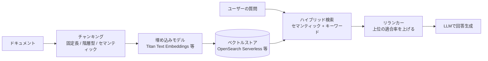
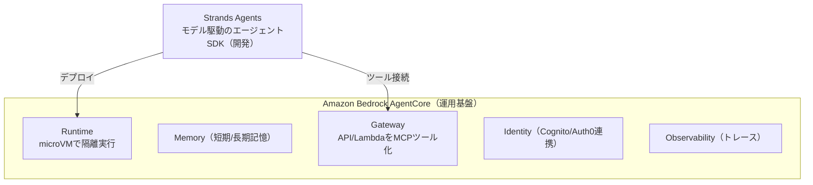

# はじめに

フューチャーでFutureVuls（脆弱性管理SaaS）の開発に携わる棚井です。2026年7月14日に AWS Certified Generative AI Developer - Professional (AIP-C01) を受験し、794点/1000点（合格ライン750点）で一発合格しました。

受けた動機はシンプルで、生成AIの知識武装です。

前回の [AWS Certified Advanced Networking - Specialty の合格体験記](https://future-architect.github.io/articles/20260708a/) の最後に、「設計から障害調査までをAIが担うようになっても、その出力の妥当性を自分で見極められるように、知識をアップデートし続けたい」と書きました。書いておいて何ですが、そのAIを、当時の私はノリと雰囲気で使っていただけです。

（上の画像は [雰囲気ジェネレータ](https://potato4d.github.io/huniki_generator/) で生成しました）

Claude CodeもPerplexityも、仕事でも仕事以外でも毎日のように使っています。ただ正直なところ、その多くは勘で動かしているだけで、内側で何が起きているかは分かっていません。

RAGやファインチューニングにしても、概念としては知っているものの、いざ設計や実装のレベルになると手が止まります。AIにまるごと渡せば、いい感じに処理してくれるので、それ以上を深掘りする機会がありませんでした。それほど、手軽にAIを使えるようになったのだとも言えます。

ちょうどAWSから、生成AIアプリ開発に振り切ったProfessionalの新しい認定が出たので、これを言い訳のきかない締め切りにして学び直すことにしました。

# 試験の概要

AIP-C01 は、AWSの認定のなかで初のProfessionalレベルのAI/生成AI専門資格です。これまでAIまわりの認定は、基礎の [AI Practitioner (AIF-C01)](https://aws.amazon.com/certification/certified-ai-practitioner/) とAssociateの [Machine Learning Engineer (MLA-C01)](https://aws.amazon.com/certification/certified-machine-learning-engineer-associate/) が中心でした。かつては [Machine Learning - Specialty (MLS-C01)](https://aws.amazon.com/certification/certified-machine-learning-specialty/) という Specialty もありましたが、こちらは廃止済みです。AIP-C01は、これらに続く開発者向けの上位の資格です。

対象がはっきりしているのが特徴です。MLの研究者やデータサイエンティスト向けではなく、基盤モデル（FM）をアプリや業務ワークフローに組み込んで本番投入する開発者に振ってあります。モデルを一から訓練する話やデータエンジニアリングはスコープ外で、RAG、プロンプト管理、エージェント、コスト最適化、セキュリティ、評価といった、作って運用する側のテーマが並びます。FutureVulsのようなSaaSを作っている人間には、業務の延長にある内容でした。

試験概要は次のとおりです（2026年7月時点、[公式ページ](https://aws.amazon.com/certification/certified-generative-ai-developer-professional/)・[試験ガイド](https://docs.aws.amazon.com/aws-certification/latest/ai-professional-01/ai-professional-01.html)より）。

| 項目 | 内容 |
| --- | --- |
| 試験時間 | 180分 |
| 設問数 | 75問（採点対象65問＋評価用の非採点10問） |
| 出題形式 | 選択式（4択1正解）・複数選択式（複数正解） |
| 受験料 | 300 USD |
| 合格ライン | 750 / 1000（スコア範囲 100〜1000） |
| 受験方法 | テストセンター / オンライン監督 |
| 推奨経験 | 本番グレードのアプリ構築2年＋生成AIソリューション実装1年 など |

コンテンツ分野と出題比率は以下です。分野1と分野2だけで合わせて57%を占めるので、ここを落とすと苦しくなります。

| コンテンツ分野 | 出題比率 |
| --- | --- |
| 1. 基盤モデルの統合、データ管理、コンプライアンス | 31% |
| 2. 実装と統合 | 26% |
| 3. AIの安全性、セキュリティ、ガバナンス | 20% |
| 4. GenAIアプリケーションの運用効率と最適化 | 12% |
| 5. テスト、検証、トラブルシューティング | 11% |

# 学習方法

新しい試験で日本語の一次情報がまだ少なく、対策の順番から自分で決める必要がありました。効いたのは次の4つです。

## 1. Perplexityで計画を立て、「モデル評議会」で弱点を特定する

まず [Perplexity](https://www.perplexity.ai/) と壁打ちして学習計画を立てました。Perplexityにしたのは、新しい情報を踏まえて回答してほしいからです。AIP-C01は出たばかりで、学習ブログの蓄積に頼りきれません。試験ガイドや公式ドキュメントを裏取りしながら答えてくれる相手として、分からないところはすべてPerplexityに聞きました。

面白かったのが、Perplexity Maxプランのモデル評議会という機能です。同じ問いを複数のモデルに投げて、それぞれの見解を突き合わせられます。最初にSkill Builderの無料の20問セットを解いたところ、正答率は45%でした。この結果（分野別スコアと解答時間）をそのままモデル評議会にかけて、傾向を分析させました。返ってきた指摘がこれです。

> 3モデルが揃って注目しているのが「不正解の方が平均解答時間が短い」点です。これは"迷って外した"というより、"知らないので即決で外した"傾向を示唆し、対策としては演習を闇雲に回すより、まず概念と選定基準（いつどれを選ぶか）をインプットしてから演習に入った方が伸びが速いパターンです。

知らないから即答で外している、という見立ては、耳が痛いくらい当たっていました。実際、20問のドメイン別正答率は分野4と分野5がともに0%でした。ここでいきなり過去問を回しても意味がないと割り切り、まず概念と選定基準を頭に入れてから演習に入る、という順番に切り替えました。この切り替えで、演習の伸び方が変わりました。

## 2. 書籍でエージェント実装を押さえる

AIエージェント周りの概念のインプットに、書籍『[Amazon Bedrock AgentCore実践入門 Strands Agentsで構築するAIエージェント](https://www.amazon.co.jp/dp/B0GTSMR7GT/)』（AWS深掘りガイド）を読みました。AgentCore（エージェントの実行基盤）とStrands Agents（モデル駆動のエージェントSDK）は、まさに分野2（実装と統合）の中心です。

この領域は新しく、日本語でまとまった情報が少ないので、一冊で通して学べたのは効率がよかったです。ただし後述するとおり、配点最大の分野1（RAG・モデル選定・データ管理）や分野5（評価・トラブルシューティング）はこの本の守備範囲外なので、そこは別教材で補う前提で読むのがよさそうです。

## 3. AWS Skill Builderで演習を回す

演習は [AWS Skill Builder](https://skillbuilder.aws/) の月額サブスクリプション（29 USD）を契約しました。やった順番はこうです。

- Official Practice Question Set（無料・20問）… 最初の腕試し
- Domain 1〜5 Practice … 分野ごとの演習。弱かった分野4と分野5を優先的に
- Official Pretest … 本番形式の公式模試で最終確認

分野別に演習できるのが今回はありがたく、モデル評議会に指摘された弱点を狙い撃ちできました。正解を選べたかだけでなく、誤答の選択肢がなぜ誤りかまで説明できるかを毎回確認しました。この試験は選択肢がどれもそれっぽいので、消去法の根拠を言葉にできないと本番で崩れます。

## 4. Udemyで本番の長文に慣れる

仕上げに [Udemyの対策講座](https://www.udemy.com/course/awsgenerative-ai-developer-professional-aip-c01-j/) の問題を回しました。Udemyの演習には、過去2回の合格体験記（[AWS Certified Security - Specialty](https://future-architect.github.io/articles/20260604a/)・[AWS Certified Advanced Networking - Specialty](https://future-architect.github.io/articles/20260708a/)）でもお世話になっていて、今回も頼りにしました。

ひとつ補足すると、このAIP-C01の講座は執筆時点でサブスクリプションの対象外で、追加料金を払って個別に購入する必要がありました。追加の出費にはなりましたが、解説が丁寧で量も多く、日本語で学べるAIP-C01の対策教材がまだ限られるなかでは貴重でした。

Professionalの問題文は状況設定が長く、要件（レイテンシのSLA、予算、データの機密性など）を読み落とすと一発で外します。数をこなして、長文から何を最適化したい問題なのかを早く抜き出せるようにしました。

# 試験勉強で得た学び

私はもともとAI領域の知識が足りませんでした。とはいえ体系立てて学び直したわけではなく、問題演習で知らない自然言語処理の用語に出くわすたびに、そこで立ち止まって、理解できるまでAIと壁打ちする、という進め方です。この試験は用語の暗記ではなく判断を問うので、特に効いた知識を、いつどれを選ぶかの選定基準として整理します。

## 知識をどう入れるか：RAG・ファインチューニング・継続事前学習・プロンプト

分野1で最頻出、そして基本となるのがこの4つの使い分けです。社内ドキュメントの内容を答えさせたい、と言われて反射でファインチューニングと答えると、たいてい外れます。

| 手法 | 変えられるもの | 必要なデータ | 使いどころ |
| --- | --- | --- | --- |
| プロンプトエンジニアリング | 指示の与え方 | 不要 | まず最初に試す |
| RAG | 参照する知識 | 外部ドキュメント | 情報が更新される／出典を示したい |
| ファインチューニング | 振る舞い（口調・出力形式・タスク精度） | ラベル付き（プロンプト-応答ペア） | 出力のスタイルや形式を固定したい |
| 継続事前学習 | ドメイン知識そのもの | 大量の非ラベルデータ | 専門分野全体に適応させたい |

軸はこうです。知識の鮮度ならRAG、振る舞いならファインチューニング、ドメイン知識の底上げなら継続事前学習。特に、ラベル付きならファインチューニング、非ラベルの大量データなら継続事前学習、という判別は問題文の一語で正解が変わるので気をつけました。原則は、安いプロンプトやRAGで足りないかを先に確かめてからカスタマイズに進むこと。コスト意識が正解の根拠になる問題が多いです。

同じファインチューニングでも、かけるコストには幅があります。モデルの重みをすべて更新するフルファインチューニングは重い一方で、LoRA（Low-Rank Adaptation）のように、元のモデルは凍結したまま小さなアダプター（低ランク行列）だけを学習する手法もあります。パラメータ効率のよいファインチューニング（PEFT）と呼ばれる考え方で、全体を再学習せずに振る舞いを調整できるぶん、計算コストを大きく抑えられます。

## チャンキングと埋め込み、RAGの検索品質

RAGの精度は、検索の前工程でほとんど決まります。ドキュメントをどう分割（チャンキング）し、どう埋め込むかです。

Amazon Bedrock の Knowledge Bases では、チャンキングを固定長・階層型・セマンティック・分割なし・Lambdaによるカスタムから選べます。技術マニュアルや法務文書のように入れ子構造のものは、親チャンクで文脈を保ちつつ小さな子チャンクで検索する階層型が効きます。見出しのない長文の記事や調査レポートのように、構造は平坦でも話題が移っていくものは、意味のまとまりで区切るセマンティックが向きます。隣り合う文の埋め込みの類似度が下がったところを境界にするので、話題の途中でチャンクが切れにくくなります。細かすぎると文脈が切れ、粗すぎるとノイズが混ざるので、この加減を文書の性質で判断させるのが出題パターンでした。

地味に効いたのが、取り込み時とクエリ時の埋め込みモデルは同じでなければならない、という制約です。当たり前のようで、選択肢に紛れ込ませてくる引っかけがありました。

## ハイブリッド検索とリランカー：再現率と適合率

セマンティック検索は言い換えに強い一方で、型番や固有名詞、略語のように完全一致してほしい語に弱いです。脆弱性管理でいう `CVE-2026-XXXXX` のようなIDがまさにそれで、意味が近いだけでは拾えません。そこでキーワード検索を組み合わせるのがハイブリッド検索です。

ここで役割を混同しないことが大事でした。

| 目的 | 手段 | 効く指標 |
| --- | --- | --- |
| 取りこぼしを減らす | ハイブリッド検索（セマンティック + キーワード） | 再現率（Recall）を上げる |
| 上位の精度を上げる | リランカー（検索後の再順位付け） | 適合率（Precision）を上げる |

ハイブリッド化は漏れなく拾うための再現率対策、リランカーは上位を精度よく絞るための適合率対策で、別のレイヤーの話です。リランカーが再現率を上げると誤解していると、選択肢で足をすくわれます。ちなみにハイブリッド検索が使えるかどうかは、選ぶベクトルストアに左右されます。Bedrock Knowledge Basesでは当初OpenSearch Serverlessが中心でしたが、その後Aurora PostgreSQLなど対応先が広がりました。こうした実装の制約もセットで問われました。

## 推論パラメータ：TemperatureとTop-Pはどちらか一方で調整する

出力を制御するパラメータも、名前を知っているだけでは足りず、効果と使いどころまで問われます。

| パラメータ | 効果 | 使いどころ |
| --- | --- | --- |
| Temperature | 出力のランダム性（低いほど決定的） | 事実回答・抽出は低め、創作は高め |
| Top-P | 累積確率がP（0〜1）に達するまでの上位語彙に限定 | Temperatureとどちらか一方で調整 |
| Top-K | 上位K個の語彙に限定 | モデル依存 |
| 停止シーケンス | 指定文字列が出たら生成停止 | 出力を厳密に区切りたい |
| 最大トークン長 | 出力の上限 | コスト・レイテンシの制御 |

引っかかったのは、TemperatureとTop-Pはどちらもランダム性を制御するので、両方を同時に動かさず、どちらか一方で調整する、という点です。多様性を出すために両方を上げる、という選択肢を正解に見せてくる問題がありました。長さペナルティやTop-Kのように、モデルによって使えたり使えなかったりするパラメータもあり、モデルごとに公開されているパラメータが違う前提で読む必要があります。

## Bedrock Agents・AgentCore・Strands Agents、そしてMCP

分野2の山場が、エージェントまわりの三者の区別です。ここは書籍が効きました。

- Strands Agents … オープンソース（Apache-2.0）のエージェントSDK。LLM自身に推論・計画・ツール選択を任せるモデル駆動で、少ないコードでツールを使うエージェントを組めます。作る側の道具です。
- Amazon Bedrock AgentCore … フレームワークに依存しない実行基盤。作ったエージェントを隔離実行（Runtime）し、記憶（Memory）、認証（Identity）、可観測性（Observability）、ツール接続（Gateway）を後から足せます。動かす側の道具です。
- Bedrock Agents … Bedrock内で完結する、マネージドな簡易エージェント機能です。

紛らわしいのは名前の近さですが、役割のレイヤーが違います。Strandsはエージェントを組み立てるSDK、AgentCoreはそれを本番で動かす実行基盤で、補完関係にあります。ただしAgentCoreはフレームワークに依存せず、Strands以外で作ったエージェントも動かせるので、両者は必ずセットというわけではありません。Bedrock Agentsは、これらを自分で組み合わせる代わりにBedrockにまかせるマネージドな選択肢です。この違いで見分けると、三者を混ぜてくる問題にも対応できます。特に注目したのが、AgentCoreのGatewayが既存のAPIやLambdaをMCP（Model Context Protocol）のツールとして公開できる点です。エージェントが外部の道具を使うための共通規格としてMCPが使われていて、この考え方が後半の話につながります。

# 試験勉強を通しての所感

## ユースケースを自分のサービスに引き寄せて考えられる

対策のなかでは、さまざまなユースケースの説明が出てきます。それをひたすら追ううちに、自分が担当するサービスのどこに、どう展開できるかが具体的に見えてくるのが面白く、勉強しながらメモを取り続けました。

メモにはこんな走り書きが並びます。

- このユースケース、うちのあの機能にRAGでそのまま使えそう
- 呼び出すモデルは固定でなくてよく、軽い処理と重い処理で動的に切り替える（ルーティングする）制御もできる
- モデルの評価には、LLM-as-a-judge に加えて、迷うエッジケースは人が判定し、両者を組み合わせるハイブリッドもある

どれも、言われてみれば確かにそうだ、とうなずけるものばかりでした。生成AIの実装経験は浅くても、アプリ開発の勘所があれば、こうした学びは設計に生きます。

## PII対応で、法律と実装がつながった

試験を通して、PII（個人を特定できる情報）の扱いが何度も出てきました。実は先日、[個人情報保護士認定試験にも合格し、その体験記を書きました](https://future-architect.github.io/articles/20260715a/)。そこで学んだ法律や制度を、いざサービスに実装する段になると、Amazon Bedrock GuardrailsのPIIフィルタ、テキストから個人情報を検出するAmazon Comprehend、S3上の機微データを見つけるAmazon Macieといったサービスが要ります。

制度として知っていたことと、それをどう実装するかが、一本の線でつながりました。コンプライアンスを要件から実装まで通して考えられるようになったのは、今回の思わぬ収穫です。

# 試験結果の振り返り

スコアは794点、合格ラインの750点を44点上回っての合格でした。

分野別の評価はこうです。

| コンテンツ分野 | 評価 |
| --- | --- |
| 1. 基盤モデルの統合、データ管理、コンプライアンス | コンピテンシーを満たしている |
| 2. 実装と統合 | コンピテンシーを満たしている |
| 3. AIの安全性、セキュリティ、ガバナンス | コンピテンシーを満たしている |
| 4. GenAIアプリケーションの運用効率と最適化 | コンピテンシーを満たしている |
| 5. テスト、検証、トラブルシューティング | 改善が必要 |

正直に書くと、最後まで分野5（テスト、検証、トラブルシューティング）が埋まりきりませんでした。弱点だった分野4・5のうち、分野4は個別Practiceで持ち直しましたが、分野5は薄いまま本番に臨みました。モデル評価やLLM-as-a-judge、RAGの検索と生成を分けて診断する話は書籍でも手薄で、公式ドキュメントを直接あたる必要がありました。配点が11%と小さいことに救われた面はあります。

本番の進め方も少し書いておきます。試験時間の180分は、見直しまで含めて目一杯使いました。時間にゆとりは決してなく、最後まで押し気味でした。もう一つ、数問だけ日本語では文意を取りにくい設問があり、その場で英語に切り替えて読み直しました。技術的な内容は英語の原文のほうが素直に読めることもあるので、少しでも迷ったら切り替えるのは有効な手でした。

44点差での合格です。数字のうえでは少し上回っていますが、手応えとしてはぎりぎりでした。効いたのは、配点の大きい分野1と分野2を固めきれたことです。埋めきれなかった分野5は割り切り、重い分野から順に押さえる。この判断が、合否を分けたのだと思います。

# おわりに

生成AIの知識武装という当初の目的は、ひとまず果たせました。勘や雰囲気で動かしていたものを、内側で何が起きているかを踏まえて扱えるようになったのは、大きな収穫です。

学んでいて感じたのは、SaaSに求められるものが変わりつつあることです。先日、日経クロステックに「[フリーは『AIが使いやすい』SaaSを目指す、CAIO直下に新組織](https://xtech.nikkei.com/atcl/nxt/column/18/03076/070700028/)」（2026年7月13日、有料会員限定）という記事が出ました。freee共同創業者でCAIOの横路隆氏の言葉として、こう紹介されています。

> SaaSのあり方も、これまでは人が使いやすいプロダクトを目指してきましたが、これからはAIエージェントが使いやすいものにする必要があります。

SaaSを作る側にいる自分にとって、この指摘は他人事ではありません。プロダクトを使うのが人だけでなくAIエージェントにもなるなら、エージェントが叩ける口、つまりMCPサーバーを備えていることは、もう前提に近いはずです。画面を磨くのと同じ手間を、AIエージェント向けの入り口にもかける必要があります。

折しも、私のいるFutureVulsチームでは、7月17日に [FutureVuls MCP Server](https://prtimes.jp/main/html/rd/p/000000848.000004374.html) をリリースしました。「いつものAIエージェントに、“脆弱性管理”を」というものです。試験勉強では、AgentCore GatewayがまさにMCPを軸にしているのを見ました。作る側に回るいま、その中身を理解したうえで判断できるのは大きいです。

今回の試験では、AWSのAIエコシステムの知識と、設計に落とし込める自然言語処理の知識が身につきました。これからは両方をフル活用して、サービス開発につなげていきます。

とはいえ、AWSのサービスは日々増えていきます。そのキャッチアップとして、ランチタイムのウェビナー「[もぐもぐ AWS](https://aws.amazon.com/jp/blogs/news/mogmog/)」に毎日参加しています。30分で最新のサービス動向を追えるのがちょうどよく、毎回いい刺激をもらっています。

次に何を受けるかは迷っていますが、AIエージェントの運用が本格化するほど、それを支えるインフラやセキュリティの知識がまた要るはずです。受かったら、また書きます。

## 関連記事

- [AWS Certified Security - Specialty 合格体験記 - Claude壁打ちとUdemy演習で一発合格](https://future-architect.github.io/articles/20260604a/)
- [AWS Certified Advanced Networking - Specialty 合格体験記 - 廃止直前の駆け込み受験](https://future-architect.github.io/articles/20260708a/)

## 参考

- [AWS Certified Generative AI Developer - Professional（公式ページ）](https://aws.amazon.com/certification/certified-generative-ai-developer-professional/)
- [AIP-C01 試験ガイド](https://docs.aws.amazon.com/aws-certification/latest/ai-professional-01/ai-professional-01.html)
