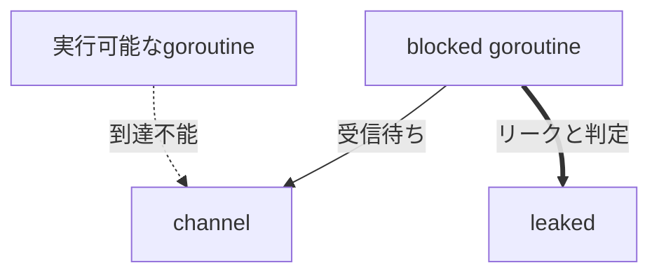

The Go gopher was designed by Renee French.

[Go 1.27リリース連載](/articles/20260728a/)の5本目です。

## はじめに

Go 1.26で実験的に導入されたgoroutineリーク検出プロファイル`goroutineleak`が、Go 1.27で正式機能になりました。

goroutineリークの基本原理や、従来手法（goleakなど）との比較は、[Go 1.26 リリース連載 Goroutine Leak Profiles](/articles/20260128a/)で解説いただいています。今回は、正式化後の使い方と、検出したリークをどう修正するかを中心に紹介します。あわせて、検出の土台になった論文と、Goに取り込まれた範囲にも触れます。

## Go 1.27での変更

Go 1.26では`goroutineleak`は実験的機能であり、ビルド時に次の指定が必要でした（[Go 1.26リリースノート](https://go.dev/doc/go1.26#goroutineleak-profiles)）。

```bash
GOEXPERIMENT=goroutineleakprofile go build
```

[Go 1.27](https://go.dev/doc/go1.27#runtime)では正式機能（generally available）になり、実験フラグなしで利用できます。`goroutineleakprofile`という`GOEXPERIMENT`設定自体も削除されました。

利用箇所は次の2つです。

- `runtime/pprof`の`goroutineleak`プロファイル
- `net/http/pprof`の`/debug/pprof/goroutineleak`エンドポイント

## 検出の仕組み

goroutineリークとは、goroutineがチャネルなどの同期プリミティブで待機したまま、その待機を解除する手段が失われた状態です。プログラム全体が停止する通常のデッドロックとは異なり、一部のgoroutineだけが残るため、発見しにくい問題です。なお、待機中であること自体はリークではありません。I/OやHTTP接続を待つgoroutineのように、将来再開できるものは正常です。

正常な待機・goroutineリーク・通常のデッドロックの関係を整理すると、次のとおりです。

| 状態 | 待機の解除経路 | プログラム全体 |
| --- | --- | --- |
| 正常な待機（I/OやHTTP応答待ちなど） | 残っている（いずれ再開する） | 動き続ける |
| goroutineリーク | 失われている（永久に再開しない） | 動き続けるため、発見しにくい |
| 通常のデッドロック | 失われている | 全体が停止するため、すぐ気づく |

発見しにくい理由は、リークしていない部分が正常に動き続けることにあります。アプリケーションは応答を返し続ける一方で、リークしたgoroutineはスタックを保持したまま残り、そこから参照されるチャネルや変数もGCの視点では到達可能なため、回収されません。リークが蓄積するほど解放されないメモリが増え、GCがマークすべきオブジェクトも増えるため、メモリ使用量とGC負荷が少しずつ上がっていきます。症状がメモリ使用量の緩やかな増加などとして遅れて現れるうえ、再起動すると一時的に解消してしまうため、原因の特定が難しくなります。

`goroutineleak`は、GCの到達可能性解析を「そのgoroutineは再開できるか」という判定に応用します（[Proposal](https://github.com/golang/go/issues/74609)、[Design Document](https://go.googlesource.com/proposal/+/master/design/74609-goroutine-leak-detection-gc.md)）。goroutineがチャネルで受信待ちしているとき、実行可能なgoroutine（今後実行可能になり得るものを含みます）のどれからもそのチャネルへ到達できなければ、待機を解除するコードは二度と実行されません。これをリークと判定します。検出専用のGCサイクルはプロファイル取得時にだけ実行され、利用しない間は追加の実行時オーバーヘッドが生じないように設計されています。



この検出は、偽陽性（誤検出）を出さないことを重視して設計されています。一方で、すべてのリークを検出できるわけではありません。グローバル変数や、実行可能なgoroutineのローカル変数から到達可能なチャネルで待機している場合、実際には誰も解除しなくても「到達可能」であるため、検出されないことがあります。偽陰性（見逃し）はあり得るため、プロファイルの検出件数が0件（後述する`debug=1`出力では`total 0`と表示されます）であっても、リークが存在しないことの証明にはなりません。

なお、GCのマーキングの仕組みを詳しく知りたい方は[Go 1.26の新GC「Green Tea（緑茶）」解説](https://future-architect.github.io/articles/20260130a/)もあわせてご覧ください。ただし、Green Teaはマーキングを高速化するGCの最適化であり、goroutineリーク検出とは別の機能です。

### 論文からGoへの取り込み

この検出理論は、Saiocらによる論文「[Dynamic Partial Deadlock Detection and Recovery via Garbage Collection](https://dl.acm.org/doi/pdf/10.1145/3676641.3715990)」（ASPLOS 2025）で提案されました。論文では、プログラム全体ではなく一部の並行処理だけが永久にブロックされる状態をpartial deadlock（部分デッドロック）と呼んでいます。Goでは、このような状態は一般にgoroutine leakとも呼ばれます。

検出では、実行中または実行可能なgoroutineを起点としてGCのマークを開始します。そこから到達可能な並行処理プリミティブによって再開し得るgoroutineを新たにliveとみなし、そのスタックからさらにマークを続けます。この処理を固定点まで繰り返し、最後までliveと判定されなかったgoroutineをpartial deadlockとします。

研究実装はGolf（Goroutine Leak Fixer）と呼ばれ、検出にとどまらず、リークしたgoroutineを停止させ、スタックやそこからのみ到達可能なオブジェクトをGCの回収対象にすることまで扱っていました。ただし、これらを回収すると、通常のGoでは生存していたはずのオブジェクトが回収され、finalizer（`runtime.SetFinalizer`で登録された後始末処理）が実行される可能性があります。これは副作用やpanicなど、本来観測されなかった挙動を生じさせます。そのためGolfでも、回収候補からfinalizer付きオブジェクトへ到達できる場合は、検出結果の報告にとどめて回収しない処理が設けられています。

一方、[Proposal #74609](https://github.com/golang/go/issues/74609)を経てGoへ取り込まれた機能では、自動回復を採用していません。Proposalでは、論文の実装からの主な変更として、リークしたgoroutineとそのスタックからのみ到達可能なリソースを強制回収しないこと、`goroutineleak`プロファイルの取得を契機に検出用GCサイクルをオンデマンドで実行することが明示されています。なお、[Go 1.27リリースノート](https://go.dev/doc/go1.27#runtime)には「Special thanks to Vlad Saioc at Uber for contributing this work.」と、この機能に貢献したSaioc氏への謝辞が記されています。

| 観点 | 論文のGolf | Goに取り込まれた機能 |
| --- | --- | --- |
| 目的 | 検出と自動回復 | 検出と診断情報の提供 |
| 起動方法 | 拡張したGCで検出 | プロファイル取得時にオンデマンド実行 |
| 検出後 | 対象goroutineの停止とメモリ回収を試みる | プロファイルへ報告し、GCでトレースする |
| スタック | 回収対象になり得る | 通常のGCと同様にトレースする |
| 出力 | Golf独自の報告 | `runtime/pprof`と`net/http/pprof` |
| 既存プログラムへの影響 | 回収で挙動が変わり得るため、finalizerを考慮した回復処理が必要 | 強制回収せず、既存の挙動を変えない |

Goへの取り込みで自動回復を見送ったのは、前述のとおり、強制回収がfinalizerの実行などを通じてプログラムの挙動を変えてしまうためです。そのためGoは、リークと判定したgoroutineもそれまでどおりGCの管理下に残したまま、プロファイルで報告するだけにとどめています。この機能が担うのはリークの検出と診断までであり、報告されたリークを修正するのは、そのコードを書いた私たち開発者自身です。

## 実際に試す

ここからは検証編です。意図的にgoroutineをリークさせる小さなプログラムを用意し、`goroutineleak`プロファイルでリークが検出される様子を確認します。

### 再現コード

```go
package main

import (
	"fmt"
	"log"
	"net/http"
	_ "net/http/pprof"
)

func startLeaks(n int) {
	for range n {
		ch := make(chan struct{})

		go func() {
			<-ch
		}()
	}
}

func main() {
	startLeaks(3)

	fmt.Println("pprof: http://127.0.0.1:6060/debug/pprof/")
	log.Fatal(http.ListenAndServe("127.0.0.1:6060", nil))
}
```

`ch`を受信するgoroutineは存在しますが、`ch`へ送信も`close`もしていません。ループを抜けた後は実行可能なコードのどこからも`ch`へ到達できず、3つのgoroutineは再開不能、つまりリークです。

`net/http/pprof`のブランクインポートと、`ListenAndServe`の第2引数の`nil`により、pprofのハンドラーが登録された`http.DefaultServeMux`が使われます。

### ビルドと実行

検証には、正式リリース前のGo 1.27 RC2を使用しました。

```console
$ go1.27rc2 build -trimpath -o leakdemo .
$ ./leakdemo
pprof: http://127.0.0.1:6060/debug/pprof/
```

実験フラグの指定は不要です。

プログラムを実行したまま、別のターミナルから`/debug/pprof/goroutineleak`エンドポイントにアクセスすると、リーク検出の結果を取得できます。出力形式は`debug`パラメーターで切り替わります。

### debug=1: 件数と集約スタック

```bash
curl -s 'http://127.0.0.1:6060/debug/pprof/goroutineleak?debug=1'
```

```text
goroutineleak profile: total 3
3 @ 0x100da4428 0x100d366e0 0x100d36264 0x100f4f2a4 0x100dab454
#       0x100f4f2a3     main.startLeaks.func1+0x23      example.com/leakdemo/main.go:15
```

`total 3`は検出されたリークgoroutineの合計です。行頭の`3`は同じスタックに集約されたgoroutine数、`@`以降は各スタックフレームのPC値（プログラムカウンタ）、`#`行が関数名とソース位置を示します。3つのgoroutineが同じ箇所（`main.go:15`の受信待ち）でリークしているとわかります。

### debug=2: 完全なスタックダンプと(leaked)

```bash
curl -s 'http://127.0.0.1:6060/debug/pprof/goroutineleak?debug=2'
```

`debug=2`では、リークしたgoroutineだけでなく、取得時点で存在するすべてのgoroutineの完全なスタックダンプが出力されます。以下はリーク部分の抜粋です。

```text
goroutine 36 [chan receive (leaked)]:
main.startLeaks.func1()
        example.com/leakdemo/main.go:15 +0x24
created by main.startLeaks in goroutine 1
        example.com/leakdemo/main.go:14 +0x24
```

状態表示の`chan receive`はチャネル受信待ちを、`(leaked)`はリーク判定を表します。`main.go:15`が実際に待機している位置、`created by`以下がこのgoroutineを生成した位置です。待機箇所と生成元の両方を特定できます。

### goroutineプロファイルとの違い

pprofには従来から、取得時点に存在するすべてのgoroutineのスタックを一覧する`goroutine`プロファイルがあります。ただし、その出力から、待機中のgoroutineが「将来再開する正常な待機」なのか「解除されないリーク」なのかを判断するのは読み手の仕事です。`goroutineleak`は、この判断を到達可能性解析で肩代わりし、解除不能と判定されたgoroutineだけを報告します。両者の用途を整理すると次のとおりです。

| プロファイル | 用途 |
| --- | --- |
| `goroutine` | 取得時点で存在するgoroutineの状態とスタックを確認する |
| `goroutineleak` | 解除不能と判定されたgoroutineを確認する |

参考として、`goroutine`プロファイルは次のコマンドで取得できます。

```bash
curl -s 'http://127.0.0.1:6060/debug/pprof/goroutine?debug=2'
```

前述のとおり、`debug=2`では`goroutineleak`もリークだけでなく完全なスタックダンプを出力するため、出力の行数は`goroutine?debug=2`と同程度または同じになる場合があります。検証では、どちらも81行でした。ただし、取得処理自身のスタックや取得タイミングが異なるため、内容が完全に同一になるとは限りません。

## リークを修正する

修正の共通原則は次のとおりです。

> goroutineを待機させるなら、その待機を解除できるコードパスを用意する。

解除経路を用意できないのであれば、待機そのものを無くします。この原則に沿って、再現コードを4つの方針で修正します。使い分けは次のとおりです。

| 方針 | 適する状況 |
| --- | --- |
| 方針1: 待機を削除 | 同期が不要 |
| 方針2: `close`または送信 | 明確な完了通知がある |
| 方針3: `context`でキャンセル | 外部からキャンセルしたい |
| 方針4: タイムアウト | 相手の応答が保証されない |

### 方針1: 待機を削除

同期が不要なら、チャネルと受信待ちを削除します。

```go
package main

import (
	"fmt"
	"log"
	"net/http"
	_ "net/http/pprof"
)

func startWorkers(n int) {
	for range n {
		go func() {
			// チャネルでの待機を削除し、何らかの処理（例: doWork()）だけを実行する
		}()
	}
}

func main() {
	startWorkers(3)

	fmt.Println("pprof: http://127.0.0.1:6060/debug/pprof/")
	log.Fatal(http.ListenAndServe("127.0.0.1:6060", nil))
}
```

### 方針2: closeまたは送信

完了通知が必要なら、チャネルを閉じる処理を用意します。

```go
package main

import (
	"fmt"
	"log"
	"net/http"
	_ "net/http/pprof"
	"sync"
)

func startWorkers(n int) *sync.WaitGroup {
	var wg sync.WaitGroup

	for range n {
		ch := make(chan struct{})
		wg.Add(1)

		go func() {
			defer wg.Done()
			<-ch // closeされると受信可能になり、待機が解除される
		}()

		// 待機と対になる解除役。実務では処理の完了時にcloseする
		go func() {
			close(ch)
		}()
	}

	return &wg
}

func main() {
	wg := startWorkers(3)
	wg.Wait() // すべてのworkerの終了を待つ

	fmt.Println("pprof: http://127.0.0.1:6060/debug/pprof/")
	log.Fatal(http.ListenAndServe("127.0.0.1:6060", nil))
}
```

この例は、待機と解除を対にする構造を確認するための最小例です。実務では、実際の処理主体が完了時にチャネルを閉じます。1回限りの通知であれば、`close`の代わりにチャネルへの送信でも待機を解除できます。

### 方針3: contextでキャンセル

外部から停止したい場合は`context.Context`を使用します。

```go
package main

import (
	"context"
	"fmt"
	"log"
	"net/http"
	_ "net/http/pprof"
)

func startWorkers(ctx context.Context, n int) {
	for range n {
		go func() {
			<-ctx.Done() // cancel()が呼ばれると受信可能になる
		}()
	}
}

func main() {
	ctx, cancel := context.WithCancel(context.Background())

	startWorkers(ctx, 3)

	cancel() // 必要なタイミングで確実に呼び出す

	fmt.Println("pprof: http://127.0.0.1:6060/debug/pprof/")
	log.Fatal(http.ListenAndServe("127.0.0.1:6060", nil))
}
```

`cancel()`によって`ctx.Done()`が受信可能になり、workerが終了します。キャンセル関数が存在するだけではリークは防げません。必要なタイミングで確実に呼び出す必要があります。

### 方針4: タイムアウト

相手の応答が保証されない場合は、待機に期限を設けます。

```go
package main

import (
	"fmt"
	"log"
	"net/http"
	_ "net/http/pprof"
	"time"
)

func startWorkers(n int) {
	for range n {
		ch := make(chan struct{})

		go func() {
			select {
			case <-ch: // 通常の完了通知
			case <-time.After(2 * time.Second): // 期限が来たら待機を解除する
			}
		}()
	}
}

func main() {
	startWorkers(3)

	fmt.Println("pprof: http://127.0.0.1:6060/debug/pprof/")
	log.Fatal(http.ListenAndServe("127.0.0.1:6060", nil))
}
```

`time.After`は`ch`とは別のチャネルを返します。`select`は、`ch`またはタイマー用チャネルのうち、先に受信可能になったcaseを1つ選びます（複数のcaseが同時に受信可能な場合は、ランダムに1つ選ばれます）。実務では`context.WithTimeout`を使い、キャンセルとタイムアウトをまとめて扱う方法もあります。

いずれの方針でも、修正後に`goroutineleak?debug=1`を再取得すると、リークが検出されなくなったことを確認できます。

## まとめ

- Go 1.27では、`goroutineleak`プロファイルを実験フラグなしで利用できます（`GOEXPERIMENT=goroutineleakprofile`は削除されました）
- 論文の研究実装Golfが目指した自動回復は採用されておらず、`goroutineleak`は修正すべきコードを発見するための診断機能です
- `debug=1`は件数と集約スタックの確認に向きます
- `debug=2`は完全なgoroutineスタックダンプを出力し、リークには`(leaked)`が付きます
- 到達可能性に基づく検出のため偽陰性はあり得ます。`total 0`はリークが存在しないことの証明にはなりません
- 修正の基本は、不要な待機を削除するか、待機を解除する経路を用意することです

## 参考

- [Go 1.27リリース連載（インデックス）](https://future-architect.github.io/articles/20260728a/)
- [Go 1.26 リリース連載 Goroutine Leak Profiles](https://future-architect.github.io/articles/20260128a/)
- [Go 1.26の新GC「Green Tea（緑茶）」解説](https://future-architect.github.io/articles/20260130a/)
- [Go 1.27 Release Notes](https://go.dev/doc/go1.27#runtime)
- [Go 1.26 Release Notes](https://go.dev/doc/go1.26#goroutineleak-profiles)
- [proposal: runtime/pprof,runtime: new goroutine leak profile · golang/go#74609](https://github.com/golang/go/issues/74609)
- [Design Document: Goroutine leak detection via garbage collection](https://go.googlesource.com/proposal/+/master/design/74609-goroutine-leak-detection-gc.md)
- [Saioc et al., Dynamic Partial Deadlock Detection and Recovery via Garbage Collection (ASPLOS 2025)](https://dl.acm.org/doi/pdf/10.1145/3676641.3715990)
