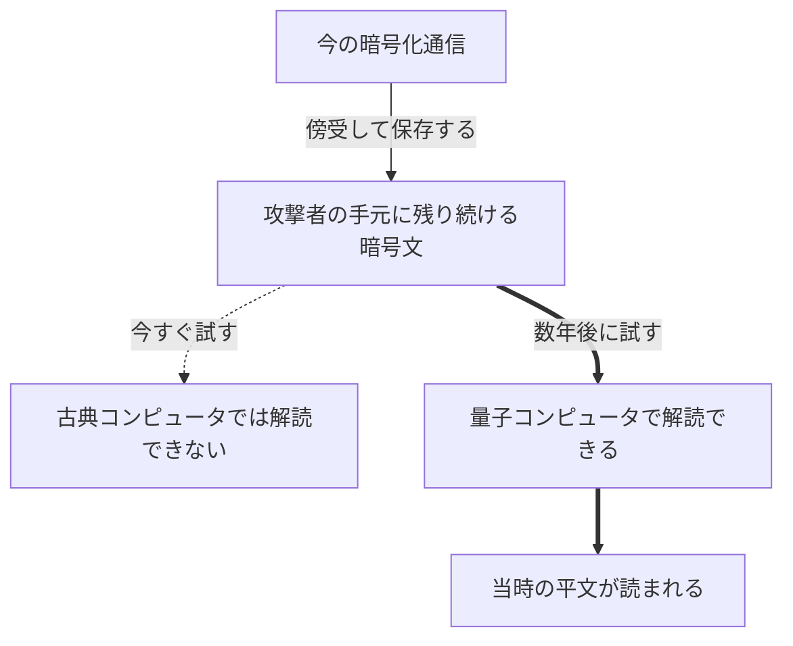

[Go 1.27リリース連載](/articles/20260728a/)の8本目です。

# はじめに

Go 1.27で`crypto/mldsa`が追加されました。ポスト量子暗号のデジタル署名ML-DSAの実装です。

Goのポスト量子暗号への対応はGo 1.24から始まっています。鍵交換のML-KEMが入り、TLSの既定で有効になりました。Go 1.27で署名が加わり、鍵交換と署名の両方が標準ライブラリでそろいました。

今回は、量子コンピュータが暗号のどこに影響するのかという基礎から入り、ML-KEMの動作確認、ML-DSAでの署名と検証、ML-DSA証明書でのTLSサーバー構築までを、手元で動かしながら紹介します。

# 量子コンピュータと暗号

まず、いま使われている公開鍵暗号がなぜ安全なのかを整理します。代表例として、HTTPSの証明書やSSHの鍵で長く使われてきたRSAを取り上げます。

RSAは、大きな素数を2つ掛け合わせた数を公開鍵として使い、元の素数2つは秘密にしておきます。掛け算は簡単ですが、その積から元の素数に戻す作業、つまり素因数分解は、桁数が増えるほど難しくなります。この積が何ビットの数かを鍵長と呼びます。RSA-2048なら積が2048ビットの数で、10進に直すと600桁あまりになります。

楕円曲線暗号（ECDSAやECDH）とDiffie-Hellman（DH）は離散対数と呼ばれる別の問題を使いますが、基本的な考え方は同じです。片方向の計算は簡単で、逆向きは現実的な時間では解けない、という非対称性に安全性を置いています。

しかし、この「現実的な時間では解けない」は、古典コンピュータ（いま私たちが使っているコンピュータのことで、量子コンピュータと区別するときにこう呼びます）を相手にした話です。

## 量子コンピュータとは

量子コンピュータは、量子ビットという単位で計算する計算機です。古典コンピュータのビットが0か1のどちらかを取るのに対して、量子ビットは0と1が重なり合った状態を取れます。重ね合わせのまま計算を進め、最後に読み出した時点で0か1に確定します。

この重ね合わせを活かした専用のアルゴリズムを組むと、特定の問題を桁違いに速く解けます。裏を返すと、専用アルゴリズムが見つかっていない計算処理は速くならないと言われています。また、大きな問題を解くには多くの量子ビットが必要で、量子コンピュータの規模は量子ビットの数で決まります。

そして素因数分解と離散対数には、その専用アルゴリズムが見つかっています。

## Shorのアルゴリズム

1994年にPeter Shorが発表した[量子コンピュータ向けのアルゴリズム](https://ja.wikipedia.org/wiki/ショアのアルゴリズム)は、素因数分解と離散対数を、古典コンピュータよりはるかに少ない手間で解きます。

差が出るのは鍵長を伸ばしたときの増え方です。

```text
解読にかかる手間（縦軸は対数目盛）
  ^
  |                              *   古典コンピュータ
  |                         *
  |                    *
  |               *
  |          *
  |     *
  |  *
  |
  |  o    o    o    o    o    o      量子コンピュータ（Shorのアルゴリズム）
  +--------------------------------->
    512  1024  2048  4096          RSAの鍵長（ビット）
```

RSAの鍵長を1024ビットから2048ビットへ倍にすると、古典コンピュータでの解読の手間はおよそ43億倍に増えます。NISTの見積もりで、安全性が80ビット相当から112ビット相当へ上がるためです。この増え方があったので、計算機が速くなっても鍵長を伸ばして対応できました。

同じ変更に対して、Shorのアルゴリズムの手間は8倍程度にしか増えません。実装によりますが、手間は鍵長の3乗あたりで増えるとされていて、鍵長が倍なら2の3乗で8倍です。8倍で済むなら、攻撃側は量子ビットの数を増やすだけで対処できてしまいます。

つまり、鍵長を伸ばして攻撃側の計算時間を引き延ばす、という従来の防御が使えなくなります。Shorのアルゴリズムを実行できる数の量子ビットがそろえば、RSAとECDSA、ECDH、DHはまとめて安全性を失います。鍵長の調整では防ぎきれないため、アルゴリズムそのものを入れ替える必要があります。

## 対称鍵暗号とハッシュ関数

一方、AESやSHA-2、SHA-3への影響はずっと小さいとされています。これらには素因数分解のような数学的な構造がなく、Shorのアルゴリズムが働く余地がないからです。解読の手段は基本的に総当たりです。

その総当たりを速くするのが[Groverのアルゴリズム](https://ja.wikipedia.org/wiki/グローバーのアルゴリズム)で、探索の手間を平方根まで縮めます。128ビットの鍵なら、2の128乗回の試行が2の64乗回相当になります。ただし、こちらは鍵長を伸ばせば相殺できます。AES-256であれば2の128乗回相当が残るので、いま128ビット鍵に期待している水準を保てます。

ここまでを整理すると、次のとおりです。

| 対象 | 解読の手がかり | 量子コンピュータの影響 | 対応 |
| --- | --- | --- | --- |
| RSA、ECDSA、ECDH、DH | 素因数分解、離散対数 | Shorのアルゴリズムで解ける | アルゴリズムを入れ替える |
| AES、SHA-2、SHA-3 | 総当たりのみ | Groverのアルゴリズムで探索が平方根に短縮 | 鍵長やダイジェスト長を伸ばす |

## NISTが標準化したアルゴリズム

暗号を解ける規模の量子コンピュータが現れても、AESやSHA-2、SHA-3は鍵長やダイジェスト長を伸ばせば使い続けられます。手を打たなければならないのは、表の上の行にあるRSAとECDSA、ECDH、DHです。鍵長では防ぎきれないため、代わりのアルゴリズムが必要になります。

その置き換え先として、NISTは公募と評価を経て、[2024年8月に3つの標準を確定しました](https://www.nist.gov/news-events/news/2024/08/nist-releases-first-3-finalized-post-quantum-encryption-standards)。

| 標準 | アルゴリズム | 用途 |
| --- | --- | --- |
| FIPS 203 | ML-KEM（旧Kyber） | 鍵交換 |
| FIPS 204 | ML-DSA（旧Dilithium） | デジタル署名 |
| FIPS 205 | SLH-DSA（旧SPHINCS+） | デジタル署名 |

この3つのように、量子コンピュータを使っても効率よく解く方法が見つかっていない問題に安全性を置く暗号を、ポスト量子暗号（Post-Quantum Cryptography）と呼びます。量子コンピュータで動かす暗号ではなく、いまのコンピュータの上でそのまま動きます。

ML-KEMとML-DSAの先頭にあるMLはModule-Lattice、つまり格子を指します。格子は空間に規則的に並んだ点の集まりです。

```text
2次元の格子

   *     *     *     *     *

   *     *     *     *     *

   *     *     X  x  *     *

   *     *     *     *     *

   *  格子点
   x  目標の座標（格子点の上にはない）
   X  x に最も近い格子点
```

ここで「指定された座標に最も近い格子点を探す」という問題を考えます。2次元なら目で見て探せます。

ML-KEMとML-DSAが使うのは、数百次元の格子です。ML-KEM-768という名前の768が、その次元を表しています。次元がここまで上がると、最も近い格子点を探すのに、知られているどのアルゴリズムでも次元に対して指数関数的な時間がかかります。

Shorのアルゴリズムは素因数分解と離散対数に特化した手法なので、格子問題には効きません。格子問題を効率よく解く量子アルゴリズムも、今のところ見つかっていません。この見込みのうえに、新しい標準が組まれています。

Goが標準ライブラリに入れたのは、このうちML-KEM（Go 1.24）とML-DSA（Go 1.27）です。

# Harvest Now, Decrypt Later

Shorのアルゴリズムを実行してRSA-2048を破るには、100万個規模の量子ビットが必要という見積もりがあります（[Gidney, 2025](https://arxiv.org/abs/2505.15917)）。いま動いている量子コンピュータの量子ビットは1000個規模なので、まだ3桁の開きがあります。この開きがいつ埋まるかの確かな見通しはありません。それでも今から移行する理由が、Harvest Now, Decrypt Later（HNDL）と呼ばれる攻撃です。攻撃者は暗号化された通信を今のうちに保存しておき、解読できる量子コンピュータが手に入った時点でまとめて復号することを狙っています。



暗号文は攻撃者の手元に残り続けるので、解読できるかどうかは、保存された時点ではなく攻撃者が試した時点の技術で決まります。今は解読できないという状態が、そのまま安全を意味しません。

そして、この攻撃は後から対策できません。移行を終えた後でも、それ以前に流れたトラフィックは保存された側の手元に残っています。移行が早いほど、守れる通信が増えます。期限の目安として、NISTはドラフト段階の[NIST IR 8547](https://nvlpubs.nist.gov/nistpubs/ir/2024/NIST.IR.8547.ipd.pdf)で、量子コンピュータで破れる公開鍵暗号を2035年より後は使用できないものとする方針を示しています。RSA-2048相当の強度のものは、2030年より後は非推奨です。

一方、デジタル署名にこの図式は当てはまりません。暗号文は後から解読できれば中身の秘密が手に入りますが、署名の役割は受け取ったものが本物かをその場で確かめることで、その確認は受け取った時点で終わっています。署名を保存しておいて後から破っても、攻撃者が得るものはありません。署名で問題になるのは、解読できる量子コンピュータが現れた後に、攻撃者が新しい署名を偽造できるようになる点です。

つまり、鍵交換と署名では急ぎ方が違います。鍵交換は、通信がいまも保存され続けているため、今すぐ移行を始める必要があります。署名は、偽造が現実になる前に移行が終わっていれば間に合います。Goもこの順番で、鍵交換をGo 1.24（2025年2月）で、署名をGo 1.27（2026年8月）で入れました。

# Go 1.24のML-KEM

ML-KEMはKEM（Key Encapsulation Mechanism）、つまり鍵交換の仕組みです。Go 1.24で`crypto/mlkem`が入り、同時にTLSの鍵交換にも組み込まれました。

| Go | 既定に追加された鍵交換 |
| --- | --- |
| 1.24 | `X25519MLKEM768` |
| 1.26 | `SecP256r1MLKEM768`、`SecP384r1MLKEM1024` |

いずれも従来の楕円曲線とML-KEMを組み合わせたハイブリッドです。ML-KEMに未知の弱点が見つかっても、楕円曲線側の強度が残ります。`Config.CurvePreferences`が`nil`のときに有効になるため、Go 1.24以降でビルドしたクライアントとサーバーは、相手も対応していれば、コードを変えなくてもポスト量子の鍵交換を使います。

実際に使われたかどうかは、`ConnectionState.CurveID`（Go 1.25で追加されたフィールドです）で確認できます。

```go
package main

import (
	"crypto/tls"
	"fmt"
	"log"
)

func main() {
	conn, err := tls.Dial("tcp", "go.dev:443", &tls.Config{MinVersion: tls.VersionTLS12})
	if err != nil {
		log.Fatal(err)
	}
	defer conn.Close()

	st := conn.ConnectionState()
	fmt.Printf("version: %s\n", tls.VersionName(st.Version))
	fmt.Printf("curve:   %v\n", st.CurveID)
	fmt.Printf("cipher:  %s\n", tls.CipherSuiteName(st.CipherSuite))
}
```

```text
$ go1.27rc2 run .
version: TLS 1.3
curve:   X25519MLKEM768          ← 鍵交換はX25519とML-KEM-768のハイブリッド
cipher:  TLS_AES_128_GCM_SHA256
```

`GODEBUG=tlsmlkem=0`を付けるとポスト量子の鍵交換が既定から外れるので、比較すると違いが分かります。

```text
$ GODEBUG=tlsmlkem=0 go1.27rc2 run .
version: TLS 1.3
curve:   X25519                  ← 鍵交換は従来の楕円曲線だけ
cipher:  TLS_AES_128_GCM_SHA256
```

2つの出力で変わったのは`curve`だけで、`cipher`は同じ`TLS_AES_128_GCM_SHA256`のままです。ポスト量子への移行で入れ替わるのは鍵交換だけで、対称鍵暗号のAESはそのまま使われ続けます。

# Go 1.27のML-DSA

配布されたソフトウェアが改変されていないかを確かめる作業は、ハッシュの比較と署名の検証を組み合わせて成り立っています。この検証は署名アルゴリズムが破られていないことを前提にしているため、署名側の移行も必要になります。

ソフトウェアへの署名で広く使われているSigstoreは、Goで書かれています。Sigstoreはポスト量子暗号をすぐには導入せず、信頼できる実装がGoの`crypto`パッケージに入ることを導入の前提条件としていました。Go 1.27の`crypto/mldsa`で、その前提条件がそろったことになります。Sigstoreの検証の仕組みは[別の記事](https://www.vuls.biz/blog/sigstore-cosign)で整理しました。

ML-DSAはFIPS 204で標準化されたデジタル署名です。`crypto/mldsa`は3つのパラメータセットを提供します。

| パラメータセット | 公開鍵 | 署名 | 秘密鍵（シード） |
| --- | --- | --- | --- |
| ML-DSA-44 | 1312バイト | 2420バイト | 32バイト |
| ML-DSA-65 | 1952バイト | 3309バイト | 32バイト |
| ML-DSA-87 | 2592バイト | 4627バイト | 32バイト |

比較のために、いま広く使われているEd25519を並べると、公開鍵は32バイト、署名は64バイトです。ML-DSAでは最小のML-DSA-44でも署名が2420バイトあり、Ed25519の約38倍です。一方で秘密鍵は32バイトのシードだけです。`crypto/mldsa`は展開済みの秘密鍵形式を扱いません。[proposalの議論](https://github.com/golang/go/issues/77626)では、展開済みの鍵はシードより大きく読み込みも遅いうえに危険であり、利点がないと判断されています。

## 署名して検証する

短いメッセージに署名して、検証まで通してみます。ML-DSAはメッセージをそのまま署名対象にできるため、事前のハッシュ計算は不要です。

```go
package main

import (
	"crypto/mldsa"
	"fmt"
	"log"
)

func main() {
	message := []byte("Hello, World")

	sk, err := mldsa.GenerateKey(mldsa.MLDSA65())
	if err != nil {
		log.Fatal(err)
	}

	opts := &mldsa.Options{Context: "example"}
	sig, err := sk.Sign(nil, message, opts)
	if err != nil {
		log.Fatal(err)
	}

	fmt.Printf("params:      %s\n", sk.PublicKey().Parameters())
	fmt.Printf("private key: %d bytes\n", len(sk.Bytes()))
	fmt.Printf("public key:  %d bytes\n", len(sk.PublicKey().Bytes()))
	fmt.Printf("signature:   %d bytes\n", len(sig))

	// 検証側は公開鍵のバイト列から鍵を復元する
	pk, err := mldsa.NewPublicKey(mldsa.MLDSA65(), sk.PublicKey().Bytes())
	if err != nil {
		log.Fatal(err)
	}
	fmt.Printf("verify:            %v\n", mldsa.Verify(pk, message, sig, opts))

	// メッセージが1文字でも変わると検証に失敗する
	tampered := []byte("Hello, World!")
	fmt.Printf("verify (tampered): %v\n", mldsa.Verify(pk, tampered, sig, opts))
}
```

```text
$ go1.27rc2 run .
params:      ML-DSA-65
private key: 32 bytes
public key:  1952 bytes
signature:   3309 bytes
verify:            <nil>
verify (tampered): mldsa: invalid signature
```

秘密鍵32バイト、公開鍵1952バイト、署名3309バイトという出力は、先ほどの表のML-DSA-65の行と一致します。`verify`の`<nil>`は、`Verify`がエラーを返さなかった、つまり検証に成功したという意味です。最後の行は末尾に`!`を1文字足したメッセージに対する結果で、同じ署名では検証が通らなくなっています。

`sk.Sign`の第1引数は乱数源を渡すための`io.Reader`ですが、この引数は使われず、乱数は内部の安全な乱数源から取られます。`crypto.Signer`インターフェースに形を合わせるためだけにあるので、`nil`を渡します。`*mldsa.PrivateKey`は`crypto.Signer`を実装しているので、このインターフェースを受け取る既存の署名処理にそのまま差し込めます。

`Options.Context`は署名の用途を区別する文字列です。署名時と検証時で一致しないと検証が失敗するため、同じ鍵で用途の違う署名を作るときに境界を引けます。使わないなら`Options`ごと`nil`を渡せます。

# x509とTLSで動かす

Go 1.27では`crypto/x509`と`crypto/tls`もML-DSAに対応しました。`x509.CreateCertificate`に`*mldsa.PublicKey`と`*mldsa.PrivateKey`をそのまま渡せます。あわせて、標準ライブラリのソースツリーにある自己署名証明書の生成ツール[`crypto/tls/generate_cert.go`](https://go.dev/src/crypto/tls/generate_cert.go)に`--mldsa`フラグが追加されました。

## 証明書を作る

```bash
$ go1.27rc2 run $(go1.27rc2 env GOROOT)/src/crypto/tls/generate_cert.go --host=localhost --mldsa
2026/08/06 00:26:49 wrote cert.pem
2026/08/06 00:26:49 wrote key.pem
```

ML-DSA-44の鍵で自己署名証明書ができます。`key.pem`は128バイトです。秘密鍵が32バイトのシードだけなので、この小ささになります。

## サーバーを立てる

```go
package main

import (
	"fmt"
	"log"
	"net/http"
)

func main() {
	http.HandleFunc("/", func(w http.ResponseWriter, r *http.Request) {
		fmt.Fprintln(w, "hello over post-quantum TLS")
	})
	log.Fatal(http.ListenAndServeTLS("localhost:8443", "cert.pem", "key.pem", nil))
}
```

ML-DSA固有の記述はありません。`ListenAndServeTLS`にPEMファイルのパスを渡すだけで、従来のHTTPSサーバーと同じコードです。

先ほどの`cert.pem`と`key.pem`があるディレクトリで実行すると、待ち受けが始まります。

```bash
$ go1.27rc2 run .
```

## 接続して確認する

別のターミナルから`openssl s_client`で接続します。ML-DSAを扱うにはOpenSSL 3.5以降が必要です。末尾の`< /dev/null`は、接続確認だけしてすぐ終了させるための指定です。

```bash
$ openssl s_client -connect localhost:8443 -CAfile cert.pem -servername localhost -brief < /dev/null
```

```text
Connecting to 127.0.0.1
CONNECTION ESTABLISHED
Protocol version: TLSv1.3
Ciphersuite: TLS_AES_128_GCM_SHA256
Peer certificate: O=Acme Co
Hash used: UNDEF
Signature type: mldsa44
Verification: OK
Negotiated TLS1.3 group: X25519MLKEM768
DONE
```

`Signature type: mldsa44`が証明書の署名アルゴリズム、`Verification: OK`がその署名の検証結果、`Negotiated TLS1.3 group: X25519MLKEM768`が鍵交換です。署名と鍵交換の両方がポスト量子暗号になっています。

Goで立てたサーバーに対してOpenSSLが検証に成功しているので、実装をまたいで動くことも確認できます。

## 証明書のサイズ

証明書には、所有者の公開鍵と発行者による署名がほぼそのまま入ります。そのため証明書のサイズは、「署名して検証する」で見た数値からおおよそ決まります。ML-DSA-65なら、公開鍵1952バイト + 署名3309バイト + 残り241バイト（所有者名や有効期間などのフィールド）で5502バイトです。

同じ`x509.Certificate`テンプレートを使い、鍵を作る関数だけを差し替えて、アルゴリズムごとの自己署名証明書を作りました。`ed25519.GenerateKey`、`ecdsa.GenerateKey`、`rsa.GenerateKey`、`mldsa.GenerateKey`のいずれかで鍵を作り、証明書を作る呼び出しは共通にしています。

```go
der, err := x509.CreateCertificate(rand.Reader, tmpl, tmpl, pub, priv)
```

`pub`と`priv`の型はアルゴリズムごとに違いますが、`CreateCertificate`の引数はどちらも`any`なので、呼び出し側の記述は変わりません。証明書（DER）の列は、`CreateCertificate`が返したバイト列の長さです。

| アルゴリズム | 方式 | 公開鍵 | 署名 | 証明書（DER） |
| --- | --- | --- | --- | --- |
| Ed25519 | 楕円曲線の離散対数、従来型 | 32バイト | 64バイト | 312バイト |
| ECDSA P-256 | 楕円曲線の離散対数、従来型 | 65バイト | 約71バイト | 約377バイト |
| RSA-2048 | 素因数分解、従来型 | 270バイト | 256バイト | 773バイト |
| ML-DSA-44 | 格子、ポスト量子 | 1312バイト | 2420バイト | 3973バイト |
| ML-DSA-65 | 格子、ポスト量子 | 1952バイト | 3309バイト | 5502バイト |
| ML-DSA-87 | 格子、ポスト量子 | 2592バイト | 4627バイト | 7460バイト |

ML-DSAの3行はいずれも、公開鍵と署名の合計に241バイトを足した値が証明書のサイズになっています。ECDSAの署名は符号化の都合で生成ごとに1〜2バイト前後するため、約を付けています。

ML-DSAの証明書はECDSA P-256の10倍から20倍です。このサイズは接続を張るときの速さに響きます。TLSでは接続のたびに、サーバーが自分の証明書と発行元のCA証明書をまとめてクライアントへ送ります。ML-DSA-65の証明書（5502バイト）が2枚3枚と重なると、暗号化通信が始まる前のやり取りだけで10キロバイトを超えるためです。

なお、古典アルゴリズムとポスト量子暗号を1つの署名にまとめるcomposite署名は、[proposal](https://github.com/golang/go/issues/78888)で意図的に対象外とされました。移行期に両方の署名を出すなら、独立した2本の署名を作ります。

# まとめ

- いまの公開鍵暗号は、古典コンピュータでは現実的な時間で解けない計算問題に依拠しています。量子コンピュータが実用化すると、この前提が崩れて危殆化します
- 攻撃者はHarvest Now, Decrypt Laterを狙っています。暗号文を保存しておいて、後から解読する攻撃です。将来の量子コンピュータによる解読に備えて、今のうちに対策する必要があります
- Goの鍵交換は1.24から対応済みです。相手が対応していれば、何もしなくてもポスト量子になっています。`ConnectionState.CurveID`で確認できます
- 1.27の`crypto/mldsa`で署名も作れるようになりました。署名は数十倍に膨らみますが、秘密鍵は32バイトで済みます
- 証明書とTLSもML-DSAで動きます。`generate_cert.go`の`--mldsa`で手元で試せます

# 参考

- [Go 1.27リリース連載（インデックス）](https://future-architect.github.io/articles/20260728a/)
- [Go 1.27 Release Notes](https://go.dev/doc/go1.27)
- [Go 1.24 Release Notes](https://go.dev/doc/go1.24)
- [crypto/mldsa](https://pkg.go.dev/crypto/mldsa)
- [crypto/mlkem](https://pkg.go.dev/crypto/mlkem)
- [proposal: crypto/mldsa: new package · golang/go#77626](https://github.com/golang/go/issues/77626)
- [proposal: crypto/x509,crypto/tls: add ML-DSA support · golang/go#78888](https://github.com/golang/go/issues/78888)
- [FIPS 204: Module-Lattice-Based Digital Signature Standard](https://doi.org/10.6028/NIST.FIPS.204)
- [NIST IR 8547 (Initial Public Draft): Transition to Post-Quantum Cryptography Standards](https://nvlpubs.nist.gov/nistpubs/ir/2024/NIST.IR.8547.ipd.pdf)
- [Sigstore & Post-Quantum Cryptography (2025)](https://blog.sigstore.dev/post-quantum-2025/)
- [Sigstore・cosign で「改ざんされていない」を検証した仕組み](https://www.vuls.biz/blog/sigstore-cosign)

