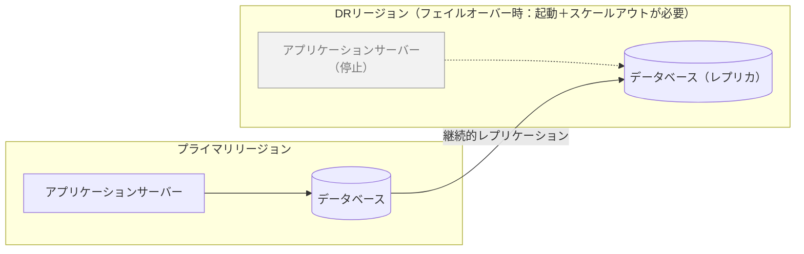
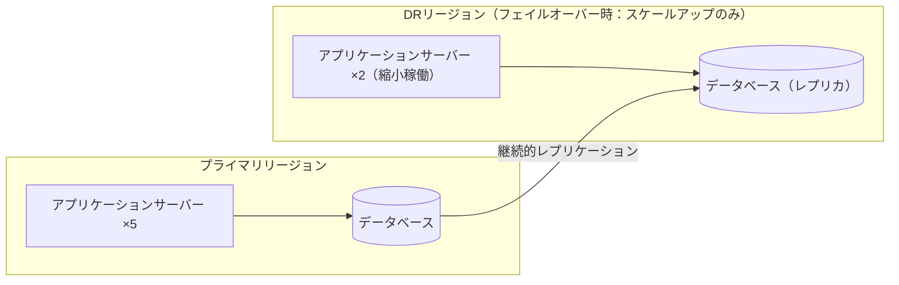
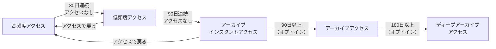
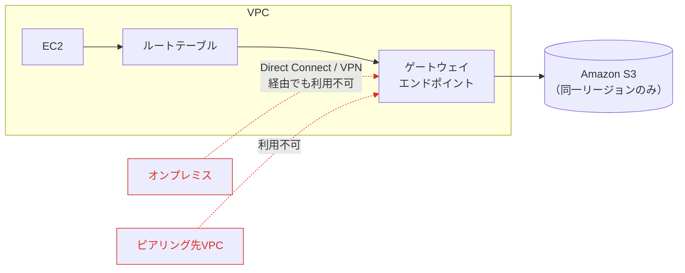
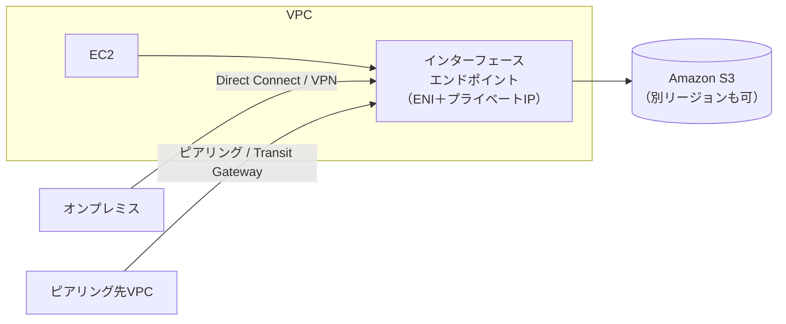
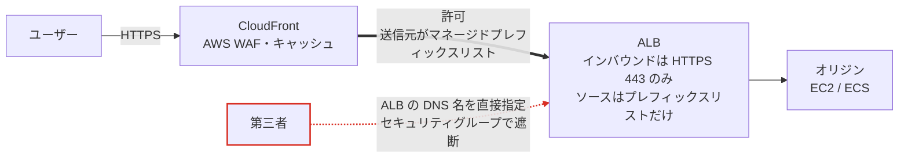

## はじめに

Cyber Security Innovation Group、FutureVulsチームの棚井です。

2026年7月25日に「AWS Certified Solutions Architect - Professional (SAP-C02)」を受験し、812点/1000点（合格ラインは750点）で一発合格しました。

これまでに「[AWS Certified Security - Specialty](https://future-architect.github.io/articles/20260604a/)」「[AWS Certified Advanced Networking - Specialty](https://future-architect.github.io/articles/20260708a/)」のスペシャリティ2つと、「[AWS Certified Generative AI Developer - Professional](https://future-architect.github.io/articles/20260721a/)」のプロフェッショナル1つに合格してきました。残るプロフェッショナルは「Solutions Architect」と「DevOps Engineer」の2つです。

どちらを先に受けるか迷いました。SAP-C02を選んだ理由は、これまでの業務と資格勉強で身につけたスキルとの重複範囲が広そうだったからです。SAP-C02はネットワーク、セキュリティ、データベース、移行と、AWSの全領域を横断します。Specialtyで深掘りしたネットワークとセキュリティが、そのまま使えるのではないかという読みがありました。

もうひとつは、AIとの対話で「難しい方はどちらか」を聞いたところ、SAPだと返ってきたことです。どうせ両方受けるのであれば、難しい方を先に片付けて、残りを楽に進めたいと考えました。この判断がどう転んだかは、後半の「試験結果の振り返り」で書きます。

## 試験の概要

SAP-C02は、AWS Well-Architected Frameworkに基づいてAWSソリューションを設計し、最適化する能力を検証する試験です。受験対象者は「AWSのサービスを使用してクラウドソリューションを設計し、実装した経験が2年以上ある人」とされています。

### 試験の基本情報

| 項目 | 内容 |
| --- | --- |
| 試験コード | SAP-C02 |
| 試験時間 | 180分 |
| 設問数 | 75問（採点対象65問＋採点対象外10問） |
| 出題形式 | 択一選択問題（正解1つ・不正解3つ）、複数選択問題（5つ以上の選択肢から正解2つ以上） |
| 受験料 | 300 USD |
| スコア | 100〜1,000のスケールスコア |
| 合格ライン | 750点 |
| 対応言語 | 英語、日本語、韓国語、ポルトガル語（ブラジル）、中国語（簡体字）、スペイン語（ラテンアメリカ） |

未回答の設問は不正解とみなされますが、推測による回答にペナルティはありません。わからなくても必ず何かを選ぶべき、という点はほかのAWS認定と同じです。

### コンテンツ分野と出題比率

| 分野 | 出題の比率 |
| --- | --- |
| 第1分野: 複雑な組織に対応するソリューションの設計 | 26% |
| 第2分野: 新しいソリューションのための設計 | 29% |
| 第3分野: 既存のソリューションの継続的な改善 | 25% |
| 第4分野: ワークロードの移行とモダナイゼーションの加速 | 20% |

比率が26%・29%・25%・20%とほぼ均等に割り振られているので、全分野を満遍なく押さえる必要があります。Specialty試験のように、特定領域が突出して配点されているわけでもありません。

[試験ガイド](https://d1.awsstatic.com/ja_JP/training-and-certification/docs-sa-pro/AWS-Certified-Solutions-Architect-Professional_Exam-Guide_C02.pdf)のタスクステートメントは合計20あります。内訳は第1分野に5つ、第2分野に6つ、第3分野に5つ、第4分野に4つです。ネットワーク接続戦略、セキュリティコントロール、信頼性と耐障害性、マルチアカウント環境、コスト最適化、事業継続性、パフォーマンス、運用上の優秀性、移行戦略の選定、モダナイゼーションと、AWSの設計論がひととおり網羅されています。

これが「最難関」と言われる理由でしょう。個々のサービスの知識だけを見れば、Specialtyのほうが深いところまで問われます。SAP-C02で難しいのは、試験ガイドの構成からわかるように、全領域を横断したうえで「この要件に対する最適解はどれか」を判断する力が求められるところです。

加えて、公式のサンプル問題を見てもわかるとおり、問題文と選択肢がどちらも長めです。要件が何行も続いたあとに、それぞれ数行ある選択肢を比べることになるので、知識とは別に読み解く負荷がかかります。

## 学習方法

今回は書籍とUdemyの2本立てで、わからない部分や知らないサービスはPerplexityに質問して補いました。「[AWS Certified Generative AI Developer - Professional](https://future-architect.github.io/articles/20260721a/)」のときは日本語の教材が限られていたので、学習計画そのものをAIと組み立てる必要がありました。SAP-C02は歴史のある試験で教材が充実しているぶん、AIの役割は教材の穴を埋めるところに落ち着きました。

### 1. 書籍で全分野を一通り押さえる

『[AWS教科書 AWS認定ソリューションアーキテクトプロフェッショナル テキスト＆問題集](https://www.shoeisha.co.jp/book/detail/9784798183428)』（煤田弘法、西城俊介、上堂薗健 著／翔泳社）を使いました。

この書籍を選んだのは、章立てが試験の4分野にそのまま対応しているからです。

- 序章: 試験とサービスの基礎知識
- 第1章: 複雑な組織に対応するソリューションの設計（第1分野）
- 第2章: 新しいソリューションのための設計（第2分野）
- 第3章: 既存のソリューションの継続的な改善（第3分野）
- 第4章: ワークロードの移行とモダナイゼーションの加速（第4分野）
- 第5章: 模擬試験

まず内容を一通り読み、書籍内の演習問題は全て解きました。例題68問、節末の確認問題64問、そして模擬試験1回分が収録されています。各章を読み終えるたびに節末の確認問題で理解度を測り、最後に模擬試験で全分野をまとめて解く流れになるので、知識の抜け漏れをその都度つぶしていけました。

説明に図がふんだんに使われているのも助かりました。マルチアカウント構成やDRの切り替えのように、構成要素の関係を文章だけで追うのが大変なところでも、図と並べて読むと構成をイメージしやすくなります。

特に良かったのは、この書籍が「要件を理解する→関連するサービスや機能を探す→典型的なアーキテクチャを見る」という3ステップで設計手法を説明していることです。SAP-C02の問題文はこの順番で読み解くことになるので、書籍の構成そのものが解き方の訓練になっていました。

### 2. Udemyの演習問題で多くの問題パターンに触れる

『[【図解付き】AWS SAP-C02完全対応 2026年版本番同等演習問題集+詳細解説](https://www.udemy.com/course/aws-sap-practice/)』（syo @Cloud 講師）を使いました。

この講座の解説が詳しくて学べることは、過去の試験勉強から知っていました。「[AWS Certified Security - Specialty](https://future-architect.github.io/articles/20260604a/)」「[AWS Certified Advanced Networking - Specialty](https://future-architect.github.io/articles/20260708a/)」「[AWS Certified Generative AI Developer - Professional](https://future-architect.github.io/articles/20260721a/)」でも同じ講師の講座を使っており、今回で4回連続です。

いちばん効いたのは解説の詳しさです。各設問に、正解だけでなく不正解の選択肢にも解説が付き、問題文や選択肢に登場した用語の説明まで入っています。この種の選択式試験では選択肢がどれもそれらしく見えるので、「なぜこれは違うのか」を言語化できるかどうかが消去法の精度を決めます。知らないサービス名が出てきても、調べ直さずに解説の中で拾えました。

さらに、すべての解説にアーキテクチャ図かデータフロー図が付いているのもGoodポイントです。SAP-C02の問題文は状況設定が長いので、図と対応づけて読むと「この構成のどこがボトルネックか」が頭に残ります。不明点をその場で解決できるため、1問解くたびに複数の知識が入ってきます。

注意点として、詳しさの裏返しで、全問を解き切ろうとすると相当な時間がかかります。1問ごとに解説を読み込んでいくと、問題数のわりに進みません。演習の問題数だけを見て計画を立てると足りなくなるので、解説を読む時間まで含めて見積もっておくのが良いと思います。

## 試験勉強で得た学び

### 7つの移行戦略（7R）の使い分け

第4分野の中心にあるのが、[7つの移行戦略（7R）](https://docs.aws.amazon.com/ja_jp/prescriptive-guidance/latest/large-migration-guide/migration-strategies.html)です。リホストやリファクタリングのように、いくつかの戦略名は個別に聞いたことがありました。ただ、それらが7Rとして体系化されていることは知らず、今回の試験勉強で初めて全体像を押さえられました。7つを並べて比べると、判断軸がはっきりします。

| 戦略 | 別名 | 何を変えるか | 使いどころ |
| --- | --- | --- | --- |
| リタイア（Retire） | — | 廃止する | ビジネス価値がない、90日間インバウンド接続がない、セキュリティリスクが高い |
| リテイン（Retain） | — | 何も変えない（移行しない） | データレジデンシー要件、他アプリの移行待ち、最近アップグレードしたばかり |
| リロケート（Relocate） | — | 実行場所だけ | ハードウェア購入もアプリ書き換えも運用変更もせずに移す |
| リホスト（Rehost） | リフト・アンド・シフト | 実行場所（アプリはそのまま） | 短期間で多数のマシンを、最小のダウンタイムで移す |
| リプラットフォーム（Replatform） | リフト・ティンカー・シフト | 一部を最適化 | マネージド／サーバーレス化、OSアップグレード、Graviton活用、VMをコンテナへ |
| リパーチェス（Repurchase） | ドロップ・アンド・ショップ | 製品そのもの | ライセンス製品をSaaSに置き換える |
| リファクタリング（Refactor/Rearchitect） | — | アーキテクチャ | モノリスの制約が課題、俊敏性やスケーラビリティを上げたい |

覚え方として効いたのは、移行後に何が変わるかの変化量で並べることです。リタイアとリテインは移行しないので変化なし、リロケートとリホストは場所だけ、リプラットフォームは一部、リパーチェスは製品、リファクタリングはアーキテクチャそのものが変わります。この順に、移行後に変わる範囲が広がっていきます。

ただし、コストの高さがそのまま同じ順に並ぶわけではありません。AWSが明記しているのは「リファクタリングは移行戦略のなかで最も複雑でコストが高い」（[Refactoring is the most complex and costly of the migration strategies](https://docs.aws.amazon.com/prescriptive-guidance/latest/large-migration-guide/migration-strategies.html#refactor)）という点だけです。リパーチェスについては保守・インフラ・ライセンスにかかるコストを削減できると説明されているので、変化量の大きさとコストの高さを一本の線で結んで覚えないよう注意してください。

そしてAWSの大規模移行ガイドでは、大規模移行の一般的な戦略としてリホスト・リプラットフォーム・リロケート・リタイアが挙げられています。リファクタリングは理想的に見えますが、移行中のモダナイズを伴う最も複雑な戦略であるため、大規模移行では推奨されていません。短期間で多数のワークロードを移す要件では、技術的に一番きれいな構成が最適解になるとは限らない、というのが大規模移行の設計感覚です。

### DR戦略の4パターン、パイロットライトとウォームスタンバイの違い

試験ガイドを見ると、事業継続性や信頼性のタスクステートメントとして第1分野・第2分野・第3分野に横断して含まれているのがDR（災害対策）戦略です。[AWSのホワイトペーパー](https://docs.aws.amazon.com/ja_jp/whitepapers/latest/disaster-recovery-workloads-on-aws/disaster-recovery-options-in-the-cloud.html)では4パターンが定義されており、RTOとRPOの目安は[AWS Well-Architected 信頼性の柱のREL13-BP02](https://docs.aws.amazon.com/ja_jp/wellarchitected/latest/reliability-pillar/rel_planning_for_recovery_disaster_recovery.html)に数値で載っています。

（出典: [AWS 災害対策ホワイトペーパー「クラウド内での災害対策オプション」](https://docs.aws.amazon.com/ja_jp/whitepapers/latest/disaster-recovery-workloads-on-aws/disaster-recovery-options-in-the-cloud.html)）

| 戦略 | 分類 | RTO | RPO | コスト | DRリージョンの状態 |
| --- | --- | --- | --- | --- | --- |
| バックアップと復元 | アクティブ/パッシブ | 24時間以下 | 数時間 | 最低 | バックアップのみ |
| パイロットライト | アクティブ/パッシブ | 数十分 | 数分 | 低〜中 | データ層は稼働、アプリ層はスイッチオフ |
| ウォームスタンバイ | アクティブ/パッシブ | 数分 | 数秒 | 中〜高 | 全コンポーネントが縮小容量で稼働 |
| マルチサイトアクティブ/アクティブ | アクティブ/アクティブ | ほぼゼロ | ゼロに近い | 最高 | 全リージョンが本番構成で稼働 |

REL13-BP02には「戦略は、コストと複雑さが低く、かつ RTO と RPO が長い順にリストされます」と書かれています。つまり表の並び順そのものが判断の手がかりになるので、パイロットライトのRPOがウォームスタンバイより短くなることはありません。分類で見ると、アクティブ/パッシブのパターンが3つあり、アクティブ/アクティブはマルチサイトの1つだけです。

学習していて少し迷ったのは、パイロットライトとウォームスタンバイの違いです。どちらもDRリージョンにプライマリのコピーを持つので、混同しやすいところです。AWS公式ドキュメントには、次のように書かれています。

> パイロットライトは追加のアクションを最初に実行しない限りリクエストを処理できないのに対し、ウォームスタンバイはトラフィックを (キャパシティーレベルを減らして) すぐに処理できる

判断基準は、いま切り替えたらリクエストを処理できるかどうかです。両者の構成を図にすると次のとおりです。

**パイロットライト**

**ウォームスタンバイ**

もうひとつ、Professionalらしい観点として印象に残ったのが、フェイルオーバーはデータプレーンで実装せよという原則です。Auto Scalingによるスケールアップはコントロールプレーンの操作なので、大規模障害時には可用性が下がりかねません。低RTOを確保したいなら、初期トラフィック分をあらかじめプロビジョニングし、追加分をAuto Scalingで処理するハイブリッドな実装が、ホワイトペーパーではトレードオフの選択肢として紹介されています。机上で動くはずの構成と、障害のときに本当に動く構成は別物だという話でした。

### S3 Intelligent-Tieringの階層と、ライフサイクルとの使い分け

コスト最適化は第1・第2・第3分野すべてに登場します。そのなかでもS3のストレージクラス選定は、複数分野のコスト最適化タスクに関わる重要テーマです。

[S3 Intelligent-Tiering](https://docs.aws.amazon.com/ja_jp/AmazonS3/latest/userguide/intelligent-tiering-overview.html)は、アクセスパターンに応じて階層を自動で移動させる仕組みです。

| 階層 | 移行条件 | 取り出し時間 |
| --- | --- | --- |
| 高頻度アクセス | デフォルト | 即座 |
| 低頻度アクセス | 30日連続でアクセスなし | 即座 |
| アーカイブインスタントアクセス | 90日連続でアクセスなし | ミリ秒 |
| アーカイブアクセス（オプション） | 90日以上アクセスなし（最大730日まで設定可） | 3〜5時間 |
| ディープアーカイブアクセス（オプション） | 180日以上アクセスなし（最大730日まで設定可） | 12時間以内 |

階層の遷移を図にすると次のとおりです。実線は自動の移動、破線はオプトインの移動です。

アーカイブインスタントアクセスまでは何もしなくても効きますが、Glacier相当の2階層に落としたいなら明示的に有効化する必要があります。

そして128KB未満のオブジェクトはモニタリング対象外で、常に高頻度アクセス階層に置かれます。小さなファイルが大量にあるワークロードでは、Intelligent-Tieringのメリットが出ません。実務でも見落としやすい注意点だと思いました。

ライフサイクルポリシーとの使い分けも、あわせて整理しておきたいポイントです。アクセスパターンが読めない、あるいは変動するときはIntelligent-Tieringを選びます。逆に、アクセスパターンが明確に予測できるなら、ライフサイクルポリシーで決め打ちした方が、モニタリングと自動化の料金がかからないぶん安くなります。

階層移動のタイマーをリセットするアクション（`GetObject`、`PutObject`、`CopyObject`など）と、リセットしないアクション（`HeadObject`、`ListObjects`、`GetObjectTagging`など）が区別されているのも面白いところでした。メタデータを見るだけの操作は、アクセスとみなされません。

### S3 Storage Lensの無料メトリクスと高度なメトリクス

コスト最適化を実行する前に、どこに無駄があるかを可視化する必要があります。それを担うのが[S3 Storage Lens](https://docs.aws.amazon.com/ja_jp/AmazonS3/latest/userguide/storage_lens_basics_metrics_recommendations.html)です。組織・アカウント・リージョン・バケット・プレフィックスを横断して、ストレージの使用状況を集計できます。

| 項目 | 無料メトリクス | 高度なメトリクスとレコメンデーション（有料） |
| --- | --- | --- |
| クエリ可能期間 | 14日 | 15か月 |
| 集計レベル | バケットレベルまで | プレフィックスレベルまで |
| アクティビティメトリクス（GET/PUT等） | × | ○ |
| ステータスコード別メトリクス（403、503等） | × | ○ |
| CloudWatchへのパブリッシュ | × | ○ |
| レコメンデーション | × | ○ |

第1分野のマルチアカウント環境と絡めて押さえたいのが、AWS Organizationsとの連携です。信頼されたアクセスを有効化すれば全メンバーアカウントのメトリクスを集約でき、委任管理者を指定して運用を任せることもできます。組織全体のストレージ利用状況を可視化したい場合は、Storage Lensが適しています。

### S3のゲートウェイエンドポイントとインターフェースエンドポイントの使い分け

VPCエンドポイントの使い分けは、第1分野のタスクステートメント「ネットワーク接続戦略を設計する」に含まれる領域です。ここは「[Advanced Networking - Specialty](https://future-architect.github.io/articles/20260708a/)」で押さえた知識がそのまま活きました。S3へプライベートにアクセスする方式は2つあります。

| 項目 | [ゲートウェイエンドポイント](https://docs.aws.amazon.com/ja_jp/vpc/latest/privatelink/gateway-endpoints.html) | [インターフェースエンドポイント](https://docs.aws.amazon.com/ja_jp/vpc/latest/privatelink/create-interface-endpoint.html) |
| --- | --- | --- |
| 実装方式 | ルートテーブルにプレフィックスリスト宛のルートを追加 | サブネットにENIを作成しプライベートIPを割り当て |
| 料金 | 追加料金なし | 有料（時間課金＋データ処理料金） |
| セキュリティグループ | 適用不可（アウトバウンドルールで宛先にプレフィックスリストを指定） | 適用可 |
| オンプレミスからの利用 | 不可 | 可（Direct Connect／VPN経由） |
| VPCピアリング／Transit Gateway経由 | 不可 | 可 |
| リージョン | 同一リージョン内のみ | クロスリージョン対応 |
| AWS PrivateLink | 使用しない | 使用する |

経路の違いを図にすると次のとおりです。

**ゲートウェイエンドポイント**

**インターフェースエンドポイント**

判断軸は明快で、VPC内からだけ使うのか、オンプレミスやほかのVPCからも使うのかで決まります。

VPC内のインスタンスからS3にアクセスするだけなら、ゲートウェイエンドポイントが無料なので迷う必要はありません。しかし、Direct Connect経由でオンプレミスからS3にプライベートアクセスしたい、あるいはVPCピアリング先のVPCから使いたいという要件が入った瞬間に、ゲートウェイエンドポイントは選択肢から外れます。ここでインターフェースエンドポイントが必要になります。

「無料だからゲートウェイ」「PrivateLinkだからインターフェース」と決め打ちせず、オンプレミスや他VPCからの利用有無とコストの両面から選ぶのが基本です。

### CloudFrontのマネージドプレフィックスリストでオリジンを保護する

セキュリティ領域で新たに学んだのが、CloudFrontとALBを組み合わせる際のオリジン保護です。

CloudFrontをALBの前に置いても、ALBのDNS名が知られていればCloudFrontを迂回して直接アクセスされてしまいます。WAFやキャッシュを回避されるので、オリジン側でCloudFrontからのアクセスだけを許可したいところです。ここで使うのが[CloudFrontのマネージドプレフィックスリスト](https://docs.aws.amazon.com/ja_jp/AmazonCloudFront/latest/DeveloperGuide/LocationsOfEdgeServers.html)です。

- `com.amazonaws.global.cloudfront.origin-facing`（IPv4）
- `com.amazonaws.global.ipv6.cloudfront.origin-facing`（IPv6）

これらはCloudFrontのオリジン向けサーバーのIPアドレス範囲を含むマネージドプレフィックスリストで、AWSが自動で最新に保ってくれます。オリジン（ALBやEC2）のセキュリティグループで、このプレフィックスリストからのインバウンドHTTPS（443）を許可し、それ以外のインバウンドルールをすべて削除します。これでCloudFront以外のトラフィックがオリジンに到達しなくなります。

図にすると次のようになります。

自前でCloudFrontのIPレンジを取得して更新していく運用は、更新漏れが即障害になるので避けたいところです。マネージドプレフィックスリストなら、その管理をAWSに寄せられます。

ただし注意点があります。マネージドプレフィックスリストがセキュリティグループのルール数として消費するのは1ルールではなく、そのプレフィックスリストに設定された「重み（Weight）」の分です。セキュリティグループのルール数にはクォータがあるので、重みを考慮せずに設定すると上限に引っかかることがあります。「マネージドプレフィックスリストを使えば1行で済む」と思い込んでいると、実務で踏む地雷になりそうです。

## 試験結果の振り返り

最終スコアは812点（合格ライン750点）で、62点上回っての一発合格でした。

分野別の評価は次のとおりです。

| コンテンツ分野 | 出題比率 | 評価 |
| --- | --- | --- |
| 第1分野: 複雑な組織に対応するソリューションの設計 | 26% | コンピテンシーを満たしている |
| 第2分野: 新しいソリューションのための設計 | 29% | コンピテンシーを満たしている |
| 第3分野: 既存のソリューションの継続的な改善 | 25% | コンピテンシーを満たしている |
| 第4分野: ワークロードの移行とモダナイゼーションの加速 | 20% | コンピテンシーを満たしている |

4分野すべてで「コンピテンシーを満たしている」という結果になりました。

全分野を埋められた理由は、過去に合格した試験の勉強が効いたことだと思っています。冒頭に書いた「重複範囲が広そう」という読みは、想定以上に当たりました。第1分野のタスクステートメント1が「ネットワーク接続戦略を設計する」なので、「[Advanced Networking - Specialty](https://future-architect.github.io/articles/20260708a/)」の範囲がそのまま復習になりました。IAMのクロスアカウントアクセスやKMSの暗号化戦略も「[Security - Specialty](https://future-architect.github.io/articles/20260604a/)」と重なります。そこに書籍とUdemyで広く問題パターンに触れたことが加わり、ある分野が弱くても他分野で補うという戦い方をせずに済みました。

SAPはAWS認定の最難関とされますが、全領域を総合した試験なので、ほかの試験に合格してからチャレンジした方が、復習にもなって良いのかもしれません。私は「難しい方を先に片付けたい」という理由でSAPを選びましたが、結果としてはSpecialty2つとProfessional1つの合計3つを積み上げたあとにSAPを受けたことが、追い風になっていました。

時間配分については、見直しも含めて180分すべてを使いました。75問を180分なので1問あたり2.4分ですが、長文の状況設定を読み、選択肢を4つ（複数選択なら5つ以上）比較していると、それなりに押します。余裕があるとは言えない配分でした。

## おわりに

「難しい方を先に片付けて、残りを楽に進めたい」という動機で選んだSAP-C02でしたが、受け終えてみると、難しかったのは知識の深さよりも全領域を同時に扱う総合力でした。

その総合力は、日々のAWSクラウドインフラ業務と、ネットワーク・セキュリティ・生成AIという専門領域を1つずつ押さえてきた積み上げが形になったものだと感じています。業務で設計や運用をしている構成と出題範囲が広く重なるので、日々の仕事と試験勉強がまっすぐつながりました。「最難関」という言葉に身構えていましたが、受け終えて感じたのは、これまで学んだことと日々やっていることを、要件に合わせて選ぶ力の大切さでした。

次は、残るプロフェッショナルであるAWS Certified DevOps Engineer - Professionalを目指します。当初の狙いどおり難しい方を先に倒したので、ここからは積み上げた知識を活かして進められるはずです。SAP-C02で押さえたCI/CD、IaC、Systems Manager、モニタリングと自動修復の考え方は、DevOps側と重なる部分が多いと見ています。

AWSのサービスは日進月歩なので、試験に合格してもキャッチアップは終わりません。
