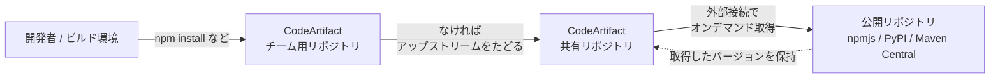
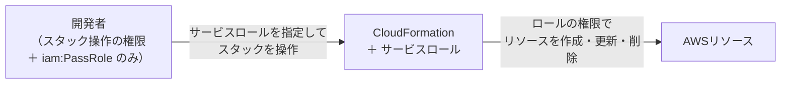
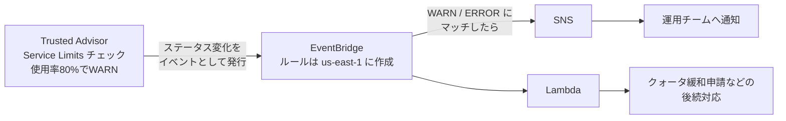

## はじめに

Cyber Security Innovation Group、FutureVulsチームの棚井です。

2026年7月27日に「AWS Certified DevOps Engineer - Professional (DOP-C02)」を受験し、833点/1000点（合格ラインは750点）で一発合格しました。

先日、「[AWS Certified Solutions Architect - Professional 合格体験記](https://future-architect.github.io/articles/20260813a/)」を公開しました。その記事の締めで、次はDevOps Engineer - Professionalを目指すと書いており、SAP-C02に合格した勢いのまま受験しました。

## 試験の概要

DOP-C02は、DevOpsエンジニアロールを担う人を対象に、AWSでの分散システムのプロビジョニングや運用、管理の技術的な専門知識を検証する試験です。受験対象者には「AWS環境でのプロビジョン、運用、管理に関する2年以上の経験」に加えて、ソフトウェア開発ライフサイクルとプログラミングまたはスクリプティングの経験が求められています。

### 試験の基本情報

| 項目 | 内容 |
| --- | --- |
| 試験コード | DOP-C02 |
| 試験時間 | 180分 |
| 設問数 | 75問（採点対象65問＋採点対象外10問） |
| 出題形式 | 択一選択問題（正解1つ・不正解3つ）、複数選択問題（5つ以上の選択肢から正解2つ以上） |
| 受験料 | 300 USD |
| スコア | 100〜1,000のスケールスコア |
| 合格ライン | 750点 |
| 対応言語 | 英語、日本語、韓国語、中国語（簡体字） |

出題形式や合格ラインはSAP-C02と同じです。

### コンテンツ分野と出題比率

| 分野 | 出題の比率 |
| --- | --- |
| 第1分野: SDLCのオートメーション | 22% |
| 第2分野: 設定管理とIaC | 17% |
| 第3分野: 耐障害性の高いクラウドソリューション | 15% |
| 第4分野: モニタリングとロギング | 15% |
| 第5分野: インシデントとイベントへの対応 | 14% |
| 第6分野: セキュリティとコンプライアンス | 17% |

最大配点は第1分野「SDLCのオートメーション」の22%で、第2分野「設定管理とIaC」と合わせると39%になります。CI/CDパイプラインとIaCが試験の中心です。

面白いのは、[試験ガイド](https://d1.awsstatic.com/ja_JP/training-and-certification/docs-devops-pro/AWS-Certified-DevOps-Engineer-Professional_Exam-Guide.pdf)に「受験対象者として範囲外の職務」が明記されていることです。高度なネットワークに関する知識、データベースの設計やクエリ、パフォーマンスの最適化、フルスタックアプリケーションのコード開発は範囲外とされています。全領域を広く問うSAP-C02に対して、DOP-C02は運用の自動化に的を絞った試験です。

## 学習方法

今回はSkill BuilderとUdemyの2本立てです。これまでの試験勉強で続けてきた「わからないところをPerplexityに質問する」流れは、今回はほとんど使いませんでした。後述するUdemyの解説が詳しく、疑問がその場で解消されたからです。

### 1. Skill Builderで出題の傾向をつかむ

まず[AWS Skill Builder](https://skillbuilder.aws/)で、分野別のDomain Practiceを1から6まで解きました。問題の傾向を知るためです。そのあとに、無料で受けられるOfficial Practice Question Set（20問）を解きました。

公式模試（Official Pretest）はやっていません。解説が自分にとっては不足しており、理解するまで自力で補う労力が大きすぎたからです。CI/CDまわりのサービス群は業務でちょうど使っておらず、解説を読んでも「なぜその選択肢が最適なのか」を判断するだけの事前知識がありませんでした。

### 2. Udemyの演習問題で「知らない」を潰す

『[【全出題範囲網羅+詳細解説】AWS DOP-C02日本語実践問題225問(DevOps Engineer Pro)](https://www.udemy.com/course/aws-dop-practice/)』（syo @Cloud 講師）を使いました。

同じ講師の講座を使うのは、これで5回連続です。演習問題1〜3（75問・75問・76問）と出題順固定版を合わせて計452問が収録されており、ほぼすべての問題に図解が付いています。

正直に書くと、解き始めの正答率は50%程度で、とても焦りました。SAP-C02に合格した直後なので知識の貯金で解けるつもりでいたのですが、CI/CDパイプラインの構成やコンテナ運用など、「知らない」問題が次々に出てきたからです。

そこからは、正誤にかかわらず解説を読み込み、知らないサービスや機能を「どんなユースケースで使うのか」とセットで頭に入れていきました。この講座は正解と不正解の両方の選択肢に解説が付き、公式ドキュメントへのリンクも張られているので、「知らない」をその場で潰す使い方に向いています。

## 試験勉強で得た学び

ここからは、演習問題で「知らない」となって覚え直した内容です。

### PowerUserAccessとよく使うAWS管理ポリシー

AWS管理ポリシーの[PowerUserAccess](https://docs.aws.amazon.com/ja_jp/aws-managed-policy/latest/reference/PowerUserAccess.html)は、権限設計を考えるうえで押さえておきたいポリシーです。このポリシーはNotActionを使って「`iam:*`、`organizations:*`、`account:*`以外のすべて」を許可する構造になっています。

開発チームに幅広い権限を渡しつつ、ユーザーやロールの管理（＝権限の自己拡張につながる操作）は渡さない、という用途のポリシーです。ただし例外があり、`iam:CreateServiceLinkedRole`や`organizations:DescribeOrganization`など、サービスの利用に必要な読み取り系とサービスリンクロール系のアクションは許可されています。渡さないのはアイデンティティと組織の管理だけだと理解しておくと、選択肢の切り分けがしやすくなります。

PowerUserAccess以外にも、名前から権限の範囲を即答できるようにしておきたいAWS管理ポリシーがあります。よく登場するものを整理します。

| ポリシー | 許可する範囲 | 使いどころ |
| --- | --- | --- |
| [AdministratorAccess](https://docs.aws.amazon.com/ja_jp/aws-managed-policy/latest/reference/AdministratorAccess.html) | すべてのサービスとリソースへのフルアクセス | 管理者。付与は最小限の人数に絞る |
| [PowerUserAccess](https://docs.aws.amazon.com/ja_jp/aws-managed-policy/latest/reference/PowerUserAccess.html) | IAMとOrganizations、アカウント管理を除くフルアクセス | 開発チームにアイデンティティ管理以外を渡す |
| [ReadOnlyAccess](https://docs.aws.amazon.com/ja_jp/aws-managed-policy/latest/reference/ReadOnlyAccess.html) | すべてのサービスの読み取り。S3オブジェクトなどデータの中身の読み取りを含む | 調査や監査で、データの中身まで確認するとき |
| [ViewOnlyAccess](https://docs.aws.amazon.com/ja_jp/aws-managed-policy/latest/reference/ViewOnlyAccess.html) | リソースの一覧と基本的なメタデータの参照のみ | リソースの棚卸し、状況把握 |
| [SecurityAudit](https://docs.aws.amazon.com/ja_jp/aws-managed-policy/latest/reference/SecurityAudit.html) | セキュリティ設定メタデータの参照（CloudTrailのイベント履歴は参照可。CloudWatch LogsやS3上のログ本文の読み取りは含まない） | セキュリティ監査、インシデントの初動調査 |
| [Billing](https://docs.aws.amazon.com/ja_jp/aws-managed-policy/latest/reference/Billing.html) | 請求情報の確認、支払いの設定と承認 | 経理・コスト管理の担当者 |

混同しやすいのは、ReadOnlyAccessとViewOnlyAccessの違いです。どちらも「読み取り専用」に見えますが、データの中身まで読めるのはReadOnlyAccessだけです。閲覧させたいのがリソースの一覧なのか、格納されたデータそのものなのかで選択肢が分かれます。なお、SecurityAuditとViewOnlyAccessをインシデント初動調査に使う話は、「[AWS Certified Security - Specialty](https://future-architect.github.io/articles/20260604a/)」の試験勉強でも登場しました。

### CodeArtifactで依存パッケージを一元管理する

第1分野「SDLCのオートメーション」で登場するのが、[AWS CodeArtifact](https://docs.aws.amazon.com/ja_jp/codeartifact/latest/ug/welcome.html)です。npmやPyPI、Mavenなどに対応したマネージドのアーティファクトリポジトリで、ドメインの下にリポジトリを作り、チームごとに使い分けます。

特徴は、アップストリームと外部接続の仕組みです。目当てのパッケージがなければ社内の共有リポジトリをたどり、その先の外部接続からnpmjsやPyPIといった公開リポジトリをオンデマンドで参照します。取得したバージョンはCodeArtifact側に保存されるので、2回目以降は社内で完結します。

セキュリティ面の利点は2つです。

* ビルド環境の通信先をCodeArtifactに一本化でき、IAMの認可トークンで誰がどのリポジトリから取得できるかを制御できる
* 取得済みのバージョンが保持されるので、公開リポジトリ側で削除や障害が起きても手元のビルドは止まらない

依存関係かく乱攻撃（dependency confusion）への対策にもなります。社内パッケージと同じ名前を公開リポジトリに登録して取り込ませる攻撃ですが、パッケージオリジンコントロールで「直接公開のみを許可し、外部接続からの取得はブロックする」と統制すれば、内部パッケージが外の同名パッケージにすり替わる経路を塞げます。

### CloudFormationのサービスロールとiam:PassRole

第2分野「設定管理とIaC」では、CloudFormationそのものの機能に加えて、権限まわりの設計が問われます。

CloudFormationはデフォルトでは操作した人の権限でリソースを作りますが、サービスロールを指定すると、そのロールの権限でスタックを操作するようになります。開発者にはスタック操作の権限と`iam:PassRole`だけを与え、リソース作成の強い権限はサービスロールに寄せます。この形にすると、開発者本人に強い権限を直接持たせずに、スタックの作成や更新、削除を回せます。

鍵になるのが`iam:PassRole`です。これは「このロールをサービスに渡してよいか」を制御する権限で、これがないとサービスロールを指定した（関連付け・変更する）スタック操作ができません。注意したいのは、一度サービスロールを関連付けたスタックでは、以後のすべての操作でそのロールが使われる（作成後に取り外せない）点です。スタックへの操作権限を持つユーザーは、PassRoleを持っていなくてもそのロールの権限を利用できるため、サービスロール自体も最小権限にしておく必要があります。逆に、PassRoleを広く許可してしまうと、強力なロールを任意のサービスに渡せてしまいます。CloudFormationに限らず、権限昇格の話で何度も出てくる考え方でした。

### Trusted AdvisorのService Limitsチェック

クォータ管理の自動化で中心になるのが、[Trusted AdvisorのService Limitsチェック](https://docs.aws.amazon.com/ja_jp/awssupport/latest/user/service-limits.html)です。アラートの条件が具体的に決まっていて、使用率がクォータの80%に達すると黄色、100%に達すると赤になります。

このチェック結果はAWS Support APIから取得・更新できるので、「クォータ超過でデプロイが失敗する前に検知する」といった自動化に組み込めます。ただし、Service LimitsチェックそのものはBasicプランでもコンソールから確認できる一方、APIの利用自体にはBusinessサポート以上のプランが必要です。Trusted Advisorの全チェックを使う場合も、同じくBusinessサポート以上が前提になります。

通知まで自動化するなら、EventBridgeとの組み合わせです。チェックのステータスがWARNやERRORに変わったことをイベントとして拾い、SNSで運用チームに通知したり、Lambdaで後続の対応につなげたりします。

ここで見落としやすいのがリージョンです。Trusted Advisorはグローバルサービスなので、[イベントはすべて米国東部（バージニア北部）リージョンのEventBridgeに出力されます](https://docs.aws.amazon.com/ja_jp/awssupport/latest/user/cloudwatch-events-ta.html)。ルールをus-east-1に作らないと、東京リージョンでいくら待ってもイベントは届きません。閾値とサポートプランの前提に加えて、このリージョン制約まで押さえておく必要があります。

## 試験結果の振り返り

最終スコアは833点（合格ライン750点）で、83点上回っての一発合格でした。これまで受けたAWS認定でいちばん高いスコアです。

分野別の評価は次のとおりです。

| コンテンツ分野 | 出題比率 | 評価 |
| --- | --- | --- |
| 第1分野: SDLCのオートメーション | 22% | コンピテンシーを満たしている |
| 第2分野: 設定管理とIaC | 17% | コンピテンシーを満たしている |
| 第3分野: 耐障害性の高いクラウドソリューション | 15% | コンピテンシーを満たしている |
| 第4分野: モニタリングとロギング | 15% | コンピテンシーを満たしている |
| 第5分野: インシデントとイベントへの対応 | 14% | 改善が必要 |
| 第6分野: セキュリティとコンプライアンス | 17% | コンピテンシーを満たしている |

第5分野「インシデントとイベントへの対応」だけは「改善が必要」となりました。

試験を通しての実感は、「難しい」ではなく「知らない」が多い、に尽きます。SAP-C02は要件を読んで積み上げた知識から最適解を選ぶ試験で、考えれば答えに近づけました。いっぽうDOP-C02は、考える以前に「知らない」とどうにもならない問題が多くありました。SAP-C02と重なったのはIaCやモニタリングの考え方までで、CI/CDやコンテナ運用まわりの細部の知識は別物でした。

もうひとつ、この試験は二段構えで理解していないと解けません。まずシステム構成をイメージできる前提知識があり、そのうえで「AWSが提供するDevOps関連のサービス群を活用するなら、どのツールのどの機能を使うべきか」を答えさせられます。構成がイメージできないと問題文が頭に入らず、ツールの理解が浅いと選択肢が絞れません。

時間配分には余裕があり、見直しを入れても30分余りました。180分を使い切ったSAP-C02とは対照的です。矛盾するようですが、これは同じことの裏返しです。知らなければ考えても解けない代わりに、知っていれば即答できる問題が多数を占めます。

## おわりに

ドメインが変わると「知らない」が一気に増える感覚は、「[AWS Certified Generative AI Developer - Professional](https://future-architect.github.io/articles/20260721a/)」のときにも味わいました。裏を返せば、資格の勉強は、普段の業務では使わないサービスをまとめて学べる機会でもあります。今回もCodeArtifactのように、業務では触れていなかったサービスを、使いどころごと知ることができました。

設計の選択肢が増えたことも収穫でした。「自前で実装しなくても、ネイティブ機能としてすでに用意されている」と知っていれば、その機能を前提にした構成を最初から検討できます。問題演習の中で「もっと簡単な正解」を何度も突きつけられたので、まずマネージドな機能を探して、なければ作る、という考え方が身につきました。

ProfessionalとSpecialtyの上位資格は、これで揃いました。ただ、AssociateとFoundationalのレベルにはまだ合格していません。次はそちらを進めて、全冠達成まで頑張ります。
