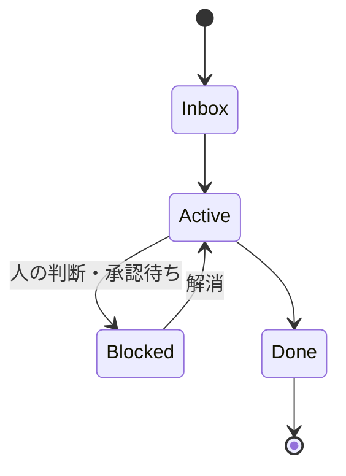

[夏休み自由研究連載 2026](/articles/20260827a/) の3本目です。

## 1. はじめに

こんにちは。製造エネルギーグループの片岡久人です。

テーマは **「スケジューリングをAIに任せられないか」** です。やってみたところ、任せること自体はおおよそできたのですが、できあがったものは、当初やりたかったこととは少し違うところに着地しました。結論としては、スケジュールを組ませるために文脈を溜めていったら、**スケジュール以外の仕事もAIに渡せるようになっていた**、という話になります。

そこに至るまでに、何が足りなくて、何を足して、次に何が見えたのか。その順番で書いていこうと思います。できあがった仕組みそのものは、付録にまとめました。

最小構成で始める手順も、後ろのほうに書いています。フォルダ2つとMarkdown 1枚だけなので、よければ試してみて、感想などもらえるとうれしいです。

## 2. 前提

使っているのは、次の2つだけです。

- **Obsidian** — Markdownを書くためのエディタ。実体はただのテキストファイル群で、プラグインは入れていません
- **Claude Code** — ローカルのファイルを読み書きできるAIのCLI（Claudeの契約があれば、追加の費用はかかりません）

どちらも特殊な使い方はしていないので、バージョンによる違いはあまり気にしなくて大丈夫です。ファイルの置き場所も、手元のフォルダであれば何でも構いません。

Markdownが書ければいいので、エディタはVS Codeなど別のものでも動きます。私がObsidianを使っているのは、**タスクや日々の記録が相互にリンクする形になるため、リンクをたどって行き来しやすい**からです。

## 3. スケジューリングを楽にしたい

スケジューリングって大変ですよね。日次の段取り、週次や月次の見通し、さらに長いスパンの計画と、仕事をしている限り避けては通れません。しかも状況は日々変わりますし、考えるスパンごとに頭の使い方も変わってくるので、コンテキストスイッチのコストも高いです。

これをできるだけ楽にしたい。AIならどうにかしてくれるんじゃないか。そんな期待をもって取り組んでみました。

## 4. まずは日次の段取りを任せてみる

いきなり長いスパンの計画は難しいので、まずは日次から試すことにしました。その日の予定と、手元にあるタスクの情報を渡して、「今日の段取りを組んで」と投げてみます。

やってみると、それっぽいものは出てきました。ただ、中身の質としてはそれなりで、そのまま使えるものではありません。手を入れる前提の叩きが出てくる、という感じです。

それでも、**ゼロが1になっていると、次の作業に取りかかりやすい**です。何もないところから始めるよりは、ずっといい感じでした。日々の、「まず何をやって、次に何をやって」と予定を立てる作業が、**出てきた叩きを見て直す作業に変わりました**。この段階で、感覚としては結構楽になりました。

中身の質を上げるには、**こちらからもっと詳しい文脈を渡してあげる必要があります**。何を抱えていて、どれが急ぎで、次に何をするつもりなのか。それを知らない相手に、精緻な計画は立てられません。

というわけで、そこを埋めにいこうと思いました。

## 5. タスクの文脈を渡す仕組みを作る

### 5.1 タスクの情報を書き溜める場所を作る

そこで、**タスクの情報を書き溜める場所**を作ることにしました。ここで初めてMarkdownとフォルダが出てきます。

- 1タスク1ファイル。次にやること・期限・優先度・状態を持たせる
- 状態はフォルダで分ける（`Inbox` / `Active` / `Done` など）

フォルダで状態を分けたのは、整理のためというより **「今読ませたい分だけ渡したかったから」** です。全部読ませると、遅くなるうえに、関係ない情報に引っ張られた計画が出てきます。逆に、進行中のものだけが入ったフォルダを作っておけば、あとは「ここだけ読んで」で済みます。

タスクファイルは、こんな形をしています。

```markdown
---
id: "20260824_01"
title: "技術ブログ（夏休み自由研究連載）の記事を書く"
status: "Active"
priority: "High"
next_action: "初稿を読み返して、リンクと出典を埋める"
due_date: "2026-09-05"
created_at: "2026-08-24"
---

# 思考ログ・ブレスト

## 目的
- 連載の1本として、スケジューリングをAIに任せた話を書く
- 仕組みの紹介ではなく、「なぜこうなっていったのか」の順で書く

## 完了条件
- [x] 章立ての確定
- [x] 全章のドラフト
- [ ] 公開前の最終確認（固有の情報が残っていないか）

## 試行履歴・ブロッカー
- 2026-08-30: 章立てを口述で固めて、初稿まで書いた
```

先頭のYAML部分（frontmatter）が、AIに読ませる構造化された情報です。下の自由記述は、人間が読むためのメモであり、同時にAIに渡す背景でもあります。

ちなみにこれは、まさにこの記事を書くために置いてあるタスクファイルです。

### 5.2 入力もAIに任せる

ここまでは想定どおりでした。想定と違ったのはこの先です。

当初は、**タスクの情報は自分でMarkdownに書き込むもの**だと思っていました。ところが、そうはなりませんでした。結局、**その入力もClaudeに任せる**形に変わっていきました。

理由は単純です。やり取りの中には、**タスクについての暗黙的な観点や考え方**が入っています。

自分でファイルを開いて書くと、整理された**結論だけ**が残ります。「次にやること：レビュー結果を確認する」。これはこれで間違っていないのですが、なぜそれが次なのか、何を懸念しているのか、どういう条件なら方針を変えるのか、といったあたりは頭の中に残ったままになります。

一方、Claudeと会話しながらファイルを更新していると、**そこに至った考え方まで文脈として書き残ります**。会話では自然とそういうことも喋っているので、それがそのまま残る形になります。

つまり、置き場を作ることと、**そこへの入れ方**は別の問題だったわけです。そして精緻な計画につながったのは、フォーマットを整えたことよりも、**言語化していない前提まで残る入れ方に変えたこと**のほうでした。

このあたりから、使い方が「人が書いてAIが読む」から「**AIが読み書きする**」に移っています。当時は意識していませんでした。ただ、AIがファイルを触るようになったことで、このあと任せられる仕事がどんどん増えていきます。振り返ると、そこへの分かれ目がここでした。

## 6. 文脈が溜まると、任せられる範囲が広がる

タスクに関するやり取りを全部Claude経由でやっていると、**「ここまでコンテキストがあるのであれば、あとは進められるんじゃないか」** と思えるものが出てきます。

たとえば、技術的に実現できるのかどうかを確かめるために一次情報を探してもらう。タスクを一段ブレークダウンしてもらう。詰まりそうなポイントを先に挙げてもらう。そういったことが頼めるようになります。

共通しているのは1つです。**自分で考える前に、先にアウトプットを出させる**。私は出てきたものを見て「これでいい」「これじゃない」を判断する側に回ります。そのまま使えるものが出てきたら、もうけもんくらいの感覚でいます。

任せる単位にはコツがあると思っていて、タスク丸ごとは渡しません。**「次にやること」1個**の単位で渡すようにしています。タスク自体は自分がやるしかない仕事でも、その一手だけなら渡せることは多いです。

:::note warn
**先にアウトプットが出ていると、それに引っ張られる**ことは無きにしもあらずです。まっさらな状態で考えたときと同じ結論になるとは限りません。

なので、**出てきたものを理解したうえで見る／判断は自分が持つ**、を条件にしています。逆に言えば、**「これじゃない」と言えるのは、自分が何を伝えたいかを持っているとき**だけです。ここに気を付けないと、速いだけで質が落ちてしまうので、注意しています。
:::

ここまでくると、感覚としては、**雑にタスクを投げても、いい感じに進めてくれるパートナーが1人いる**ような状態になりました。

## 7. 今の運用と、出力に持たせている決めごと

現状では、**段取りやスケジュールというマネジメント側の仕事**と、**実作業そのもの**の両方を、AIが一部進めてくれる形になっています。やりたかったのはスケジュールを組ませることだけだったので、当初の想定からはだいぶ広がりました。

朝は「今日の計画」と伝えると、外部の予定と進行中のタスクを突き合わせた時間割の叩きが出てきます。私はそれを見て、順番を入れ替えたり、無理のある枠を削ったりするだけです。夜は「終業」と伝えると、その日終わったタスクを完了フォルダへ移したうえで、何がどこまで進んで、何が残ったかを書き出してくれます。この2つの呼びかけは、繰り返し使うプロンプトとして登録してあります（付録Aにまとめています）。

出てくるものには、いくつか決めごとを持たせています。

1. **読ませる範囲は、外部の予定と進行中のタスクだけ**。それ以外は読ませていません
2. **分からないことは埋めない**。始業時刻を申告していなければ、その枠は空欄のまま残します
3. **完了の根拠を書く**。「終わった」ではなく、「どこまで到達して、何が未充足のままクローズしたか」まで残します
4. **できなかったことは、できなかったと書く**。手をつけられなかった枠は、翌日も同じように出てきます

地味ですが、2番目が大事です。ここを推測で埋めさせると、記録としての価値がなくなります。3番目と4番目があるおかげで、翌朝の計画が前日の続きから始まります。

こうした決めごとを足しながら回しているうちに、対象そのものも広がっていきました。最初にできたのは日次だけでしたが、**週次のタスク棚卸しも同じ仕組みに乗せることができ**、冒頭に書いたスケジューリングのつらさも軽減できました。

## 8. 振り返って大きかったこと

ここまでの流れは、こういうことだったと思っています。

> **スケジュールを組ませるために文脈を溜めたら、その文脈が他の仕事にも使えた。**

任せられる範囲が広がったのは、AIが賢くなったということももちろんあるのですが、**こちらが渡せる文脈が増えたから**でもあります。振り返ると、大きかったのは次の2つです。どちらも最初から設計したわけではなく、そのときどきで足りないものを足していったら、結果としてこの形に落ち着いています。

**その1：今アクティブな分だけ渡す**

関係ない情報が混じるほど出力はぶれますし、入力が増えればそれだけコストもかかるため、全部は読ませないようにしています。状態でフォルダを分けているのは、「今読ませたい範囲」を指定するためです。

**その2：AIにファイルを読み書きさせる**

5章で書いたように、Claudeとの会話を通してファイルをいじることで、**言語化していない分まで記録できる**ようになりました。自分で書くと結論だけが残りますが、会話を通すと、そこに至った考え方も一緒に残ります。

:::note warn
ただし、記録がそのまま溜まっていくだけだと、読み返さないファイルが増えていくことになります。**終わったタスクから、次に使えそうなところだけを別の場所に抜き出しておく**、という作業は別でやっています。
:::

### 8.1 うまくいかなかったこと

正直なところも書いておきます。

**架空の予定や実績を書いてしまう**。これがいちばん困りました。始業時刻や空き時間が分からないと、それらしく埋めてきます。記録としては最悪なので、**「実在する事実だけで組む」「分からなければ聞く」「レポートの根拠は実際に完了へ動かしたものだけ」** をルールとして明文化して、ようやく落ち着きました。

### 8.2 どこまで効くのか

もうひとつ、適用限界の話です。私の仕事は、技術的に可能かどうかを調べる、エラーの原因を追う、あるべき姿と現状の差分を埋める、といった**検証しやすく前例の多いもの**が多いので、この形がよく効きます。

一方、何を問題として設定するか、どちらを取るかを決める、といった仕事では効き幅は小さいと感じています。しかもこちらは、間違っていたことに気づくのが遅くなりがちです。**易しい仕事で身についた軽いレビューの癖を、そのまま持ち込むのが危ない**。今のところ、これがいちばんの注意点です。

ではそこに意味がないかというと、そうでもありません。**任せられる仕事を速く終わらせるのは、考える仕事に使う時間と頭を空けるため**でもあります。

## 9. 参考にした考え方

この仕組みは、AIと壁打ちしながら作りました。とはいえAIが出してくる案は、**すでに誰かが考えたことの延長**です。似たようなことを考えている人が先にいるから、それらしい形が返ってくるわけで、実際、作っている途中で「その考え方にはこういう名前がついている」と教えてもらいました。

**Second Brain（第二の脳）**、**PARA**、それから **構造化したMarkdownをLLMに直接読ませる**という考え方（Andrej Karpathy 氏が2026年4月に出した提案）あたりです。私は原典の詳細まで当たれていないので中身の紹介はしませんが、興味のある方は元をたどってみてください。リンクは末尾に置いておきます。

## 10. 最小構成で始める

大掛かりなものは要りません。次の5ステップで1周できます。

1. Obsidianを入れて、vault（＝ただのフォルダ）を作る
2. フォルダを **2つだけ** 作る（`Active` と `Done`）
3. Markdownを1枚作って、今抱えている仕事を1つ書く。次にやること・期限だけでいいです
4. Claude Code に **「この `Active` フォルダだけ読んで、今日の段取りの叩きを作って」** と投げる
5. 出てきたものを、その場で直す

ここまでで1周です。4章に書いたとおり、**何もないところから始めなくてよくなったぶんの効果は、この時点でもう出ています**。設計は後回しで構いません。

:::note warn
ここに載せたものはあくまで個人の運用例で、そのまま動くことを保証するものではありません。ルールの明文化（8.1で書いた「架空の記録を作らない」など）は、環境に合わせて自分で足していく必要があります。
:::

## 11. さいごに

自由研究として始めた話ですが、やってみて思ったのはこういうことでした。

> **AIに任せられる仕事の範囲は、こちらが渡せる文脈の量で決まる。**

もちろんAIの賢さも関係しています。ただ、同じAIに同じことを頼んでも、渡している文脈の量で返ってくるものは変わります。私の場合は、スケジュールを組ませたいという入口から文脈を溜めはじめて、気づいたら任せられる仕事の範囲のほうが広がっていました。

そして、任せる方向に進むほど、自分の仕事は確認に寄っていきます。作業レベルのことは、文脈さえ渡せば適切にやってくれる。そうなると大事になるのは、**出てきたものをどういう観点で見られるか**です。速く作れることよりも、良し悪しを判断できることのほうが、これからは重要になるのだろうと思っています。

この記事も同じやり方で書いています。章立てを口述して、叩きを出させて、違うところを直す。最初に返ってきた構成は「仕組みの説明」から入るものでしたが、「なぜこうなっていったのか」の順で書きたかったので、丸ごと組み替えるといった感じで変更を加えました。

今後考えてみたいこととしては、このような個人のタスク管理をどうやってチーム単位の管理に広げるのか、もっとうまい仕事の渡し方はあるのか、みたいなあたりです。そこはまだ手探りです。

もし試していただけた方や、すでに似たような仕組みを作って回している方がいたら、感想や、どうやっているのかをぜひ聞かせてください。

長い記事を最後まで読んでいただき、ありがとうございました。この記事が、みなさんのAI活用の役に立てば幸いです。

## 付録A. できあがったvaultの全体構成

本文では順番に足していった話をしたので、最後に現在の形をまとめておきます。

```text
vault/
├── CLAUDE.md          # AIへの常設の指示書（運用ルール）
├── 01_Daily/          # 1日1ファイル（月ごとにサブフォルダ）
│   └── 2026-08/
├── 02_Tasks/          # 1タスク1ファイル。フォルダ＝状態
│   ├── 01_Inbox/      # 未計画
│   ├── 02_Active/     # 進行中 ← 日次計画で読むのはここだけ
│   ├── 03_Done/       # 完了（月ごとにアーカイブ）
│   └── 04_Blocked/    # 人の判断待ちで自走できない
├── 90_Attachments/    # 特定タスクの証跡・作業素材
└── 91_Reference/      # 複数タスクで再利用する知識
```

状態はこう動きます。



**状態をフォルダとファイル内の両方に持たせています**。フォルダで持つのは「読ませる範囲を切り出す」ため、ファイル内（frontmatter）で持つのは「AIがパースできる形にする」ためです。二重管理なので、移動のたびに両方を書き換えます。手間ではありますが、2つは目的が違うため、片方に寄せると片方が不便になります。

`CLAUDE.md` には、AIに毎回説明しなくて済むように運用ルールを書いています。抜粋するとこんな内容です。

<details><summary>CLAUDE.md に書いているルール（抜粋）</summary>

- 日次の時間割を作るときは、進行中フォルダだけを読む。未計画・完了は読まない（コンテキストを膨らませないため）
- 架空のスケジュール・実績を作らない。実在する事実だけで組み、分からなければ聞く
- 業務レポートの根拠は、実際に完了フォルダへ移動したタスクだけ
- 日次計画とタスクの深掘りは、編集するファイルを分ける
- 新規ファイルはテンプレートからコピーして作り、勝手に項目を増やさない
- ファイル名は `日付_連番_タイトル.md` で統一する

</details>

定型のルーチンは、繰り返し使うプロンプトとして登録してあります（Claude Code の「スキル」の仕組みです）。

| 呼び出し | やること |
| --- | --- |
| `/morning` | 前日レポートの埋め戻し → 期限超過チェック → 今日の時間割を生成 |
| `/evening` | 完了タスクを完了フォルダへ移動 → 今日のレポートを生成 |
| `/kickoff` | 進行中タスクの「次にやること」を仕分けし、渡せるものを先に進めさせる |
| `/weekly-review` | 週次の棚卸し（期限の再交渉、未計画の整理、完了分のアーカイブ） |

呼び出し名は自分で決められます。本文で「今日の計画」「終業」と書いていたのは、それぞれ `/morning` と `/evening` のことです。

## 参考

- [Tiago Forte『Building a Second Brain』（2022）](https://www.amazon.co.jp/SECOND-BRAIN%EF%BC%88%E3%82%BB%E3%82%AB%E3%83%B3%E3%83%89%E3%83%96%E3%83%AC%E3%82%A4%E3%83%B3%EF%BC%89-%E6%99%82%E9%96%93%E3%81%AB%E8%BF%BD%E3%82%8F%E3%82%8C%E3%81%AA%E3%81%84%E3%80%8C%E7%9F%A5%E7%9A%84%E7%94%9F%E7%94%A3%E8%A1%93%E3%80%8D-%E3%83%86%E3%82%A3%E3%82%A2%E3%82%B4%E3%83%BB%E3%83%95%E3%82%A9%E3%83%BC%E3%83%86/dp/4492558217)
  - 第二の脳、PARA の元になっている書籍です
- [Andrej Karpathy 氏によるLLM知識ベースの構想](https://x.com/karpathy/status/2039805659525644595)
  - 小〜中規模ならRAGを使わず、Markdownを直接読ませるという提案です
