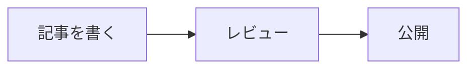

# 記法ガイド

フューチャー技術ブログで使える記法と、その表示結果をまとめたページです。見た目そのものの決まり（色・文字の大きさ・行間・間隔）は [スタイルガイド](/specials/styleguide/) にまとめています。

## 基本の記法

一般的な Markdown と同じ書き方で、表示だけがこのブログの見た目になるものです。

### 見出し

記事タイトルが最上位なので、本文の見出しは `##` から始めます。

```markdown
## 大きな見出し
### 中くらいの見出し
#### 小さな見出し
```

**目次（ToC）は見出しから自動で作られます。** 記事ページのサイドバー（画面が狭いときは本文の前）に出るので、本文に目次を書く必要はありません。見出しにはリンク用のアンカーも自動で付きます。

番号（「1. はじめに」の「1.」）は付けないでください。順序は目次が示すので要りません。手で振った番号は、節を足したり消したりすると置き去りになります。

ただし手順や数え上げのように、**番号そのものが意味を持つ**ときは付けて構いません。

### 箇条書き

```markdown
- 中黒の項目
- 入れ子にすると1段下がります
  - 2段目の項目
  - 2段目の項目
    - 3段目の項目
```

- 中黒の項目
- 入れ子にすると1段下がります
  - 2段目の項目
  - 2段目の項目
    - 3段目の項目

マーカーは何段目でも同じ「●」です。段の深さは字下げが表します。

### 番号付きリスト

```markdown
1. 手順の1つ目
2. 手順の2つ目
3. 手順の3つ目
```

1. 手順の1つ目
2. 手順の2つ目
3. 手順の3つ目

番号は書いたとおりに出ます。すべて `1.` と書いて自動で振らせることもできますが、原文を読む人が分かりにくいので、通し番号で書くことをおすすめします。

### 引用

```markdown
> 引用文です。出典は引用の外に書きます。
```

> 引用文です。出典は引用の外に書きます。

`>` を重ねると入れ子になります。引用の中でも箇条書きや強調は使えます。

```markdown
> 引用の1段目です。
>
> > 引用の2段目です。
> >
> > - 引用の中の箇条書き
> > - **強調**も効きます
```

> 引用の1段目です。
>
> > 引用の2段目です。
> >
> > - 引用の中の箇条書き
> > - **強調**も効きます

### 表

```markdown
| 項目 | 説明 |
| --- | --- |
| 1つ目 | 説明の文 |
| 2つ目 | 説明の文 |
```

| 項目 | 説明 |
| --- | --- |
| 1つ目 | 説明の文 |
| 2つ目 | 説明の文 |

列が多い表は横スクロールになります。画面の狭い端末で読まれることも多いので、列は5つくらいまでに収めると読みやすくなります。

### リンク・強調・インラインコード

```markdown
[リンクのテキスト](https://example.com/)、**強調**、`git status` のようなインラインコードです。
```

[リンクのテキスト](https://example.com/)、**強調**、`git status` のようなインラインコードです。

インラインコードはコード（コマンド・識別子・パス・設定値）を指す印なので、日本語の装飾には使いません。画面のボタンやメニューの名前は「続行」のように鍵括弧で、意味を強めたいだけなら **強調** で書いてください。ブラウザのページ翻訳はインラインコードの中を訳さないため、囲った日本語は翻訳しても原文のまま残ります。

### コードブロック

言語名を書くと色が付きます。言語名の後ろにファイル名を書くと、上にファイル名が出ます。

````markdown
```go main.go
func main() {
	fmt.Println("hello")
}
```
````

```go main.go
func main() {
	fmt.Println("hello")
}
```

シェルの操作は、実行するコマンドだけなら `sh`、実行結果を含むなら `console` を使います。

ファイル名は言語名との間を空白で区切ります。`go:main.go` のようにコロンで続けると、全体が言語名として扱われて色もファイル名も出ません。

### 脚注

```markdown
本文の途中に脚注を置けます[^1]。

[^1]: 脚注の中身です。記事の一番下にまとめて出ます。
```

本文の途中に脚注を置けます[^1]。

[^1]: 脚注の中身です。記事の一番下にまとめて出ます。

### 折りたたみ

長いログや補足は折りたためます。HTML をそのまま書きます。

```html
<details>
<summary>クリックで開きます</summary>

中身には Markdown をそのまま書けます。空行を1つ空けるのがコツです。

</details>
```

<details>
<summary>クリックで開きます</summary>

中身には Markdown をそのまま書けます。空行を1つ空けるのがコツです。

</details>

中には箇条書き・番号付きリスト・コードブロック・表も書けます。

````html
<details>
<summary>実行ログ（長いので折りたたみ）</summary>

- 箇条書き
- 番号付きリスト

```go
fmt.Println("コードブロックも書けます")
```

| 項目 | 説明 |
| --- | --- |
| 表 | 書けます |

</details>
````

<details>
<summary>実行ログ（長いので折りたたみ）</summary>

- 箇条書き
- 番号付きリスト

```go
fmt.Println("コードブロックも書けます")
```

| 項目 | 説明 |
| --- | --- |
| 表 | 書けます |

</details>

### 数式

`$` で挟むとインラインの数式、`$$` で挟むとブロックの数式になります。

```markdown
学習率を $\alpha$ とすると、更新式は次のようになります。

$$
\theta_{t+1} = \theta_t - \alpha \nabla L(\theta_t)
$$
```

学習率を $\alpha$ とすると、更新式は次のようになります。

$$
\theta_{t+1} = \theta_t - \alpha \nabla L(\theta_t)
$$

## このブログ固有の記法

一般的な Markdown には無い、このブログだけの記法です。

### 注釈（note）

4種類あります。`:::` と `note` の間の空白は任意です。`:::note info` でも書けます。

```markdown
::: note tip
おすすめや小技を書きます。
:::

::: note info
補足情報を書きます。種別を省略するとこれになります。
:::

::: note warn
気をつけてほしいことを書きます。
:::

::: note alert
壊れる・消えるなど、実害のあることを書きます。
:::
```

::: note tip
おすすめや小技を書きます。
:::

::: note info
補足情報を書きます。種別を省略するとこれになります。
:::

::: note warn
気をつけてほしいことを書きます。
:::

::: note alert
壊れる・消えるなど、実害のあることを書きます。
:::

種別のあとに書いた文字はタイトルになります。

```markdown
::: note warn キャッシュの有効期限について
タイトルを付けると、タイトル行と本文が分かれます。
:::
```

::: note warn キャッシュの有効期限について
タイトルを付けると、タイトル行と本文が分かれます。
:::

注釈の中には、箇条書き・番号付きリスト・コードブロック・表も書けます。

````markdown
::: note info 中で使えるもの
- 箇条書き
- 番号付きリスト
- インラインコードや**強調**などの文字装飾

```go
fmt.Println("コードブロックも書けます")
```

| 項目 | 説明 |
| --- | --- |
| 表 | 書けます |
:::
````

::: note info 中で使えるもの

- 箇条書き
- 番号付きリスト
- インラインコードや**強調**などの文字装飾

```go
fmt.Println("コードブロックも書けます")
```

| 項目 | 説明 |
| --- | --- |
| 表 | 書けます |

:::

### 画像

画像は Markdown の記法で書いてください。

```markdown

```


**`` を手で書いて `width` / `height` で表示サイズを変えるのは避けてください。** 実寸と違う値を指定すると、大きい画像を送ってブラウザ側で縮めるだけになります。小さく見せたい場合は**画像ファイル自体を加工**してください（そのほうが表示も速くなります）。

`` の角括弧に書く文字は、画像が見えない人に向けた説明（alt）です。装飾目的の画像なら空のままで構いません。

### 画像のキャプション

画像の直下の行を `*` で挟むと、キャプションになります。

```markdown

*図1: キャプションの文*
```


*図1: キャプションの文*

代替テキストとキャプションは役割が違います。代替テキストは画像が見えない人への説明、キャプションは全員に向けた補足なので、同じ文を両方に書く必要はありません。

### 図（mermaid）

````markdown

````


書く側は、言語名に `mermaid` を指定したコードブロックへ図の定義を置くだけです。

### csv

`csv` と書くと、列ごとに色が変わります。

````markdown
```csv
store_id,item_id,sales_date,sales_quantity,sales_amount
1,101,2025-04-01,2,3000
1,102,2025-04-01,1,1500
```
````

```csv
store_id,item_id,sales_date,sales_quantity,sales_amount
1,101,2025-04-01,2,3000
1,102,2025-04-01,1,1500
```

### 差分つきコードブロック

`diff_go` のように `diff_` に言語名をつなげると、差分の色と構文の色が同時に出ます。

````markdown
```diff_go
 func main() {
-	fmt.Println("hello")
+	fmt.Println("hello, world")
 }
```
````

```diff_go
 func main() {
-	fmt.Println("hello")
+	fmt.Println("hello, world")
 }
```
